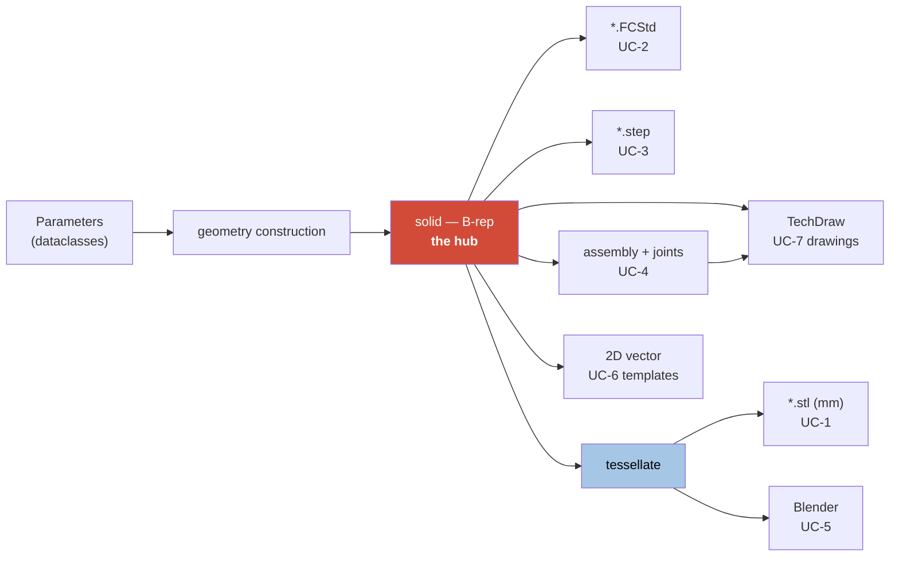
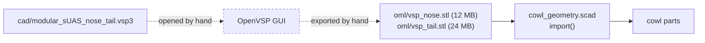
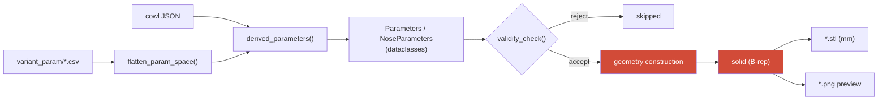
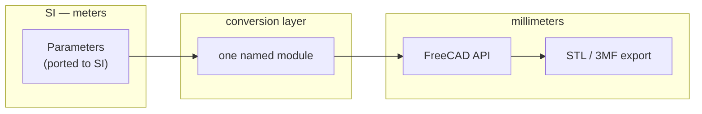

# FreeCAD Migration — Architecture

**Scope.** The target architecture for roadmap [Phase 3](../roadmap.md): generating parts
through FreeCAD's Python API instead of by emitting OpenSCAD source. This document covers
what changes, what does not, and what the change costs — particularly in verification,
where the migration starts by losing a capability.

**Status.** Written 2026-08-06, before any port work. The measurements in it were taken on
this machine; the design arguments follow from decisions already made and recorded in
[corner.md](../design/corner.md) and [bulkhead.md](../design/bulkhead.md).

**Relationship to `overview.md`.** The `/arch` skill defines `doc/architecture/overview.md`
as the primary system architecture document, with a module registry, the MAUS unit
standard, and interface conventions. **It does not exist yet.** This document is scoped to
the migration only and deliberately does not duplicate what belongs there. When
`overview.md` is written, the toolchain diagram below belongs in its *Generator toolchain*
section and the open questions here become system-level OQs.

Dimensions are stated in SI unless marked. Where a quantity is millimeters — the FreeCAD
API, the OpenSCAD path, exported meshes — that is called out, because the unit boundary is
the single easiest place in this project to be silently wrong by a factor of 1000.

---

## Use cases

Six anticipated uses of the FreeCAD generation tools. They are listed first because they
set the scope of everything below, and because **three of them are not achievable in
OpenSCAD at any effort** — which is the actual justification for the migration.

### Actors

| Actor | Wants |
| --- | --- |
| Airframe designer | To change a parameter and see the consequence, interactively |
| Build engineer | Printable meshes and cut templates for a specific airframe size |
| Analyst | Mass properties, FEM on load-bearing structure |
| Downstream CAD consumer | Neutral solid geometry that opens in other CAD systems |
| Documentation / visualization | Assembly views, exploded views, animation |

### The use cases

| ID | Use case | Terminal artifact | Kind | Possible today? |
| --- | --- | --- | --- | --- |
| **UC-1** | Headless parameter sweep producing printable meshes | `*.stl` (mm) | mesh | **Yes** — this is the current system |
| **UC-2** | Headless sweep producing native FreeCAD solid models | `*.FCStd` | B-rep | **No** |
| **UC-3** | Headless sweep producing STEP solid models | `*.step` | B-rep | **No** |
| **UC-4** | Solid assemblies with defined joints — fuselage unit, nose, tail, full fuselage | `*.FCStd` assembly | B-rep | **No** |
| **UC-5** | Blender mesh assemblies: full fuselage, units, exploded, exploded with animation paths | `*.blend` | mesh | Partly — `blender/splode.blend` exists |
| **UC-6** | New components: printable panels, panel cutting templates, wing joiners, boom collet and clamp, landing-gear bulkheads and structural blocks | solid + 2D vector | mixed | No — new design work |
| **UC-7** | High-quality dimensioned engineering drawings, of both individual parts and assemblies | `*.pdf` / `*.svg` drawing | drawing | **No** |
| **UC-8** | Structural analysis — mass properties, deformation, stress, yield margin — including the components the model does not yet contain | analysis results | analysis | **No** |
| **UC-9** | Aerodynamic analysis via OpenVSP — parametric nose and tail generation, fuselage force and moment, building toward full-configuration analysis | OML surfaces + aero coefficients | analysis | Partly — OpenVSP is already the OML source, driven by hand |

**UC-2, UC-3, UC-4 and UC-7 are blocked by OpenSCAD's representation, not by its
interface.** OpenSCAD has no boundary representation. Its solid model is a polyhedral
mesh — a `cylinder()` *is* a prism of `$fa`/`$fs` facets, not a cylindrical surface — so
there is no curved geometry to write into a STEP file, nothing for an assembly constraint
to attach to, and **no circle for a drawing to dimension**. **No amount of work on the
OpenSCAD path reaches these four.** That is a stronger argument for the port than
convenience, and it bounds the argument too: UC-1 alone would not justify the migration.

UC-7 is worth spelling out because it is the least obvious of the four. A dimensioned
drawing needs to attach a diameter callout to a *cylindrical face* and a radius to an
*arc*. Projecting OpenSCAD's output gives a 360-sided polygon: every "circle" is a chain
of short line segments, so there is no arc to select, no center to reference, and a
diameter callout has nothing to bind to. The drawing would have to be dimensioned by hand
against coordinates, which is exactly the manual step the generator exists to remove.

**Mesh is not acceptable as an intermediate for UC-2, UC-3 or UC-4.** Tessellating and
re-fitting a surface would produce a nominally-solid model whose faces are approximations
of approximations. The solid must stay a B-rep from construction to export.

### Consequence: the solid is the hub, not the mesh

Today the pipeline is linear and terminates in a mesh. It has to become a hub with
several leaves, and the mesh becomes one leaf among four artifact kinds:



Two rules follow, and both are architectural:

- **Tessellation happens once, at the leaf.** Nothing downstream of it feeds back into a
  solid path.
- **The four artifact kinds — B-rep, mesh, 2D vector, drawing — are exports of one solid,
  never conversions of each other.**

### New geometry capability: cowl interior surfaces (UC-4)

The nose and tail cowls are currently modeled as an outer surface only. Present practice
is to let the slicer create the interior by slicing with zero infill. A CAD assembly needs
the interior as real geometry, so the cowl generator gains an interior surface.

**It is a per-layer 2D inset, not a 3D shell offset.** The interior surface is produced
the way a slicer produces it: within each extrusion layer, offset the exterior cross
section inward by a fixed multiple of the extrusion width. That is deliberately *not*
`Part::Offset` or `makeThickness`, which offset perpendicular to the surface.

The two differ on every sloped surface, and the difference is not small. For a surface
tilted by angle α from vertical, a horizontal inset `t` leaves a wall whose perpendicular
thickness is `t·cos α`. So a per-layer inset **thins toward horizontal surfaces** — the
nose tip and the tail cap get progressively thinner walls, reaching zero at a horizontal
face.

That is correct and intended: it reproduces what the printer actually lays down, which is
the whole point of modeling the interior rather than assuming a uniform shell. It will
nonetheless look like a defect to anyone who expects constant wall thickness, so it is
recorded here as designed behavior. Where a real part needs material at a near-horizontal
surface, a slicer supplies it with top and bottom solid layers, and the CAD model needs
the equivalent rule rather than relying on the inset alone.

**The parameter already exists — it was misnamed.** `PrinterSettings` carried a field
called `nozzle_diameter`, but every use of it in the codebase was extrusion-width
semantics: a wall *N* beads thick, or *N* beads of margin. Not one referred to the
nozzle's bore.

| Use | What it means |
| --- | --- |
| `greeble_thickness = max(2·√U·w, 2·w)` | a wall *N* beads thick, floored at two |
| `flange_thickness = max(⌈3U⌉·w, 3·w)` | a whole number of beads |
| `longeron_chamfer = w` | one bead |
| `corner_radius − w − cowl_flange_tolerance` | one bead of setback |
| `panel_clearance_radius + 2·w` | two beads of margin |

Renamed to `extrusion_width` throughout (IP-GEO-24). The rename was worth doing in code
that Phase 3 replaces precisely *because* Phase 3 replaces it: the port will be written by
reading this code, and a field named `nozzle_diameter` gets ported as nozzle diameter —
after which this use case adds a *second* `extrusion_width` field and the model carries two
parameters, differing by 10–20 %, where the design has one.

The method belongs in an algorithm document (`doc/algorithms/`, per the `/arch` skill)
rather than here; this section states the requirement and the trap. Tracked as
[OQ-ARCH-5](#open-questions).

### UC-8: analysis needs a second class of model object

Every part the generator produces today is a **printed** part. Structural analysis needs
the whole load path, and most of it is missing:

| Component | In the model today | Needed for analysis |
| --- | --- | --- |
| Longeron | only its bore | the tube — the primary bending member |
| Panel | only its capture slot | the sheet, as a structural skin |
| Threaded insert | only the bore, and a dimension table | the insert as a stiff body |
| Bolt | only the hole | preload and shear path |
| Glue bond | nothing at all | the bonded interface |

The architectural point is that these are **not new designs**. The model already knows
their dimensions, because it cuts the clearances that receive them: `longeron_radius`,
`panel_thickness`, `bolt_hole_radius`, and the anchor diameter looked up from
[`threaded_insert_dimensions.csv`](../../src/Fuselage/tools/threaded_insert_dimensions.csv).

**So the non-printed components should be derived from the same parameters that create
their clearances, never specified separately.** That is the same argument the greeble
already settles for the joint: a bore and the thing that fills it are two views of one
dimension, and two independent statements of one dimension eventually disagree. A longeron
modeled at 16 mm against a bore cut for a 15.9 mm tube is a bug that no test would catch,
because both parts would be individually correct.

**Glue bonds are different in kind.** They are not solids; they are interfaces between
solids, and in analysis they are contact or tie conditions rather than geometry. They
therefore belong to the *assembly*, not to any part, which makes this part of UC-8 depend
on UC-4.

### UC-8 is a ladder, not a single capability

The four tiers differ by orders of magnitude in cost, and only the last is uncertain:

| Tier | Capability | Needs | Status |
| --- | --- | --- | --- |
| 1 | **Mass properties** — mass, center of gravity, inertia tensor | densities per component; the non-printed solids | Available immediately once the solids exist; FreeCAD computes these exactly from the B-rep, no solver involved |
| 2 | **Isotropic FEM** — deformation, stress, yield margin | tier 1, plus an assembly with loads, restraints and bonded interfaces | Reachable with the existing stack |
| 3 | **Orthotropic FEM** — printed parts as layered material, weak through the layer axis | tier 2, plus print orientation **stated** per part | Solver-side capability exists; the orientation is already designed in, it is simply not written down |
| 4 | **Mesostructure / toolpath-level** — bead geometry, infill pattern, layer adhesion as modeled features | tier 3, plus tooling that may not exist permissively | **Unverified** — see below |

Separating tier 1 matters. Mass properties are exact from a B-rep, need no solver, and
answer a question the project asks constantly — what does this airframe weigh, and where
is its CG. That is available as soon as the non-printed components are modeled, which is
work UC-8 needs anyway.

**Tier 3 is closer than it looks.** Treating a printed part as orthotropic — stiff along
the beads, weak across the layer interface — requires knowing which way the layers run.

**Every printable component in this system already has a print orientation by design.**
The parts are not shapes that might be printed any way up; each one was drawn for a
specific orientation, and the features that show it are already in the geometry — chamfers
sized to be self-supporting, the 45° ramp on the interconnect's depth change, the greeble's
lead-in. So the layer normal is a *known* property of every part.

What is missing is that it is nowhere **stated**. Nothing in the model or the design
documents says, for each part, which axis the layers stack along and whether the modeled
frame is the print frame or a rotation of it. That distinction matters — the `/arch`
convention already notes that assembly orientation and print orientation are not the same
thing — and an orthotropic material assignment needs the answer per part.

So tier 3's prerequisite is a **recording** task, not a design decision: write down what
was already decided, one line per part, in each part's design document. That is much
cheaper than adding a parameter someone has to choose.

**On licensing**, the project's policy already answers most of the question:

> GPL (any) — Avoid for libraries. Note that OpenSCAD and FreeCAD are themselves GPL/LGPL
> applications invoked as **separate processes**, which does not propagate to this
> project's code.

FreeCAD's FEM workbench drives **CalculiX**, a GPL solver, as a separate process — exactly
the pattern the policy already sanctions. Orthotropic elasticity is standard CalculiX
capability, so tier 3 does not require a new solver; what is unverified is whether
FreeCAD's material editor exposes it or whether the input deck must be written directly.

**Tier 4 is where I cannot give an answer.** Whether a mature, permissively-licensed tool
exists for bead-level or layer-adhesion modeling of FDM parts is a survey question, and it
should be answered by looking rather than by assuming in either direction. The commercially
established tools in this space are proprietary. Recorded as [OQ-ARCH-8](#open-questions)
rather than guessed at.

### UC-9: OpenVSP is already in the pipeline, one-way and by hand

This use case does not introduce OpenVSP — it closes a loop that already exists and is
currently manual. Today:



The source model **is** version-controlled — `src/Fuselage/cad/modular_sUAS_nose_tail.vsp3`
— so the provenance exists. What does not exist is any automation between it and the
meshes, and no check that the committed meshes were exported from the committed model.

**The OML import is a third unit boundary, and the only metre-to-millimetre conversion in
the OpenSCAD path.** `body_blank_full()` applies `scale([U/oml_scale_m_per_mm, …])` with
`oml_scale_m_per_mm = 1e-3`, so the factor is `1000·U`: the exported mesh is in **meters** and the
model is in millimeters. The companion values in the cowl JSON are metres too —
`oml_length_m = 0.050` for the nose, `0.1` for the tail. Worth stating plainly, because it
is the one place the existing millimeter-throughout rule already meets SI data, and the
port has to keep the conversion rather than discover it.

### UC-9 has a hard dependency on UC-2 and UC-3

This is the interaction most likely to be missed, and it runs the opposite way to
intuition.

**A cowl built from an imported mesh cannot be a clean B-rep.** The cowls are currently
built by importing a tessellated STL and cutting it. Whatever comes out is a polyhedron —
so for the cowls specifically, UC-2 and UC-3 do not deliver true solid models even after
the port, and UC-7 cannot dimension a cowl's curvature, for the same reason it cannot
dimension OpenSCAD's faceted cylinders.

**OpenVSP can export STEP and IGES**, i.e. real surfaces rather than a tessellation. So
the fix is available and it belongs to UC-9: the OML should arrive as a *surface*, not a
mesh. That single change is what makes the cowls first-class in UC-2, UC-3, UC-4 and UC-7,
and it also removes 36 MB of committed mesh from the repository.

The corollary is a sequencing constraint: **the OML-as-surface part of UC-9 should land
before or with UC-2**, not after it. Otherwise the B-rep export ships with the cowls
quietly excluded, which is exactly the kind of partial capability that gets forgotten.

### What UC-9 needs

| Piece | Notes |
| --- | --- |
| Driven OpenVSP | The Python API drives the `.vsp3` model headlessly, so nose and tail shapes become generated artifacts with parameters rather than hand-exported files |
| OML as surface | STEP or IGES export instead of STL — see above |
| Configuration export | The fuselage geometry, and later the whole aircraft, presented to the aero solver |
| Force and moment | VSPAERO. Note that its vortex-lattice method models lifting surfaces; body force and moment want the panel solver, and fuselage-alone results should be treated as a step toward configuration analysis rather than an answer in themselves |

**Licensing: checked, and it is fine.** OpenVSP 3.50.5 is under the **NASA Open Source
Agreement v1.3**, whose obligations attach to *distribution* rather than to linkage — so
using it, in either pattern, imposes nothing on this project's code, and importing its
Python API is no different from spawning the binary. Details and the clause references are
in [OQ-ARCH-9](#open-questions), including the one clause that does deserve attention
(§4.B, an indemnity term about products built with the software, not about code).

### What each use case adds

| Use case | Beyond the port itself |
| --- | --- |
| UC-1 | Nothing — this *is* the port |
| UC-2 | An export step; the solid already exists |
| UC-3 | An export step |
| UC-4 | Cowl interior surfaces; joint/mate definitions; an assembly structure |
| UC-5 | A mesh export path to Blender; explode transforms and animation paths |
| UC-6 | Several new generators, and a 2D vector output kind that nothing currently produces. **Its landing-gear bulkheads and structural blocks are members of an existing family** — the interstitial plate bulkheads, of which the tail-boom bulkhead is the first. See [bulkhead.md](../design/bulkhead.md) |
| UC-7 | TechDraw pages, a dimensioning scheme, and a drawing template — and it consumes UC-4's assemblies, not just parts |
| UC-8 | **A second class of model object**: the non-printed components — longerons, panels, inserts, bolts — plus material data, bonded-interface definitions, and each part's print orientation written down |
| UC-9 | A driven OpenVSP path — parametric nose and tail generation, and configuration export for aero solving. The OML becomes a generated input rather than a committed mesh |

**UC-1 is the port. UC-2 through UC-6 are capabilities the port enables.** Keeping that
line sharp is what protects the migration from becoming an open-ended redesign: the
migration is done when UC-1 produces geometry verifiably equivalent to what it replaces,
and everything else is new work scheduled after it.

---

## The port is one layer, not the toolchain

This section is about **UC-1**, the port proper. The most important architectural fact
about it is how little of the system it touches. The generator is already layered, and
only two layers are OpenSCAD-specific:

| Layer | Today | After the port |
| --- | --- | --- |
| Parameter axes — `variant_param/*.csv`, `*.json` | pandas rows | **unchanged** |
| Derivation — `derived_parameters()` → `Parameters` dataclass | Python | **unchanged** |
| Validity — `corner_validity_check()`, `bulkhead_validity_check()` | Python | **unchanged** |
| Geometry construction | `solid2` → generated `.scad` text | **replaced** — FreeCAD Python API → in-memory `Shape` |
| Solid evaluation + export | `openscad.exe`, CGAL → `.stl` | **replaced** — OCC kernel → B-rep, tessellated to `.stl` at the leaf |
| Sweep driver — queue, workers, resume, atomic writes, previews, naming | Python | **unchanged in structure**, one call swapped |
| Verification | three tiers | **one tier is lost**, see below |

That the parameter layer survives untouched is not luck. It is the result of
[OQ-GEO-1](../implementation/geometry_refactor.md#open-questions), which rejected grouping
parameters inside OpenSCAD precisely because that work would be discarded here, and built
the typed dataclasses in Python instead. The same reasoning applies to anything still
tempting in the OpenSCAD path: it has one phase left to live.



Only the two red nodes are rewritten. Everything to their left is already in its final
form; everything to their right keeps its current contract.

---

## Verified: the headless path works

The roadmap requires the sweep to run headless, because the FreeCAD MCP drives a live GUI
session and a batch of thousands of parts must not. Confirmed on this machine, 2026-08-06:

```text
C:\Users\Alex\AppData\Local\Programs\FreeCAD 1.1\bin\freecadcmd.exe
    FreeCAD 1.1.1
    GuiUp = 0
```

A box with a cylindrical cut, built and measured entirely headless:

| Measurement | Result |
| --- | --- |
| `Shape.Volume` | 2230.353997 mm³ |
| Analytic volume, `20·20·6 − π·3²·6` | 2230.353997 mm³ |
| `Shape.BoundBox` | 20.000 × 20.000 × 6.000 mm |
| `Shape.isValid()` | `True` |
| `tessellate(0.1)` | 520 triangles |
| `tessellate(0.01)` | 932 triangles |
| Exported STL, mesh volume | 2230.375282 mm³ |

Three architectural consequences follow from that table, and they matter more than the
fact that it ran.

**`Volume` is exact, not sampled.** It agrees with the closed-form answer to all printed
digits, because it is integrated over the B-rep rather than summed over triangles. The
OpenSCAD path has no equivalent — there, volume is only ever a property of a mesh.

**Triangle count is a setting, not a property.** The same solid gives 520 or 932 triangles
depending on a deviation argument. In the OpenSCAD path triangle count is likewise set by
`$fa`/`$fs`/`$fn`, but it has been usable as a change-detector because those values are
held constant. **Across the two toolchains it is meaningless** — see the verification
section.

**Tessellation error is small but real.** The exported mesh measures 0.021 mm³ larger than
the exact solid, +0.001 % at deviation 0.01. The sign is right: the cut cylinder is
approximated by an inscribed prism, which removes slightly less material than the true
cylinder. Any equivalence test between the two toolchains inherits an error of this
character, so it needs a *relative* tolerance justified by tessellation — not an
arbitrary epsilon.

---

## The unit boundary

The project standard is SI (m, s, kg, rad). **FreeCAD's Python API is millimeters**, its
FEM stack is N/mm², and exported STL and 3MF must be millimeters because those formats
carry no unit metadata and a slicer will read them as mm regardless.

So the port has a real unit boundary, and it needs exactly one named conversion layer
rather than factors scattered through the geometry code:



The roadmap already names the test that catches a mistake here: a ported part's bounding
box in meters must equal the OpenSCAD part's bounding box in millimeters divided by 1000.
It is worth restating why this deserves a dedicated check — a 1000× error still renders,
still exports, and still passes `isValid()`. It fails only at the printer.

**The existing OpenSCAD path stays in millimeters and is never converted.** It has one
phase left; converting it spends real risk for no benefit.

---

## What must be preserved

The sweep driver is not incidental scaffolding. Most of its behavior was built in response
to a specific failure, and each of those failures will recur if the port reimplements the
driver rather than reusing it:

| Capability | Why it exists |
| --- | --- |
| Bounded parallel workers | A worker count set from cores alone exhausted memory and crashed a sweep mid-run |
| Atomic writes — render to `*.partial.stl`, `os.replace` on success | An interrupted run left a convincing truncated part that a resume then skipped |
| `--resume` with staleness detection | Skipping on "the file exists" silently keeps stale parts after the geometry changes |
| Preview from the finished mesh | Previews used to cost a second full solid evaluation — the dominant cost of the sweep |
| Validity checks before construction | Roughly half of the Cartesian product is geometrically invalid and must never reach the kernel |
| Deterministic naming and directory scheme | The output tree is the reference corpus that equivalence testing compares against |

**Keep "render is a subprocess".** Today the driver shells out to `openscad.exe`, which is
why a thread pool works — the subprocess releases the GIL. Driving FreeCAD in-process
would hold it, and the whole `RenderQueue` design would need replacing with multiprocessing.
Spawning `freecadcmd.exe` per part instead preserves the queue, the memory budget, the
atomic writes, and the retry path exactly as they are, and swaps one command string.

The cost of that choice is process startup per part, which is higher for FreeCAD than for
OpenSCAD. **That was a measurement, not a design question** — and it has now been taken.

> **MEASURED 2026-08-07 (IP-FC-1): startup is 0.24 s. Subprocess-per-part it is.**
>
> `freecadcmd` on this machine — wall time minus in-script time, stable across runs:
>
> | Workload | In-script | Wall | Startup |
> | --- | --- | --- | --- |
> | Import only | 0.032 s | 0.27 s | **0.24 s** |
> | Box minus cylinder | 0.044 s | 0.40 s | ~0.24 s |
> | Boolean-heavy — 16 cuts, a fuse, 4-way mirror, `removeSplitter` | 0.60 s | 0.84 s | ~0.24 s |
>
> The decisive figure is not the per-part ratio but the **total**: 576 parts × 0.24 s is
> **about 2.3 minutes of startup across an entire sweep**, against a sweep that currently
> runs for hours. Negligible regardless of what a real ported part costs to build — which
> makes the conclusion robust to the one quantity still unknown.
>
> A caveat kept deliberately: the boolean-heavy case is a *synthetic* analogue at 7,776
> triangles, while real bulkheads run 25,000–37,000. A true part will build more slowly,
> which only strengthens the conclusion by raising the denominator.

The decision tree that measurement resolves, kept for the record:

| Measurement | Choose | Consequence |
| --- | --- | --- |
| Startup small next to a part's build time | **One `freecadcmd` per part** | Queue, worker budget, atomic writes, retry and resume all survive unchanged; crash isolation per part; threads keep working |
| Startup dominates | **One long-lived worker per thread** | Startup paid once per worker, but crash isolation is lost — a bad part takes its worker's whole batch — and document state leaks between parts unless each is closed explicitly |
| Neither acceptable | **In-process, multiprocessing** | Rewrites the queue; parameter objects must be picklable; the memory-budget logic changes shape |

These parts take seconds to minutes of kernel work each, so the first row is the likely
outcome. It costs one measurement to know, and rows two and three are progressively larger
rewrites that should not be entered speculatively.

**`--resume` needs a new staleness key.** It currently compares the freshly generated
`.scad` text against what is on disk, byte for byte. There is no generated text after the
port. The replacement has to key on the inputs instead: the parameter object plus a version
of the geometry code that produced it.

---

## Verification across the port

This is where the migration is most exposed, and the exposure is not obvious.

### The cheap exact tier does not survive

Verification today is three tiers, each covering what the others cannot:

| Tier | Mechanism | Survives the port? |
| --- | --- | --- |
| [`scad_snapshot.py`](../../src/Fuselage/tools/scad_snapshot.py) | Byte-compare the generated `.scad` for all 576 variants | **No** |
| [`sweep_check.py`](../../src/Fuselage/tools/sweep_check.py) / [`verify_sweep_change.py`](../../src/Fuselage/tools/verify_sweep_change.py) | Measured geometry against a reference tree | Yes, with changes |
| [`verify_drivers.py`](../../src/Fuselage/tools/verify_drivers.py) | Render every GUI driver, treat warnings as failures | Different shape |

The first tier is exact, runs in seconds, and proved most of the Phase 2 work outright —
including the parameter dataclass conversion, where all 576 parts came out byte-identical.
It works *because* the generated `.scad` is a complete written statement of the geometry.
**The port removes that artifact**: FreeCAD builds objects in memory and there is nothing
textual to diff.

Losing it means every Python-side change costs a full render to verify instead of a few
seconds of text comparison. Plan for the replacement rather than discovering the gap
mid-port.

### The replacement: snapshot the parameters, not the source

The cheap tier can be recovered one layer up. The `Parameters` and `NoseParameters`
dataclasses are the complete input to geometry construction and are shared by both
toolchains. Snapshot those for every variant and diff them, exactly as `scad_snapshot.py`
diffs generated text today.

That covers every layer above geometry construction — axes, derivation, validity, naming —
which is where most changes actually land. It does not cover the geometry code itself,
which is what the geometric tier is for. The division of labor is the same as today; only
the boundary moves.

### Equivalence between toolchains

The 576-part output tree is the golden reference. Comparing a ported part against it needs
care about which properties are portable:

| Property | Portable across toolchains? |
| --- | --- |
| Enclosed volume | **Yes** — with a tessellation tolerance |
| Bounding box | **Yes** |
| Hole positions and count | **Yes** |
| Triangle count | **No** — a tessellation setting, measured above at 520 vs 932 for one solid |

`sweep_check.py` compares all four today, and triangle count is currently its *strictest*
signal. That signal has to be dropped for cross-toolchain comparison and kept for
within-toolchain regression. Conflating the two would either mask real differences or
report false ones on every part.

### The reference corpus is faceted, and that is a real geometric difference

This is the subtlety most likely to be mistaken for a bug, and the use cases above are
what make it unavoidable.

OpenSCAD has no curved surfaces. Its `cylinder()` is an inscribed prism of `$fa`/`$fs`
facets, so the reference corpus is not an approximation *of* the intended solid — **it is
a different solid**, one whose round features are systematically smaller than round. The
ported part, built on true cylindrical surfaces, will not match it exactly no matter how
finely either side is tessellated.

The difference is not noise. It is **systematic, one-sided, and computable**: an inscribed
regular *n*-gon has area `(n / 2π)·sin(2π / n)` times the circle it approximates, so every
convex round feature in the reference is slightly undersized and every round hole slightly
oversized. At `$fa = 1` — 360 facets — that is about 0.005 % of area per feature, with the
sign depending on whether the feature adds or removes material.

Three consequences:

- **The equivalence tolerance has two components,** not one: tessellation error on the
  measurement (measured above at 0.001 %) *plus* the faceting bias of the reference. Only
  the first shrinks if you tessellate more finely.
- **The sign is predictable per feature,** so a difference in the unexpected direction is
  a genuine finding rather than a tolerance problem. That is worth more than a tighter
  bound.
- **This applies only to comparisons against the OpenSCAD corpus.** UC-2, UC-3 and UC-4
  compare B-rep against B-rep, where volume is exact on both sides and the tolerance
  collapses to floating point.

So the equivalence test is a one-time migration instrument, not a permanent fixture. Once
UC-1 is signed off, within-FreeCAD regression testing is strictly more precise than
anything available today.

---

## What the design documents constrain

Two findings from Phase 2 bear directly on how the port should be structured, and both
would be easy to lose.

**The joint is one description, not two.** The bulkhead's greeble is formed by subtracting
`corner_end()` — the corner's own end section — from the bulkhead. What survives is the
positive post that fills the corner's bore, with a rib filling the corner's groove. The two
mating halves are complements of a single shape and therefore *cannot* disagree. See
[bulkhead.md](../design/bulkhead.md).

Preserving that property is an architectural requirement, not a stylistic preference. If
the port models the corner's bore and the bulkhead's post as two independent features, a
constraint is needed to hold them together — and constraints can be violated, while
complements cannot.

**Corner and bulkhead share the cross-section, not the length.** They are not independent
designs; they are two halves of one joint. But bay length is *not* part of that coupling:
`FX` scales `unit_length`, which reaches the corner alone, which is why one bulkhead design
serves bays of every length and why the bulkhead sweep carries no `FX` axis. See
[OQ-DES-C3](../design/corner.md#open-questions).

The port should therefore share cross-section and joint parameters between the two parts by
construction, and keep bay length a parameter of the corner only.

---

## Migration sequence

Ordered so that each step's failure is cheap and legible:

1. **Measure `freecadcmd` startup and one part's build time.** Decides whether
   subprocess-per-part is viable, which decides whether the sweep driver survives intact.
   Everything else is easier to change than this.
2. **Port one part end to end** — the corner, which is the simpler of the two joint halves
   and has a design document. Compare against its OpenSCAD reference by volume and
   bounding box.
3. **Port the bulkhead, forming the greeble by cutting with the corner's end section.**
   This is the step that proves the paradigm can express the joint; if it cannot, that is
   the point to find out.
4. **Build the parameter snapshot tool** before porting anything further, so the remaining
   work has a cheap regression check.
5. **Swap the render call in the sweep driver**, keeping the queue, resume, atomic writes,
   and previews.
6. **Run the full sweep and compare against the reference tree** by portable properties.
   **UC-1 is complete here**, and the migration proper is done.
7. **Then, and only then, the capabilities the port existed to enable.** UC-2 and UC-3
   first — `.FCStd` and `.step` exports, both of them export steps on a solid that already
   exists, and the two use cases OpenSCAD could never reach.
8. **UC-4** — cowl interior surfaces first (the new geometry), then assemblies and joints.
9. **UC-5** — the Blender export path, explode transforms, animation.
10. **UC-6** — new components, in whatever order the airframe needs them. The 2D vector
    output kind for cutting templates has no precedent in the toolchain and should be
    prototyped on one panel before the others are designed around it.
11. **UC-7** — drawings. Part drawings can follow UC-2 directly; assembly drawings depend
    on UC-4, so the two halves of this use case land at different times and should be
    planned as such.
12. **UC-8** — analysis, in tiers. The non-printed components and mass properties (tier 1)
    are worth doing early and independently: they need no solver, they answer the weight
    and CG question the project asks constantly, and modeling the longerons and panels is
    prerequisite work for every later tier anyway. Stress analysis follows UC-4, because
    bonded interfaces are a property of the assembly.
13. **UC-9** — but **its first half belongs at step 7, not here.** Getting the OML as a
    STEP surface instead of a 36 MB mesh is what makes the cowls first-class in UC-2, UC-3,
    UC-4 and UC-7; deferred to the end, those four ship with the cowls quietly excluded.
    The aero half — driven generation, VSPAERO force and moment — has no such constraint
    and can follow at leisure.

Two orderings are deliberate. **Step 3 before step 4:** the greeble is the highest-risk
geometry in the project, and finding out it does not map cleanly is worth more than having
a faster test suite while porting parts that were never in doubt. **Steps 7–8 after step
6:** UC-2 and UC-3 cost almost nothing once UC-1 lands, so they should not be entangled
with it — but UC-4 pulls in new geometry and a new failure mode, and starting it before
the port is verified would make it impossible to tell which layer a discrepancy came from.

---

## Open questions

| ID | Status | Question |
| --- | --- | --- |
| ARCH-1 | ~~decided~~ 2026-08-07 | `Part::` or `PartDesign::`? — build both, then choose (IP-FC-5) |
| ARCH-2 | ~~decided~~ 2026-08-07 | What replaces the exact verification tier? — do both, plus every method that works |
| ARCH-3 | ~~withdrawn~~ 2026-08-07 | Not an open question — a measurement. See IP-FC-1 |
| ARCH-4 | ~~decided~~ 2026-08-07 | Retire it after IP-FC-13; FreeCAD becomes the definition of correctness |
| ARCH-5 | ~~decided~~ 2026-08-07 | Adaptive curvature-aware slice-and-fit; G1 threshold, G2 objective; never ruled |
| ARCH-6 | ~~decided~~ 2026-08-07 | FreeCAD Assembly joints, verified against the constructed placement |
| ARCH-7 | ~~decided~~ 2026-08-07 | Dimensions are expressions over parameters; interfaces are a floor; family drawing with a variant table |
| ARCH-8 | ~~withdrawn~~ 2026-08-07 | Not an open question — a survey. See IP-FC-6 |
| ARCH-10 | **open** 2026-08-09 | `eps` is an absolute 0.01 mm, and the octant-and-mirror tiling needs that overlap to stay resolvable at part scale. It does not, at U ≥ 2.5. What replaces it? **Blocks IP-FC-49** |
| ARCH-9 | ~~resolved~~ 2026-08-07 | Is OpenVSP's license compatible with the project's policy, and in which usage pattern? |

### ~~OQ-ARCH-1 — `Part::` or `PartDesign::`?~~ — DECIDED 2026-08-07: build both

The roadmap calls this the decision that shapes the whole phase. The geometry today is
CSG: unions and differences of primitives and extrusions, with masks trimming an octant and
mirrors tiling it.

**Alternatives**

1. **`Part::` primitives with booleans.**
   *Benefits:* maps directly onto the existing code, so the port is a translation rather
   than a redesign; a `Shape` is a value that can be reused as a cutting tool, which is
   exactly how the greeble is formed today; the octant-and-mirror construction carries over
   unchanged.
   *Drawbacks:* less idiomatic FreeCAD; fillets and drafts are applied to edges selected
   programmatically, which is fragile if edge ordering shifts.
   *Prerequisites:* none.

2. **`PartDesign::` bodies with sketches.**
   *Benefits:* idiomatic; proper parametric fillets and drafts; better suited to TechDraw
   and to later assembly work.
   *Drawbacks:* a body is a single contiguous solid, and reusing one body as a cutter for
   another is awkward — which is a direct problem for the greeble, whose whole safety
   property is that both halves are complements of one shape; sketches must be constructed
   programmatically, which is more code than the geometry warrants.
   *Prerequisites:* a way to express the joint that preserves the single-description
   property.

3. **`Part::` for the joint, `PartDesign::` for the rest.**
   *Benefits:* keeps the risky part in the paradigm that suits it.
   *Drawbacks:* two paradigms in one codebase, and the boundary between them is another
   thing to get wrong.
   *Prerequisites:* both of the above understood first.

**Recommendation was alternative 1.** The single-description property of the greeble is the
strongest constraint in the geometry and `Part::` preserves it for free. The fillet
fragility is real but confined to the flange and web features, which are the least
load-bearing geometry in the project.

---

**DECIDED 2026-08-07: build the parts *both* ways, then choose.** Neither alternative is
selected on paper. IP-FC-5 produces a `Part::` corner **and** a `PartDesign::` corner, and
the paradigm decision follows from comparing them.

This is a deliberate deferral, and it is bought rather than free — it costs a second
prototype. It is worth that because the roadmap calls this "the decision that shapes the
whole phase", and the arguments on each side are of a kind that prototypes settle and
reasoning does not:

- Whether `PartDesign::` can express the greeble's single-description property at all, or
  needs a constraint where `Part::` has an identity, is a question about how the workbench
  behaves — not about the geometry.
- Whether programmatic edge selection for fillets is as fragile as feared is a question
  about topological naming stability across a parameter sweep, which only a sweep answers.
- Whether sketch-based construction is genuinely a "bigger rewrite" is a question about how
  much of the octant-and-mirror structure survives, which is visible once one part exists
  in both forms.

**What the comparison must produce**, so it decides something rather than becoming two
prototypes nobody chooses between:

1. Identical measured geometry from both — volume and bounding box against the OpenSCAD
   reference, to prove both are correct before either is preferred.
2. A statement of whether the greeble can be formed in `PartDesign::` by reusing the
   corner's end section, and what it costs if not.
3. Line counts and, more importantly, how each behaves when a parameter changes — a
   regenerate across several `U` values, checking whether fillet references survive.

Until IP-FC-5 reports, no other part is ported. That is the point of the deferral.

### ~~OQ-ARCH-2 — What replaces the exact verification tier?~~ — DECIDED 2026-08-07: do both, and more

`scad_snapshot.py` is exact, runs in seconds, and disappears with the generated `.scad`.

**Alternatives**

1. **Snapshot the parameter dataclasses instead.**
   *Benefits:* same cost and exactness; covers axes, derivation, validity, and naming —
   where most changes land; toolchain-independent, so it works before, during, and after
   the port.
   *Drawbacks:* covers nothing below geometry construction, so geometry changes still cost
   a render.
   *Prerequisites:* none; the dataclasses already exist.

2. **Serialize each `Shape` to BREP and byte-compare.**
   *Benefits:* covers the geometry layer exactly.
   *Drawbacks:* BREP is not obviously stable across kernel versions or construction order,
   so a false difference is likely; unproven.
   *Prerequisites:* measure whether identical input yields identical BREP bytes.

3. **Accept the loss and rely on measured geometry alone.**
   *Benefits:* no work.
   *Drawbacks:* every Python-side change costs a full sweep; that is the situation Phase 1
   built tooling to escape.
   *Prerequisites:* none.

**Recommendation was alternative 1 now, alternative 2 opportunistically.** They compose —
parameters above, BREP below — and 1 is cheap enough to build before it is needed.

---

**DECIDED 2026-08-07: do both, and pursue every shape-comparison method available.**
Alternative 3 — accepting the loss — is rejected outright. The governing statement:

> **At this point we cannot afford to operate without verification coverage.**

That is a stronger position than any single alternative above, and it reframes the
question. The default is **not** "pick the cheapest adequate check". It is **try every
method, keep everything that works, and deprecate a method only after demonstrating it
cannot be made to work** — a failed attempt is evidence; an untried idea is not.

**What this commits to building:**

| Method | Layer it covers | Item |
| --- | --- | --- |
| Parameter snapshot | everything above geometry construction — axes, derivation, validity, naming | IP-FC-2 |
| BREP serialization compare | the geometry layer, exactly, within FreeCAD | IP-FC-32 |
| Measured geometry | cross-toolchain and within-toolchain | survives as `sweep_check.py` |
| Generator-script render | that every part still builds at all | successor to `verify_drivers.py` |

These are complements, not competitors. A parameter snapshot cannot see a geometry change; a
BREP compare cannot see a naming change; measured geometry sees both but costs a render.
**Layered coverage is the goal and redundancy between layers is a feature** — Phase 2 found
defects that only one of its three tiers could have caught, more than once, and the two dead
parameters (OQ-DES-B6, OQ-DES-C3) were invisible to *all* of them.

**Grounds for deprecating a method:** demonstrate that it produces false results or cannot
be made to work, and record the finding. "It seemed redundant" is not sufficient, because
redundancy is the property being bought.

**Why this matters more after the port than before.** Phase 2's cheapest tier was exact,
ran in seconds, and carried most of the verification load. The port deletes it. Replacing
one strong check with one weaker check would quietly reduce coverage at exactly the moment
the codebase is least trustworthy — a newly ported geometry engine with no track record.
Several partial checks is the right response, even though it is more work than the
arrangement it replaces.

### ~~OQ-ARCH-3 — Is subprocess-per-part viable?~~ — WITHDRAWN 2026-08-07: not an open question

**This was miscategorized.** An open question is a decision requiring judgment between
alternatives whose merits cannot be settled by looking. This is a **measurement** — take the
`freecadcmd` startup time and a single part's build time, and the answer follows
mechanically from the ratio. There is no design judgment in it.

The substance has moved to where it belongs:

- **The measurement** is [IP-FC-1](../implementation/freecad_migration.md), already an
  unblocked work item and the first thing in the plan.
- **The decision tree** — which architecture each outcome implies, and what each costs — is
  in [§What must be preserved](#what-must-be-preserved), beside the discussion of why the
  driver keeps its subprocess model.

Nothing is lost by withdrawing it; the ID is retained rather than renumbered so that
references elsewhere stay valid.

**Worth noting as a pattern**, since this document raised nine questions and one of them
was not a question: *"we do not know X"* is not sufficient grounds for an OQ. The test is
whether knowing X requires a **decision** or merely an **observation**. If an afternoon of
measurement settles it, it is a work item.

### ~~OQ-ARCH-4 — What becomes of the OpenSCAD implementation?~~ — DECIDED 2026-08-07: retire it

The roadmap says do not delete it before the FreeCAD path is proven across the full
parameter range, which settles the near term but not the end state.

**Alternatives**

1. **Retire it once equivalence is demonstrated.**
   *Benefits:* one implementation to maintain; no divergence.
   *Drawbacks:* loses the only independent check on the new geometry.
   *Prerequisites:* full-range equivalence.

2. **Keep it as a cross-check, run on demand.**
   *Benefits:* two independent implementations of the same geometry is a strong check —
   the current design documents were written partly by reading it.
   *Drawbacks:* every geometry change must be made twice or the check rots into a source of
   false alarms.
   *Prerequisites:* a decision about who keeps them in step.

3. **Freeze it as a reference corpus, not as code.**
   *Benefits:* keeps the 576-part output tree as the golden reference forever, at no
   maintenance cost; the `.scad` sources stay readable as documentation of intent.
   *Drawbacks:* the reference goes stale the moment the geometry legitimately changes.
   *Prerequisites:* none.

**Recommendation was alternative 3.** A frozen corpus captures nearly all the value of
alternative 2 — an independent statement of what the geometry was — without the standing
cost of maintaining two implementations, which alternative 2 will lose to entropy.

---

**DECIDED 2026-08-07: alternative 1 — retire it.** No new geometry will be developed in
OpenSCAD, and two implementations will not be maintained in parallel. **Once verified, the
FreeCAD implementation becomes the definition of correctness.**

That last clause settles it, and it is what my recommendation missed. Alternative 3 proposed
keeping the OpenSCAD output as a frozen reference corpus — but a corpus is only useful as a
*datum*, and there cannot be two definitions of correctness. The moment IP-FC-13 signs off
equivalence, the OpenSCAD tree stops being an independent check and becomes a second,
unmaintained answer to a question that now has an authoritative one. Keeping it invites
someone to read a disagreement as ambiguous when it is not.

**The corpus is therefore a migration instrument with a defined end of life, not an asset:**

| Phase | Role of the OpenSCAD output |
| --- | --- |
| Until IP-FC-13 | **The datum** — every ported part is checked against it |
| At IP-FC-13 | Equivalence demonstrated across the full parameter range |
| After IP-FC-13 | **Superseded** — FreeCAD defines correctness; the OpenSCAD implementation is removed |

**Deleting it is safer than it feels**, which is worth stating because working code is hard
to throw away: the implementation lives in git history and stays recoverable indefinitely.
Removing it from the working tree destroys nothing — it stops it being read, maintained, or
mistaken for authoritative. And the part that *would* genuinely have been lost, the design
intent the code was the only record of, is now in [corner.md](../design/corner.md),
[bulkhead.md](../design/bulkhead.md) and [cowl.md](../design/cowl.md).

**Two conditions on the removal**, both still binding:

1. **Not before the full parameter range is proven** — IP-FC-13, not the first part that
   matches.
2. **Not before the design documents are checked against it one last time.** They were
   reconstructed *from* this code; once it is gone, an error in them is no longer
   falsifiable against the original. This session found several such errors, so the risk is
   demonstrated rather than theoretical.

Tracked as IP-FC-34.

---

### ~~OQ-ARCH-5 — How is the cowl interior surface generated?~~ — DECIDED 2026-08-07: adaptive slice-and-fit

Required by UC-4. The interior must be a per-layer 2D inset matching slicer behavior, not
a perpendicular shell offset — see the use-case section for why the two differ and why the
difference is intended.

**The parameter question is settled.** Extrusion width already exists; it was stored under
the name `nozzle_diameter` and has been renamed (IP-GEO-24). No new field is needed, and —
more to the point — no new field should be *added*, because doing so would produce two
nearly-equal parameters where the design has one.

The offset should still be expressed as an explicit multiple, `n_perimeters ×
extrusion_width`, so the count and the width stay separately visible. That matches the
existing convention for `flange_thickness` and `plate_thickness`, which are already whole
multiples of extrusion width and layer height respectively.

**What remains open is the method** — how layers are sliced, how the inset is computed per
layer, how the sections are joined into a solid, and what supplies material at
near-horizontal surfaces where a horizontal inset leaves none.

**Alternatives**

1. **Slice-and-loft** — section the solid at `layer_height` intervals, offset each 2D
   contour inward by `n_perimeters × extrusion_width`, and loft the resulting contours.
   *Benefits:* directly mirrors what the slicer does, so the model matches the print by
   construction; each step uses standard 2D offset operations that OCC provides.
   *Drawbacks:* produces one contour per layer — thousands for a large cowl — so the loft
   is heavy and the resulting B-rep is large; contour topology can change between layers
   (a notch closing, a hole appearing) and a loft does not handle that gracefully.
   *Prerequisites:* none.

2. **Coarse slice-and-loft** — the same, at a spacing much larger than `layer_height`,
   chosen so the offset error stays within tolerance.
   *Benefits:* far cheaper; a smooth cowl needs few sections to capture an offset that
   varies slowly; the result is a clean surface rather than a staircase.
   *Drawbacks:* no longer exactly what the printer produces; needs a stated tolerance and
   a way to check it.
   *Prerequisites:* deciding the acceptable deviation from the true per-layer inset.

3. **3D shell offset with local correction** — use `Part::Offset`/`makeThickness` for the
   bulk, and correct where the surface approaches horizontal.
   *Benefits:* one kernel operation for most of the surface; robust and fast where the
   surface is steep.
   *Drawbacks:* offsets normal to the surface, which is *not* what the slicer does, so it
   is wrong by `1/cos α` everywhere the surface is not vertical — precisely the error this
   use case exists to avoid; the correction region is where the method is least reliable.
   *Prerequisites:* a criterion for where to switch methods.

4. **Two surfaces, explicitly** — model a nominal interior independent of slicer behaviour,
   and record that it is an idealisation.
   *Benefits:* simplest to build and to reason about; adequate for mass properties and
   assembly clearance.
   *Drawbacks:* diverges from the printed part in a way that matters for UC-8; interacts
   with OQ-DES-CW6, where the ribs have the same problem.
   *Prerequisites:* ~~agreement on what the model is *for*~~ — settled by OQ-DES-CW6
   (2026-08-09): the solid model is for everything except printing, and the print keeps its
   own representation.

**Recommendation: alternative 2.** It keeps the mechanism that makes the result correct —
horizontal insets, matching the slicer — while avoiding a per-layer loft that no downstream
consumer needs at full resolution. Alternative 3 is the tempting one and should be
resisted: a normal offset is the exact error mode this use case was raised to prevent.
The near-horizontal rule needs deciding regardless of which is chosen, and it is the same
decision as the top-and-bottom-solid-layers rule a slicer applies.

**The full method belongs in an algorithm document**, not here — see IP-FC-16.

---

**DECIDED 2026-08-07: alternative 2, with four requirements on the surface it produces.**

1. **Curvature-aware, adaptive section spacing.** Not a fixed interval. Section density
   follows local curvature — close where the OML turns hard, sparse where it is nearly
   straight. Uniform spacing wastes sections on the parallel midbody and under-samples the
   nose radius, which is the one place accuracy matters.
2. **Bidirectional curvature.** The interior must be doubly curved — circumferentially
   *and* axially. Not developable, not ruled.
3. **Axial continuity: G1 tangency is the threshold, G2 curvature is the objective.**
   Tangency across every section join is the minimum acceptable result; curvature
   continuity is the goal to design toward.
4. **Explicitly not a ruled surface with tangency discontinuity.** A loft that
   straight-lines between adjacent contours and meets only C0 at each section is precisely
   the failure this requirement excludes.

**Why the continuity requirement is not cosmetic.** Wall thickness is the *difference*
between exterior and interior surfaces. The exterior is a piecewise cubic Bézier carrying
G2 across several stations by design (§1.2). If the interior is only C0 at its section
joins, then **wall thickness is discontinuous at every join** — a thickness step at a seam
the exterior does not have — even though each surface is individually acceptable. That is a
stress raiser for UC-8 and a visible artifact in UC-4 and UC-7.

Matching the interior's continuity class to the exterior's is the real requirement; G1
threshold / G2 objective is how it is stated.

**What this rules out in implementation.** A `ruled=True` loft is excluded by (4). So is a
`ruled=False` loft that merely interpolates the section curves without tangency
constraints, since that satisfies neither (3) nor generally (2). The method wants a surface
**fit** through the offset contours with continuity conditions imposed — the same class of
construction OpenVSP uses for the exterior, applied to the interior.

**Adaptive spacing has a natural termination test:** refine the interval until the deviation
between the fitted surface and the true per-layer offset falls below tolerance. That makes
spacing a derived quantity rather than a tuning knob, and gives the algorithm document a
convergence criterion to state.

The near-horizontal material rule — the equivalent of a slicer's top and bottom solid
layers — remains the main undecided item inside IP-FC-16.

**Amended 2026-08-09 by OQ-DES-CW6: this surface is not what gets printed.** Cowls are
printable in **spiral vase mode**, which permits one contour per layer and no interior
geometry at all, so a cowl carrying this interior surface is no longer vase-printable. The
interior therefore serves UC-2, UC-3, UC-4, UC-7 and UC-8, and the UC-1 export continues to
come from the un-shelled notched blank — two representations from one parametric source, as
[cowl.md §6.4](../design/cowl.md) records. Two consequences here. First, alternative 4's
"diverges from the printed part" drawback is no longer a drawback to be weighed: divergence
is the *design*, and the thing to guard is that the two paths stay separate. Second, the
interior's fidelity requirements above are unchanged but their justification narrows — they
matter because analysis and assembly need them, not because a printer will follow them.

### ~~OQ-ARCH-6 — How are assembly joints defined and stored?~~ — DECIDED 2026-08-07: Assembly joints

Required by UC-4: fuselage unit, nose, tail, and full fuselage assemblies with real joints.

The unresolved part is where the mating information lives. The geometry already knows how
the parts mate — the greeble post and its bore are complements of one shape, and the bolt
pattern is a shared parameter — so an assembly could in principle place parts by
construction rather than by constraint. That is the same argument that appears in
[OQ-DES-C3](../design/corner.md#open-questions) for the joint itself.

**Alternatives**

1. **Place parts by construction, from the parameters that already position them.**
   *Benefits:* cannot be inconsistent, for the same reason the greeble cannot; no
   constraint solver in the sweep path; headless-friendly.
   *Drawbacks:* not a FreeCAD Assembly document, so it does not interoperate with the
   Assembly workbench's tooling.
   *Prerequisites:* none.

2. **Use FreeCAD's Assembly workbench with real joints.**
   *Benefits:* idiomatic; interference checks and kinematics come free; exports as a
   proper assembly to STEP.
   *Drawbacks:* constraints can be violated or fail to solve, which is a new failure mode
   in a batch context; the solver's headless behavior is unverified.
   *Prerequisites:* confirm the Assembly workbench is scriptable under `freecadcmd`.

3. **Both — construction for placement, joints added for downstream use.**
   *Benefits:* placement stays deterministic while the assembly still carries joint
   semantics for consumers.
   *Drawbacks:* two representations of the same relationship, which is exactly the class
   of duplication this project has spent Phase 2 removing.
   *Prerequisites:* both of the above understood.

**Recommendation was to measure alternative 2's headless behavior first**, because it
decides whether the choice is real. If the Assembly workbench does not script cleanly under
`freecadcmd`, alternative 1 is the only option that runs in a sweep.

---

**DECIDED 2026-08-07: alternative 2 — FreeCAD Assembly with real joints.**

This buys what UC-4 and UC-7 actually need: interference checking, kinematics, and an
assembly that exports to STEP as an assembly rather than as a bag of solids.

**The headless question becomes a work item, not a decision gate.** Confirming that the
Assembly workbench scripts under `freecadcmd` is now a prerequisite task inside IP-FC-19
rather than a condition on the choice. If it turns out not to script, that is a problem to
solve — not a reason to revisit the decision.

**The one real objection to this option has a cheap mitigation, and it should be built in
from the start.** The drawback of joints over construction is that a constraint can fail to
solve, or solve to something unintended, and in a batch context nothing would notice.

But **the constructed placement remains computable from the parameters** — that is what
alternative 1 would have used, and those parameters do not go away. So:

> **Solve with joints; verify against the constructed placement.**
> For every assembly, compute where each part *should* sit from `unit_width`,
> `bulkhead_thickness`, `unit_length` and the rest, and assert the solver put it there
> within tolerance.

That converts the failure mode from silent into loud, at the cost of arithmetic that is
already available. It preserves the property [OQ-DES-C3](../design/corner.md#open-questions)
established — that parts sharing parameters cannot drift — while still producing a real
assembly with real joints.

**Note what this does and does not change about the geometry.** Parts still share their
cross-section and joint parameters by construction; the greeble is still formed by cutting
with `corner_end()`. Joints are an additional layer describing how parts relate, for the
benefit of downstream consumers. They are not a substitute for the parametric consistency
that makes the parts fit in the first place, and nothing here should be read as license to
let the two representations diverge.

### ~~OQ-ARCH-7 — What decides which dimensions a generated drawing carries?~~ — DECIDED 2026-08-07

Required by UC-7. Projecting a view is the easy part; TechDraw does it from any shape.
The hard part is *which* dimensions to place, and that is a question about design intent,
not geometry. A part has hundreds of dimensionable edges and a useful drawing carries a
dozen.

The observation that shapes this: **the parameter set already is the design intent.**
`corner_radius`, `bolt_offset`, `panel_thickness`, `bulkhead_thickness` are exactly the
quantities a reader of the drawing needs, and they are exactly what the geometry was
built from.

**Alternatives**

1. **Generate the dimension scheme from the `Parameters` object.**
   *Benefits:* a drawing is guaranteed to dimension the things that are actually
   parametric, and it cannot drift from the model — both come from one source; scales to
   every variant in the sweep for free.
   *Drawbacks:* needs a mapping from each parameter to the edges or faces that express it,
   which is per-part work and brittle if the topology changes.
   *Prerequisites:* stable topological references, which bears on OQ-ARCH-1.

2. **Hand-author a drawing template per part type**, reused across variants.
   *Benefits:* full control over layout and standards compliance; a draftsman's drawing
   rather than a generated one.
   *Drawbacks:* the template references specific edges, so it breaks when the geometry
   changes; one template per part type is real ongoing work.
   *Prerequisites:* none.

3. **Dimension only the interfaces** — bolt pattern, mating diameters, overall envelope —
   and treat internal structure as non-dimensioned reference geometry.
   *Benefits:* small, stable set; matches what the drawing is actually *for*, which is
   fit between parts and inspection of what mates.
   *Drawbacks:* not a manufacturing drawing in the full sense.
   *Prerequisites:* agreement on what belongs to the interface, which
   [overview.md](#relationship-to-overviewmd)'s interface-conventions section should own.

**Recommendation: alternative 3 first, then 1.** The interface dimensions are the ones
that matter and the ones that are already named as shared conventions, so they are both
the most valuable and the most stable. Growing that into a full parameter-driven scheme is
a natural second step; starting there risks spending the effort on internal dimensions
nobody reads.

Note that this use case does **not** change the OQ-ARCH-1 recommendation. TechDraw
projects any shape and does not require `PartDesign::` bodies or sketches — its dimensions
attach to projected edges and vertices, not to sketch constraints.

---

**DECIDED 2026-08-07: none of the three as posed.** The alternatives framed this as a choice
between dimensioning *interfaces* and dimensioning *parameters*. That framing is wrong twice
over.

**First: a dimension is an expression over parameters, not a parameter.** Some are a
parameter directly — `corner_radius`, `bolt_offset`. Many are *combinations*: the bulkhead's
flange inner edge sits at `corner_radius − panel_thickness − panel_tolerance`, its outer
flange face a further `flange_thickness` in. Neither is a parameter anyone set; both are
what a machinist or inspector needs.

The dimension scheme is therefore a set of **named expressions**, each bound to two
topological references. Alternative 1's "generate from the `Parameters` object" was too
literal — the object supplies the *inputs*, not the dimensions.

**A useful consequence:** the design documents already contain many of these expressions,
because documenting the geometry required deriving them.
`corner_radius − panel_thickness − panel_tolerance` appears in
[bulkhead.md](../design/bulkhead.md); the buttress profile vertices in
[cowl.md §4.1](../design/cowl.md) are expressions of exactly this kind. The scheme starts
from the design authority rather than blank.

**Second: interfaces are a floor, not the scope.** The physical interface must be documented
with dimensioning — that part of alternative 3 stands — but the drawing must also be
**complete**, and complete and **readable** pull against one another. That tension is the
real design problem and neither side is negotiable.

### What this implies

**Completeness has a testable definition** and should be stated as one: every dimension
needed to manufacture and inspect the part is present, and none is redundant.
Over-dimensioning — the same distance implied twice through different chains — is a genuine
defect rather than mere clutter, because the two chains can disagree once tolerances apply.

**The sweep makes readability easier, not harder.** 576 variants share one *scheme* and
differ only in *values*. That is exactly what classical drafting solves with a **family
drawing**: lettered callouts (A, B, C …) on the views and a table of values per variant. One
readable sheet replaces 576 crowded ones, completeness is checked once against the scheme
rather than per part, and a new variant adds a table row rather than a drawing.

That form also inverts the earlier worry about which dimensions to include: with values in a
table rather than on the view, an extra dimension costs a column instead of a crowded leader
line — so **completeness becomes affordable in a way it is not on a one-off drawing.**

**Still to settle**, and belonging to the drawing scheme's own design work:

1. Which expressions constitute the interface set — the floor, and something
   `overview.md`'s interface-conventions section should own once it exists.
2. What "complete" means for this family: fully defining every part, or fully defining
   every mating and inspected feature.
3. Whether internal structure — webs, fillets, chamfers — is dimensioned at all, or shown
   as reference geometry governed by the model.
4. How topological references survive a parameter change. This is the same edge-naming
   stability question IP-FC-5's two prototypes will answer, so it need not be solved twice.

### ~~OQ-ARCH-8 — Can printed parts be analyzed as non-uniform material?~~ — WITHDRAWN 2026-08-07: not an open question

**Miscategorized, in the same way as [OQ-ARCH-3](#open-questions).** The question was
"does a permissively-licensed tool exist for bead-level FDM analysis" — and I said in the
original text that it "should be answered by looking". That is the admission that it is a
**work item**: an observation, not a decision between alternatives.

It is [IP-FC-6](../implementation/freecad_migration.md), already an unblocked survey task.

The substance that was worth keeping is not the question but the **ladder it sat at the top
of**, and that is recorded in [§UC-8 is a ladder](#uc-8-is-a-ladder-not-a-single-capability):

- Tier 3 — orthotropic per part — is reachable with the stack already in use. CalculiX
  supports orthotropic elasticity, FreeCAD invokes it as a separate process, and the layer
  axis per part is now recorded (IP-FC-3).
- Tier 4 — bead-level or toolpath-resolved — depends on tooling whose existence is unknown.

**The decision that *would* have been an open question is a different one:** whether to
stop at tier 3 or pursue tier 4 at the cost of a heavy dependency. That question cannot be
posed usefully until the survey reports, because its alternatives depend on what the survey
finds. If IP-FC-6 turns up a viable tool, raise it then.

**Two of the nine questions in this document were work items** — this and OQ-ARCH-3. Both
had the same shape: *"we do not know the value of X"*, where X is discoverable by looking.
The test that separates them is whether resolution requires a **judgment** or an
**observation**. Recorded here because it is a cheap mistake to repeat.

### ~~OQ-ARCH-9 — Is OpenVSP's license compatible, and in which usage pattern?~~ — RESOLVED 2026-08-07

**Read from the installed copy:** `C:\Program Files\OpenVSP-3.50.5-win64\LICENSE` —
**NASA Open Source Agreement version 1.3** (3.47.0 is also installed, same terms).

**It is compatible, and the usage pattern does not matter.** NOSA's obligations key on
*distribution*, not on linkage:

| Clause | Says | Effect here |
| --- | --- | --- |
| §3.A | Obligations attach to "Distribution or Redistribution of the Subject Software" | We use OpenVSP; we do not ship it. **§3 does not bite.** |
| §3.I | A Recipient may combine Subject Software with software not governed by the Agreement and distribute the result as a single product, provided the OpenVSP portions remain under NOSA | Component-level, **not viral**. Our code keeps its own license even if OpenVSP were bundled. |
| §1.F | "the act of including Subject Software as part of a Larger Work does not in and of itself constitute a Modification" | Using it does not make us a Contributor with §3.C change-log duties. |
| §3.F | Registration "is requested" | A courtesy, not a condition. |

**So the distinction I drew between driving it as a process and importing its Python API
was wrong.** That distinction is the GPL/LGPL mental model, where linkage is what triggers
copyleft. NOSA has no such trigger — both patterns are equally fine, and the choice should
be made on engineering grounds alone. Importing the Python API is the better option for
UC-9's parametric generation, and there is no license reason to avoid it.

Two notes worth carrying forward:

- **§4.B is the clause that actually deserves thought**, and it is a liability term rather
  than a copyleft one: the Recipient waives all claims against the US Government and
  agrees to indemnify it for damages "from products based on, or resulting from,
  Recipient's use of the Subject Software", with the sole remedy being termination of the
  agreement. That is the commonly-cited objection to NOSA. It bears on shipping an
  *aircraft* designed with these tools, not on the code, and it is not a code-licensing
  question at all.
- **The Python tree is mixed-license, and OpenVSP states the split explicitly.**
  `python/openvsp/openvsp/LICENSE` opens: *"The base openvsp vsp api files (`_vsp.so`,
  `_vsp.pyd`, `vsp.py`) are distributed under the NOSA license listed below."* Everything
  else in `python/` — `utilities.py`, `parasite_drag.py`, `degen_geom_parse.py`,
  `surface_patches.py`, `facade.py`, and the sibling packages `AvlPy`, `CHARM`,
  `degen_geom`, `utilities` — is **MIT, Copyright 2018–2020 Uber Technologies**, and
  `python/openvsp/setup.py` declares `license='MIT', author='Uber Technologies'`.

  So the file you `import` for the API itself (`vsp.py`, wrapping the 30 MB `_vsp.pyd`) is
  **NOSA** — which is why the import-versus-subprocess question genuinely was a NOSA
  question, and why the answer above settles it. The higher-level helpers layered on top
  are MIT and unconditionally fine.

- **VSPAERO ships inside the Python package.** `vspaero.exe`, `vspaero_opt.exe`,
  `vsploads.exe` and `vspviewer.exe` sit in `python/openvsp/openvsp/`, so UC-9's aero half
  needs no separate install — and those are executables invoked as processes, the least
  encumbered pattern of all.

**The project's license table should gain a NOSA row**, since it now has a real dependency
under a license the table does not mention. Suggested wording: *acceptable as a separate
tool or an imported module; obligations attach only on redistribution; note the §4.B
indemnity.*

### OQ-ARCH-10 — What replaces the absolute `eps` when the part gets big? — OPEN 2026-08-09

`geometry_eps()` is `0.01` mm, a constant of the OpenSCAD source, carried into the port
verbatim. Two jobs rest on it: making cuts overshoot the material they pass through, and
making the octant overlap its own mirror so the tiling fuse has something to work with.
`bulkhead_full`'s own docstring records the second — *"`octant_mask` is shifted by `eps`, so
adjacent octants overlap by a sliver and the union reclaims it"*.

That works in OpenSCAD, whose CGAL kernel is exact. It does not work in OCCT, whose booleans
work to a tolerance that scales with the shape. At U=2.5 the bulkhead is 250 mm across and
the sliver is 4 × 10⁻⁵ of it:

| U | Octant | Mirror | **Their fuse** |
| --- | --- | --- | --- |
| ≤ 2.0 | valid | valid | valid |
| ≥ 2.5 | valid | valid | **invalid** |

Only the fuse fails, and it fails for every panel — so it is a threshold in U and nothing
else. Raising `eps` at U=2.5 makes it valid again at 0.05 and every value above. The corner
is unaffected at every U up to 4.0, because the octant-and-mirror tiling is `bulkhead_full`'s
construction alone.

**`eps` is not free, which is what makes this a decision rather than a constant to raise.**
It changes the finished volume, because it is not purely internal — it also sets how far
cuts overshoot:

| U=2.0, `eps` | 0.01 | 0.05 | 0.1 | 0.25 | 0.5 |
| --- | --- | --- | --- | --- | --- |
| Volume mm³ | 39413.1119 | 39416.2807 | 39420.1978 | 39431.6900 | 39450.1504 |

**Alternatives**

1. **Scale `eps` with U.** One line, and it matches what the value is *for* — a sliver that
   has to stay resolvable relative to the part.
   *Drawbacks:* the port stops agreeing with `geometry_eps()`, so FreeCAD and OpenSCAD
   produce different volumes at every U ≠ 1, by roughly 0.01% at the sizes measured. That is
   above the tolerance IP-FC-13 has been holding the port to (0.0006%), so IP-FC-13 would
   need a stated exemption for it rather than a threshold that quietly absorbs it.
   *Prerequisite:* deciding whether OpenSCAD scales too, which changes the shipped parts.

2. **Give the boolean a fuzzy tolerance instead of moving geometry.** Tells OCCT to treat
   the faces as coincident, leaving the model dimensionally identical to OpenSCAD's.
   *Drawbacks:* `Part::Cut`/`Part::Fuse` document objects expose no fuzzy value —
   `Shape.fuse(other, tolerance)` does, but that returns a computed shape, not a feature, so
   the tiling would stop being a live parametric tree. That is the one property the port
   exists to preserve.

3. **Do not create the coincident seam.** Build the full section directly rather than an
   octant plus seven mirrors, so no boolean is ever asked about two faces on the same plane.
   *Drawbacks:* discards the construction the port is transcribing, and with it the check
   that makes the tiling verifiable — the eps overlap is why the full part is *not* eight
   times the octant, which is what proves the mirrors are about the right planes.

**Not decided here.** Each alternative trades against something already recorded as intent:
OpenSCAD parity, the live parametric tree, or fidelity to the construction being ported.
IP-FC-49 is blocked on this.

---

## References

- [roadmap.md](../roadmap.md) — Phase 3 objectives and exit criteria
- [corner.md](../design/corner.md) — corner design authority; OQ-DES-C3 on the coupling
- [bulkhead.md](../design/bulkhead.md) — bulkhead design authority; the greeble as a
  positive post formed by cutting with `corner_end()`
- [geometry_refactor.md](../implementation/geometry_refactor.md) — Phase 2 plan; OQ-GEO-1
  on why the parameter groups were built in Python
- [general.md](../guidelines/general.md) — units standard and the OpenSCAD exemption
- [python.md](../guidelines/python.md) — dataclass conventions the ported code follows
- [fuselage_folder_summary.md](../../src/Fuselage/docs/fuselage_folder_summary.md) — how
  the current sweep is driven
