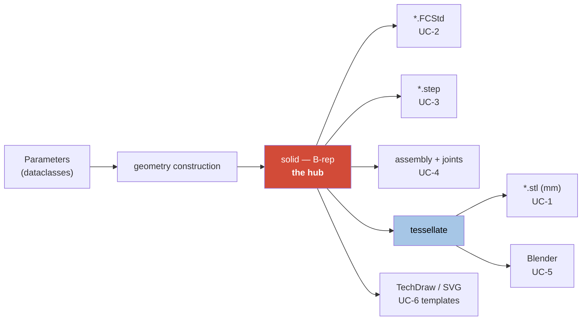
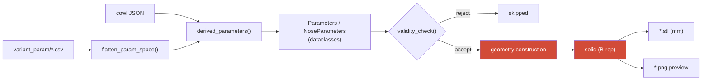
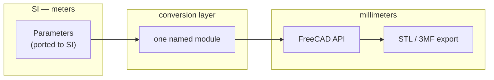

# FreeCAD Migration — Architecture

**Scope.** The target architecture for roadmap [Phase 3](../roadmap.md): generating parts
through FreeCAD's Python API instead of by emitting OpenSCAD source. This document covers
what changes, what does not, and what the change costs — particularly in verification,
where the migration starts by losing a capability.

**Status.** Written 2026-08-06, before any port work. The measurements in it were taken on
this machine; the design arguments follow from decisions already made and recorded in
[corner.md](../design/corner.md) and [bulkhead.md](../design/bulkhead.md).

**Relationship to `overview.md`.** The `/arch` skill defines `doc/architecture/overview.md`
as the primary system architecture document, with a module registry, the MAUS unit
standard, and interface conventions. **It does not exist yet.** This document is scoped to
the migration only and deliberately does not duplicate what belongs there. When
`overview.md` is written, the toolchain diagram below belongs in its *Generator toolchain*
section and the open questions here become system-level OQs.

Dimensions are stated in SI unless marked. Where a quantity is millimeters — the FreeCAD
API, the OpenSCAD path, exported meshes — that is called out, because the unit boundary is
the single easiest place in this project to be silently wrong by a factor of 1000.

---

## Use cases

Six anticipated uses of the FreeCAD generation tools. They are listed first because they
set the scope of everything below, and because **three of them are not achievable in
OpenSCAD at any effort** — which is the actual justification for the migration.

### Actors

| Actor | Wants |
| --- | --- |
| Airframe designer | To change a parameter and see the consequence, interactively |
| Build engineer | Printable meshes and cut templates for a specific airframe size |
| Analyst | Mass properties, FEM on load-bearing structure |
| Downstream CAD consumer | Neutral solid geometry that opens in other CAD systems |
| Documentation / visualization | Assembly views, exploded views, animation |

### The use cases

| ID | Use case | Terminal artifact | Kind | Possible today? |
| --- | --- | --- | --- | --- |
| **UC-1** | Headless parameter sweep producing printable meshes | `*.stl` (mm) | mesh | **Yes** — this is the current system |
| **UC-2** | Headless sweep producing native FreeCAD solid models | `*.FCStd` | B-rep | **No** |
| **UC-3** | Headless sweep producing STEP solid models | `*.step` | B-rep | **No** |
| **UC-4** | Solid assemblies with defined joints — fuselage unit, nose, tail, full fuselage | `*.FCStd` assembly | B-rep | **No** |
| **UC-5** | Blender mesh assemblies: full fuselage, units, exploded, exploded with animation paths | `*.blend` | mesh | Partly — `blender/splode.blend` exists |
| **UC-6** | New components: printable panels, panel cutting templates, wing joiners, boom collet and clamp, landing-gear bulkheads and structural blocks | solid + 2D vector | mixed | No — new design work |

**UC-2, UC-3 and UC-4 are blocked by OpenSCAD's representation, not by its interface.**
OpenSCAD has no boundary representation. Its solid model is a polyhedral mesh — a
`cylinder()` *is* a prism of `$fa`/`$fs` facets, not a cylindrical surface — so there is
no curved geometry to write into a STEP file and nothing for an assembly constraint to
attach to. **No amount of work on the OpenSCAD path reaches these three.** That is a
stronger argument for the port than convenience, and it is worth stating plainly because
it also bounds the argument: UC-1 alone would not justify the migration.

**Mesh is not acceptable as an intermediate for UC-2, UC-3 or UC-4.** Tessellating and
re-fitting a surface would produce a nominally-solid model whose faces are approximations
of approximations. The solid must stay a B-rep from construction to export.

### Consequence: the solid is the hub, not the mesh

Today the pipeline is linear and terminates in a mesh. It has to become a hub with
several leaves, and the mesh becomes one leaf among four artifact kinds:



Two rules follow, and both are architectural:

- **Tessellation happens once, at the leaf.** Nothing downstream of it feeds back into a
  solid path.
- **The four artifact kinds — B-rep, mesh, 2D vector, drawing — are exports of one solid,
  never conversions of each other.**

### New geometry capability: cowl interior surfaces (UC-4)

The nose and tail cowls are currently modeled as an outer surface only. Present practice
is to let the slicer create the interior by slicing with zero infill. A CAD assembly needs
the interior as real geometry, so the cowl generator gains an interior surface.

**It is a per-layer 2D inset, not a 3D shell offset.** The interior surface is produced
the way a slicer produces it: within each extrusion layer, offset the exterior cross
section inward by a fixed multiple of the extrusion width. That is deliberately *not*
`Part::Offset` or `makeThickness`, which offset perpendicular to the surface.

The two differ on every sloped surface, and the difference is not small. For a surface
tilted by angle α from vertical, a horizontal inset `t` leaves a wall whose perpendicular
thickness is `t·cos α`. So a per-layer inset **thins toward horizontal surfaces** — the
nose tip and the tail cap get progressively thinner walls, reaching zero at a horizontal
face.

That is correct and intended: it reproduces what the printer actually lays down, which is
the whole point of modeling the interior rather than assuming a uniform shell. It will
nonetheless look like a defect to anyone who expects constant wall thickness, so it is
recorded here as designed behavior. Where a real part needs material at a near-horizontal
surface, a slicer supplies it with top and bottom solid layers, and the CAD model needs
the equivalent rule rather than relying on the inset alone.

**The parameter already exists — it was misnamed.** `PrinterSettings` carried a field
called `nozzle_diameter`, but every use of it in the codebase was extrusion-width
semantics: a wall *N* beads thick, or *N* beads of margin. Not one referred to the
nozzle's bore.

| Use | What it means |
| --- | --- |
| `greeble_thickness = max(2·√U·w, 2·w)` | a wall *N* beads thick, floored at two |
| `flange_thickness = max(⌈3U⌉·w, 3·w)` | a whole number of beads |
| `longeron_chamfer = w` | one bead |
| `corner_radius − w − cowl_flange_tolerance` | one bead of setback |
| `panel_clearance_radius + 2·w` | two beads of margin |

Renamed to `extrusion_width` throughout (IP-GEO-24). The rename was worth doing in code
that Phase 3 replaces precisely *because* Phase 3 replaces it: the port will be written by
reading this code, and a field named `nozzle_diameter` gets ported as nozzle diameter —
after which this use case adds a *second* `extrusion_width` field and the model carries two
parameters, differing by 10–20 %, where the design has one.

The method belongs in an algorithm document (`doc/algorithms/`, per the `/arch` skill)
rather than here; this section states the requirement and the trap. Tracked as
[OQ-ARCH-5](#open-questions).

### What each use case adds

| Use case | Beyond the port itself |
| --- | --- |
| UC-1 | Nothing — this *is* the port |
| UC-2 | An export step; the solid already exists |
| UC-3 | An export step |
| UC-4 | Cowl interior surfaces; joint/mate definitions; an assembly structure |
| UC-5 | A mesh export path to Blender; explode transforms and animation paths |
| UC-6 | Several new generators, and a 2D vector output kind that nothing currently produces |

**UC-1 is the port. UC-2 through UC-6 are capabilities the port enables.** Keeping that
line sharp is what protects the migration from becoming an open-ended redesign: the
migration is done when UC-1 produces geometry verifiably equivalent to what it replaces,
and everything else is new work scheduled after it.

---

## The port is one layer, not the toolchain

This section is about **UC-1**, the port proper. The most important architectural fact
about it is how little of the system it touches. The generator is already layered, and
only two layers are OpenSCAD-specific:

| Layer | Today | After the port |
| --- | --- | --- |
| Parameter axes — `variant_param/*.csv`, `*.json` | pandas rows | **unchanged** |
| Derivation — `derived_parameters()` → `Parameters` dataclass | Python | **unchanged** |
| Validity — `corner_validity_check()`, `bulkhead_validity_check()` | Python | **unchanged** |
| Geometry construction | `solid2` → generated `.scad` text | **replaced** — FreeCAD Python API → in-memory `Shape` |
| Solid evaluation + export | `openscad.exe`, CGAL → `.stl` | **replaced** — OCC kernel → B-rep, tessellated to `.stl` at the leaf |
| Sweep driver — queue, workers, resume, atomic writes, previews, naming | Python | **unchanged in structure**, one call swapped |
| Verification | three tiers | **one tier is lost**, see below |

That the parameter layer survives untouched is not luck. It is the result of
[OQ-GEO-1](../implementation/geometry_refactor.md#open-questions), which rejected grouping
parameters inside OpenSCAD precisely because that work would be discarded here, and built
the typed dataclasses in Python instead. The same reasoning applies to anything still
tempting in the OpenSCAD path: it has one phase left to live.



Only the two red nodes are rewritten. Everything to their left is already in its final
form; everything to their right keeps its current contract.

---

## Verified: the headless path works

The roadmap requires the sweep to run headless, because the FreeCAD MCP drives a live GUI
session and a batch of thousands of parts must not. Confirmed on this machine, 2026-08-06:

```text
C:\Users\Alex\AppData\Local\Programs\FreeCAD 1.1\bin\freecadcmd.exe
    FreeCAD 1.1.1
    GuiUp = 0
```

A box with a cylindrical cut, built and measured entirely headless:

| Measurement | Result |
| --- | --- |
| `Shape.Volume` | 2230.353997 mm³ |
| Analytic volume, `20·20·6 − π·3²·6` | 2230.353997 mm³ |
| `Shape.BoundBox` | 20.000 × 20.000 × 6.000 mm |
| `Shape.isValid()` | `True` |
| `tessellate(0.1)` | 520 triangles |
| `tessellate(0.01)` | 932 triangles |
| Exported STL, mesh volume | 2230.375282 mm³ |

Three architectural consequences follow from that table, and they matter more than the
fact that it ran.

**`Volume` is exact, not sampled.** It agrees with the closed-form answer to all printed
digits, because it is integrated over the B-rep rather than summed over triangles. The
OpenSCAD path has no equivalent — there, volume is only ever a property of a mesh.

**Triangle count is a setting, not a property.** The same solid gives 520 or 932 triangles
depending on a deviation argument. In the OpenSCAD path triangle count is likewise set by
`$fa`/`$fs`/`$fn`, but it has been usable as a change-detector because those values are
held constant. **Across the two toolchains it is meaningless** — see the verification
section.

**Tessellation error is small but real.** The exported mesh measures 0.021 mm³ larger than
the exact solid, +0.001 % at deviation 0.01. The sign is right: the cut cylinder is
approximated by an inscribed prism, which removes slightly less material than the true
cylinder. Any equivalence test between the two toolchains inherits an error of this
character, so it needs a *relative* tolerance justified by tessellation — not an
arbitrary epsilon.

---

## The unit boundary

The project standard is SI (m, s, kg, rad). **FreeCAD's Python API is millimeters**, its
FEM stack is N/mm², and exported STL and 3MF must be millimeters because those formats
carry no unit metadata and a slicer will read them as mm regardless.

So the port has a real unit boundary, and it needs exactly one named conversion layer
rather than factors scattered through the geometry code:



The roadmap already names the test that catches a mistake here: a ported part's bounding
box in meters must equal the OpenSCAD part's bounding box in millimeters divided by 1000.
It is worth restating why this deserves a dedicated check — a 1000× error still renders,
still exports, and still passes `isValid()`. It fails only at the printer.

**The existing OpenSCAD path stays in millimeters and is never converted.** It has one
phase left; converting it spends real risk for no benefit.

---

## What must be preserved

The sweep driver is not incidental scaffolding. Most of its behavior was built in response
to a specific failure, and each of those failures will recur if the port reimplements the
driver rather than reusing it:

| Capability | Why it exists |
| --- | --- |
| Bounded parallel workers | A worker count set from cores alone exhausted memory and crashed a sweep mid-run |
| Atomic writes — render to `*.partial.stl`, `os.replace` on success | An interrupted run left a convincing truncated part that a resume then skipped |
| `--resume` with staleness detection | Skipping on "the file exists" silently keeps stale parts after the geometry changes |
| Preview from the finished mesh | Previews used to cost a second full solid evaluation — the dominant cost of the sweep |
| Validity checks before construction | Roughly half of the Cartesian product is geometrically invalid and must never reach the kernel |
| Deterministic naming and directory scheme | The output tree is the reference corpus that equivalence testing compares against |

**Keep "render is a subprocess".** Today the driver shells out to `openscad.exe`, which is
why a thread pool works — the subprocess releases the GIL. Driving FreeCAD in-process
would hold it, and the whole `RenderQueue` design would need replacing with multiprocessing.
Spawning `freecadcmd.exe` per part instead preserves the queue, the memory budget, the
atomic writes, and the retry path exactly as they are, and swaps one command string.

The cost of that choice is process startup per part, which is higher for FreeCAD than for
OpenSCAD. That is measurable before committing, and it is the first thing to measure —
see [OQ-ARCH-3](#open-questions).

**`--resume` needs a new staleness key.** It currently compares the freshly generated
`.scad` text against what is on disk, byte for byte. There is no generated text after the
port. The replacement has to key on the inputs instead: the parameter object plus a version
of the geometry code that produced it.

---

## Verification across the port

This is where the migration is most exposed, and the exposure is not obvious.

### The cheap exact tier does not survive

Verification today is three tiers, each covering what the others cannot:

| Tier | Mechanism | Survives the port? |
| --- | --- | --- |
| [`scad_snapshot.py`](../../src/Fuselage/tools/scad_snapshot.py) | Byte-compare the generated `.scad` for all 576 variants | **No** |
| [`sweep_check.py`](../../src/Fuselage/tools/sweep_check.py) / [`verify_sweep_change.py`](../../src/Fuselage/tools/verify_sweep_change.py) | Measured geometry against a reference tree | Yes, with changes |
| [`verify_drivers.py`](../../src/Fuselage/tools/verify_drivers.py) | Render every GUI driver, treat warnings as failures | Different shape |

The first tier is exact, runs in seconds, and proved most of the Phase 2 work outright —
including the parameter dataclass conversion, where all 576 parts came out byte-identical.
It works *because* the generated `.scad` is a complete written statement of the geometry.
**The port removes that artifact**: FreeCAD builds objects in memory and there is nothing
textual to diff.

Losing it means every Python-side change costs a full render to verify instead of a few
seconds of text comparison. Plan for the replacement rather than discovering the gap
mid-port.

### The replacement: snapshot the parameters, not the source

The cheap tier can be recovered one layer up. The `Parameters` and `NoseParameters`
dataclasses are the complete input to geometry construction and are shared by both
toolchains. Snapshot those for every variant and diff them, exactly as `scad_snapshot.py`
diffs generated text today.

That covers every layer above geometry construction — axes, derivation, validity, naming —
which is where most changes actually land. It does not cover the geometry code itself,
which is what the geometric tier is for. The division of labor is the same as today; only
the boundary moves.

### Equivalence between toolchains

The 576-part output tree is the golden reference. Comparing a ported part against it needs
care about which properties are portable:

| Property | Portable across toolchains? |
| --- | --- |
| Enclosed volume | **Yes** — with a tessellation tolerance |
| Bounding box | **Yes** |
| Hole positions and count | **Yes** |
| Triangle count | **No** — a tessellation setting, measured above at 520 vs 932 for one solid |

`sweep_check.py` compares all four today, and triangle count is currently its *strictest*
signal. That signal has to be dropped for cross-toolchain comparison and kept for
within-toolchain regression. Conflating the two would either mask real differences or
report false ones on every part.

### The reference corpus is faceted, and that is a real geometric difference

This is the subtlety most likely to be mistaken for a bug, and the use cases above are
what make it unavoidable.

OpenSCAD has no curved surfaces. Its `cylinder()` is an inscribed prism of `$fa`/`$fs`
facets, so the reference corpus is not an approximation *of* the intended solid — **it is
a different solid**, one whose round features are systematically smaller than round. The
ported part, built on true cylindrical surfaces, will not match it exactly no matter how
finely either side is tessellated.

The difference is not noise. It is **systematic, one-sided, and computable**: an inscribed
regular *n*-gon has area `(n / 2π)·sin(2π / n)` times the circle it approximates, so every
convex round feature in the reference is slightly undersized and every round hole slightly
oversized. At `$fa = 1` — 360 facets — that is about 0.005 % of area per feature, with the
sign depending on whether the feature adds or removes material.

Three consequences:

- **The equivalence tolerance has two components,** not one: tessellation error on the
  measurement (measured above at 0.001 %) *plus* the faceting bias of the reference. Only
  the first shrinks if you tessellate more finely.
- **The sign is predictable per feature,** so a difference in the unexpected direction is
  a genuine finding rather than a tolerance problem. That is worth more than a tighter
  bound.
- **This applies only to comparisons against the OpenSCAD corpus.** UC-2, UC-3 and UC-4
  compare B-rep against B-rep, where volume is exact on both sides and the tolerance
  collapses to floating point.

So the equivalence test is a one-time migration instrument, not a permanent fixture. Once
UC-1 is signed off, within-FreeCAD regression testing is strictly more precise than
anything available today.

---

## What the design documents constrain

Two findings from Phase 2 bear directly on how the port should be structured, and both
would be easy to lose.

**The joint is one description, not two.** The bulkhead's greeble is formed by subtracting
`corner_end()` — the corner's own end section — from the bulkhead. What survives is the
positive post that fills the corner's bore, with a rib filling the corner's groove. The two
mating halves are complements of a single shape and therefore *cannot* disagree. See
[bulkhead.md](../design/bulkhead.md).

Preserving that property is an architectural requirement, not a stylistic preference. If
the port models the corner's bore and the bulkhead's post as two independent features, a
constraint is needed to hold them together — and constraints can be violated, while
complements cannot.

**Corner and bulkhead share the cross-section, not the length.** They are not independent
designs; they are two halves of one joint. But bay length is *not* part of that coupling:
`FX` scales `unit_length`, which reaches the corner alone, which is why one bulkhead design
serves bays of every length and why the bulkhead sweep carries no `FX` axis. See
[OQ-DES-C3](../design/corner.md#open-questions).

The port should therefore share cross-section and joint parameters between the two parts by
construction, and keep bay length a parameter of the corner only.

---

## Migration sequence

Ordered so that each step's failure is cheap and legible:

1. **Measure `freecadcmd` startup and one part's build time.** Decides whether
   subprocess-per-part is viable, which decides whether the sweep driver survives intact.
   Everything else is easier to change than this.
2. **Port one part end to end** — the corner, which is the simpler of the two joint halves
   and has a design document. Compare against its OpenSCAD reference by volume and
   bounding box.
3. **Port the bulkhead, forming the greeble by cutting with the corner's end section.**
   This is the step that proves the paradigm can express the joint; if it cannot, that is
   the point to find out.
4. **Build the parameter snapshot tool** before porting anything further, so the remaining
   work has a cheap regression check.
5. **Swap the render call in the sweep driver**, keeping the queue, resume, atomic writes,
   and previews.
6. **Run the full sweep and compare against the reference tree** by portable properties.
   **UC-1 is complete here**, and the migration proper is done.
7. **Then, and only then, the capabilities the port existed to enable.** UC-2 and UC-3
   first — `.FCStd` and `.step` exports, both of them export steps on a solid that already
   exists, and the two use cases OpenSCAD could never reach.
8. **UC-4** — cowl interior surfaces first (the new geometry), then assemblies and joints.
9. **UC-5** — the Blender export path, explode transforms, animation.
10. **UC-6** — new components, in whatever order the airframe needs them. The 2D vector
    output kind for cutting templates has no precedent in the toolchain and should be
    prototyped on one panel before the others are designed around it.

Two orderings are deliberate. **Step 3 before step 4:** the greeble is the highest-risk
geometry in the project, and finding out it does not map cleanly is worth more than having
a faster test suite while porting parts that were never in doubt. **Steps 7–8 after step
6:** UC-2 and UC-3 cost almost nothing once UC-1 lands, so they should not be entangled
with it — but UC-4 pulls in new geometry and a new failure mode, and starting it before
the port is verified would make it impossible to tell which layer a discrepancy came from.

---

## Open questions

| ID | Status | Question |
| --- | --- | --- |
| ARCH-1 | **open** | `Part::` primitives with booleans, or `PartDesign::` bodies with sketches? |
| ARCH-2 | **open** | What replaces the exact-and-cheap verification tier? |
| ARCH-3 | **open** | Is subprocess-per-part viable at FreeCAD's startup cost? |
| ARCH-4 | **open** | What is the fate of the OpenSCAD implementation? |
| ARCH-5 | **open** | How is the cowl interior surface generated, and where does extrusion width come from? |
| ARCH-6 | **open** | How are assembly joints defined and stored? |

### OQ-ARCH-1 — `Part::` or `PartDesign::`?

The roadmap calls this the decision that shapes the whole phase. The geometry today is
CSG: unions and differences of primitives and extrusions, with masks trimming an octant and
mirrors tiling it.

**Alternatives**

1. **`Part::` primitives with booleans.**
   *Benefits:* maps directly onto the existing code, so the port is a translation rather
   than a redesign; a `Shape` is a value that can be reused as a cutting tool, which is
   exactly how the greeble is formed today; the octant-and-mirror construction carries over
   unchanged.
   *Drawbacks:* less idiomatic FreeCAD; fillets and drafts are applied to edges selected
   programmatically, which is fragile if edge ordering shifts.
   *Prerequisites:* none.

2. **`PartDesign::` bodies with sketches.**
   *Benefits:* idiomatic; proper parametric fillets and drafts; better suited to TechDraw
   and to later assembly work.
   *Drawbacks:* a body is a single contiguous solid, and reusing one body as a cutter for
   another is awkward — which is a direct problem for the greeble, whose whole safety
   property is that both halves are complements of one shape; sketches must be constructed
   programmatically, which is more code than the geometry warrants.
   *Prerequisites:* a way to express the joint that preserves the single-description
   property.

3. **`Part::` for the joint, `PartDesign::` for the rest.**
   *Benefits:* keeps the risky part in the paradigm that suits it.
   *Drawbacks:* two paradigms in one codebase, and the boundary between them is another
   thing to get wrong.
   *Prerequisites:* both of the above understood first.

**Recommendation: alternative 1.** The single-description property of the greeble is the
strongest constraint in the geometry and `Part::` preserves it for free. The fillet
fragility is real but confined to the flange and web features, which are the least
load-bearing geometry in the project. Revisit if TechDraw or assemblies later demand
`PartDesign::` — porting a part a second time is cheaper than losing the joint's safety
property in the first port.

### OQ-ARCH-2 — What replaces the exact verification tier?

`scad_snapshot.py` is exact, runs in seconds, and disappears with the generated `.scad`.

**Alternatives**

1. **Snapshot the parameter dataclasses instead.**
   *Benefits:* same cost and exactness; covers axes, derivation, validity, and naming —
   where most changes land; toolchain-independent, so it works before, during, and after
   the port.
   *Drawbacks:* covers nothing below geometry construction, so geometry changes still cost
   a render.
   *Prerequisites:* none; the dataclasses already exist.

2. **Serialize each `Shape` to BREP and byte-compare.**
   *Benefits:* covers the geometry layer exactly.
   *Drawbacks:* BREP is not obviously stable across kernel versions or construction order,
   so a false difference is likely; unproven.
   *Prerequisites:* measure whether identical input yields identical BREP bytes.

3. **Accept the loss and rely on measured geometry alone.**
   *Benefits:* no work.
   *Drawbacks:* every Python-side change costs a full sweep; that is the situation Phase 1
   built tooling to escape.
   *Prerequisites:* none.

**Recommendation: alternative 1 now, and measure alternative 2 opportunistically.** They
compose — parameters above, BREP below — and 1 is cheap enough to build before it is
needed.

### OQ-ARCH-3 — Is subprocess-per-part viable?

Keeping "render is a subprocess" preserves the entire sweep driver. It costs a FreeCAD
process start per part, and FreeCAD starts far more slowly than OpenSCAD.

**Alternatives**

1. **One `freecadcmd` process per part.**
   *Benefits:* the queue, worker budget, atomic writes, retry, and resume all survive
   unchanged; crash isolation per part; parallelism keeps working through threads.
   *Drawbacks:* startup cost multiplied by part count.
   *Prerequisites:* measure startup.

2. **One long-lived worker process handling many parts.**
   *Benefits:* startup paid once per worker.
   *Drawbacks:* loses crash isolation — one bad part can take a worker's whole batch;
   document state leaks between parts unless carefully closed; a new failure mode where
   part N is contaminated by part N−1.
   *Prerequisites:* alternative 1 measured and found too slow.

3. **In-process, multiprocessing instead of threads.**
   *Benefits:* no process-per-part startup.
   *Drawbacks:* rewrites the queue; parameter objects must be picklable; the memory budget
   logic changes shape.
   *Prerequisites:* both of the above ruled out.

**Recommendation: measure before choosing**, and this is step 1 of the sequence above.
If startup is a small fraction of a part's build time — plausible, since these parts take
seconds to minutes of kernel work — alternative 1 wins on every other axis.

### OQ-ARCH-4 — What becomes of the OpenSCAD implementation?

The roadmap says do not delete it before the FreeCAD path is proven across the full
parameter range, which settles the near term but not the end state.

**Alternatives**

1. **Retire it once equivalence is demonstrated.**
   *Benefits:* one implementation to maintain; no divergence.
   *Drawbacks:* loses the only independent check on the new geometry.
   *Prerequisites:* full-range equivalence.

2. **Keep it as a cross-check, run on demand.**
   *Benefits:* two independent implementations of the same geometry is a strong check —
   the current design documents were written partly by reading it.
   *Drawbacks:* every geometry change must be made twice or the check rots into a source of
   false alarms.
   *Prerequisites:* a decision about who keeps them in step.

3. **Freeze it as a reference corpus, not as code.**
   *Benefits:* keeps the 576-part output tree as the golden reference forever, at no
   maintenance cost; the `.scad` sources stay readable as documentation of intent.
   *Drawbacks:* the reference goes stale the moment the geometry legitimately changes.
   *Prerequisites:* none.

**Recommendation: alternative 3.** A frozen corpus captures nearly all the value of
alternative 2 — an independent statement of what the geometry was — without the standing
cost of maintaining two implementations, which alternative 2 will lose to entropy.

---

### OQ-ARCH-5 — How is the cowl interior surface generated?

Required by UC-4. The interior must be a per-layer 2D inset matching slicer behavior, not
a perpendicular shell offset — see the use-case section for why the two differ and why the
difference is intended.

**The parameter question is settled.** Extrusion width already exists; it was stored under
the name `nozzle_diameter` and has been renamed (IP-GEO-24). No new field is needed, and —
more to the point — no new field should be *added*, because doing so would produce two
nearly-equal parameters where the design has one.

The offset should still be expressed as an explicit multiple, `n_perimeters ×
extrusion_width`, so the count and the width stay separately visible. That matches the
existing convention for `flange_thickness` and `plate_thickness`, which are already whole
multiples of extrusion width and layer height respectively.

**What remains open is the method**, and it belongs in an algorithm document rather than
here. It needs to
state how layers are sliced, how the inset is computed per layer, how the resulting
sections are joined into a solid, and what rule supplies material at near-horizontal
surfaces where the inset alone would leave none.

### OQ-ARCH-6 — How are assembly joints defined and stored?

Required by UC-4: fuselage unit, nose, tail, and full fuselage assemblies with real joints.

The unresolved part is where the mating information lives. The geometry already knows how
the parts mate — the greeble post and its bore are complements of one shape, and the bolt
pattern is a shared parameter — so an assembly could in principle place parts by
construction rather than by constraint. That is the same argument that appears in
[OQ-DES-C3](../design/corner.md#open-questions) for the joint itself.

**Alternatives**

1. **Place parts by construction, from the parameters that already position them.**
   *Benefits:* cannot be inconsistent, for the same reason the greeble cannot; no
   constraint solver in the sweep path; headless-friendly.
   *Drawbacks:* not a FreeCAD Assembly document, so it does not interoperate with the
   Assembly workbench's tooling.
   *Prerequisites:* none.

2. **Use FreeCAD's Assembly workbench with real joints.**
   *Benefits:* idiomatic; interference checks and kinematics come free; exports as a
   proper assembly to STEP.
   *Drawbacks:* constraints can be violated or fail to solve, which is a new failure mode
   in a batch context; the solver's headless behavior is unverified.
   *Prerequisites:* confirm the Assembly workbench is scriptable under `freecadcmd`.

3. **Both — construction for placement, joints added for downstream use.**
   *Benefits:* placement stays deterministic while the assembly still carries joint
   semantics for consumers.
   *Drawbacks:* two representations of the same relationship, which is exactly the class
   of duplication this project has spent Phase 2 removing.
   *Prerequisites:* both of the above understood.

**Recommendation: measure alternative 2's headless behavior first**, because it decides
whether the choice is real. If the Assembly workbench does not script cleanly under
`freecadcmd`, alternative 1 is the only option that runs in a sweep and the question closes
itself.

---

## References

- [roadmap.md](../roadmap.md) — Phase 3 objectives and exit criteria
- [corner.md](../design/corner.md) — corner design authority; OQ-DES-C3 on the coupling
- [bulkhead.md](../design/bulkhead.md) — bulkhead design authority; the greeble as a
  positive post formed by cutting with `corner_end()`
- [geometry_refactor.md](../implementation/geometry_refactor.md) — Phase 2 plan; OQ-GEO-1
  on why the parameter groups were built in Python
- [general.md](../guidelines/general.md) — units standard and the OpenSCAD exemption
- [python.md](../guidelines/python.md) — dataclass conventions the ported code follows
- [fuselage_folder_summary.md](../../src/Fuselage/docs/fuselage_folder_summary.md) — how
  the current sweep is driven
