# Architectural requirements

**Status:** authoritative. Created 2026-08-29, deciding
[OQ-DES-DB5](../design/design_basis.md#open-questions).

**This document is the source. The project wiki is a restatement of it.** The requirements here
were first written on the wiki's *MAUS‑FOS Fuselage Outer Mold Line (OML) Standard* and *Modular
Airframe Unitized System (MAUS) Architecture* pages, as a Mermaid `requirementDiagram` and an
objectives list. Those pages are a **user document** — they explain the architecture to someone
reading about it. This file is what they restate, it lives with the code the requirements
constrain, and where the two differ this one is correct.
[§ Keeping the wiki in step](#keeping-the-wiki-in-step) gives the id mapping.

---

## What is architectural, and what is not

> **An architectural requirement constrains *any* compliant implementation. A design
> requirement constrains *this* one.**

That test puts both MAUS‑FOS and MAUS‑FD1 here: FOS is a standard another airframe could be
built to, and FD1 is a design *system* that a family of designs can satisfy. The fuselage design
in this repository is one such design, and what *it* must do — where a clearance sits, what a
seat is set back by, which face carries a fit — is a **design** requirement and lives in
[doc/design/design_basis.md](../design/design_basis.md).

**Design requirements may cite an architectural requirement, and do not have to.** A design
requirement with no citation is not defective; it is a decision taken at design level. What it
does need is its own rationale, since nothing above it supplies one.

Four tiers, then:

| Tier | Where | Example |
| --- | --- | --- |
| Architecture | this file | *the OML uses a constant cross section so external components can move longitudinally* |
| Design (`DES-n`) | [system_requirements.md](../design/system_requirements.md), argued in [design_basis.md](../design/design_basis.md) | *the corner carries the corner/bulkhead clearance so the bulkhead's dimensions stay consistent* |
| Interface (`INT-n`) | [system_requirements.md section 5](../design/system_requirements.md#5-interface-requirements) | *the corner captures the panel in a rebate, not a slot* |
| Drawing, model, equivalence (`DRW-n`, `MDL-n`, `EQV-n`) | [system_requirements.md sections 6 to 8](../design/system_requirements.md#6-drawing-requirements) | *no witness line crosses a dimension line*; *the delivered .FCStd stays editable* |
| Implementation | `scad/`, `freecad/` | `flat_x = -(panel_overlap + panel_offset)` |

---

## Objectives

Not requirements — the priorities the requirements answer to, and the tie-breaker when two of
them pull against each other. In order:

| ID | Objective |
| --- | --- |
| **AR-OBJ-1** | Facilitate iteration of aircraft sizing and configuration |
| **AR-OBJ-2** | Facilitate system integration |
| **AR-OBJ-3** | Maximize modularity |
| **AR-OBJ-4** | Decouple component designs |

**Aerodynamic efficiency is explicitly a secondary concern.** The reasoning is recorded and it
is not an admission: in many small UAS cases a better aircraft sizing and configuration yields
more mission efficiency than aerodynamic optimization of a configuration that was not matched to
the mission in the first place.

**This has a consequence worth stating plainly**, because it is easy to assume otherwise: the
outer mold line is a **modularity datum, not an aerodynamic surface.** Every reason given for
its shape below is a modularity reason. A design document that justifies the OML aerodynamically
has the architecture backwards.

---

## Functional requirements

### Modularity

| ID | Requirement |
| --- | --- |
| **AR-MOD-1** | Minimally constraining physical interface |
| **AR-MOD-2** | Allow interchange of fuselage sections |
| **AR-MOD-3** | Allow re-ordering of fuselage sections |
| **AR-MOD-4** | Interchange or re-ordering of fuselage sections does not affect fuselage structure |
| **AR-MOD-5** | The OML provides flat exterior panels for system integration |
| **AR-MOD-6** | The OML provides a simple exterior shape for the wing interface |
| **AR-MOD-7** | The OML uses a constant cross section, to allow longitudinal relocation of external components such as wings |
| **AR-MOD-8** | The OML uses standardized dimensions, to allow commonality between implementations |
| **AR-MOD-9** | The volume the airframe encloses is usable — payload, wiring, and a hand |
| **AR-MOD-10** | The OML cross section is a rounded square, and the corner radius fixes the design's position on the trade between flat panel area and aerodynamic efficiency |

**AR-MOD-9 and AR-MOD-10 were adopted on 2026-08-29** and have no counterpart on the wiki yet;
see [§ Keeping the wiki in step](#keeping-the-wiki-in-step). AR-MOD-9 was proposed because
AR-MOD-5 covers integration on the *outside* only, and nothing turned AR-OBJ-2 into a
requirement on the inside. AR-MOD-10 is the answer to a question the wiki had left open — see
[§ The cross section, and why it is a compromise](#the-cross-section-and-why-it-is-a-compromise).

### Printability

| ID | Requirement |
| --- | --- |
| **AR-PRT-1** | Printable using FDM technology |
| **AR-PRT-2** | Layer orientation aligned to structural performance needs |
| **AR-PRT-3** | Printable without support material |

### Construction

| ID | Requirement |
| --- | --- |
| **AR-CON-1** | Structural parts are printed; longerons, booms, panels, fasteners and inserts are bought |

**Adopted 2026-08-29, and it is a new group rather than a fourth Printability requirement.**
"Some of the airframe is not printed at all" is not a statement about printing, and MAUS‑FD1 is
*the mostly printable fuselage design system* — the printed/bought split is in the design
system's own name. It decides which side of every joint can be altered: a bought tube has the
diameter the supplier sells, so only the printed part can move. That is what the whole tolerance
scheme rests on, and until this was adopted nothing above it said so.

The grouping is a placement decision and it is cheap to change; if Construction should be folded
into Printability, only this heading and one diagram edge move.

### Assembly

| ID | Requirement |
| --- | --- |
| **AR-ASM-1** | Components are self-aligning during assembly |

---

## The standards

**MAUS‑FOS — the MAUS Fuselage Outer Mold Line Standard.** Refines **Modularity**. It is the
interface another airframe can be built to, and it is deliberately narrow: it fixes the outer
shape and the dimensional scheme, and nothing about how a part is made.

> **MAUS‑FOS excludes dimensional tolerances, and that exclusion is a requirement in its own
> right:** *dimensional tolerances are considered application dependent and are therefore not
> included in the standard.*
>
> This is why every clearance in this project is a **design** decision rather than an
> architectural one, and it settles what looked like a gap. `design_basis.md`'s three requirements
> that cite nothing above them — which side of a joint carries its clearance, and where — cite
> nothing because the standard declines to say. That is the standard working as intended, not an
> omission in the design.

**MAUS‑FD1 — the MAUS mostly printable fuselage design system, type 1.** Refines **MAUS‑FOS**,
**Printability**, **Construction** and **Assembly**. This is the design system the fuselage in
this repository belongs to: FOS says what the outside is, FD1 says it is made mostly of printed
parts that go together by hand.

**The fuselage design satisfies MAUS‑FD1.** It is one design, not the only possible one.

```mermaid
requirementDiagram

direction RL

functionalRequirement Modularity:::MAUSFOS {
}
functionalRequirement Printability:::MAUSFD1 {
}
functionalRequirement Construction:::MAUSFD1 {
}
functionalRequirement Assembly:::MAUSFD1 {
}

physicalRequirement "MAUS-FOS":::MAUSFOS {
    text: "The MAUS Fuselage Outer Mold Line Standard"
}
physicalRequirement "MAUS-FD1":::MAUSFD1 {
    text: "The MAUS mostly printable fuselage design system, type 1"
}

element "Fuselage Design":::FuseDes {
    type: "The fuselage design in this repository"
}

"MAUS-FOS" - refines -> Modularity
"MAUS-FD1" - refines -> "MAUS-FOS"
"MAUS-FD1" - refines -> Printability
"MAUS-FD1" - refines -> Construction
"MAUS-FD1" - refines -> Assembly
"Fuselage Design" - satisfies -> "MAUS-FD1"

classDef MAUSFOS  fill:#400,stroke:#fff,stroke-width:4px
classDef MAUSFD1  fill:#040,stroke:#fff,stroke-width:4px
classDef FuseDes  fill:#004,stroke:#fff,stroke-width:4px
```

The `contains` edges from each group to its numbered requirements are left off the diagram and
carried by the tables above, which is the only place this differs from the wiki's rendering.

---

## The cross section, and why it is a compromise

*Recorded 2026-08-29, answering the wiki's FAQ entry "Why only square fuselage cross sections?",
whose body was `TODO`.*

**The section is not square because square is right. It is a chosen point on a trade, and the
trade has two sides that pull in opposite directions:**

- **Rounder is better aerodynamically and structurally.** A rounder section has lower wetted
  area for the volume it encloses and carries pressure and bending load more efficiently, so it
  gains on both drag and weight.
- **Flatter is better for integration and for cost.** Flat sides are what AR-MOD-5 needs —
  something to mount to and pass through — and, just as importantly, **a flat panel can be cut
  from cheap sheet stock.** A curved panel cannot; it becomes a molded part, and the panel stops
  being something a user can make.

Neither end of that is a requirement. **The requirement is that the design occupies a stated
point on the front**, and AR-MOD-10 says which: a rounded square, with the corner radius as the
parameter that moves along it. `corner_radius` and `unit_width` in
[`design_constants.json`](../../src/Fuselage/design_constants.json) are that point.

**Where this design sits, measured from the standard's own numbers at 1U:**

| | |
| --- | ---: |
| corner radius, as a fraction of the width | 0.10 |
| flat run per side of the mold line | 80.0 mm — **80 % of the width** |
| usable panel width per side, at 3/16 in panel | 75.0 mm — 75 % of the width |
| section area | 9 914 mm² |
| section perimeter | 382.8 mm |
| perimeter of a circle of the same area | 353.0 mm |
| **wetted-perimeter penalty against that circle** | **8.5 %** |

So the design buys 80 % of its width as flat, mountable, sheet-cuttable surface for about eight
and a half percent more wetted perimeter than the roundest section of the same area. That is the
compromise, stated as a number rather than as a preference.

**What is *not* established, and the distinction matters.** No analysis on record locates this
point on the Pareto front — nothing says 0.10 is better than 0.08 or 0.15, and no drag or weight
model has been run against the integration benefit. The ratio is engineering judgment, in the
same category as `greeble_opening_angle`: a tuned value, chosen deliberately, not derived. What
AR-MOD-10 fixes is that the section *is* a rounded square and that the corner radius is the
control; it does not claim the control is at its optimum.

**Two consequences worth stating**, because designs downstream will assume them:

- **A compliant implementation may sit at a different point** — a different corner radius is not
  a violation of AR-MOD-10, it is a different position on the same front. What it would break is
  AR-MOD-8, commonality, since panels and corners would no longer interchange between the two.
- **The corner radius is not free within this implementation.** It is a `standard` value, so
  everything scaled from it moves together; `doc/design/design_basis.md` DES-1 covers that.

---

## Adopted additions

The three proposals raised on 2026-08-29 under OQ-DES-DB5 were all resolved the same day:

| Was | Now | Outcome |
| --- | --- | --- |
| AP-1 — the enclosed volume is usable | **AR-MOD-9** | Adopted. `dimension_scheme.md` §1 had already admitted the enclosed span of each part into the dimension set, stated 2026-08-22, precisely because the joint test could not see it |
| AP-2 — which parts are bought rather than printed | **AR-CON-1** | Adopted, as a new **Construction** group rather than a fourth Printability requirement |
| AP-3 — a rule for the cross section | **AR-MOD-10** | Answered rather than adopted as written: the question assumed a rule was missing, and what was missing was the *trade* the section resolves. See above |

---

## Keeping the wiki in step

The wiki's `requirementDiagram` names its requirements `Modularity1`…`Assembly1`. This file uses
prefixed ids so they read unambiguously in a design document's trace. The mapping is one to one:

| Here | Wiki |
| --- | --- |
| `AR-MOD-1` … `AR-MOD-8` | `Modularity1` … `Modularity8` |
| `AR-PRT-1` … `AR-PRT-3` | `Printability1` … `Printability3` |
| `AR-ASM-1` | `Assembly1` |
| `MAUS-FOS`, `MAUS-FD1` | `"MAUS-FOS"`, `"MAUS-FD1"` |
| `AR-OBJ-1` … `AR-OBJ-4` | the priorities list on the MAUS Architecture page, unnumbered there |
| **`AR-MOD-9`, `AR-MOD-10`, `AR-CON-1`** | **nothing — adopted here on 2026-08-29; the wiki is behind by three requirements and one group** |

**The wiki needs three additions and one new group to restate this file as it now stands**, plus
the answer to its own FAQ entry *"Why only square fuselage cross sections?"*, which AR-MOD-10 and
the section above now give.

Wording here is lightly edited from the wiki's for grammar — *"OML provides simple exterior shape
for wing interface"* reads *"The OML provides a simple exterior shape for the wing interface"* —
with no change of meaning in any of the twelve. The objectives are unnumbered on the wiki; the
`AR-OBJ` ids are this file's.

**When these diverge, this file is correct and the wiki is stale.** Nothing enforces that
automatically, which is a known weakness: the wiki is a separate repository
(`modular-sUAS.wiki`, a sibling of this one) and no check spans them.

---

## Relationship to `overview.md`

The `/arch` skill defines `doc/architecture/overview.md` as the primary system architecture
document, with a module registry, the MAUS unit standard, and interface conventions. **It does
not exist.** When it is written, this file is the requirements section it should reference rather
than restate, for the same reason the wiki should: one authoritative copy.

[OQ-ARCH-7](freecad_migration.md#open-questions) named *"agreement on what belongs to the
interface"* as a prerequisite and assigned it to `overview.md`. That agreement is now split
across two files: the architectural half here, and the design half in
[design_basis.md](../design/design_basis.md).

---

## See also

- [system_requirements.md](../design/system_requirements.md) — the design, interface, drawing,
  model and equivalence requirements, which may cite the ids above, with a coverage matrix that
  says which of the ids above are reached and which are not
- [design_basis.md](../design/design_basis.md) — why each of those requirements is what it is; and
  OQ-DES-DB5, which this file decides
- [dimension_scheme.md](../design/dimension_scheme.md) — the interface register and the drawing
  scheme
- [freecad_migration.md](freecad_migration.md) — the migration's architecture and OQ-ARCH-7
