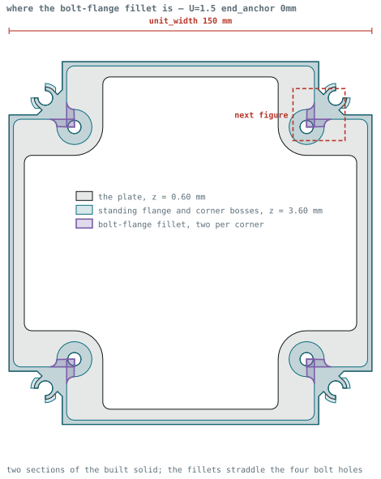
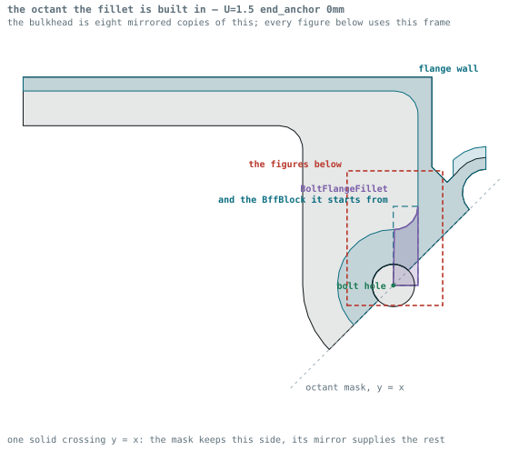
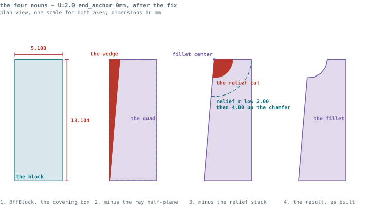
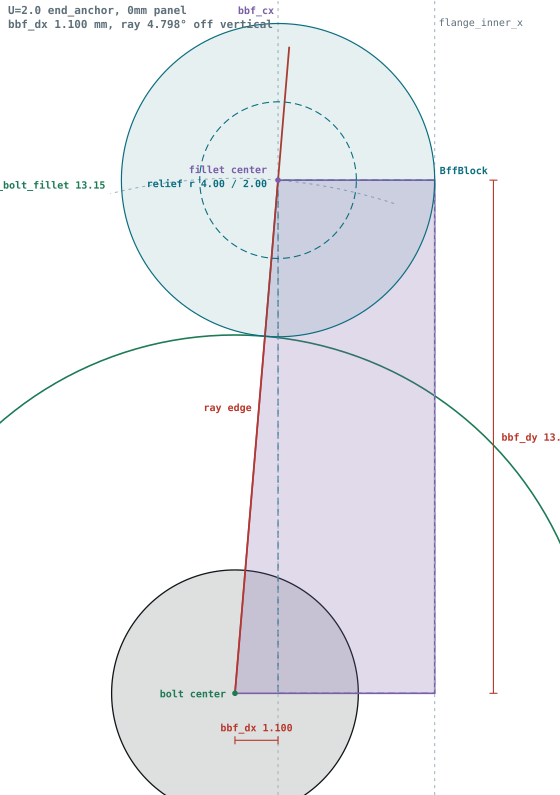
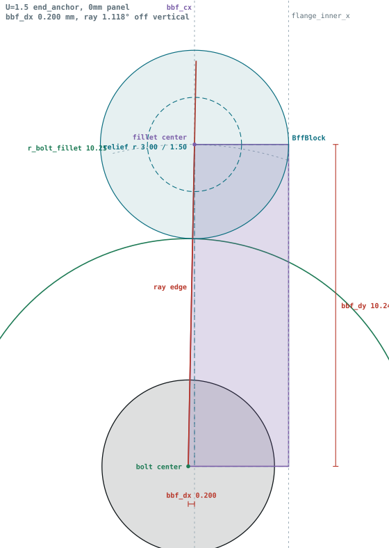
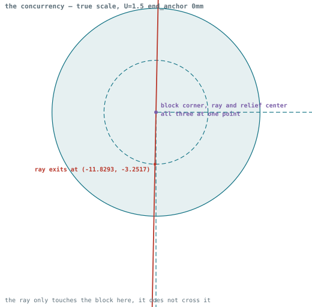
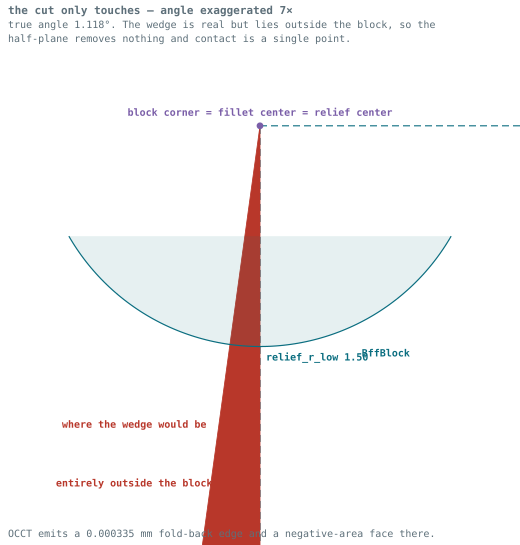
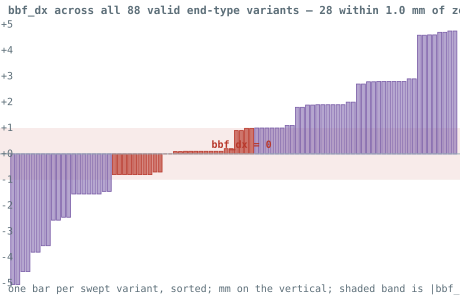
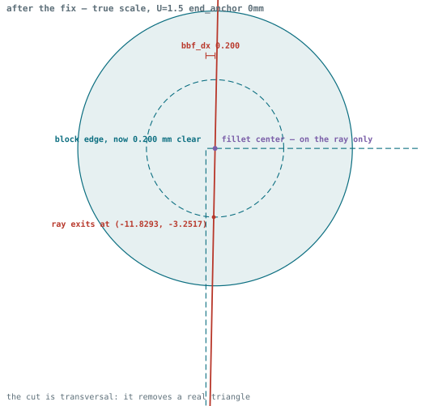

# Bulkhead — Design

**Status:** Reconstructed from the implementation, 2026-08-06. This is the first design
authority the bulkhead has had; it was written by reading
[`fuselage_bulkhead_geometry.scad`](../../src/Fuselage/scad/fuselage_bulkhead_geometry.scad)
and the derivations in
[`fuselage_variants.py`](../../src/Fuselage/tools/fuselage_variants.py), not from an
existing specification.

**How to read it.** Statements about *what the geometry does* are read off the code and
are reliable. Statements about *why* are marked as inference where they are inference.
Where the intent could not be recovered, there is an open question rather than a guess.
The code is what builds parts; anything here that contradicts it is a bug in this
document.

The corner is the mating half — see [corner.md](corner.md), particularly the greeble.

---

## What the bulkhead is

The bulkhead is the transverse frame that closes a fuselage bay. It ties the four corners
into a rigid square, carries the bolts that join one bay to the next, and provides the
mounting surface for whatever the bay contains.

**A bulkhead does not know how long the bay is.** `FX`, the bay-length multiplier, scales
`unit_length`, and `unit_length` reaches the corner alone — so one bulkhead design serves
bays of every length. That is why `FX` appears only in `corner_size_variants.csv` and the
bulkhead sweep carries no `FX` axis: bulkheads are generated once per (panel, type, size)
and reused. See [OQ-DES-C3](corner.md#open-questions), and IP-GEO-23, which removed a
`unit_length` parameter that had been passed to these modules and never used.

**The greeble is the bulkhead's feature.** At each corner the bulkhead grows a positive
annular post with a snap rib around it; the corner is bored to receive it. Naming
throughout this file assumes that — "the flange at the greeble", "greeble to bolt web"
are locations *on the bulkhead*. See [the joint](#the-greeble-is-a-positive-post) below,
because the code makes the direction easy to read backwards.

It is **not a solid plate.** The default bulkhead is an open frame: a peripheral flange
that follows the outer mould line, four bolt bosses, and — optionally — a thin web that
spans between them. Nothing fills the middle unless a variant asks for it. *Inference:*
this is a mass decision. The bulkhead's structural job is edge stiffness and load
transfer into the bolts, neither of which the middle contributes to.

## The taxonomy: one peer axis, two cousins, two families

`BulkheadType` lists four values as though they were four kinds of the same thing. **They
are not, and the enum has the relationships close to backwards.**

### The only true peers are the fastener variants

`end_bolt` and `end_anchor` are the same part, differing only in whether the hole is sized
for a through-bolt or bored for a heat-set threaded insert. That is a genuine peer
relationship — two interchangeable options for one decision.

**And it is not in the enum.** It is `is_anchor`, a boolean, and it is *orthogonal* to the
type — the variation table applies it to both `end` and `cowling`:

| Variant | `is_end` | `is_interconnect` | `is_cowling` | `is_anchor` |
| --- | --- | --- | --- | --- |
| `end_bolt` | ✓ | | | |
| `end_anchor` | ✓ | | | ✓ |
| `cowling_bolt` | | | ✓ | |
| `cowling_anchor` | | | ✓ | ✓ |
| `interconnect` | | ✓ | | |

`interconnect` has no `is_anchor` variant because it has no bolt bosses at all — the axis
is *meaningless* there, not merely unused.

So **the one relationship that is a true peering is expressed as an attribute, while three
relationships that are not peerings are expressed as enum values.**

### Cousins — the structural unit cell

`END` and `INTERCONNECT` are **related but not peers.** Both exist to construct a fuselage
structural unit cell, and both carry the cell's full mating vocabulary: corners, greeble
posts, longeron bores, panel capture.

| Type | Role in the cell |
| --- | --- |
| `END` | Closes a unit. Bolt bosses; greeble posts; optional web |
| `INTERCONNECT` | Joins two units back to back. Two sections stacked, `2·bt`; **no bolt bosses** — captured between two bolted units rather than fastened |

### Family — the cowl interface

`COWLING` is a **distinct family**: used only with a cowl, never within a structural unit.
It substitutes the cowl joint for the panel joint — flange ring, plate, cowl lip, and **no
panel at all**, which `bulkhead_validity_check()` enforces.

**One cowl bulkhead serves both ends.** The nose cowl and the tail cowl mount to the same
bulkhead — there is no nose version and no tail version, and none should be added. The
nose/tail split in the sweep is in the *cowl shells* (`nose_type_variants.csv`,
`tail_type_variants.csv`, each naming its own shape JSON); the bulkhead knows nothing about
which end it is at. Recorded 2026-08-14 because it is not recoverable from the code —
nothing in `derived_parameters()` or the geometry distinguishes the two ends, and an absent
distinction reads exactly like an unfinished one.

**The cowl bulkhead varies on two axes and there are sixteen of them.** Eight `U` sizes × the `is_anchor` fastener choice, which applies to `COWLING` exactly as it does to `END` (see the variation table above) — a bolt version and an anchor version are both wanted at every size. The two are genuinely different parts: measured at `U` = 1.0, `bolt.radius` is 2.0 mm on `cowling_bolt` and 2.75 mm on `cowling_anchor`, the anchor being bored for a heat-set insert from `threaded_insert_dimensions.csv`, and the built volumes differ by 0.9–3.6% across the size range.

**The panel axis does not multiply them, though it looks in the parameter space as if it does.** `bulkhead_validity_check()` rejects every cowling row with a non-zero panel, so 128 of the 144 cowling combinations in the Cartesian product are never built and the rendered output is two parts per `U` under `panel_0mm` alone. **Count the built output, not the Cartesian product** — the validity checks stand between the two.

### Family — inter-unit plates

`TAIL_BOOM` is a **second distinct family**: a flat plate used **between** structural units,
never within one. It does not participate in the cell.

**It is the first member of this family, not the last.** Landing-gear attachment bulkheads
and structural blocks are named in UC-6 of the
[migration architecture](../architecture/freecad_migration.md) and belong here.

Three properties follow from being an inter-unit plate rather than from the boom design:

- **Symmetric in `z`**, so print orientation carries no sign — unlike every cell bulkhead.
- **None of the cell's mating vocabulary**: no greeble, no panel slot, no cowl lip.
- **Separately generated already.** The boom bulkhead has its own geometry file
  (`fuselage_boom_bulkhead_geometry.scad`), its own sweep function, and its own variation
  table — the code has effectively separated this family already, while the *type enum*
  has not.

`NULL` exists as the unset default and never reaches geometry.

See [OQ-DES-B8](#open-questions) on whether the enum should be split to match.

The interconnect having no bolt bosses is the one that looks wrong and is not: it is
sandwiched between two bays that are themselves bolted, so it is captured rather than
fastened. It is also why it is twice as thick — it is two end-bulkhead sections mirrored
about their shared face:

```scad
bulkhead_section(true,  …)                       // z: 0 → bt, with web
mirror([0,0,-1]) translate([…, -2·bt])
    bulkhead_section(false, …)                   // z: bt → 2·bt, no web
```

Only the first section gets the web (`make_web`). *Inference:* a web on each half would
double the mass for no additional stiffness, since the two halves are fused.

`make_web` does more than add or omit the web. It also reaches
`bulkhead_flange_positive()` and `outer_corner_fillet()`, so it reads better as *"this is
the web-bearing face of the section"* than as a feature toggle — the flange and the outer
fillet change to suit. Nothing outside the geometry ever sets it; see OQ-DES-B3.

**It is not `2·bt` all the way round.** After stacking, a trapezoidal prism is subtracted
that removes the upper section everywhere inboard of the corner flange, so the full
double depth survives only *at the corners* and the runs between them drop back to a
single `bulkhead_thickness`:

```
        corner            mid-edge            corner
   ┌────────────┐                        ┌────────────┐   2·bt
   │            └──╲                  ╱──┘            │
   │               └──────────────────┘               │   1·bt
   └──────────────────────────────────────────────────┘
        ↑ full depth over the flange + its fillets
                    ↑ 45° ramp, one bt of run
```

**This is a mass reduction** (established 2026-08-06): the double depth is only needed where the
load is, at the corners where the longerons and the bolted joints land. Carrying it
around the whole circumference would add mass without adding strength.

The cut keeps full depth out to
`panel_offset + panel_overlap + flange_thickness + 2·flange_fillet_radius` — the flange's
inboard edge (`bulkhead_flange_positive()` places it at
`panel_offset + panel_overlap + flange_thickness`) plus two fillet radii of margin. So the
retained region is defined as "the flange and its fillets", not as an independent number.

The transition is a 45° ramp: the polygon's two inboard vertices differ by exactly
`bulkhead_thickness` in `x` over a `bulkhead_thickness` rise in `z`. *Inference:* a square
step would leave a horizontal overhang on the underside; 45° is the standard
self-supporting limit, so this prints without support in either orientation.

Reading the transform is the hard part. `rotate([90,0,0])` maps the polygon's `y` onto
model `z` and swings the extrusion axis onto `y`, so the polygon is drawn in the **x–z**
plane and swept across the full `unit_width`. Its `y` values — `bulkhead_thickness` and
`2·bulkhead_thickness` — are heights, not widths.

## Construction: one octant, mirrored

The bulkhead has eight-fold symmetry, and the code draws **one octant** and tiles it:

```scad
octant_tiled(unit_width, corner_radius)   //  = octant_to_full ∘ corner_translate
    → corner_translate  : move the drawing out to (unit_width/2 − corner_radius, …)
    → octant_to_full    : mirror_x ∘ mirror_y ∘ mirror_xy
```

Everything is therefore drawn in the neighbourhood of **one corner**, in that corner's
local frame, and the diagonal `mirror_xy()` produces the second half of the corner. This
is the single most important thing to know before reading the module: coordinates are not
measured from the centre of the bulkhead, and `x` and `y` are interchangeable by
construction.

The octant is trimmed by `octant_mask()`, a half-plane polygon subtracted after
everything else, so the drawing may overrun its wedge freely and be cut back at the end.
`mask_reach()` supplies the "far enough to be off the part" distance for those mask
vertices; `through_cut()` does the same for cutting solids that must pass all the way
through. Both were introduced by IP-GEO-9 to replace raw multipliers.

## Feature stack

Assembled as one `difference()`: a union of positive features, minus a set of cuts.

**Positive**

- `bulkhead_flange_positive` — the rim that follows the OML. Its inner edge sits at
  `corner_radius − panel_thickness − panel_tolerance`, i.e. flush behind the panel, and
  it is `flange_thickness` deep.
- `bolt_flange_positive`, `bolt_flange_fillet`, `bolt_web` — the boss around each bolt
  hole and the material tying it back into the rim. **Skipped for interconnects.**
- `bulkhead_web` — the thin span, `plate_thickness` tall, present only when `make_web`.
- Cowling-only: a flange ring (`corner_radius` less `flange_thickness`), a plate at
  `plate_thickness`, a longeron flange and chamfer, and the cowl lip extruded above the
  bulkhead by `cowl_flange_height`.

**Negative**

- **`corner_end()` itself**, subtracted — which is what *leaves* the greeble standing.
  See below.
- The longeron opening wedge — `greeble_opening_angle` (35°) **either side** of the
  diagonal, so a 70° mouth. This is what makes the greeble a **C** and lets the longeron
  snap in; see below.
- A cleanup cut on the outer faces of the corner cutout.
- The longeron bore, `longeron_radius + longeron_tolerance`.
- The bolt hole, at `(−bolt_offset, −bolt_offset)`, skipped for interconnects.
- `octant_mask`.

### The greeble is a positive post

```scad
greeble_tolerance_local = 0;
corner_end(U, bulkhead_thickness + 2·eps, …, greeble_tolerance_local, …);
```

The most consequential line in the file, and the one most likely to be misread. It sits
in the *negative* half of a `difference()`, so it looks like it cuts a pocket. It does
the opposite.

`corner_end()` is the corner's end section, and the corner's end section is *itself*
mostly a difference — a bore of `greeble_radius` with an annular groove out to
`greeble_nub_radius` through its middle third. Subtracting that solid from the bulkhead
removes bulkhead material wherever the corner has material, and leaves it wherever the
corner does not. What survives, standing out of the bulkhead face, is a post filling the
corner's bore with a rib filling the corner's groove.

So the bulkhead grows the greeble by subtracting the part that mates with it. The payoff
is that there is exactly **one** description of the joint: the two halves are complements
of a single shape and cannot drift apart. It is worth the moment of confusion.

The tolerance is forced to zero so the post comes out at nominal size; all fit clearance
is taken on the corner's bore instead. See
[corner.md](corner.md#where-the-clearance-lives) for why it is not split. Note that this
local zero also makes the module's own `greeble_tolerance` parameter dead — OQ-DES-B6.

The `+2·eps` and the `−eps` shift on the translate break coincident faces at the base of
the post. That is what `geometry_eps()` is for throughout.

### The longeron snaps into the greeble

The greeble is not a solid post. It is a **C**, split by a wedge cut on the diagonal —
and that wedge is how the longeron gets in.

```scad
// longeron opening cutout
polygon([[0,0],
         [sin(45−greeble_opening_angle)·corner_radius, cos(45−greeble_opening_angle)·corner_radius],
         [cos(45−greeble_opening_angle)·corner_radius, sin(45−greeble_opening_angle)·corner_radius]]);
```

**`greeble_opening_angle` is a half-angle.** The two vertices sit at 10° and 80°, so the
wedge removed spans **70°**, centred on the 45° diagonal. The tube is pressed in sideways
through that mouth rather than threaded in axially, and snaps home.

`GREEBLE_OPENING_ANGLE_DEG = 35` **was arrived at by experiment** (established 2026-08-06). It
is a tuned value. The geometry corroborates that it is doing snap-fit work rather than
merely providing clearance — the mouth is deliberately *narrower* than the tube:

| | chord across the mouth | tube diameter | mouth / diameter |
| --- | --- | --- | --- |
| any `U` | `2·r·sin 35°` | `2·r` | **57.4 %** |

where `r = longeron_radius + longeron_tolerance`. The ratio is scale-invariant because
the angle is, so the *proportional* interference is identical at every size — but the
*absolute* spread the arms must accept is not: 0.9 mm at U=0.5 against 6.9 mm at U=4.
Whether one experimentally-found angle can serve that whole range is
[OQ-DES-B7](#open-questions).

This also means the greeble does two jobs, and only one of them is the corner joint:

1. **Register the corner** — the post and its rib into the corner's bore and groove.
2. **Retain the longeron** — the C-shaped bore snapping onto the tube.

That is worth knowing before changing any greeble dimension. `greeble_thickness` sets the
wall that has to flex for job 2 while also setting the post diameter for job 1, so it is
not free to be tuned for either one alone.

## Derived dimensions

The bulkhead's own dimensions are computed in `derived_parameters()`, not chosen. The
pattern is that **structural dimensions scale with `U`, printed features scale in
extrusions and layers, and fit clearances do not scale at all.**

| Parameter | Formula | Reading |
| --- | --- | --- |
| `bolt.thickness` | `max(3·U, 3)` | Boss wall, floored at 3 mm |
| `bolt.radius` | `diameter/2`, or anchor bore | See below |
| `plate.thickness` | `ceil(4·U) · layer_height` | A whole number of layers |
| `web.fillet_radius` | `2·U` | |
| `web.width` | `6·U` if tail-boom else `3·U` | Boom bulkheads carry more load |
| `bulkhead_flange.thickness` | `max(ceil(3·U)·nozzle, 3·nozzle)` cowling, `max(ceil(2·U)·nozzle, 2·nozzle)` otherwise | A whole number of extrusions |
| `bulkhead_flange.fillet_radius` | `2·U` | |
| `bulkhead_flange.chamfer` | `1·U` | |
| `cowl_flange.height` | `2·U` when cowling, else 0 | |
| `cowl_flange.tolerance` | 0.2 mm when cowling | Does **not** scale |

The `ceil()` calls are the tell: a flange is a whole number of extrusion widths and a
plate a whole number of layers, because a wall 2.5 extrusions thick prints as either two
or three and the slicer decides which. Rounding up in the model takes that decision away
from the slicer. The cowling flange is one extrusion thicker than the standard one —
*inference:* it carries the cowl joint rather than just closing the bay.

### Bolts and anchors

`bolt.diameter` comes from the variation table. `bolt.radius` is then either half of it,
or — when `is_anchor` — the bore for a heat-set threaded insert, looked up by bolt size in
[`threaded_insert_dimensions.csv`](../../src/Fuselage/tools/threaded_insert_dimensions.csv).
That table is the authority for insert geometry; do not re-derive those numbers. Each row
carries a McMaster URL for both the standard and short insert.

**Only `anchor_diameter` is read.** The table also carries `anchor_depth_standard` and
`anchor_depth_short`; nothing anywhere in the repository consumes either. The depth
available for the insert is `bulkhead_thickness`, which is set by the size table with no
reference to the insert going into it.

**That is not an omission.** An insert longer than the bulkhead is thick is not a fault,
because **the insert is set from the interior side and may stand proud of that face.**
The interior is free space — nothing lands on it — so the surplus length simply sticks
out where it does not matter. The exterior face is the mating face and is what must stay
clear.

So the depth columns are informational rather than constraints, which is consistent with
nothing reading them. What matters is thread engagement in the material available, not
whether the insert is fully swallowed.

For reference, the relationship across the swept sizes:

| U | `bulkhead_thickness` | bolt | standard | short | insert stands proud by |
| --- | --- | --- | --- | --- | --- |
| 0.5 | 4 | M3 | 7 | 4.5 | 0.5 mm on the short |
| 0.75 | 5 | M3 | 7 | 4.5 | — |
| 1 | 6 | M4 | 7.5 | 5 | — |
| 1.5 | 6 | M4 | 7.5 | 5 | — |
| 2 | 8 | M5 | 9 | 6.5 | — |
| 2.5 | 10 | M6 | 9 | 7.5 | — |
| 3 | 12 | M6 | 9 | 7.5 | — |
| 4 | 16 | M8 | 14 | 7.5 | — |

The worst case is the smallest size, and it is 0.5 mm of a short M3 insert standing out
of the interior face. From U = 0.75 up the short insert is fully contained; the standard
insert is longer than the bulkhead below U = 2.5 and would stand proud accordingly.

Which of the two to fit at a given size is therefore a build choice, not something the
model constrains — and the table carries a URL for each.

`bolt.offset` is `8·U` from `standard_values()`, placing the bolt on the diagonal.

Note that `bolt.diameter` was, until IP-GEO-16, assigned to a dict that had never declared
it. It is a real field with a real consumer; it simply had no schema. That is the class of
defect the dataclass conversion closed.

## Validity

`bulkhead_validity_check()` rejects a combination when any of these fail:

```
panel_thickness == 0  or  panel_thickness ≥ 1·U           # not too thin to be worth it
panel_thickness ≤ corner_radius − (longeron_radius + longeron_tolerance
                                   + greeble_thickness + greeble_nub_thickness)
bulkhead_type != COWLING  or  panel_thickness == 0        # a cowling bulkhead has no panel
```

The first two are shared with the corner and mean the same things there. The third is
specific: **a cowling bulkhead never carries a panel**, because the cowl closes that end
of the airframe instead. A parameter row that asks for both is rejected rather than
reconciled.

The checks reject a large fraction of the Cartesian product, which is the expected
outcome of sweeping axes that are not independent (measured 2026-08-06):

| Sweep | Valid | Combinations |
| --- | --- | --- |
| corner | 264 | 432 |
| bulkhead | 148 | 360 |
| boom | 132 | 216 |

The 412 "valid combinations" quoted in `mask_reach()`'s justification comment is corner
plus bulkhead, 264 + 148 — not a figure for the whole sweep. The 576 parts a full run
produces is the *output* count across all five sweeps, cowls included, and is not
comparable to either.

## Print orientation

**Confirmed 2026-08-07 (IP-FC-3).**

**The modeled frame is the print frame.** The STLs the sweep produces are already in print
orientation — no rotation is applied between the model and the bed. That is a system-wide
rule, not a bulkhead one: *every* printable part in this system is designed so that model
`+z` is the build direction, and model `z` corresponds to the **aircraft body `x` axis**.

For the bulkhead specifically: **flat surface down.** Layers stack along model `z`, which
is the bulkhead's thickness direction.

That is what the geometry already implied — the part is drawn in `xy` and extruded by
`bulkhead_thickness`, the flange, web and bolt bosses all print without support in this
orientation, and the interconnect's depth change is a 45° ramp in the `x–z` plane, which is
self-supporting only if `z` is the build direction.

**Consequence for analysis (UC-8 tier 3): the bulkhead is weakest in through-thickness
tension** — separating one face from the other, across the layer interfaces. That is
exactly the direction a bolted joint loads it, and it is the single most important input to
an orthotropic model of this part.

**Z sign matters, and the rule is: flat surface down.** Most bulkheads are **not**
symmetric in `z`, and the geometry says so plainly — everything is built from the `z = 0`
face upward:

| Feature | `z` extent | Breaks symmetry because |
| --- | --- | --- |
| Flange, bolt bosses | `0 → bulkhead_thickness` | — |
| `bulkhead_web` | `0 → plate_thickness` | present only near the bottom face |
| `bolt_flange_fillet` | at `plate_thickness` | one-sided |
| Cowl flange lip | `bulkhead_thickness → + cowl_flange_height` | stands proud of the top face only |

So the `z = 0` face is the solid one — flange, web and bolt bosses all begin there — while
the far face carries the cowl lip and the open web cavity. That is the flat surface, and it
goes on the bed.

The only bulkhead that genuinely is `z`-symmetric is the **tail boom bulkhead**, which is a
flat plate. The interconnect is closer to symmetric than an end bulkhead, being two mirrored
sections, but only one of its halves carries the web (`make_web`), so it is not symmetric
either.

Getting this sign wrong would print the cowl lip into the bed and leave the web as an
unsupported ceiling. See [cowl.md](cowl.md#7-print-orientation) for the rest of the family.

## Open questions

| ID | Status | Question |
| --- | --- | --- |
| B1 | ~~resolved~~ 2026-08-06 | What sets `greeble_opening_angle = 35°`? |
| B2 | ~~resolved~~ 2026-08-06 | Is the interconnect's cut dimensioned or fitted? |
| B3 | **open** — intent unrecoverable | Should the web be a variant rather than a flag? |
| B4 | ~~resolved~~ 2026-08-06 | Have large-`U` bulkheads been printed? |
| B5 | ~~resolved~~ 2026-08-06 — not a defect | Should insert depth be a validity check? |
| B6 | ~~resolved~~ 2026-08-06 | `greeble_tolerance` was dead on the bulkhead side |
| B7 | ~~resolved~~ 2026-08-06 | Does one snap angle work at the *small* end? |
| B8 | **open** | Should `BulkheadType` be split to match the two families? |
| B12 | ~~resolved~~ 2026-08-11 — fixed | The greeble-forming tool takes an accidental 0.0067 mm on the snap rib |
| B13 | ~~resolved~~ 2026-08-14 — fixed | The outer-face cleanup tool sets a material face from `geometry_eps` |
| B14 | **open** | Nothing keeps the bolt-flange fillet center off the bolt axis |

**Three open: B3, B8 and B14.** B3 and B8 need a decision rather than an answer — B3's original
intent is not recoverable, B8 is a forward-looking structural choice. B14 is different: the
symptom it caused has been fixed, and the relationship that produced it has not been decided.
B3's original intent is not recoverable; B8 is a forward-looking structural choice that
gets more expensive the longer it is deferred.

**B13 was raised, decided and fixed on 2026-08-14, and was the same shape as B12**: a constant
whose stated job is boolean slop was setting the position of a face on the finished part. It
was not the same *cause*, though — the `eps` was a symptom, and the decision recorded here
first was to compute an intersection that turned out not to be the problem. The defect was one
term in the corner's rectangular extension, which stopped one `panel_tolerance` short of the
mating plane; fixing that made the `eps` inert, and it was then removed. Implemented as
IP-FC-59. The geometry below is the authority, and it records all four readings including the
three that were wrong.

**B12 was raised, decided and fixed on 2026-08-11.** `corner_end` now takes an explicit
`overshoot` argument, so its thickness argument no longer drives the snap rib as a side
effect. The socket's rib is 2.000 mm, equal to the corner post's, and the two are now
asserted equal on every run rather than merely printed side by side — which is how the
0.0067 mm survived in plain sight.

B4 and B7 together mean the swept range is validated in hardware at **both** ends, U=0.5
and U=4.

Resolved entries keep their full text below, in numerical position, with the reasoning
that produced the answer.

**~~OQ-DES-B1 — What sets `greeble_opening_angle = 35°`?~~ — RESOLVED 2026-08-06.**
It was **arrived at experimentally**, and what it does is let the longeron snap
into the greeble's centre hole. See [the longeron snap](#the-longeron-snaps-into-the-greeble)
above, which is written from that answer. It is a tuned value, not a derived one: do not
replace it with a formula.

**~~OQ-DES-B2 — Is the interconnect's relief cut dimensioned or fitted?~~ — RESOLVED
2026-08-06.** It is neither a relief nor a clearance: it is a **mass
reduction**. The interconnect's flange is only full `2·bt` depth at the corners, where
the longerons and the bolted joints put the load, and is narrowed to `1·bt` along the
runs between them. See [the interconnect](#four-types) above, rewritten from that answer.

The question was posed badly — I had guessed it was clearance for the panel to pass
between bays, which is wrong, and described it as a "relief cut", which named it after
the wrong purpose. The shape is a depth profile, not a clearance.

### OQ-DES-B3 — Should the web be a variant rather than a flag?

**Problem.** `make_web` is a boolean passed into the bulkhead geometry that decides whether
a section carries its internal web — the thin span, `plate_thickness` tall, that stiffens
the bulkhead between the bolt bosses and the flange.

**Original intent is not recoverable** (2026-08-06): whether it was meant to allow lighter
bulkhead variants, or was only ever a mechanization of the differences between bulkhead
types, is not remembered. Recorded so nobody spends time trying to recover it. What the
code establishes still constrains the decision:

- **Nothing ever chooses it.** `make_web` is `true` for every non-interconnect bulkhead
  and for exactly one half of every interconnect, fixed by position in
  `bulkhead_section_octant()`. No variation table has a column for it. Functionally it is
  a mechanization today, whatever it was intended to be.
- **But the idea exists elsewhere in the same family.**
  `boom_bulkhead_type_variants.csv` *does* carry `make_vert_web` and `make_lower_web` as
  variation columns. So "web presence as a variant" is realised for the boom bulkhead and
  not for the standard one — which is as consistent with an unfinished intent as with a
  deliberate difference.
- **It is not a simple on/off for one feature.** `make_web` reaches three places:
  `bulkhead_web()` itself, `bulkhead_flange_positive()`, and `outer_corner_fillet()`. It
  is closer to "this is the web-bearing face of the section", and the flange and fillet
  change to suit. Promoting it to a variation axis is therefore more than exposing a
  boolean — it changes three features at once, and the two halves of an interconnect must
  stay complementary.

The question is therefore not *what was meant* but *what it should be*.

**Alternatives**

1. **Leave it a positional flag**, and rename it to say so — `is_web_bearing_face` rather
   than `make_web`.
   *Benefits:* matches what it actually does today; no geometry change; removes the
   implication of configurability that the current name carries.
   *Drawbacks:* forecloses lighter bulkhead variants without deciding whether they are
   wanted.
   *Prerequisites:* none.

2. **Promote it to a variation-table column**, following `boom_bulkhead_type_variants.csv`,
   which already exposes `make_vert_web` and `make_lower_web`.
   *Benefits:* precedent exists in the same part family; enables a lighter end bulkhead as
   a swept variant; makes the two families consistent with each other.
   *Drawbacks:* it changes three features at once (`bulkhead_web()`,
   `bulkhead_flange_positive()`, `outer_corner_fillet()`), so it is not a simple boolean
   exposure; the two halves of an interconnect must stay complementary, which a free
   parameter does not guarantee; doubles the bulkhead sweep.
   *Prerequisites:* deciding whether a webless bulkhead is structurally acceptable — this
   is a strength question, not a plumbing one.

3. **Defer to the FreeCAD port**, where the section is an object and "web-bearing" is a
   property of it rather than an argument threaded four levels deep.
   *Benefits:* the awkwardness is an artifact of OpenSCAD's parameter passing and largely
   disappears; the port is rewriting this layer anyway.
   *Drawbacks:* the misleading name survives until then.
   *Prerequisites:* none.

**Recommendation: alternative 1 now, and revisit as alternative 2 only if a mass case is
made for a webless bulkhead.** The evidence says `make_web` describes *which face of a
section this is*, not a design choice — it is `true` everywhere except the mirrored half of
an interconnect, and no variation table asks for anything else. Renaming makes the code
honest at negligible cost. Promoting it to a variant is a real capability, but it should be
motivated by a mass or stiffness requirement rather than by the observation that the flag
exists.

**~~OQ-DES-B4 — Have large-`U` bulkheads been printed?~~ — RESOLVED 2026-08-06.**
Yes. **A U=4 bulkhead section has been printed and assembled** with 16 mm
longerons and a corner section. Both snap fits work: the longeron snaps into the greeble,
and the corner snaps onto it.

That is the top of the swept range, and it exercises both joints at once. It also
confirms the parametric standard is being followed in hardware — `longeron_radius = 2·U`
gives 8 mm at U=4, so a 16 mm tube is exactly the nominal size.

The other end is covered by [OQ-DES-B7](#open-questions): a U=0.5 part has also been
printed, with the tolerances working. Between them the swept range is validated in
hardware at both extremes — which is as much as two prints can establish, and more than
the rest of this document rests on. Everything else here is geometry that renders rather
than hardware that fits.

**~~OQ-DES-B5 — Should insert depth be a validity check?~~ — RESOLVED 2026-08-06. No.**
The question was based on a wrong assumption of mine: that the insert has to be contained
within the bulkhead's thickness. It does not. **It is set from the interior side and may
stand proud of that face** — the interior is free space, so the surplus goes where nothing
lands on it, and the mating face stays clear.

At the worst case in the swept range, U = 0.5, that surplus is 0.5 mm of a short M3
insert. Not a defect, and no validity check is warranted. The depth columns are reference
data for choosing a part, which is why nothing reads them.

I had recorded this as the one question describing a part that could not be assembled.
That was wrong, and there is now no such question here — everything else in this list is
a decision that was not written down rather than something broken.

**~~OQ-DES-B6 — `greeble_tolerance` is a dead parameter on the bulkhead side.~~ —
RESOLVED 2026-08-06.** It was threaded positionally through `bulkhead_section_full` →
`_octant` → `bulkhead_section`, and then discarded: `greeble_tolerance_local = 0` is what
reached `corner_end()`. The value the sweep passed (`GREEBLE_TOLERANCE_BULKHEAD_MM`,
itself zero) had no effect, and setting it non-zero would have done nothing at all.

**Chosen: drop the parameter** (IP-GEO-21), rather than honour the caller's value.

The deciding argument is that *the post is nominal* is an **invariant, not a setting**.
All greeble fit clearance lives on the corner's bore by design, because splitting it
across both halves makes the joint carry it twice. A module that accepts a tolerance it
must ignore in order to stay correct is advertising control it cannot offer — and the
person most likely to reach for it is someone whose parts do not snap together, who
would change the number, see no difference, and conclude the geometry is at fault.

Honouring the caller instead would have been behavior-identical today, since every
caller passes zero. It was rejected because it re-opens the double-clearance failure
mode the design deliberately closed, in exchange for a knob nobody should turn.

Removed from three SCAD signatures and four call sites, from both GUI drivers, from
`bulkhead_render()`, and from the Python constants. `bulkhead_section()` now passes a
literal `0` to `corner_end()` with the invariant stated beside it.

**~~OQ-DES-B7 — Does one snap angle work at the *small* end?~~ — RESOLVED 2026-08-06.**
Yes. **A U=0.5 part has been printed and the tolerances work.** With B4's U=4 result,
that is both ends of the swept range validated in hardware.

The concern was real but did not bite. Because `greeble_opening_angle` is an angle, the
mouth is 57.4 % of the tube diameter at every scale, while the wall doing the flexing
goes as `√U` — and below U = 1 it stops scaling at all, pinned at two extrusion widths by
the `max()` floor. The small sizes therefore have a proportionally *thicker*, stiffer
wall being asked to open by proportionally the same amount: 1.2 mm of wall spreading
0.9 mm at U = 0.5. That predicted a greeble too stiff to snap, or one that cracks. It
snaps.

So a single experimentally-tuned angle does hold across an 8× span of `U`, and the
`√U` thickness rule with its two-extrusion floor is doing the right thing at both
extremes. Nothing here needs a formula.

### OQ-DES-B8 — Should `BulkheadType` be split to match the two families?

**Problem.** The enum lists
`END`, `INTERCONNECT`, `COWLING` and `TAIL_BOOM` as peers, but the first three are frame
bulkheads and the fourth is an interstitial plate — a different kind of part with a
different mating vocabulary, different symmetry, its own geometry file, its own sweep
function and its own variation table. The code has already separated them everywhere except
in the type.

This matters now rather than later because **the plate family is expected to grow**: UC-6
names landing-gear attachment bulkheads and structural blocks, and the boom bulkhead is
explicitly the first of a set. Each addition made against a flat enum widens the gap between
how the parts are organized and how they are named.

**Alternatives**

1. **Split into two enums** — `FrameBulkheadType` and `PlateBulkheadType`.
   *Benefits:* the type says which family a part belongs to; validity checks and geometry
   dispatch stop needing to know that `TAIL_BOOM` is the odd one; new plate types are added
   without touching the frame path.
   *Drawbacks:* `derived_parameters()` and the filename scheme both branch on the single
   enum today, so both change; the variation tables' boolean columns need rethinking.
   *Prerequisites:* none.

2. **Keep one enum, add a family attribute** — a `family` field beside `type`.
   *Benefits:* smallest change; existing call sites keep working.
   *Drawbacks:* two things to keep in step, which is the failure mode this project has spent
   Phase 2 removing; nothing stops a mismatched pair.
   *Prerequisites:* none.

3. **Defer to the FreeCAD port**, and model the families as separate classes there.
   *Benefits:* the port is rewriting the parameter layer anyway, and Phase 3's guideline is
   not to refactor code scheduled for replacement.
   *Drawbacks:* every plate bulkhead designed before the port lands is built against the
   flat enum, so the cost of the eventual split grows with each one.
   *Prerequisites:* none.

**Recommendation: alternative 3 for the OpenSCAD path, alternative 1 in the port — but
decide the taxonomy now and record it here.** The naming does not need to change to make
the *design* explicit, and this document now states the two families regardless. What must
not happen is landing-gear bulkheads being designed as though they were peers of `COWLING`;
that is a design error the enum would quietly encourage, and it is not fixed by renaming
anything later.

### ~~OQ-DES-B9 — Is the morphological fillet the authority, or is a true fillet?~~ — DECIDED 2026-08-08: true fillets

**Decision.** The FreeCAD version uses **real fillets that make proper use of FreeCAD's
capabilities**. They should closely resemble the OpenSCAD version but **do not need to match
it to hundredths of a millimetre**.

**The stated premise was falsified 2026-08-10, and the decision needs re-confirming before
the boom bulkhead is built.** Alternative 2 below was rejected partly on the ground that
"`Part::Offset2D` demonstrably will not do it". It will. The 15%/19% divergence recorded
below was measured at a single value of a single parameter, on a test polygon that is
degenerate at exactly that value — a limb exactly twice the offset radius, whose erosion is a
zero-area hairline that the following dilation paints into a wide band. Swept, the two
engines agree to **0.00456%** on the full `fillet_inner` chain, inside the faceting floor.
OpenSCAD's own answer at the degenerate value moves 33% across 0.002 mm. See
[freecad_migration.md §`Part::Offset2D` reproduces the whole offset
chain](../implementation/freecad_migration.md).

The decision may well stand on its own terms — it was argued from what the feature *means*,
not only from what was reachable — and nothing already built is affected. But two of its
inputs have changed:

- **Reproducing the morphological shape is now cheap, parametric and exact**, not a
  hand-written offset chain. It is a `Part::Offset2D` chain of document objects, so the
  editability constraint is satisfied either way.
- **The boom bulkhead's use of `fillet_inner` is not a corner round.** Three of its four uses
  wrap a *whole compound region* — `boom_bulkhead` itself applies it to a multi-island
  difference — where the operation's job is to close slivers across the region, not to round
  a named corner. Real fillets there mean enumerating concave vertical edges whose count
  moves with the parameters, which is the topological-naming exposure IP-FC-5 measured. That
  is a materially worse trade than the one this question was decided on, where the targets
  were four named corners.

`boom_key_shape` is the exception and is a genuine corner round: `fillet_outer(r)
fillet_inner(r)` over a circle unioned with a square.

**The re-decision is [OQ-DES-B11](#oq-des-b11--how-should-the-boom-bulkheads-morphological-rounding-be-built) below**,
decided 2026-08-10 as a split: true fillets on the key, the morphological chain for the
region-wide remainder. This question stays decided for what it actually governed — the frame
bulkhead's four named fillets and the chamfer, none of which reach `fillet_inner` — and B11
governs the boom bulkhead.

**Scope, established 2026-08-09 while porting: this affects the boom bulkhead only.**
`fillet_inner` is called exactly once in `fuselage_bulkhead_geometry.scad`, inside
`bulkhead_web_inner_shape_octant`, and the only caller of the shape that reaches it is
`fuselage_boom_bulkhead_geometry.scad`. The frame bulkheads — end, interconnect, cowling —
never execute it. `bulkhead_web`, which they do use, already makes a **true fillet** by
subtracting a cylinder of `web_fillet_radius` at the re-entrant corner; the little step out
to `x = boss_x - web_fillet_radius` in its profile is exactly the material that cylinder
rounds. So the frame bulkhead ports with no fillet decision at all, and this question governs
the plate family.

This settles more than the web. It applies to all four fillet modules — `greeble_to_web_
fillet`, `bulkhead_bolt_flange_fillet`, `web_to_bolt_fillet` and `outer_corner_fillet` — and
to any other geometry where OpenSCAD approximates a feature it cannot express directly.

Two consequences follow, and both are load-bearing:

- **Equivalence for filleted parts is a deviation tolerance, not volume equality.** IP-FC-13
  cannot test the bulkhead the way it tests the corner. The corner remains strict; parts
  with fillets need a stated tolerance and a comparison that measures deviation.
- **The printed part changes slightly.** Parts printed before and after the port are not
  interchangeable at the fillet, though they are at every interface, since no interface
  dimension is set by a fillet.

The original question and its alternatives are kept below, because the reasoning for
rejecting a bit-exact reproduction is what justifies the tolerance.

---

**Problem.** The web's inner corners are rounded by `fillet_inner(web_fillet_radius)`, which
is not a fillet operation — OpenSCAD has none. It is a morphological approximation built
from three chained 2D offsets:

```scad
intersection() { offset(-r) offset(2r) offset(-r) children; children; }
```

> ⚠️ **The paragraph below is the falsified premise, kept as written.** The fragmentation it
> blames was incidental; the divergence came from the test polygon being degenerate at the
> one parameter value tried. Corrected reading at the top of this question.

Measured 2026-08-08, `Part::Offset2D` reproduces a *single* offset to under 0.01% but the
chain diverges by **19%** once the intermediate shape fragments into disjoint islands. The
bounding boxes agree exactly, so the offset distance is right; the two disagree about the
interior. No `Join` or `Fill` setting closes the gap, and offsetting the islands separately
gives identical results. See
[freecad_migration.md §IP-FC-9](../implementation/freecad_migration.md).

So the port cannot reproduce the current web shape by the current construction, and the
question is which shape is actually wanted. This blocks `bulkhead_web` and everything that
consumes its profile.

**What the geometry is for.** These are inner corners in a load-carrying web, so the radius
is there to reduce stress concentration. A morphological closing and a true fillet both do
that; they differ in what happens where features are closer together than `2*r` — which is
exactly the region where the two measurements diverged.

**Alternatives**

1. **A true fillet in the port** — round the inner corners with `Part::Fillet`, or with arcs
   constructed in the profile sketch.
   *Benefits:* it is what the feature means, and it is exact rather than approximate; a
   constant radius is what a drawing would dimension and what an analyst would expect; it
   does not degrade where features crowd.
   *Drawbacks:* the printed part changes shape slightly, so parts printed before and after
   the port are not identical; full-sweep equivalence (IP-FC-13) cannot use volume equality
   for the web and needs a stated tolerance instead.
   *Prerequisites:* a deviation tolerance for IP-FC-13.

2. **Reproduce the morphological result exactly**, by whatever means that takes.
   *Benefits:* comparable geometry across the migration; IP-FC-13 stays a strict test for
   this part as it is for the corner.
   *Drawbacks:* it preserves an approximation for its own sake, and the approximation is
   worst precisely where the fillet matters most; `Part::Offset2D` demonstrably will not do
   it, so this means writing the offset chain by hand. *(⚠️ Both clauses of that last
   sentence are false, established 2026-08-10 — `Part::Offset2D` does it to 0.00456%, as a
   chain of four document objects with no hand-written geometry.)*
   *Prerequisites:* ~~establishing why the dilations differ, which is not yet known~~ — none;
   the dilations do not differ.

3. **Treat the current profile as incidental** and choose the radius afresh in the port.
   *Benefits:* no effort spent matching a shape nobody chose deliberately.
   *Drawbacks:* discards a shape that has been printed and flown; assumes the current
   geometry carries no tuning, which has been the wrong assumption before on this project.
   *Prerequisites:* confirmation that the web profile was never tuned by experiment.

**Recommendation: alternative 1, conditional on the web never having been tuned by
experiment.** The feature is a fillet and FreeCAD can make a fillet; carrying an
approximation forward because it is what the old tool could express is the wrong reason to
keep it. But this changes a part that has been printed, and OQ-DES-B1 above records that
geometry here is sometimes arrived at by experiment rather than derivation — the greeble
opening angle was exactly that. So whether the web profile was tuned needs answering before
the change, not after.

### ~~OQ-DES-B10 — `greeble_bolt_web` is called with three arguments in the wrong order~~ — FIXED 2026-08-08

**Decision.** The matching names are the correct interface association; the old alignment was
the accident. The call is corrected to
`(bulkhead_thickness, bolt_offset, plate_thickness, flange_thickness, flange_chamfer)`.
[`audit_call_args.py`](../../src/Fuselage/tools/audit_call_args.py) now reports zero
positional mismatches across `src/Fuselage/scad`.

**How wrong the arguments were depends on which parameters you feed it — and the hand driver
is not the authority.** `fuselage_bulkhead.scad` sets `extrusion_width = 0.4`, which makes
`flange_thickness = 0.8` equal to `plate_thickness = 0.8`, so one of the three slots landed
correctly there and the defect was partly self-cancelling. **The sweep uses
`extrusion_width = 0.6`**, giving `flange_thickness = 1.2`, and at those values *all three*
arguments were wrong:

| Parameter | Received (sweep) | Intended (sweep) |
| --- | --- | --- |
| `plate_thickness` | 1.2 | 0.8 |
| `flange_thickness` | 1.0 | 1.2 |
| `flange_chamfer` | 0.8 | 1.0 |

**Measured effect — still smaller than the analysis below suggested.** The module's own
output changes, but its material is *entirely absorbed* by the surrounding flange, web and
bolt flange at the smaller sizes, so the assembled part is bit-identical. Checked by removing
the call outright, at the driver's values *and* at a real swept variant:

| Case | Assembled bulkhead, with vs without the module |
| --- | --- |
| U=1.0 `end_bolt` 3/16 in, derived (`ew=0.6`) | **unchanged**, 6922.5048968 mm³, 29000 triangles |
| U=0.5, hand driver | **unchanged**, 1994.8939143 mm³ |
| U=1, hand driver | **unchanged**, 5733.5689982 mm³ |
| U=4, hand driver | changes — the module contributes 1584.75 mm³ |

So **no part printed at U=1 was affected**, at the swept parameters as well as the driver's.
At U=4 the bolt sits 32 mm out and the diagonal web is no longer covered by its neighbours,
so the module does carry material and the correction moves roughly 0.1% of the part.

So `greeble_bolt_web` is not dead code — it is dormant at small sizes and load-bearing at
large ones, which is also why the defect survived: every part small enough to print and fly
easily was immune to it.

---

#### B10's original analysis, as written on 2026-08-08 — superseded by the decision above

**This is history, not an open question.** It is kept because it is what the decision was made
against, and because its numbers were partly wrong in a way worth being able to recognise: it
was written at the hand driver's values, and the resolution above shows what the same call
does at the derived ones. Nothing below is current. Its recommendation, its alternatives and
its "porting in the meantime" note were all overtaken on 2026-08-08 — the call is fixed, and
`audit_call_args.py` reports zero positional mismatches.

Until 2026-08-14 this carried a second `### OQ-DES-B10` heading identical to the resolved
one, so the document appeared to hold the same question twice, once decided and once open,
and the summary table listed neither.

**Problem.** Found 2026-08-08 while porting. There is one call site and its last three
positional arguments are rotated against the signature:

```scad
module greeble_bolt_web(bulkhead_thickness, bolt_offset, plate_thickness, flange_thickness, flange_chamfer)

greeble_bolt_web(bulkhead_thickness, bolt_offset, flange_thickness, flange_chamfer, plate_thickness);
```

So inside the module, at the driver's values:

| Parameter | Receives | Value | Intended |
| --- | --- | --- | --- |
| `plate_thickness` | `flange_thickness` | 0.8 | 0.8 — correct **by coincidence** |
| `flange_thickness` | `flange_chamfer` | **1.0** | 0.8 |
| `flange_chamfer` | `plate_thickness` | **0.8** | 1.0 |

**The table above is at the hand driver's values, which are not authoritative.**
`fuselage_bulkhead.scad` sets `extrusion_width = 0.4`, making
`plate_thickness = 4 * layer_height = 0.8` and `flange_thickness = 2 * extrusion_width = 0.8`
equal, so one slot lands correctly there. The sweep derives its parameters through
`derived_parameters()` at `extrusion_width = 0.6`, where they are 0.8 and 1.2 and **nothing
cancels**. Design questions must be read against the derived values, not against a driver
written to exercise one configuration by hand.

**What it changes.** The diagonal web joining the greeble to the bolt flange:

- its width comes from `flange_thickness/(2*sqrt(2))`, so **0.3536 instead of 0.2828** — the
  web is 25% thicker than the flange thickness intends;
- its chamfered rib section is
  `[[0,0], [pt+fc,0], [pt+fc,-ft/2], [pt,-ft/2-fc], [0,-ft/2-fc]]`, built as
  `[[0,0], [1.6,0], [1.6,-0.5], [0.8,-1.3], [0,-1.3]]` where the intent is
  `[[0,0], [1.8,0], [1.8,-0.4], [0.8,-1.4], [0,-1.4]]`.

Both are small, and both are in a load path — this web is what carries load from the
longeron corner to the bolted joint.

**This is a question, not a defect report, because the parts have been printed and flown
with this geometry.** A thicker web is not obviously wrong; it may even be why the part
works. What is certainly wrong is that the geometry does not follow from the parameters,
so nobody could tune it deliberately.

**Alternatives**

1. **Fix the call, port the corrected geometry.**
   *Benefits:* the part follows its parameters again; changing extrusion width or layer
   height does what it says; the port has one description, not one plus an accident.
   *Drawbacks:* the printed part changes in a load path, so it wants a print and a fit check
   before it is trusted.
   *Prerequisites:* none.

2. **Fix the call and re-tune the constants** so the built geometry is unchanged — i.e.
   decide the current dimensions were right and express them deliberately.
   *Benefits:* keeps a flown geometry exactly while making it explicit and parametric.
   *Drawbacks:* needs a judgement about which of the current dimensions were wanted.
   *Prerequisites:* none.

3. **Port it faithfully, bug included**, and defer.
   *Benefits:* the port stays a pure translation and IP-FC-13 can compare strictly.
   *Drawbacks:* carries an accident into a new codebase where it will be much harder to
   notice, since the FreeCAD version has no positional call to misread.
   *Prerequisites:* none.

**Recommendation: alternative 2 if the current web dimensions are wanted, otherwise 1.**
Either way the call is fixed — alternative 3 preserves a defect precisely where it is
hardest to find later. The real question is only whether the *current* dimensions should be
kept, and that is a judgement about a flown part rather than about the code.

**Porting in the meantime follows alternative 3**, so the port continues and matches the
existing reference; switching later is a change to two constants.

### ~~OQ-DES-B11 — How should the boom bulkhead's morphological rounding be built?~~ — DECIDED 2026-08-10: split by intent

**Decision. Alternative 3.** True fillets on the key, and the morphological offset chain for
the more complex remainder of the bulkhead.

`boom_key_shape` is a named corner round — a circle unioned with a rectangular tab, four
corners, a fixed count — and it gets real fillets. The other four sites (`boom_bulkhead`
itself, `boom_web_outer_shape`, `boom_web_inner_shape` and `bulkhead_web_inner_shape_octant`)
apply the operator to whole compound regions whose concave-corner set moves with the
parameters, and they keep the morphological construction, which `Part::Offset2D` reproduces to
0.00456%.

**Constraint attached to the choice: the key's parameter domain is a design statement, and it
is enforced.** Choices where the key width or depth is less than two fillet radii are invalid,
as are extreme key widths approaching the diameter of **the hole the collet passes through** —
`boom_diameter/2 + collet_thickness + tolerance` in radius, not the boom tube itself.
`boom_key_validity_check()` in
[`fuselage_variants.py`](../../src/Fuselage/tools/fuselage_variants.py) enforces all three:

| Rule | Required | Tightest across the 132-variant corpus |
| --- | --- | --- |
| `key_width >= 2 * key_radius` | ratio ≥ 1 | **2.000** |
| `key_height >= 2 * key_radius` | ratio ≥ 1 | **2.000** |
| `key_width < 2 * collet_radius` | ratio < 1 | **0.270** |

**None of the three is an arbitrary threshold; each is where the construction stops existing.**
The width limit and the geometric singularity are one statement rather than two — the junction
fillet centre sits at height `sqrt((cr + r)² − (w/2 + r)²)`, which goes imaginary at exactly
`w = 2·cr`, where the tab spans the hole and the junctions being filleted no longer exist. The
height rule is what holds the junction fillets clear of the cap fillets: the junction tangent
point is at most `cr + r` and the cap starts at `cr + h − r`, and the first is below the second
precisely when `h ≥ 2r`. Only the width-vs-radius rule is about the tab in isolation.

It excludes nothing today — 132 valid variants before and after — because `key_width` and
`key_height` are both `max(2·U, 2)` and `key_radius` is `max(U/2, 1/2)`, so width and depth are
each exactly **four** fillet radii at every `U`. The guard states intent rather than filtering
the current corpus.

**The OpenSCAD path was changed and verified first, before any porting.** Measured across all
24 distinct swept key geometries, the direct construction and the morphological one agree to a
worst **0.00522%** symmetric difference, inside the 0.0060% faceting floor. Both halves of the
difference are measured separately, since equal amounts of added and removed material would
cancel in a volume comparison. The relative error falls with `U` — 0.0052% at `U` = 0.5 down to
0.0004% at `U` = 4 — which is fixed-angular tessellation on a growing part, not a construction
error. The assembled part moves by **−0.00008%** and its bounding box does not move at all.

Two things came out of the change that were not the point of it:

- **The collet's fit surface is now exact.** `boom_key_shape`'s bounding box is ±7.2000 at
  `U` = 1, where the morphological form gave ±7.1999. 7.2 is
  `boom_diameter/2 + collet_thickness + tolerance`, the surface that fits the boom tube, and
  the closing step had been eroding it by 1e-4 mm.
- **The failure mode outside the domain got quieter, which is worse.** The morphological form
  failed loudly: an opening removes any protrusion thinner than twice its radius, so a tab
  below `2 * key_radius` did not round off, it *vanished* — measured at `U` = 1, the shape
  collapses to the bare collet at 162.86 mm² against 166.86 mm² for a valid tab. The direct
  construction instead returns a defined shape whose rounded cap is wider than the tab it
  caps, because the two corner arcs cross over. That is a plausible-looking wrong part, which
  is the one failure mode this migration most needs to avoid, and it is why the validity check
  is load bearing rather than documentary.

The reasoning is recorded in [freecad_migration.md §`Part::Offset2D` reproduces the whole
offset chain](../implementation/freecad_migration.md), and the two constructions are measured
against each other by [`ref_boom_key.scad`](../../src/Fuselage/freecad/ref_boom_key.scad),
which keeps the morphological form solely as the thing being compared to.

### ~~OQ-DES-B12 — The greeble-forming tool takes an accidental 0.0067 mm on the snap rib~~ — DECIDED AND FIXED 2026-08-11: fix the authority

**Decision. Alternative 1.** `corner_end` gains an explicit overshoot argument, defaulting to
zero, which extends the extrusion only. `bulkhead_thickness` goes back to meaning the
thickness and nothing else, and keeps driving the snap rib. The greeble-forming tool calls
`corner_end` with the true thickness and an overshoot of `eps`, instead of inflating the
thickness to buy the overshoot.

**The defect.** The bulkhead does not model its greeble socket; it cuts it with a tool that is
the corner's own end section re-evaluated at different arguments. One of those arguments was
`bulkhead_thickness + 2*eps`, intended purely as cut overshoot. But `corner_end` also derives
`greeble_nub_height = bulkhead_thickness / 3` and the four nub `z` levels from that same
argument, so the overshoot silently inflated the snap rib as well — 2.00667 mm against the
post's 2.00000 at U = 1.0. The `-eps` shift applied afterwards nearly cancelled the
inflation, leaving the nub band centred on mid-thickness and only 0.00667 mm too tall, which
is why it went unnoticed. The net effect was about 0.0033 mm of gap at each end of the snap.

**Why it was worth fixing at 3% of a layer height.** Nothing printed is affected and nothing
printed will change. What was wrong is that the design states all snap clearance is carried
once, on the corner's bore, because splitting it across both halves applies it twice — and
the code asserts exactly that for the bore while the rib quietly carried a second clearance.
An invariant that is asserted in one place and false in another is worse than no invariant.

**Why the authority and not the port.** IP-FC-50 measured that OCCT needs no cut overshoot at
all: a tool cap coplanar with the face it exits through cuts exactly, at every scale tested,
and yields fewer faces than the padded version. So the FreeCAD path could have been corrected
on its own. It was not, because the two backends are compared against each other by IP-FC-13,
and a permanent known divergence — however small, however well documented — is how a
comparison harness stops being trusted. The conflation is one argument carrying two meanings;
only separating them fixes the cause rather than relocating the symptom.

**Constraints attached to the choice**

- The signature change touches every `corner_end` call site. The corner's own calls pass the
  default and are unaffected in behaviour.
- Shipped geometry changes by 0.0067 mm on the rib, so the stored reference volumes for the
  greeble tool, the bulkhead section and the assembled bulkhead must be regenerated. This is
  mechanical — the values are produced by scripts already in the tree — but it is not free,
  and until it is done the reference comparisons will show the change as a failure.
- On the FreeCAD side, `gt_bt` becomes `bulkhead_thickness` and the `-eps` shifts in
  `bulkhead_tree.GREEBLE_TOOL_PARAMS` go away with it. The port keeps agreeing with the
  authority rather than diverging from it, which was the point.
- Alternative 3 — dropping the overshoot entirely on both paths — remains available later,
  but only after measuring whether CGAL needs it here the way IP-FC-50 measured OCCT. That
  measurement does not exist, and this decision does not depend on it.

**Implemented the same day (IP-FC-51).** One correction to the alternative as written above:
"extends the extrusion only" is not sufficient. `corner_end` dimensions the greeble **bore**
from the same thickness argument, so an overshoot that moved the body and not the bore would
have quietly left the post's ends formed flush — preserving the appearance of the old
behaviour while changing it. The argument reaches the extrusion and the bore, and nothing
else; the four nub vertices stay dimensioned from the thickness.

Outcome: socket rib 2.00667 → **2.000**, equal to the post's, and asserted equal on every run
instead of printed beside it. The tool's z extent is unchanged. Regenerated references —
greeble tool 557.746362 → 557.804925, octant 865.3140969 → 865.2850690, assembled part
6922.5048968 → 6922.2726731.

Two checks establish that the fix did what it claims rather than merely producing agreeable
numbers. `ref_end` — the corner's own end section, the caller that was using the argument
correctly — is **bit-identical** across the change at 551.815740. And OpenSCAD and FreeCAD
agree on the *size* of the octant's change, −0.0290279 against −0.0290299, to 2e-6 mm³; that
is the stronger evidence, because a regenerated reference can always be made to agree with
whatever the code now does. The assembled part lost exactly eight times the octant's change,
so the eight-way tiling was not disturbed.

### ~~OQ-DES-B13 — The outer-face cleanup tool sets a material face from `geometry_eps`~~ — DECIDED 2026-08-14: fix the corner's extension, then delete the `eps`

**Decision.** Two changes, in this order, both implemented 2026-08-14:

1. **The corner's rectangular extension reaches `flat_x`** — `rect_w` becomes
   `panel_overlap + panel_offset`, dropping the `- panel_tolerance`. Short, it stopped inboard
   of the corner's own mating plane and left the bulkhead standing over the corner.
2. **The `eps` comes out of `clean_r`**, which is a material face and not a cut overshoot.

The order matters. Deleting the `eps` on its own makes the defect **worse**: the `eps` was the
only thing trimming the bulkhead's overhang, so removing it lets the overhang grow to full
height. That was this question's third wrong answer and it had been written up as decided.
`clean_x0` does not change and must not — it is already the right datum.

**The construction, as measured on the built solids rather than read off the source.** In the
corner-local frame, corner center at the origin, lengths in mm:

```
flange_r  = corner_radius - panel_thickness - panel_tolerance   the flange's outer surface,
                                                                sitting flush behind the panel
flat_x    = -(panel_offset + panel_overlap)                     the corner/bulkhead interface
rect_edge = flat_x + panel_tolerance                            the rectangular extension's edge
```

`flat_x` is the **interface between the two parts**, and it carries no tolerance. The bulkhead
forms its side by cutting itself with the *same polygon* the corner uses for its own bulkhead
boundary — vertices `(flat_x, corner_radius)`, `(flat_x, flat_y)`, `(flat_offset, 0)` and their
mirror — so the two surfaces are coincident there by construction. `clean_x0` is `flat_x`,
which is correct: the cleanup stops at the joint.

**But the corner's material does not reach `flat_x` all the way up.** Tracing the corner's
outboard face against height on the built solid, at the section that mates with the bulkhead:

| Case | Height range | Face sits at | Which feature |
| --- | --- | --- | --- |
| 1.0 end_bolt 3/16 in | `y` 4.88 → 5.1375 | −7.2625 | the mask, at `flat_x` |
| 1.0 end_bolt 1 mm | `y` 5.34 → 7.57 | −5.5000 | the mask, at `flat_x` |
| | `y` 8.46 → 8.90 | −5.4000 | the rectangular extension |
| 0.75 end_bolt 1/16 in | `y` 3.49 → 5.78 | −4.7500 | the mask, at `flat_x` |
| | `y` 5.8125 | −4.7395 | the circle |

Over almost all of its height the face is `flat_x`. Near the flange face the circle of
`corner_radius` has curved inside, the **rectangular extension becomes the outermost feature**,
and because it is dimensioned `panel_overlap + panel_offset - panel_tolerance` it stops one
`panel_tolerance` short of `flat_x`. The interface therefore has a step in it, `panel_tolerance`
deep, in a thin band below the flange face — and the bulkhead fills the notch.

**The bulkhead fills that notch, and stands over the corner.** Confirmed on an OpenSCAD render
of `1.5 end_bolt 1/16in`, probing material against void: just outboard of `flat_x` at the
flange face is bulkhead, just inboard is void, and 0.02 mm lower the bulkhead has material
0.044 mm *inboard* of `flat_x` — a tongue lying over the corner's shoulder, bounded by the
corner's circle. It is in the authority, not a port artifact.

**That tongue is also the only thing the `eps` was reaching.** The tool cuts `eps` below the
flange face across it, shaving the top off: 0.0017 to 0.048 mm³ depending on the variant, on 27
of the 132 that build. Which is why deleting the `eps` alone is backwards — it makes the tongue
taller.

**`panel_tolerance` is not the corner/bulkhead clearance** — confirmed 2026-08-14 — so its
appearance in the interface's position was never a design intent. It was the rectangular
extension's own dimension leaking into a mating face it was not meant to define. With the
extension reaching `flat_x` the corner meets its mating plane at every height, the tongue has
nowhere to form, and the `eps` becomes inert: verified on six variants, volume identical with
and without it.

**What the change costs.** The corner gains and the bulkhead loses, measured on the built
solids:

| Variant | Corner | Bulkhead |
| --- | --- | --- |
| 1.0 end_bolt 3/16 in | +0.0000 | +0.0000 |
| 1.0 end_bolt 0 mm | +0.0000 | +0.0000 |
| 0.75 end_bolt 1/16 in | +0.0065 | +0.0000 |
| 1.5 end_bolt 1/16 in | +0.6048 | −0.0589 |
| 1.0 end_bolt 1 mm | +10.3142 | −2.4274 |
| 0.5 end_bolt 1 mm | +0.5000 | −0.1280 |

It is a no-op wherever the mask already bound, which is the ~105 variants that never had the
defect. All twelve solids valid, one solid each.

**Three earlier readings of this question are recorded here because each looked plausible.**
The first was that the corner's diagonal face governed and the limit should be its crossing
with the flange face; the diagonal passes well below the flange face on most variants and its
crossing lands outboard of everything. The second was that the outer mold line governed, with
`clean_x0 = max(-sqrt(corner_radius^2 - clean_r^2), flat_x)`; that predicts the material loss
correctly on all 132 variants, which is why it survived as long as it did, but it describes
where the *tongue* ends rather than where the interface is. The third was to delete the `eps`
alone, which makes the overhang worse.

All three looked for the defect in the cleanup tool. It was in the shape the tool was cleaning.
The general lesson is the one IP-FC-55 already records in a different form: a term that is
*locally* irrelevant can be audited at one variant, but a term that participates in a mating
face cannot — and neither can be understood without looking at the part it mates with.

**Caveats attached to the choice.**

- Both changes were made in the **OpenSCAD authority first** and then in the port, and in the
  transcription `ref_bulkhead_cuts.scad`. `bulkhead_cuts.REF` was regenerated: the mask-overlap
  sliver it carries is unchanged at 1.7951847, and both backends moved by the same amount
  (−1.4697 in OpenSCAD, −1.4685 in the port).
- **It changes the shape of two parts that have flown**, by up to 10.3 mm³ on the corner and
  2.4 mm³ on the bulkhead — roughly fifty times the `eps` change it supersedes. It wants a
  print check, not only a sweep. It is a no-op on the ~105 variants where the mask already
  bound.
- The corner grows, so anything dimensioned off the corner's outboard extent near the panel
  seat should be re-checked. `slot_x` and the rebate are unaffected — the rebate already
  reached well past `flat_x`.
- With the `eps` gone the tool's underside is coplanar with the flange face. That degeneracy is
  what the `eps` was avoiding, and it is not fatal: all 132 variants build and the six checked
  in detail are valid single solids.
- One loose end, outside the design range and not part of this decision: hold `eps` at 0.020
  and raise `panel_tolerance` and the affected width tracks it to 0.500, then at 0.550 the
  affected material vanishes rather than growing. Something else takes over that face there.
  The design value is 0.100.

Drawings of all of this, taken from the built solid rather than from the equations, are the
IP-FC-59 working reference.


### OQ-DES-B14 — Nothing keeps the bolt-flange fillet center off the bolt axis

Each frame bulkhead carries a fillet where the flange meets the ring of material around the
bolt hole. In the FreeCAD port this is `bolt_flange_fillet` in `freecad/fillets.py`; in the
OpenSCAD original it is the equivalent block-minus-relief in the bulkhead geometry.

**Where it is.**



There are eight of them, two at each corner. The bulkhead is drawn twice in one view: the pale
outline is a section through the flat plate, which is the part's silhouette, and the tinted one
is a section above the plate, through the standing flange wall and the four corner bosses that
carry the bolts. Each fillet is the small solid between one boss and the wall, and the four
circles the fillets straddle are the bolt holes.



Only one of the eight is ever built. The bulkhead is one octant mirrored three times, so the
fillet is constructed once, in the octant's own frame, and the octant mask along `y = x` keeps
the half on this side while the mirrored octant supplies the other half. **Every figure below
is drawn in that frame**, in the dashed window shown. Its origin is the corner arc's center,
`corner_offset = unit_width / 2 - corner_radius` away from the bulkhead's own center, which is
why every coordinate below is negative: the bolt sits at `(bolt_c, bolt_c)` with
`bolt_c = -bolt_offset`.

**What it is made of.** The fillet is not a `Part::Fillet`; it is CSG, a box with two pieces
cut off it. Four nouns recur below, and they are these:



- **the block** — `BffBlock`, an axis-aligned box of starting stock, reaching from the
  leftmost vertex of the quad below out to the flange face, and from the bolt center up to
  the fillet center. It is not a feature of the part; nothing of it survives except what the
  two cuts leave.
- **the wedge** — what the ray half-plane removes from the block. Its slanted side is the ray
  from the bolt center through the fillet center.
- **the quad** — the four-sided region left after that cut, and the shape the construction is
  trying to produce. `fillets.py` builds it as a box minus half-planes rather than as a
  sketch, which is why the block and the wedge exist at all.
- **the relief cut** — the stepped cylinder / cone / cylinder stack centered on the fillet
  center, which rounds the quad's top corner. The step *is* the chamfer, so the radius is
  `relief_r_low` at the plate and `flange_fillet_radius` above it.

Panel 4 is a section of the solid FreeCAD actually built, so the first three panels are
checked by the last: had the block or the wedge been drawn wrong, panel 4 would not match
panel 3.

**How its center is placed.** By two rules: sit one fillet radius outboard of the flange's
inner face, and sit on the circle around the bolt center at the radius where the fillet must
be tangent to the bolt ring. In parameters,

    flange_inner_x = -(panel_tolerance + panel_offset + panel_overlap + flange_thickness)
    bbf_cx         = flange_inner_x - flange_fillet_radius          # the vertical rule
    r_bolt_fillet  = flange_fillet_radius + bolt_hole_radius + bolt_thickness
    bbf_cy         = sqrt(max(r_bolt_fillet^2 - bbf_dx^2; 0)) + bolt_c   # the circle rule

where `bolt_c = -bolt_offset` is the bolt center and

    bbf_dx = bbf_cx - bolt_c

is **the gap between the fillet's vertical construction line and the bolt centerline**. That
single quantity governs the whole construction, and nothing anywhere in the parameter
derivation constrains it. It is a difference of four independently chosen dimensions —
`panel_offset`, `panel_overlap`, `flange_thickness` and `flange_fillet_radius` against
`bolt_offset` — so it takes whatever value those happen to leave, including zero.

**Those two rules are two tangencies, and the fillet already satisfies both exactly.** The
vertical rule puts the center `flange_fillet_radius` from the plane `x = flange_inner_x`, so a
circle of that radius is tangent to the flange's inner face. The circle rule puts it
`flange_fillet_radius + bolt_hole_radius + bolt_thickness` from the bolt center, which is the
fillet radius plus the boss radius, so the same circle is *externally tangent to the bolt
boss*. Checked across all 88 valid end-type variants, the worst departure from either is
1.8 × 10⁻¹⁵ mm and 3.6 × 10⁻¹⁵ mm — floating-point noise, because both are algebraic
identities rather than fits. The built solid agrees: in the U = 2.0 section the fillet arc
runs out to (−15.2346, −6.8821), which is the predicted boss tangency point to within the
0.05 mm discretization used to sample it.

**So the fillet is already the standard two-tangency blend between the flange face and the
bolt boss**, and `bbf_dx` is not a design input at all — it is the horizontal component of the
vector from the bolt center to that solution. This matters for the alternatives below: there
is no version of "make the fillet belong to the boss" that leaves the finished part alone,
because it already does belong to the boss, and to the flange, in the only way a fillet can.



At `U = 2.0` with no panel, `bbf_dx` is 1.100 mm and the construction is comfortable: the ray
from the bolt center to the fillet center crosses the block at a clear angle, 4.798° off
vertical, so the wedge it removes is a solid triangle 1.100 mm across.



At `U = 1.5`, also with no panel, `bbf_dx` falls to 0.200 mm and the ray comes to within
1.118° of the block's own left edge. The two are drawn at the same scale; nothing else about
the part has changed.

**As `bbf_dx` approaches zero the construction degenerates, and it degenerates worse *near*
zero than *at* zero.** The block the fillet is cut from used to start at `bbf_cx`, which put
three things at one point — the block's corner, the ray that clips it, and the center of the
relief cylinder that forms the chamfer:



With the block starting at the fillet center, every point of the ray below that center lies
to the *left* of the block, so the half-plane removes nothing at all. It touches the block
along a single point and misses it everywhere else. That is a tangential boolean, and OCCT
does not survive it cleanly:



**There was no wedge in that version.** The block started exactly where the ray crossed the
fillet center, so the triangle the half-plane would have removed lay wholly to the left of the
block's left edge, and the two shapes met at a single point instead of overlapping. In exact
arithmetic there is nothing to remove — which had a consequence beyond the boolean, covered
under *a second defect* below.

#### Is there a near divide-by-zero as `bbf_dx` → 0?

**Not in the arithmetic.** The construction is six spreadsheet cells:

    bbf_dx  = bbf_cx - bolt_c
    bbf_dy  = sqrt(max(r_bolt_fillet^2 - bbf_dx^2; 0))
    bbf_r   = sqrt(bbf_dx^2 + bbf_dy^2)
    bbf_ang = atan2(bbf_dy; bbf_dx)
    bbf_hx  = bolt_c - far * bbf_dx / bbf_r
    bbf_hy  = bolt_c - far * bbf_dy / bbf_r

There is exactly one division, by `bbf_r`. Substituting the line above it,

    bbf_r² = bbf_dx² + (r_bolt_fillet² - bbf_dx²) = r_bolt_fillet²

so **`bbf_r ≡ r_bolt_fillet` identically** — 10.25 mm at `U = 1.5`, and independent of
`bbf_dx`. The denominator is a constant of the variant; it cannot approach zero.

Every other quantity gets *better* conditioned as `bbf_dx → 0`, not worse:

- `d(bbf_dy)/d(bbf_dx) = −bbf_dx / sqrt(r_bolt_fillet² − bbf_dx²) → 0`. The fillet center's
  height is at its **least** sensitive to `bbf_dx` exactly where the trouble is.
- `atan2` is ill-conditioned only at `(0, 0)`; here its first argument is
  `bbf_dy → r_bolt_fillet ≠ 0`, so `bbf_ang → 90°` smoothly.
- the discriminant `r_bolt_fillet² − bbf_dx²` approaches `r_bolt_fillet²`, its largest value,
  so the `max(...; 0)` clamp is furthest from firing precisely here.

**The small quantity is an angle, and it is the kernel that has to resolve it.** The tilt of
the ray away from the block's left face is

    θ = atan2(bbf_dx; bbf_dy) = asin(bbf_dx / r_bolt_fillet)

— 1.118° at `U = 1.5`, and → 0 with `bbf_dx`. Nothing in the derivation divides by `sin θ`,
but a solid kernel intersecting two surfaces that shallow does, in the general sense that the
position of the intersection is amplified by `1 / sin θ = r_bolt_fillet / bbf_dx`: 51× at
`U = 1.5`. **So the 1/`bbf_dx` is real, and it is inside OCCT rather than in the parameters.**

#### It is a representation failure, and it appears at one identifiable stage

Same seed, same tree, one cell different — `bbf_bx = min(bbf_cx; bolt_c)` against
`bbf_bx = bbf_cx` — at `1.5 end_anchor` with no panel:

| stage | fixed | pre-fix |
| --- | --- | --- |
| `BoltFlangeFillet` | 9 faces, min edge 1.200 mm | 9 faces, min edge 1.200 mm |
| `OuterCornerFillet` | 9 faces, min edge 1.200 mm | 9 faces, min edge 1.200 mm |
| `FlangePositive` | 28 faces, min edge 0.900 mm | 28 faces, min edge 0.900 mm |
| `SectionCut` | 49 faces, min edge 0.530 mm | **50 faces, min edge 0.000335 mm, min face −0.000377 mm²** |
| `BulkheadSection` | 33 faces, valid, 2175.779 mm³ | 34 faces, valid, 2175.827 mm³ |
| first tiling fuse | 4351.559 mm³, one solid | **0 mm³, zero solids** |

The fillet on its own is sound in both, at every `bbf_dx` from 0 to 3 mm. So is the flange
positive. The defect is created by the **final subtraction of the cut tools from the
positive**, it passes `isValid()`, and it kills the mirror-and-fuse two steps later.

**What the defect is.** The extra 50th face lies on the plane `x = bbf_cx`, normal `(1, 0, 0)`,
with an area of **−0.000377 mm²**. Its boundary carries two near-duplicate pairs: straight
lines of 3.300000 mm and 3.300144 mm, and a straight line of 2.121320 mm against a
**hyperbola** of 2.121655 mm. That `2.121320 = relief_r_low · √2` is the exact section of the
45° relief cone by a plane through its own axis — a *degenerate* conic, which is a pair of
straight lines rather than a curve. OCCT produced both the straight answer and a hyperbola
0.000335 mm longer, and the edge closing the loop between them is a `Line` 0.000334608 mm long
whose length is exactly twice the distance between its own endpoints. Its endpoints are at
`x = bbf_cx`, `y = bbf_cy − relief_r_low`, `z = plate_thickness` — the point where the low
relief cylinder touches that plane, at the height it steps into the cone.

#### Why zero is safe and near-zero is not

The relief stack is centered on `(bbf_cx, bbf_cy)`, so its axis lies inside **any** vertical
plane through that point — including both the block's left face and the ray plane. Measured:

- **One such plane is fine.** The fixed construction has exactly one, the tilted ray plane
  (face normal `(−0.9998, 0.0195, 0)`, distance to the axis 0.000000000), and is clean.
- **At `bbf_dx = 0` the pre-fix construction also has one**, because the block's left face and
  the ray plane are then the *same* plane. Two swept variants, `1.5 end_anchor 1/4in` and
  `1.5 end_bolt 1/4in`, sit at exactly zero and build correctly.
- **What fails is two of them, θ apart**, each demanding its own copy of the same degenerate
  conic section of the same cone. At `bbf_dx = 0` they merge into one; at `bbf_dx = 0.2 mm`
  they are 1.118° apart and the two answers differ by 0.000335 mm.

So the neighborhood of zero is dangerous and zero itself is not — and the reason is a duplicate
degenerate conic, not a division anywhere.

#### A second defect: the pre-fix fillet was also short of material

Because the ray half-plane removed **nothing**, the region built was the rectangle from
`bbf_cx` to `bbf_sx`, not the trapezoid out to `bolt_c` that the OpenSCAD polygon produces.
The shortfall is the wedge itself, `bbf_dx · bbf_dy · bulkhead_thickness / 2`. Measured on the
real tree at `1.5 end_anchor 0mm`, the solid after the ray cut is 190.6137 mm³ with the fix
and 184.4649 mm³ without — a difference of 6.1488 mm³, exactly that triangle. It is a quiet
error: the union with the flange base and the web reclaims most of it, leaving 3.56 mm³ at
`FlangePositive`, which is why it showed up only as the corpus-wide agreement with OpenSCAD
improving when the fix went in rather than as anything failing.

That whole chain is IP-FC-58: one variant of 88 that would not build, from a construction that
was quietly wrong on **every** variant with `bbf_dx > 0` and only fell over on one of them.

**How much of the corpus sat near zero:**



Across all 88 valid end-type variants, 14 sit within 0.5 mm of zero and 28 within 1.0 mm, and
12 of the 18 (bulkhead type, panel) families cross zero as `U` varies. Roughly a third of the
frame-bulkhead corpus was being built inside the band where the two axis planes are within a
degree or so of each other. Only one variant actually fell over, and which one it was depended
on tessellation and boolean luck rather than on anything designed — which is the part that
matters here, because the design has no opinion about `bbf_dx` either way.

**Three things this is not.** The account above concerns the *construction*, and it is easy to
read it as saying the fillet itself is in trouble somewhere in the swept space. It is not.
Measured across all 88 valid end-type variants:

- **No constraint is violated, anywhere.** Of the two tangencies, the one to the flange face
  is a subtraction and cannot fail; the one to the bolt boss fails only when the discriminant
  `r_bolt_fillet² − bbf_dx²` reaches zero. It never does. The tightest variant is `U=0.5 end_bolt
  1mm`, where `|bbf_dx| / r_bolt_fillet = 0.9182` leaves a discriminant of 4.75 mm² out of
  `r_bolt_fillet² = 30.25 mm²`. At the one variant that would not build, `1.5 end_anchor` with
  no panel, it is 105.02 out of 105.06 — the tangency there is as comfortable as it ever gets.
  The `max(...; 0)` clamp has been reached zero times.
- **The fillet has a valid solution at every swept value, `bbf_dx = 0` included.** A zero
  `bbf_dx` puts the fillet center directly above the bolt center, which is an ordinary quad,
  not a degenerate one — the quad's area there is unremarkable and the two variants that sit
  exactly at zero build correctly. Nothing about the *fillet* degenerates as `bbf_dx → 0`.
  What degenerated was the *construction*: where the block's left edge was placed relative to
  the ray. Those are different failures, and only the second one ever occurred.
- **The fillet is built and used in every one of them.** It is never skipped, never clamped
  out and never zero-sized. The quad's area ranges from 4.49 mm² at `U=0.75 end_bolt 1mm` to
  252.01 mm² at `U=4.0 end_anchor 1/4in`, median 55.48 mm²; the `1.5 end_anchor` no-panel
  variant that failed carries 31.77 mm² of it. IP-FC-58 was not a fillet that could not be
  solved — it was a solvable fillet built by a method that left a redundant planar face on the
  relief cone's own axis.

**What has already been done, and what has not.** The construction was made robust on
2026-08-15 (IP-FC-58): the block now starts at `min(bbf_cx; bolt_c)`, the true leftmost vertex
of the quad, so the cut is transversal instead of tangential and the concurrency is gone.



Verified across the whole swept space — 484 of 484 ported parts build where 483 did before,
all 484 agree with the OpenSCAD original, and the worst deviation in the corpus *improved*
from 0.00375% to 0.00234%, so the old geometry was slightly wrong and this corrected it.

**That fix removes the symptom, not the question.** The construction is now robust at any
`bbf_dx`, including zero, but the design still has no opinion about whether the flange fillet
center may sit on the bolt axis. The two features are placed by rules that were written
independently and happen to collide; a future change to `panel_offset`, `flange_thickness`,
`flange_fillet_radius` or `bolt_offset` moves `bbf_dx` with no warning and nothing checks it.
The remaining question is whether that is acceptable.

**Why nothing catches it: the tangency is arithmetic, not a constraint.** `bbf_cy` states a
tangency — the fillet center must lie on the circle of radius `r_bolt_fillet` about the bolt
center — but it is solved as a quadratic in the spreadsheet and stored as a coordinate rather
than expressed as a `Tangent` constraint. **The port expresses no geometric constraints at
all**: across every module the entire vocabulary is `Coincident`, `Horizontal`, `Vertical`,
`PointOnObject`, `DistanceX` and `DistanceY`, all of them on the single sketch in a 158-object
document. The relationship this question is about is therefore not represented anywhere that
FreeCAD, or a reader, can see or check.

The `max(...; 0)` in `bbf_cy` is where that bites. A tangency a solver cannot satisfy is
reported; a clamped discriminant silently returns a plausible wrong position — the fillet
center collapsing to the bolt center's height — and nothing downstream distinguishes the two.
Measured across all 88 valid end-type variants the clamp is never currently reached: closest
approach `|bbf_dx| / r_bolt_fillet = 0.9182` at `U=0.5 end_bolt 1mm`, discriminant 4.748. That
is unguarded margin held by four independently chosen dimensions, not a designed limit — the
same shape as `bbf_dx` itself.

**This generalizes past this fillet** and is raised separately as
[OQ-ARCH-11](../architecture/freecad_migration.md): should geometric relationships be
expressed as constraints, or stay solved into coordinates? The usual defense of coordinates —
that the relationships differ across the parameter space, so no fixed constraint set applies —
does not settle it, because that variation is *already represented*, as the `max`/`min`
selections and the branching in the derivation. It is being expressed; just in a form nothing
can inspect. Alternative 6 below is the local form of that question.

**Alternatives**

1. **Leave it unconstrained and rely on the robust construction.** Nothing further to do.
   *Benefits:* zero work; the fix is verified across the whole space and the exactly-zero case
   is known good. *Drawbacks:* the design continues to have no stated intent about the
   relationship, so a reviewer cannot tell whether `bbf_dx = 0.2` is intentional or accidental;
   a future construction change re-inherits the fragility; and if the two features ever need to
   be distinguishable in a drawing (IP-FC-21), there is no dimension to call out.
   *Prerequisites:* none.

2. **Add a validity check with a stated minimum, and reject variants that violate it.**
   Require `|bbf_dx| >= k` for some `k` tied to a real dimension, and refuse the variant
   otherwise, as `bulkhead_validity_check()` already does for other combinations. *Benefits:*
   makes the relationship explicit and catches a bad parameter change at derivation time
   rather than in a boolean. *Drawbacks:* would reject swept variants that currently build
   correctly, including the two at exactly zero, unless zero is special-cased — which is
   awkward to justify in a rule about a minimum distance. Choosing `k` needs a physical
   argument this document does not currently have. *Prerequisites:* a decision about what `k`
   means physically — a minimum wall, a print constraint, or a modeling margin.

3. **Tie the flange face to the bolt so `bbf_dx` stops being free.** `bbf_dx` is a difference
   of dimensions that are chosen independently, so the only way to stop it taking an arbitrary
   value is to make one of them depend on the others — for instance deriving `bolt_offset`
   from the flange stack, or `panel_offset` from the bolt position, so that `bbf_dx` holds
   some stated value. *Benefits:* removes the degeneracy by construction rather than by
   robustness, and puts a number on a relationship that currently has none.
   *Drawbacks:* **this necessarily moves real interfaces.** Each of the four inputs is
   something the part is judged on elsewhere: `panel_offset` and `panel_overlap` are the panel
   seat, `flange_thickness` is the flange wall, and `bolt_offset` places the bolt in the
   corner. Whichever is made to follow, the finished geometry changes on every bulkhead, must
   be re-verified against OpenSCAD across the corpus, and puts the two backends out of
   agreement until the OpenSCAD side changes to match. *Prerequisites:* a decision about which
   of the four interfaces is allowed to become a dependent quantity, and what value `bbf_dx`
   should hold.

   *An earlier version of this alternative — "derive the fillet center from the bolt geometry
   alone and let the flange follow, so the two features become genuinely one" — rested on a
   false premise and is withdrawn.* The fillet center is **already** simultaneously tangent to
   the flange inner face and to the bolt boss, to 3.6 × 10⁻¹⁵ mm across the corpus. There are
   no two features to unify, and nothing about the fillet's placement to change; what is free
   is only where that tangency solution ends up relative to the bolt axis.

4. **Constrain `flange_fillet_radius` so that `bbf_cx` cannot cross `bolt_c`.** Rather than
   check the result, choose the fillet radius from the available space:
   `flange_fillet_radius = min(current rule; flange_inner_x - bolt_c - margin)`. *Benefits:*
   keeps the relationship one-directional and self-satisfying; no variant is rejected.
   *Drawbacks:* silently shrinks a fillet radius that is currently a clean function of `U`,
   which is exactly the kind of hidden clamp `bbf_sx = max(...)` already introduced and which
   made the pentagon-versus-quad reasoning in `fillets.py` necessary. Changes geometry on the
   affected variants. *Prerequisites:* a decision on whether fillet radius is allowed to stop
   tracking `U`.

5. **Record the relationship as a monitored quantity without constraining it.** Export
   `bbf_dx` in the parameter set and have `compare_backends` or a sweep report flag variants
   inside the band. *Benefits:* cheap, changes no geometry, and makes the band visible so a
   parameter change that moves a variant into it is noticed. *Drawbacks:* detects rather than
   prevents; still needs someone to act on the report. *Prerequisites:* none.

6. **Express the two tangencies as constraints rather than solving them.** Build the fillet
   from a fully constrained sketch carrying **two** real `Tangent` constraints — one against
   the bolt boss, one against the flange inner face — instead of computing `bbf_cx` from a
   subtraction and `bbf_cy` from a clamped quadratic. Both tangencies already hold exactly, so
   this states what the part is, and the solved position is the position it has today. This
   is the local form of [OQ-ARCH-11](../architecture/freecad_migration.md). *Benefits:* the
   relationship becomes a statement the solver checks and a reader can see; an unsatisfiable
   configuration fails loudly where `max(...; 0)` currently returns a plausible wrong answer;
   and drawings (IP-FC-21) and assemblies (IP-FC-19) gain something stable to reference.
   *Drawbacks:* slower to build, and it changes the failure mode of
   any variant where a tangency cannot be met, from clamp to refusal. *Prerequisites:* a
   decision on OQ-ARCH-11, and a way to keep verifying a part whose geometry is solved rather
   than computed. It needs **no** prior intent ruling: both tangencies already hold, so what
   to constrain is read off the part rather than chosen.

**Recommendation**

**Alternative 6, with Alternative 5 in the meantime. Alternatives 1, 2, 3 and 4 are ruled
out.**

The immediate risk is gone — the construction is robust and the whole corpus is verified — so
nothing needs to change geometry today. That rules out 2, 3 and 4, all of which move the
finished part to solve a problem that no longer manifests, and 3 most of all, since the only
version of it that survives scrutiny moves a panel seat or a bolt position to pin a quantity
that is a *consequence* of them.

**The intent question is answerable from the code after all, which is a change from what this
section said before 2026-08-16.** It read: "is this fillet blending the flange into the boss,
or is it a fillet on the flange that happens to reach the boss? That cannot be settled from
the code." It can. The center is `flange_fillet_radius` from the flange's inner face *and*
`flange_fillet_radius + bolt_hole_radius + bolt_thickness` from the bolt center — tangent to
both, to floating-point exactness on all 88 variants, as algebraic identities rather than as
a fit. That is the definition of a blend between the two, and it leaves nothing for the
designer to choose about the fillet's placement.

So what actually remains open is narrower than this question originally claimed: **not where
the fillet goes, but whether the two-tangency solution is allowed to land on or near the bolt
axis.** Nothing bounds `bbf_dx`, it is a difference of four dimensions each chosen for its own
reasons, and 28 of 88 variants leave it inside 1.0 mm. That is a real gap in the design's
stated intent even though the resulting fillet is correct at every one of them.

Alternative 6 is the route, and OQ-ARCH-11's decision on 2026-08-15 toward constraints makes
it the planned one. The reason 6 was held back in an earlier draft — that it trades away a
closed-form parameter-to-geometry mapping the verification depends on — **was wrong**:
`compare_backends` measures the built solid's volume and bounding box, so a constrained
feature is checked exactly as a computed one is. Its real merit is now clearer than when it
was written: the two tangencies **already hold exactly**, so stating them as two `Tangent`
constraints is a pure change of representation. The part does not move, the corpus comparison
does not shift, and the relationship stops being a subtraction and a clamped square root that
only a reader who reconstructs the algebra can see. It also converts the `max(...; 0)` clamp —
which returns a plausible wrong position — into a solver failure that says so.

Alternative 5 remains worth doing immediately, being free: exporting `bbf_dx` and flagging the
band would have made IP-FC-58 visible before it was a build failure rather than after, and it
is the only thing here that addresses the remaining open part of the question, which is
whether anyone is watching where that solution lands.

Drawings are generated by `tools/draw_bolt_flange_fillet.py` from `derived_parameters()`, so
every dimension quoted above is the swept value rather than a typed one. The three context
figures — the bulkhead, the octant, and panel 4 of the terms figure — are traced from the
built solid instead, because where a feature *is* cannot be recovered from the feature's own
arithmetic. Their input is a snapshot written by
`tools/bbf_analysis/measure_bbf_context.py`; re-run it if the bulkhead moves, or those
figures will keep showing the old shape while still looking authoritative.

Every number in *Is there a near divide-by-zero* and the two sections after it comes from
`tools/bbf_analysis/probe_bbf_degeneracy.py`, which builds the real tree and restores the
pre-IP-FC-58 construction by setting one cell, so the two can be compared without checking out
an old revision:

    freecadcmd src/Fuselage/tools/bbf_analysis/probe_bbf_degeneracy.py \
        --pass params.json {scan|stages|edge} [fixed|broken]


## See also

- [corner_bulkhead_joint.md](corner_bulkhead_joint.md) — the joint drawn from the built
  solids. This is where B13 was found: the drawings and the equations disagreed.
- [corner.md](corner.md) — the mating half; the greeble; where the fit clearance lives.
- [geometry_refactor.md](../implementation/geometry_refactor.md) — IP-GEO-6
  (`octant_tiled`), IP-GEO-8 (`geometry_eps`), IP-GEO-9 (`through_cut`, `mask_reach`),
  IP-GEO-16 (the parameter dataclasses).
- [fuselage_folder_summary.md](../../src/Fuselage/docs/fuselage_folder_summary.md) — how
  the sweep drives all of this.
