# The corner/bulkhead joint

**Drawn from the built solids, not from the equations.** Each view is traced from geometry
FreeCAD produced, sectioned at mid-bulkhead height in the corner-local frame by
[`measure_corner_joint.py`](../../src/Fuselage/tools/joint_analysis/measure_corner_joint.py)
and drawn by [`draw_corner_joint.py`](../../src/Fuselage/tools/draw_corner_joint.py). That
separation is the whole value of the document: an equation and the solid it is supposed to
produce disagreeing is exactly the defect these drawings were made to find, and they found
one — see [OQ-DES-B13](bulkhead.md) and [OQ-DES-C5](corner.md).

`corner_tolerance` is drawn at a **0.05 mm test value** so the clearance is visible. The
swept value is 0; at 0 the two outlines are coincident and there is nothing to see, which is
the open question C5 records rather than a drafting choice.

## What the six cases are

Six variants chosen to span what the joint does, not six arbitrary samples: the two extremes
of corner size, the no-panel case, the case whose interface carried the defect, and the
family where the `max()` in `flat_offset` is decided by the panel term rather than the
longeron term.

## How to read the views

| View | Shows |
| --- | --- |
| `n.1` | the joint in section — corner, bulkhead, panel envelope, mold line |
| `n.2` | the junction as built, at the same scale |
| `n.3` | the flat face at `flat_x`, close up, with the clearance dimensioned |
| `n.4` | the diagonal face, close up, with the clearance dimensioned **normal to the face** |

The panel is drawn as an envelope, not a solid — **there is no panel solid anywhere in the
project**. Its inner surface stands off the flange face by `panel_tolerance` and its outer
surface lands flush with the mold line at `corner_radius`.

In `n.4` the clearance is measured perpendicular to the 45° face, which is why the parameter
carries a `sqrt(2)` on `flat_offset` and not on `flat_x`: dimension both the same way and
they get different gaps.


- [Case 1 — The clearance on both faces, at the 0.05 mm test value](#case-1)
- [Case 2 — No panel, and the interface clearance is unaffected by that](#case-2)
- [Case 3 — The smallest corner of the six](#case-3)
- [Case 4 — The largest corner of the six](#case-4)
- [Case 5 — The case the whole investigation turned on](#case-5)
- [Case 6 — The panel term governs, and it makes no difference here](#case-6)


## Case 1 — The clearance on both faces, at the 0.05 mm test value

*1.0 end_bolt 3/16 in · corner −68.03 mm³*

The corner's flat face moves from −7.2625 to −7.2125 and its diagonal by 0.0707 in x, which is 0.05 measured normal to a 45° face. The bulkhead is not rebuilt and does not move: its socket is cut from the same description at zero, so what you see between the two outlines is the whole clearance, carried once.

**1.1 — the joint in section**

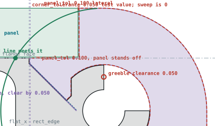

**1.2 — the junction as built**

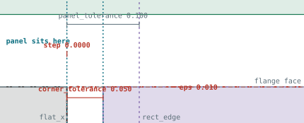

**1.3 — flat face, close up**


**1.4 — diagonal face, close up**

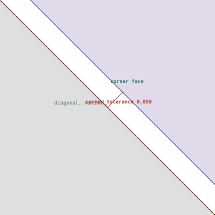

| | mm | | mm | | mm |
| --- | ---: | --- | ---: | --- | ---: |
| flange face | 5.1375 | corner_radius | 10.000 | panel_thickness | 4.7625 |
| flat_x | -7.2625 | rect_edge | -7.1625 | mold line crossing | -8.5794 |
| corner's edge at flange face | -7.2625 | step in the interface | 0.0000 | which feature binds | mask, at flat_x |
| corner volume change | -68.0314 | bulkhead volume change | +0.0000 | one solid, valid | yes |


## Case 2 — No panel, and the interface clearance is unaffected by that

*1.0 end_bolt 0 mm · corner −109.36 mm³*

`panel_tolerance` is zero here and the panel is absent, but `corner_tolerance` is a separate parameter on a separate pair of faces, so it applies exactly as everywhere else. That separation is the point of naming it: the two were entangled before, and one of them was doing the other's job by accident.

**2.1 — the joint in section**

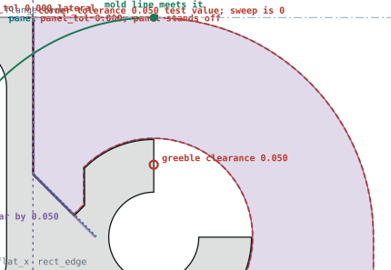

**2.2 — the junction as built**

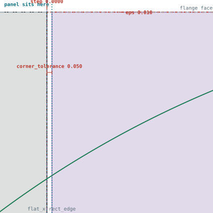

**2.3 — flat face, close up**


**2.4 — diagonal face, close up**


| | mm | | mm | | mm |
| --- | ---: | --- | ---: | --- | ---: |
| flange face | 10.0000 | corner_radius | 10.000 | panel_thickness | 0.0000 |
| flat_x | -5.5000 | rect_edge | -5.5000 | mold line crossing | -0.0000 |
| corner's edge at flange face | -5.5000 | step in the interface | 0.0000 | which feature binds | mask, at flat_x |
| corner volume change | -109.3559 | bulkhead volume change | +0.0000 | one solid, valid | yes |


## Case 3 — The smallest corner of the six

*0.75 end_bolt 1/16 in · corner −49.89 mm³*

0.05 mm is a larger fraction of a 7.5 mm corner radius than of a 20 mm one, so this is where a fixed clearance costs proportionally most. Worth watching if the value ever moves off zero: the tolerance is absolute, not scaled by U, and nothing currently forces it to be.

**3.1 — the joint in section**

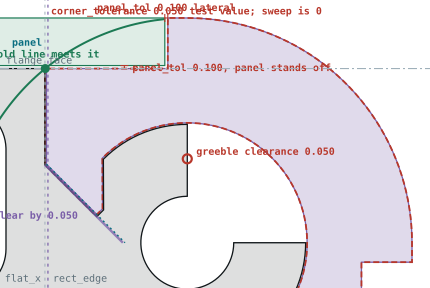

**3.2 — the junction as built**

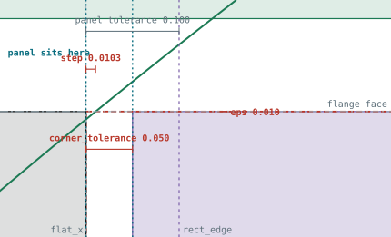

**3.3 — flat face, close up**

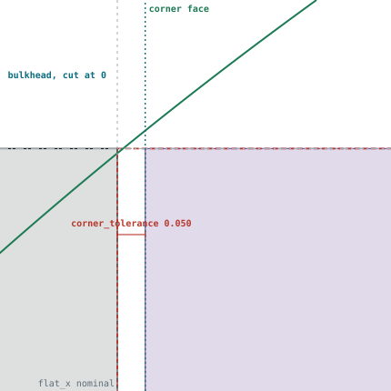

**3.4 — diagonal face, close up**

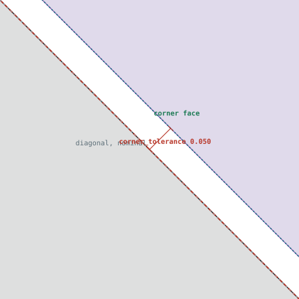

| | mm | | mm | | mm |
| --- | ---: | --- | ---: | --- | ---: |
| flange face | 5.8125 | corner_radius | 7.500 | panel_thickness | 1.5875 |
| flat_x | -4.7500 | rect_edge | -4.6500 | mold line crossing | -4.7397 |
| corner's edge at flange face | -4.7397 | step in the interface | 0.0103 | which feature binds | circle |
| corner volume change | -49.8902 | bulkhead volume change | +0.0000 | one solid, valid | yes |


## Case 4 — The largest corner of the six

*1.5 end_bolt 1/16 in · corner −216.98 mm³*

The same 0.05 mm over a longer face and a taller section removes four times the material of case 3. The clearance is a shift of two planes over the corner's full height, so what it costs scales with the size of the part rather than staying fixed.

**4.1 — the joint in section**

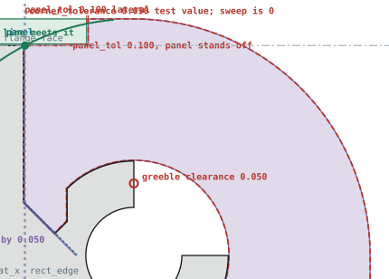

**4.2 — the junction as built**

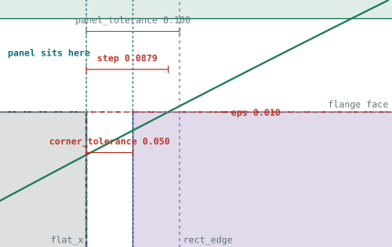

**4.3 — flat face, close up**

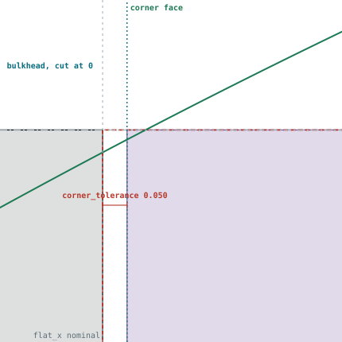

**4.4 — diagonal face, close up**

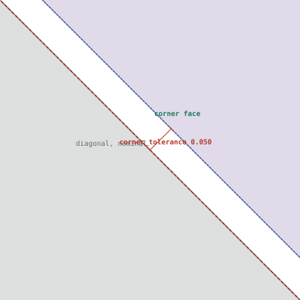

| | mm | | mm | | mm |
| --- | ---: | --- | ---: | --- | ---: |
| flange face | 13.3125 | corner_radius | 15.000 | panel_thickness | 1.5875 |
| flat_x | -7.0000 | rect_edge | -6.9000 | mold line crossing | -6.9121 |
| corner's edge at flange face | -6.9121 | step in the interface | 0.0879 | which feature binds | circle |
| corner volume change | -216.9846 | bulkhead volume change | +0.0000 | one solid, valid | yes |


## Case 5 — The case the whole investigation turned on

*1.0 end_bolt 1 mm · corner −98.36 mm³*

This is the variant whose interface had the `panel_tolerance`-deep step in it, now removed. With the face clean, the clearance applies uniformly over the full height — which is the difference between a tolerance and the accident it replaced: the step was 0.1 mm over half a millimeter of height, this is 0.05 mm over all of it.

**5.1 — the joint in section**

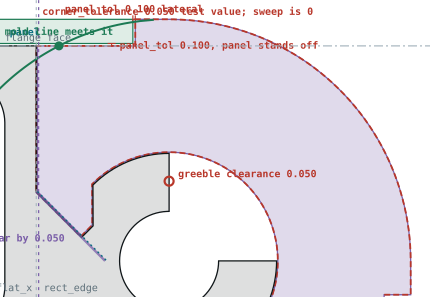

**5.2 — the junction as built**

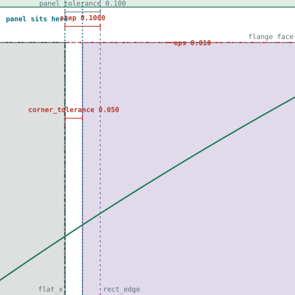

**5.3 — flat face, close up**

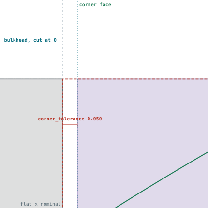

**5.4 — diagonal face, close up**


| | mm | | mm | | mm |
| --- | ---: | --- | ---: | --- | ---: |
| flange face | 8.9000 | corner_radius | 10.000 | panel_thickness | 1.0000 |
| flat_x | -5.5000 | rect_edge | -5.4000 | mold line crossing | -4.5596 |
| corner's edge at flange face | -5.4000 | step in the interface | 0.1000 | which feature binds | rectangular extension |
| corner volume change | -98.3559 | bulkhead volume change | +0.0000 | one solid, valid | yes |


## Case 6 — The panel term governs, and it makes no difference here

*0.5 end_bolt 1 mm · corner −27.31 mm³*

The family where the `max()` in `flat_offset` is decided by the panel term, so the diagonal begins on the flange face. The clearance shifts both faces regardless of which term set them; `flat_offset` moves by 0.0707 exactly as in every other case.

**6.1 — the joint in section**

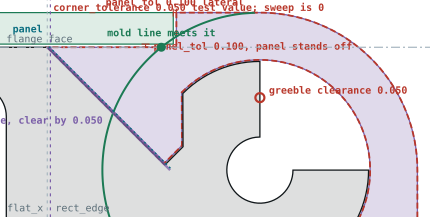

**6.2 — the junction as built**

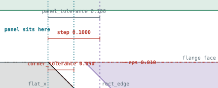

**6.3 — flat face, close up**

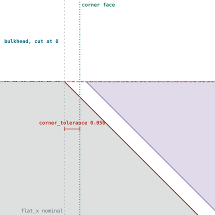

**6.4 — diagonal face, close up**


| | mm | | mm | | mm |
| --- | ---: | --- | ---: | --- | ---: |
| flange face | 3.9000 | corner_radius | 5.000 | panel_thickness | 1.0000 |
| flat_x | -6.7500 | rect_edge | -6.6500 | mold line crossing | -3.1289 |
| corner's edge at flange face | -6.6500 | step in the interface | 0.1000 | which feature binds | rectangular extension |
| corner volume change | -27.3074 | bulkhead volume change | +0.0000 | one solid, valid | yes |


## Regenerating this

The measured data under
[`joint_analysis/`](../../src/Fuselage/tools/joint_analysis/) is a **snapshot of built
solids**, not a live query. A change to the corner or the bulkhead leaves these drawings
showing the old shape while still looking authoritative, so re-measure before redrawing:

```
uv run python src/Fuselage/tools/draw_corner_joint.py
```

## See also

- [corner.md](corner.md) — OQ-DES-C5, the clearance these drawings dimension.
- [bulkhead.md](bulkhead.md) — OQ-DES-B13, the defect they found.
