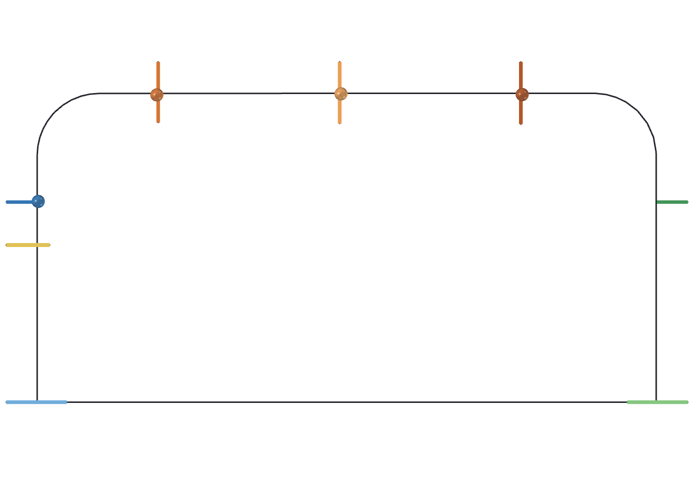
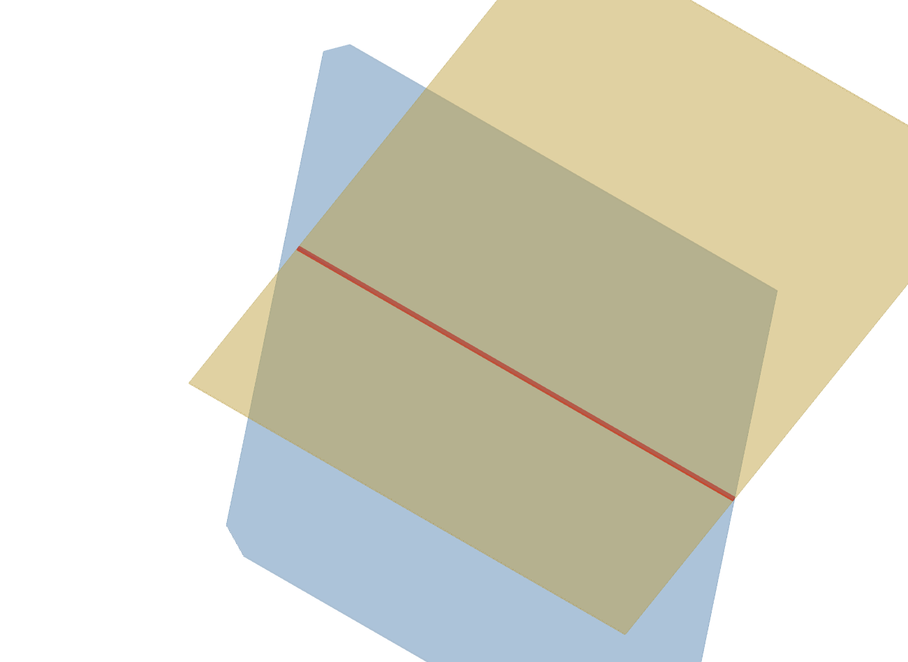
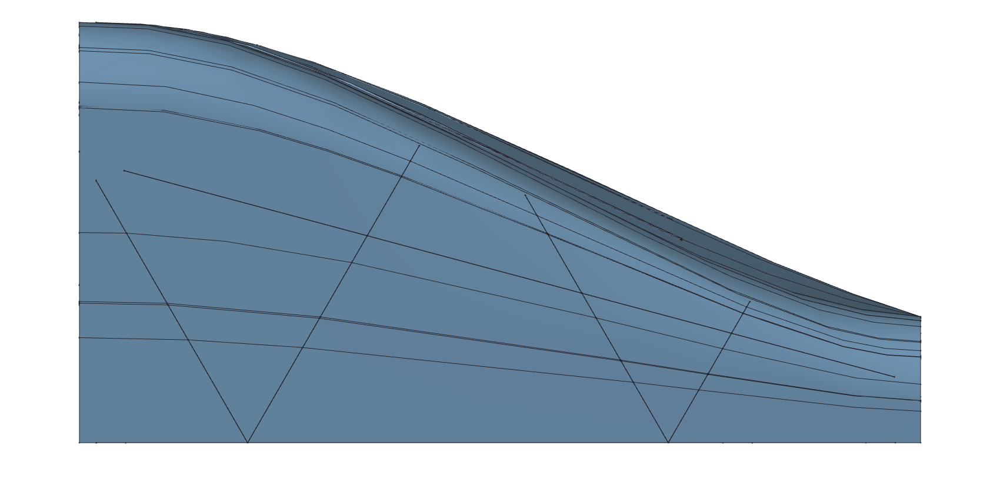
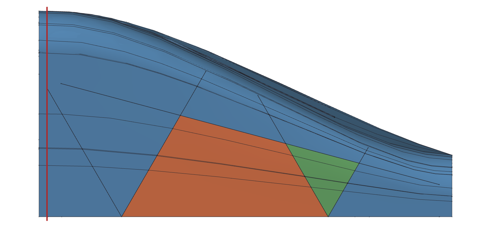
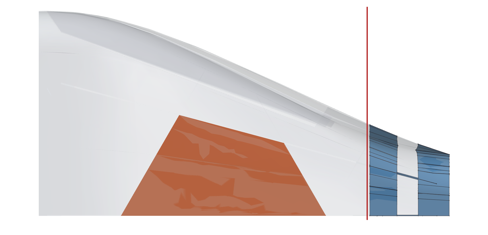
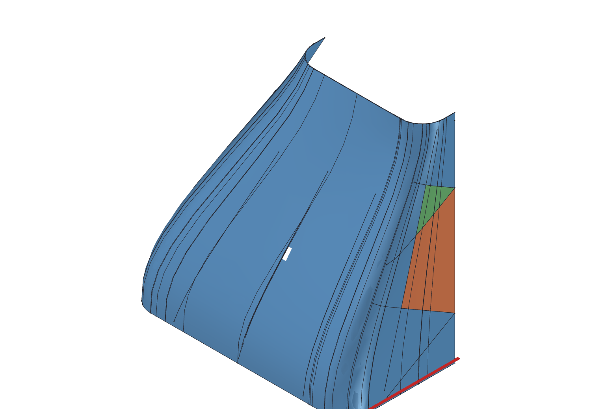
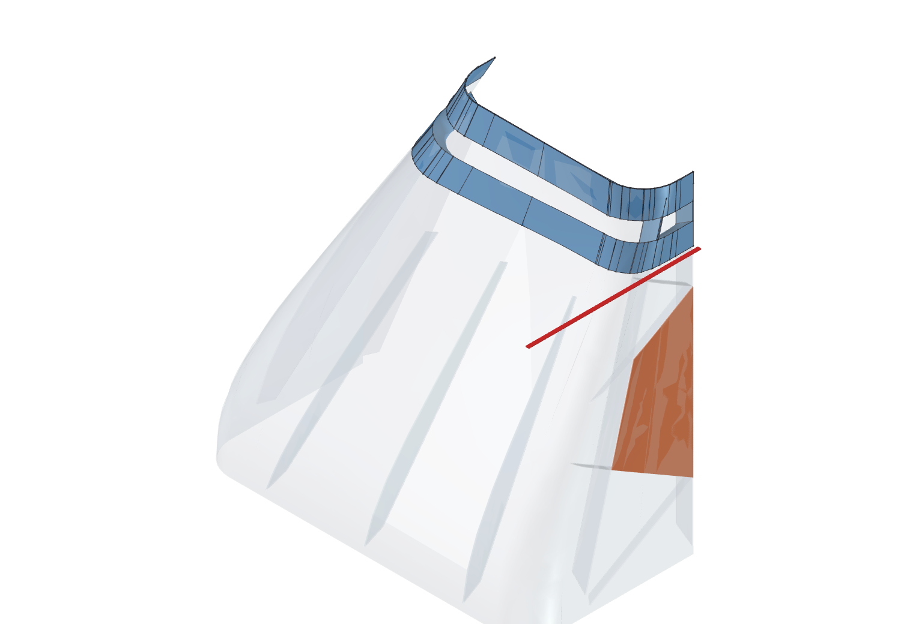
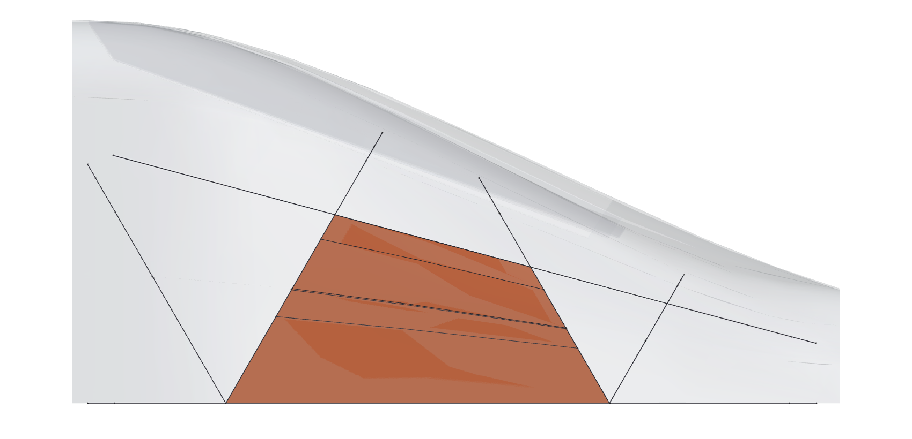

# Cowl interior surface — the algorithm

*IP-FC-16. Written 2026-08-21, once [OQ-ARCH-17](../architecture/freecad_migration.md#open-questions)
removed the last undecided item.*

The cowl today is a solid blank with channels cut into it. It has no wall
([cowl.md §6.2](cowl.md)), which is sufficient for printing and insufficient for everything
else: a blank has no mass to report, no wall to analyse, and nothing to assemble against.
This document states the method that gives it one.

It is an **algorithm** document. It says what to build and how to know the result is right.
It does not choose an OCC entry point, because the acceptance tests below are what a choice of
API has to satisfy, and an API named here without being measured would read as decided.

---

## 1. What this produces, and what it must never become

The output is the **solid representation** of [cowl.md §6.4](cowl.md): the notched blank,
shelled, with the rib modelled where each notch is. It serves **UC-2, UC-3, UC-4, UC-7 and
UC-8**.

> **The UC-1 print export continues to come from the un-shelled notched blank.** Cowls are
> printable in spiral vase mode, which spirals one contour per layer and admits no interior
> geometry at all, so a cowl that has been given a modelled inner surface is no longer
> vase-printable ([OQ-DES-CW6](cowl.md#open-questions)). Shelling is a downstream operation for
> the other use cases and **never a replacement for the blank**. A port that "improves" the
> cowl by giving it a proper wall and exports that for printing has silently removed a
> printing capability, and nothing in the geometry flags it — the STL looks better and slices
> worse.

Both representations come from one parametric source. This document describes the branch that
produces the second one.

---

## 2. Preconditions

These are properties of the input the algorithm relies on. **Each is asserted at run time, not
assumed.** A precondition that is merely true today is an accident waiting to be inherited.

### P1 — Every section is steeper than `overhang_angle_from_bed`

The interior is a *horizontal* inset, so on a wall tilted by α from vertical it leaves a
perpendicular wall of `t·cos α`, which is zero at a horizontal face. The cowl design avoids
near-horizontal geometry deliberately — the nose closure is split off as `nose_nose` and
`nose_plate` so the body never turns over, the tail is open at both ends, and every internal
relief is cut at `overhang_angle_from_bed` — so the degenerate case is outside the design
domain rather than a case to survive
([OQ-ARCH-17](../architecture/freecad_migration.md#open-questions)).

The shallowest surface the design permits is 35° from the bed, or **55° from vertical**, which
still leaves

    0.6 mm × cos 55° = 0.344 mm

of wall: 57 % of nominal, and about seven times the 0.05 mm floor below which nothing in this
project means anything.

**Assert it.** A section whose local slope is shallower than `overhang_angle_from_bed` is a
design violation upstream. The build stops and names the station. It must not emit the knife
edge, which renders, exports, passes `isValid()`, and resurfaces later as a stress singularity
in a UC-8 result nobody re-derives by hand. This assertion is also one of the few places the
**unenforced** couplings on `overhang_angle_from_bed` would actually surface — that value has
to agree with where the nose/cowl break line falls and with the buttress ramps, and nothing in
the code enforces either ([OQ-DES-CW11](cowl.md#open-questions)).

### P2 — The eroded section is a single closed loop

Erosion can pinch a region into pieces or annihilate it entirely, and OCC's behaviour when it
does is not a clean failure. See §7. Assert one loop per station.

### P3 — The exterior is available as a surface, not only as a mesh

Sectioning a tessellated OML gives polylines whose vertices are mesh artifacts, and a surface
fitted through them inherits the tessellation. This is what IP-FC-4's STEP export exists for.

### P4 — No notch lies in the layer plane

A rib forms because the slicer's single perimeter walks into the notch and back out again
**within a layer**. A notch lying in the layer plane offers no such path: the feature would have
to be formed between layers instead of within one, which thin-wall perimeter slicing cannot do,
and it comes out malformed. **So horizontal ribs are not used** — this is a property of the
design, stated 2026-09-04, and it is what keeps §4.2's `t_cut / sin θ` away from its
singularity. The shallowest cut the design contains is the tail's 30° diagonal, at 1.4 mm.

This is P1's sibling and a different object: P1 says the *body* is nowhere shallower than
`overhang_angle_from_bed`, because a horizontal surface leaves no wall; P4 says no *notch* is
horizontal, because a horizontal notch leaves no rib.

**Asserted 2026-09-04, in the build and not only in the check** (IP-FC-118).
`cowl_interior.dilated_notches` sees every cutting tool, so it is where P4 lives: a tool whose
own plane is horizontal is refused, and so is one with no planar face at all, which is not a
slab and whose thickness has no direction. Every build reports the shallowest cut plane it saw
— 90° on the nose, 30° on the tail — because the assertion deliberately separates *horizontal*
from *not horizontal* and says nothing about *shallow*: no minimum angle is stated anywhere in
the design, and choosing one in a constant would be inventing a design decision. If a floor is
ever wanted it is an open question, not a number in that file.

It had been true and unchecked, which is what P1's own paragraph warns about. Worse, the one
place that could have seen it looked away: `check_cowl_interior.in_plane_width` returned
`None` for a horizontal cut and `rib_gap` answered with `continue`, so the notch dropped out of
the rib check without comment and the part reported `OK`. Both now raise, and P4 joins P1 and
P2 in the block of preconditions the acceptance test requires to fire.

---

## 3. Inputs

| Symbol | Source | Value at the sweep |
| --- | --- | --- |
| `S` | the exterior, as surfaces | `oml/vsp_nose.step`, `oml/vsp_tail.step` |
| `n_p` | `slicing.cowl_n_perimeters` | 1 |
| `w` | `printer.extrusion_width` | 0.6 mm |
| `t = n_p · w` | derived | 0.6 mm — **the inset** |
| `t_cut` | `buttress_cut_thickness` | 0.1 mm |
| feature stations | the buttress parameters | see §4.1 |

`t` is the *horizontal* inset, and it is the cowl's own perimeter count in the same sense
`cowl_n_perimeters` is used everywhere else — see [OQ-DES-CW9](cowl.md#open-questions).

---

## 4. The construction

    exterior S
      → stations ζ₀ … ζₙ            §4.1  adaptive, derived not tuned
      → sections C(ζ) = S ∩ {z = ζ}
      → eroded contours Cin(ζ)      §4.2  2-D, in the layer plane
      → consistent parameterization §4.3
      → fitted interior surface     §4.4  G1 threshold, G2 objective
      → closed solid                §4.5

### 4.1 Stations

Start from the stations that already carry meaning, then refine by measurement (§5).

**Seed stations.** The OML's own defining sections ([cowl.md §1.2](cowl.md)), plus every
**feature station** — the axial positions where the exterior itself has an edge:

- each buttress ramp's start and end, where `r_inset · tan(overhang_angle_from_bed)` brings
  the notch to full depth or takes it away;
- the cut plane, `cut_len`;
- the base flange, for the nose.

**Feature stations are patch boundaries, not interior knots.** The exterior has a genuine
crease there, and §4.4's continuity requirement applies *within* a patch. Demanding G2 across
a rib end would smooth away a feature the part really has — and matching the exterior's
continuity class is the actual requirement that G1/G2 is a statement of
([OQ-ARCH-5](../architecture/freecad_migration.md#open-questions)).

**Axial spacing has a floor, and the floor is a design parameter.** `MIN_INTERVAL` = 0.20 mm is
the smallest axial gap the construction will *create*, and it is exactly `t`/3 — three station
rows across the thickness of the wall being built. It is enforced in one place only: §5's
subdivision refuses to split an interval narrower than `2 · MIN_INTERVAL`, so refinement cannot
manufacture a tight pair.

**Two separations are enforced, and the one that matters is not.** `feature_stations()`
deduplicates its *own* output — successive notch edges closer than `max(Z_TOL, MIN_INTERVAL)` are
collapsed — and `_patches()` drops any patch shorter than `MIN_INTERVAL`. But the stations a patch
is actually seeded with are the union

    _seed(p_lo, p_hi)  ∪  {notch edges strictly inside the patch}

and **that union applies no separation filter at all.** The uniform seed stations and the notch
edges are independent sets, so a seed station can land arbitrarily close to a notch edge even
though neither set contains a close pair on its own. That is how the real `tail_shell` fit at
`U` = 3.0 ends up with a pair **0.0009 mm** apart — 220 times finer than the floor, and 670 times
finer than the wall it is building — from two stations that are each individually legitimate.

Two rows that close carry very nearly the same eroded contour, so the fit is asked to interpolate
a near-duplicate, and the axial pole track through them is near-degenerate (§4.4, §6.2).

**Decided 2026-10-04** ([OQ-DES-CW24](cowl.md#open-questions), alternative 2) and **built the same
day** ([IP-FC-144](../implementation/freecad_migration.md#work-items)): the per-patch union carries
a separation filter, and the floor is `station_floor(t)` = `max(t, MIN_INTERVAL)` — the wall, with
the old constant surviving as a hard under-floor for a wall thinner than it. Both end stations are
preserved exactly, because a patch boundary is a station the patches on either side must sample at
the same `z`; the filter displaces a crowding neighbour rather than the end.

It costs no accuracy, as measured and then confirmed on the rebuilt part: at `tail_shell`
`U` = 3.0 the station set goes 32 to 27 on the floor and refines to **30 rows at worst wall error
0.0496 mm**, against 36 rows at the same 0.0496 mm before — with the tightest remaining gap
0.6516 mm, and `z` = -60.0000 no longer present beside `z` = -60.0009.

### 4.2 Eroding a section

For station ζ, take `C(ζ) = S ∩ {z = ζ}` **with the buttress notches already cut**, and erode
by `t`:

    Cin(ζ) = erode( C(ζ), t )

**Erode the notched section by the morphological identity, not directly.** Where the section
is the blank minus the notches, `A − B`, use

    erode(A − B, t)  ==  erode(A, t) − dilate(B, t)

The right-hand side is well conditioned; the left-hand side is the exact shape that returned a
**null shape** from `Part::Offset2D` in IP-FC-54 and took the whole part with it. That was a
different part — the boom bulkhead's web — but the same operation on the same kind of input,
and the failure was not a tangency a nudge would clear: every erosion from 3.0 to 5.0 mm was
null while 6.0 mm succeeded.

**The rib falls out of this and is not modelled separately.** The notch is `t_cut` = 0.1 mm
wide. Eroding by `t` removes a `t`-neighbourhood of it from each side, so the gap the erosion
leaves is

    t_cut + 2·n_p·w  =  0.1 + 1.2  =  1.3 mm

which is exactly the rib thickness [OQ-DES-CW3](cowl.md#open-questions) states. The wall
follows the notch in and back out, and the material between the two passes *is* the rib. That
is the whole reason the notch exists — it buys a rib inside a single-wall print, under a mode
that permits no other mechanism ([cowl.md §6.4](cowl.md)) — so the algorithm reproducing it
for free is the confirmation that the erosion is the right operation.

**1.3 mm is the vertical-cut case, and not every cut is vertical.** The tail's diagonal buttress
slabs are extruded to `t_cut` and then rotated 30°, so the slab is 0.1 mm thick normal to its
own plane and a layer plane cuts through it `t_cut / sin 30°` = 0.2 mm wide -- making the rib
there 1.4 mm. Measured to four decimals at every diagonal, and resolved as
[OQ-DES-CW19](cowl.md#open-questions) on 2026-09-04: **the cut's thickness is fixed whatever its
orientation, and a perimeter's width is evaluated parallel to the build plate**, so the rib is

    2·n_p·w + t_cut / sin θ

with θ the angle between the cut plane and the layer plane. The construction above is the
θ = 90° case of it, and **P4 is what keeps θ away from 0**, where the expression diverges: a
horizontal notch would leave no rib at all, so the design does not contain one. Anything checking a rib has to carry the angle: a flat 1.3 mm expectation
reports correct geometry as an error, which is what §6's first version did.

### 4.3 Contour correspondence

A surface fitted through a stack of contours needs each contour parameterized **consistently**
with its neighbours, or the surface twists between stations. This is the classic loft failure
and it does not announce itself: the result is a valid, closed, plausible solid.

- Anchor the parameter origin to a **feature**, not to whatever the sectioning returned first.
  The rounded-rectangle sections ([OQ-DES-CW5](cowl.md#open-questions)) have four corner arcs;
  use one of them, consistently, and a fixed traversal direction.
- Distribute the remaining parameter by **arc-length fraction**, so a station with a notch and
  a station without still correspond.
- Where a notch is present at one station and absent at the next, the correspondence is not
  well defined — which is why those are patch boundaries (§4.1), not points to interpolate
  through.

### 4.4 The surface

Fit a surface **through** the eroded contours with continuity conditions imposed. The four
requirements are [OQ-ARCH-5](../architecture/freecad_migration.md#open-questions)'s and are not
re-opened here:

1. **Curvature-aware adaptive spacing** — §4.1 and §5.
2. **Bidirectional curvature.** Doubly curved, circumferentially *and* axially. Not
   developable, not ruled.
3. **G1 tangency is the threshold, G2 curvature is the objective**, across every join within a
   patch.
4. **Not a ruled surface with tangency discontinuity.**

**What this excludes.** A `ruled=True` loft is excluded outright by (4). So is a `ruled=False`
loft that merely interpolates the section curves without tangency constraints — it satisfies
neither (3) nor generally (2). What is wanted is an **approximation with continuity
constraints**, the same class of construction OpenVSP uses for the exterior, applied to the
interior.

**Why this is not cosmetic.** Wall thickness is the *difference* between the exterior and the
interior. The exterior is a piecewise cubic Bézier carrying G2 across several stations by
design. If the interior is only C0 at its joins, **wall thickness is discontinuous at every
join** — a thickness step at a seam the exterior does not have — even though each surface is
individually acceptable. That is a stress raiser for UC-8 and a visible artifact in UC-4 and
UC-7.

**As built, the continuity is C² in both directions, and the axial fit is global within a patch.**
`_fit` interpolates each eroded contour with `GeomAPI_Interpolate` and no tangent constraints,
giving a C² cubic row curve; it then interpolates each *pole track* across the patch's stations the
same way, giving a C² cubic axially. The patch surface is bicubic and C² throughout, and because
evaluating an interpolated pole track at its own parameter returns the original pole, the surface
passes through the input contours exactly.

**That makes one station's data a global constraint, not a local one.** A C² cubic interpolating
spline is a tridiagonal solve over all of a patch's stations, so moving one row changes every
coefficient in that patch. The influence decays geometrically along the knot sequence with
alternating sign — for uniform knots the ratio is 2 − √3 ≈ 0.268 per span, about 3.7× attenuation
per station. So on the knot sequence it is global in principle but short-ranged in practice: five
stations away, a 0.01 mm displacement is of order 10⁻⁵ mm.

**That figure describes the spline's own coefficients and does not bound the finished wall's
measured sensitivity — measured 2026-10-04, it understates it by three orders of magnitude.**
Displacing one row of the input contours and measuring the real cut wall 7.5 station intervals away
gives a gain of **0.408 mm per mm**, reproduced to three figures at δ = 0.001, 0.003 and 0.01 mm
(§7.1). That implies about 1.12× attenuation per station where the coefficient decay predicts 3.7×.
Whatever closes that gap — the cut geometry, the lids and side caps rebuilt from the changed
surface, or something else — is not the tridiagonal solve, and is not established. **So a
perturbation response reaching far down the part is not by itself evidence against the fit**, and an
earlier version of this paragraph which said it was has been withdrawn.

**Patch boundaries are hard stops.** Patches are split at the *body's* own creases, each is fit
separately, and adjacent patches are made to pass through their shared station exactly — which is
why `END_INSET` is applied only at the part's own two ends (§4.1). A perturbation inside one patch
cannot reach another patch's surface at all.

### 4.5 Closing the solid

The wall is bounded by the exterior, the interior, and an annulus at each open end. Both cowls
are open — the tail at both ends, the nose body where it is cut to the closure parts — so
there is no cap to construct and no turnover to handle.

**Both cowls are one symmetry cell, not a full body — [cowl.md OQ-DES-CW20](cowl.md#open-questions).**
The tail is built as its `y ≥ 0` half, the nose as one octant; every step above — the sections,
the erosion, the surface fit, the notch cuts, the wall — runs entirely inside that cell, bounded
by the cell's own construction planes, and produces a cell-local result only. A full, mirrored
body is never constructed as an intermediate at any point in this construction.

**Mirroring happens exactly once, as the very last step, to the finished wall — never earlier,
and never to any other intermediate.** The cavity is cut out of the cell's own notched body while
still inside the cell; the resulting wall is what gets carried out to the whole part, by the same
mechanism and in the same mirror order the outer OML solid already uses to build itself from that
same cell. Nothing here mirrors a partial result — the cavity, the un-notched body, or any other
earlier intermediate — and finishes construction on it afterward: a boolean between two shapes
that were each already carried out to the whole part by an independent mirror step is not
trustworthy regardless of whether both are exactly symmetric, since OCC's boolean kernel is free
to introduce asymmetry or fail outright on a full-size operation even when its inputs are exact,
and this project has measured it doing both. One symmetry cell, one deferred mirror, one code
path for both cowls, differing only in which cell and how many mirrors — never in order of
operations.

**Mirroring a solid that still carries the flat cap where it was cut from its cell is itself not
safe to do by an ordinary boolean fuse.** Two solids that share their entire boundary over exactly
one face and nothing else are a degenerate case for OCC's general boolean intersector, measured to
fail outright (`ValueError: Null shape`) even when that shared face is exact to machine precision.
The cap is instead stripped from the finished wall, the remaining open shell mirrored, and the two
open shells sewn together along their now-identical shared edge — construction, not a boolean
asked to discover a relationship its two inputs already have exactly.

---

## 5. The refinement criterion

**Spacing is derived, not tuned.** Refine until the fitted surface agrees with the *true*
per-layer erosion, then stop. That replaces an arbitrary interval with one tolerance that
means something physical.

Between each adjacent pair of stations:

1. Take the midpoint ζ_m.
2. Compute the **true** contour there — section `S` at ζ_m and erode by `t` (§4.2).
3. Compute the **fitted** surface's contour at ζ_m.
4. Measure the deviation `d` between them: the two-sided Hausdorff distance, sampled densely
   along both. One-sided is not enough — it misses a fitted contour that bulges outward where
   the true one has no material.
5. If `d > τ`, insert ζ_m as a station and recurse on both halves.

Terminate when every interval passes. A floor on interval length guards against a
non-converging feature; **reaching the floor is a failure to report, not a result to accept**,
because it means the surface does not represent the erosion at that station and nothing
downstream will know.

**As built the floor is also a blind spot, which is a defect.** Step 1 is skipped outright for any
interval already narrower than `2 · MIN_INTERVAL`: the midpoint is not taken, the wall is not
measured there, and nothing is reported. So an interval too short to subdivide is also an interval
this criterion never looks at.

**Both passes do it.** The pre-cut fit refinement skips before measuring the fitted wall, and the
post-cut scan skips before calling `_finished_wall_gap`, so the *finished* wall is not measured
across such an interval either and `worst_finished` never includes it. A near-duplicate pair is
therefore unmeasured at every stage.

Where §4.1's unfiltered station union has put two rows 0.0009 mm apart, that is simultaneously the
interval the C² system is worst conditioned across (§6.2) and the one place no convergence
measurement runs. Refusing to *subdivide* a short interval is correct — subdividing it is exactly
what would make things worse. Declining to *measure* it is not, and the two were conflated into a
single guard.

**Decided and built 2026-10-04** ([OQ-DES-CW24](cowl.md#open-questions) alternative 2,
[IP-FC-144](../implementation/freecad_migration.md#work-items)): the two behaviours are separated.
Both passes now compute the interval's divisibility and measure regardless; an interval that
exceeds τ but sits at the subdivision floor is **reported** rather than silently skipped. It is
reported and not raised, because promoting it to a refusal is a separate decision nobody has made.

### The tolerance, and why it is absolute

    τ = 0.05 mm

**It does not scale with `U`, and that is the opposite of the project's usual rule** — for a
stateable reason. `compare_backends.bbox_tol()` scales with `U` because it measures agreement
between two engines on a whole part, and a whole part gets bigger. This tolerance measures
whether a **wall** is in the right place, and the wall is `n_p · w` = 0.6 mm at every `U`,
because extrusion width is a property of the machine. A tolerance that grew with `U` would be
2 % of the wall at U = 0.5 and 67 % of it at U = 4.

0.05 mm is the smallest linear dimension that means anything in this project, and it is 8 % of
the wall. **Getting absolute-versus-relative backwards here is not hypothetical**: IP-FC-56
used an absolute 1e-9 mm³ volume tolerance on parts of very different sizes, which is 6e-14 of
a bulkhead, and it cost two silent forty-minute runs before the cause was found. The rule is
that the tolerance is relative to *the thing being measured*. Here that thing is the wall.

### A gap this criterion does not cover, and the fix decided for it

**Steps 1-5 above run entirely before the rib cut.** They measure the fitted surface against the
true per-layer erosion of `S` — §4.2's smooth interior, with no notch subtracted from it yet.
`dilated_notches()`'s rib cut happens afterward, in `cavity()`, and nothing in this criterion or
anywhere else in the construction re-measures the *finished*, rib-cut wall against τ.

**That gap is real, not theoretical: found 2026-09-23, root-caused 2026-09-25
([OQ-DES-CW21](cowl.md#open-questions), full evidence in
[freecad_migration.md IP-FC-143](../implementation/freecad_migration.md)).** The finished wall
reads thinner than τ at the tail's shallow-angle (30°) diagonal buttresses, growing with `U` from
a few thousandths of a millimetre at `U` = 1 to 0.150 mm — three times τ — at `U` = 4, confirming
what §10's `U` = 4 prediction below already expected of this construction. Five direct
measurements ruled out every candidate that would have meant this criterion's own convergence was
at fault (`RIB_CUT_FUZZ`, `RIB_FACETS`'s polygon approximation, a coverage gap in step 5's own
bisection, cross-mirror rib overlap at the tail's seam) and instead found the smooth surface
already clean at the exact point the finished wall reads thin — the rib cut itself removes
measurably more material there than the smooth surface's own offset predicts. **This criterion is
correct as far as it goes; it simply does not go far enough**, because a rib boundary at a
shallow cut angle is a case §4.2's erosion identity does not by itself protect.

**Decided, 2026-09-25: extend this criterion with a second pass evaluated after the rib cut, not
work around the gap by bounding `U` or widening τ.** The termination structure is the same as
steps 1-5 — measure the deviation, insert a station and recurse where it exceeds τ, stop when
every interval passes — but run a second time against the *finished* solid's own wall thickness
near each notch boundary, rather than against the pre-rib fitted surface. A build only converges
once both passes are inside tolerance.

**Correction, 2026-09-26: the second pass cannot run inside `cavity()` at all, and an initial
implementation there was wrong for exactly that reason.** `cavity()` is only ever given `body` —
`cowl_tree.pieces()`'s `cell_body`, the *un-notched* cell — because that is the correct, and only,
reference for steps 1-5's own pre-rib fit. The finished wall's true exterior is not `body`; it is
`notched` (`cell_cut`, "that same cell with its buttress tools already cut into it"), which
`shell_solid()` alone holds, and only after computing `inside = cavity(...)`. A `cavity()`-internal
attempt at this second pass measured the rib-cut cavity against `body`'s exterior — the only
exterior it has ever had — and at a station where a buttress cut removes exterior material, that
reference is measurably wrong: a direct check (`tail_shell`, `U` = 3.0, `z` = -217.727) found the
real wall's exterior loop 0.56 mm from the true thin point, while `body`'s own exterior at the same
(x, y) was 26.5 mm away, a different surface entirely. **The second pass belongs in
`shell_solid()`, evaluated directly on `wall = notched.cut(inside)`** — both the exterior and the
cavity boundary then come from the same finished, cell-sized solid, which is exactly what
[§6](#6-verification)'s wall check already does on the whole part and what this function's own
docstring already argues is strictly better done at cell size, before mirroring. Full evidence
trail in [freecad_migration.md IP-FC-143](../implementation/freecad_migration.md).

**Correction, 2026-09-26: not by cutting `notched` a second time.** Implemented instead by
slicing `notched` directly at each candidate `z` and comparing that contour against the cavity's
own boundary — the same "two already-sliced contours" pattern `outer_at` already uses against
`body`, never a second, independent boolean between `notched` and the cavity. A second cut here
would repeat the exact "two shapes each independently built, then a boolean between them" mistake
`shell_solid`'s own docstring already recounts three instances of; `shell_solid`'s own
`notched.cut(inside)` remains the one authoritative cut. This still needed `open_arc`'s stripped
polyline discipline reproduced without `open_arc` itself — `notched`'s section does not always
chain the way `body`'s does — and, once reproduced, built open rather than closed, since a closed
polyline's wraparound chord across the excluded construction-plane strip cuts straight across the
cell's full width and reads spuriously close to legitimate points nowhere near a real notch.
Both are recorded in full in [freecad_migration.md IP-FC-143](../implementation/freecad_migration.md).

**Correction, 2026-09-27, per [cowl.md OQ-DES-CW22](cowl.md#open-questions): the second pass does
not re-scan the whole patch on every round.** Verified correct but measured unaffordable: re-checking
every point across the full patch, every one of up to six rounds, cost 9.5 hours without finishing
the `U` = 3.0 target once the pass actually needed multiple rounds to converge, rather than the
zero-insertion pass every case tried before OQ-DES-CW21 happened to take. **Decided: round 0 still
scans the whole patch, front-loaded with stations placed at the notch topology's own edges (already
read for the edge-focused scan) rather than left to discover them one bisection at a time; round 1
onward re-scans only a ±15-20 mm window around that round's own insertions**, a width measured
directly from how far one properly-bisected insertion's effect on the finished wall actually
reaches (decaying from -0.023 to -0.024 mm within a millimetre of the insertion to at most
±0.0012 mm, 2.4 % of τ, beyond 20 mm), not assumed. **Implemented and verified 2026-09-27**: both
`tail_shell` `U` = 1.0 (765 s, zero refinement rounds needed) and `U` = 3.0 (4,277 s, six rounds)
now converge without raising `Unconverged`, a large improvement over the 9.5-hour build this
replaced. Full numbers in [IP-FC-143](../implementation/freecad_migration.md).

**A residual gap, found immediately on that same verification, is not this pass's convergence
failing to run long enough — see [cowl.md OQ-DES-CW23](cowl.md#open-questions).** This pass's own
comparison (`_finished_wall_gap`/`finished_outer_at`) measures distance between two independently-
sliced contours -- the candidate surface's own slice and `notched`'s -- and never performs the real
`notched.cut(inside)` boolean itself, by design (a second boolean here would repeat the "two shapes
each independently built, then a boolean between them" mistake `shell_solid()`'s own docstring
already records three instances of). That prediction does not always match what the real boolean
produces: even a completely unconverged, round-0 candidate already shows the real, external
`wall_thickness()` check reading 0.0534 mm thin at `tail_shell` `U` = 3.0's worst station, at the
same time this pass's own distance-based check reports that station clear. **An initial hypothesis
that the gap came from `FINISHED_PLANE_TOL`'s exclusion band hiding a defect near a cell-boundary
plane was tested directly and refuted**: the real worst point there sits 78.688 mm from the tail's
one cell-boundary plane, thirty times the 0.5 mm tolerance -- nowhere near it. The real, external
check already catches this correctly; the gap is between what this pass converges to internally
and what that check finds, not a gap in acceptance testing.

**Characterized further, and a fix attempted directly, 2026-09-27 — see [cowl.md OQ-DES-CW23](cowl.md#open-questions)
for the full evidence and recommendation.** The gap, measured across all 12 real acceptance
stations on the same build, is signed both ways and present at every station (roughly ±0.01-0.04 mm),
not a rare, isolated defect. Inserting a station at the exact point the real (not predicted)
measurement says is worst — the most favorable case for closing the gap by refinement — moved the
real thickness there by only 3 % of the deficit, against roughly fourteen times that effect on the
*predicted* thickness for the same kind of insertion (the measurement behind this section's own
windowed re-scan sizing above). Station insertion is a weak lever on the real result, which this
pass has no other lever to pull; recommended there (not yet decided) to document this pass as a
best-effort predictor and rely on the existing external check as authoritative, rather than pursue
further refinement.

**A separate, more serious finding, 2026-09-28, re-reviewed and substantially corrected
2026-10-03.** Investigating whether the residual above reflects unreliable measurement, five
independent fresh builds confirmed the real reading is exactly reproducible (0.546556 mm to six
decimal places, every time). But the §6.2 probe — displacing one row of the fit's *input* contours
by a sub-0.1 mm amount — breaks `shell_solid()`'s construction at two stations, reproducibly.
**That failure is `notched.cut(inside)` returning the cell wall in more than one solid, and §7
carries its full current account**: both signatures, the figures, and what is and is not
established about it.

Two corrections belong here, because this subsection is where the errors were made.

**It is not a mirror-step failure.** Earlier versions attributed it to `mirror_across_cell`
("5 disconnected shells"); that was an artefact of the test harness, which called the mirror
directly and so skipped `shell_solid()`'s own earlier `len(wall.Solids)` check — the mirror was
reporting a wall that had already come apart one step before.

**The "rib crowding" explanation is withdrawn.** It rested on a ratio between two tools' distances
to the *interior surface*, which never compares the tools to one another; at the station it was
derived from, the three tools it called crowded have their own nearest points 87.7-176.9 mm apart
on a 300 mm part. Measured directly 2026-10-03, the real dilated tool set's largest pairwise
overlap is 382.5 mm³ — 0.59% of the smaller tool — against the ~40% that produced the pathological
topology in IP-FC-137's synthetic H3 test, and the three Side tools named as "the real crowding" do
not overlap each other at all. **§9.8's reading is the correct one: that mechanism is not present
in the real part.**

*The real blank and the real tools, sectioned at `z` = -283.9951 and seen down the axis. The black
outline is the half cell; each coloured bar is one tool's section, and the spheres are the nearest
points the ranking was read from. The three `Side` tools ranked as maximally crowded sit at
opposite ends of the top face.*

A mechanism is now established for one of the two stations and not the other: `z` = -60.0000 is the
near-duplicate station pair of §4.1, acting through the C² forcing term of §6.2. `z` = -294.1530 is
still unexplained, and three candidate predictors — absolute clearance, crowding ratio and row
spacing — have each been proposed and refuted by testing.

*The two real dilated tools with the largest mutual overlap — `Top1Safe` (blue) and a diagonal
(yellow) — with their intersection in red. They cross transversally, and the intersection is a
307 x 1.8 x 1.9 mm sliver: 382.5 mm³, 0.59% of the smaller tool. IP-FC-137's synthetic case paired
nearly-coincident slabs overlapping by about 40%, which is a different arrangement, not a smaller
amount of the same one.*

**What survives from the clearance surveys.** The corrected per-wire re-measurement — after the
`_Polyline` multi-loop bug that `_min_wire_distance` now guards against — found a minimum clearance
of 60 nm at `z` = -134.498, with 15 points from 60 nm to 4.1 um scattered across nearly the whole
length, recurring at a second `U` and on `nose_cowl_shell`'s octant, so it is a property of the
construction generally rather than one cowl or one `U`. A single rib binds at every one of those
points, and all three tested with the row-nudge protocol stayed stable across the full 0.001-0.1 mm
range. **What that in-plane clearance physically bounds is unverified**: whether its minimum lies on
a tool's cut floor, which bounds the wall, or on a flank, which bounds nothing, has never been
checked, and across four stations measured both ways it varied by a factor of 2.5 while the real
`wall_thickness()` varied by 4.9%.

**The two-metric check design is not closed.** Metric A ships opt-in and flag-only
(`CLEARANCE_MARGIN_MM` = 0.01 mm, for the reason in the next paragraph). Metric B is computed but
enforced nowhere, and on the 2026-10-03 evidence should be retired rather than given a cutoff: at
`z` = -60.0000 both metrics pass — Metric A 0.097097 mm, Metric B 5.950x — and the wall severs
anyway.

**The thin-wall threshold is 0.01 mm, not the coarser 0.1 mm print-accuracy figure first proposed.**
That 0.1 mm is a positional tolerance (where a feature sits); wall thickness is a different quantity,
and a single spiral-vase perimeter's thickness is exactly where a small absolute change can flip the
slicer's decision to extrude it at all. That reasoning is unaffected by the corrections above.

### The three convergences, and where the chain breaks

Three convergences run between a candidate surface and a verdict on the part, and **each one hands
off across a change of quantity**. Written out because the individual facts are recorded above and
in §6.1 but the chain they form is not, and most of the confusion about this construction — and
[OQ-DES-CW23](cowl.md#open-questions) in particular — is confusion about which link is which.

| stage | what it measures | criterion | does that quantity converge? |
| --- | --- | --- | --- |
| **Pass 1**, `_refine` | the *smooth* fitted surface against the true per-layer erosion, Hausdorff, before any rib | τ = 0.05 mm | **Yes.** Bisection to a floor; reaching the floor is reported, not accepted |
| **Pass 2**, the post-cut loop | a *prediction* of the finished wall's thinness: slice-to-slice distance between `notched` and the candidate, never the real boolean | τ = 0.05 mm | **Yes**, within `POST_CUT_ROUNDS` = 6 on the one build measured, reaching 0.0430 mm |
| **Acceptance**, `wall_thickness` | the *real* cut, mirrored wall: a nearest-point minimum from the inner contour to the outer | `WALL_TOL` = 0.01 mm | **No.** Still falling at 3840 inner samples at 17 of 24 stations; the check runs at `AROUND` = 240 |
| *(candidate)* area-based mean | (outer area − inner area) / mean ring length on the same section | — | **Yes**, to 1e-6 mm from 16000 area points — but a mean cannot see a local thin spot |

Four consequences follow, and they are what make this a design problem rather than a tuning one.

**τ is not `WALL_TOL`, and the gap between them is deliberate.** τ is what the two refinement
passes stop at; `WALL_TOL` is what the part is held to, five times tighter. A candidate can satisfy
both passes and still fail acceptance, by construction and not by error — "The tolerance, and why
it is absolute" above, and the two constants' own notes in `cowl_interior.py`, say why one may be
as loose as the construction's budget allows while the other is set by what the slicer does with a
thin perimeter.

**Pass 2 converges a prediction whose disagreement with the real wall is larger than
`WALL_TOL`.** Measured across all 12 acceptance stations of `tail_shell` at `U` = 3.0, the signed
prediction-minus-real gap has a mean absolute value of **0.0121 mm — 1.21× `WALL_TOL`** — a maximum
of 0.0385 mm (3.85×), and exceeds `WALL_TOL` at 5 of the 12. So **no amount of converging pass 2
can certify the part at 0.01 mm**: the instrument pass 2 uses and the instrument acceptance uses
disagree by more than the tolerance being claimed. Tightening τ toward `WALL_TOL` would make pass 2
insert stations chasing a quantity that does not track the one that matters, and station insertion
is independently measured to move the real wall by about 1/14 of what it moves the prediction.

**The acceptance metric has no settled value to converge to.** This is the decisive link.
`worst_low` drifts one way — thinner — with sampling, so a reading over `WALL_TOL` does not show
the wall is that thin, and a reading under it does not show compliance either. `check_cowl_interior`
prints exactly this, reporting a failure as "`WALL_TOL` compliance is not demonstrated" rather than
as a settled deviation. At the one station measured both ways the nearest-point minimum reads
0.0534 mm from nominal while the converged area-based mean reads 0.0033 mm — **inside tolerance** —
a disagreement of 16×, between two measures of the same wall at the same station.

**Neither available measure is sound at this tolerance**, which is
[IP-FC-151](../implementation/freecad_migration.md#work-items) and is unstarted: the nearest-point
minimum does not settle, the local-normal variant oscillates by up to 0.0139 mm per doubling
because the tangent estimate at a crease is itself unstable, the converged area mean is blind to
the local thin spot the slicer actually responds to, and the morphological candidate is refuted on
real geometry (`Face.makeOffset2D` did not finish in six minutes on a real section). **Until that
item lands, no figure in this document should be read as a settled deviation from `WALL_TOL`** —
including §9.9's whole corpus, which is built on `worst_low`.

---

## 6. Verification

| Check | What it catches |
| --- | --- |
| **Perpendicular wall** at sampled points equals `t·cos α` within τ | the erosion was applied as a 3-D normal offset instead of a 2-D inset — a different surface, and the exact error mode this whole method exists to avoid |
| **Rib thickness** measures `2·n_p·w + t_cut / sin θ` -- 1.3 mm at a vertical cut, 1.4 mm at the tail's 30° diagonals ([OQ-DES-CW19](cowl.md#open-questions)) | the notch eroded as a notch rather than being smoothed away. **Write the angle into the expectation:** a flat 1.3 mm here reports correct geometry as an error, which it did |
| **Volume** equals exterior minus interior cavity | the solid closed the way it was meant to |
| **G1 across every join within a patch** | requirement (3), the one a plausible-looking loft silently fails |
| **Surface distance** from the fitted surface to a densely re-eroded reference, via [`surface_distance.py`](../../src/Fuselage/tools/surface_distance.py) | a fit that passes at the sampled stations and wanders between them |
| **P1, P2 assertions fire** on a deliberately shallow section | the preconditions are checked rather than documented |
| **The cavity closes to exactly one solid** (`cavity()`), and the mirror sews to one (`mirror_across_cell`, `_extend_across_cell`) | a rib that failed to bridge the erosion identity. §9.8 is why this is refused at any scale rather than accommodated |
| **The cell wall closes to exactly one solid** (`shell_solid()`, `len(wall.Solids) != 1`) | `notched.cut(inside)` returning the wall in pieces. This is a *separate* check from the cavity's, at a later step, and it is the one that catches a wall that came apart at the shell cut rather than at the rib cut |
| **Partition identity**: the cut and its complement re-add to the blank within `PARTITION_TOL` = 2.0e-3 | the cut losing or inventing material. Independent of the solid count — a wall can come apart with the partition intact, and the partition can collapse without the solid count being unusual |

The last three are **construction-integrity** checks: they do not ask whether the wall is in the
right *place*, only whether the construction produced a coherent solid at all. The solid-count and
partition checks are independent and both are needed — a wall can sever while cut and complement
still sum to the blank to 2.05e-05, and the partition can slip by 0.993 without the solid count
being unusual.

The wall and rib checks are the load-bearing ones. Volume agreement says two solids enclose the
same space; it does not say the wall is where it should be, and a wall in the wrong place with
compensating error elsewhere passes on volume alone.

That is about what a volume check cannot *see*. There is a second problem with it, in the
number itself, and §9.6 carries it: `Shape.Volume` is wrong on solids of this kind by a
fraction of a percent, by an amount that depends on how the solid happens to be cut into
faces. **A volume here is only meaningful as a difference between volumes taken the same way
over the same operands** — which is what the row above and both identities in §9.6 are. A
volume compared against an expected value, or between two independently built solids, has to
come from [`solid_measure.py`](../../src/Fuselage/freecad/solid_measure.py) instead.

### 6.1 Measurement cautions

Eleven ways a measurement of this geometry has misled this work, each one paid for:

- **A bounding box is not evidence of where material is.** A failed wall piece's box read
  `x` = -164.89 against the blank's -150.25, suggesting material outside the solid it was cut
  from; sampled every millimetre, no section lay outside the blank. Reading the same solid through
  two different FreeCAD calls can also give boxes that disagree by several millimetres.
- **`Shape.slice()` can return nothing at one exact plane.** The healthy wall returns no section at
  `z` = -141.0000 and a normal one at ±0.05 mm. A gap in a section sweep must be confirmed by
  volume before it is called a hole.
- **`distToShape()` returns a minimum.** It reads 0.0000 for any face that merely touches a solid
  at an edge, so it cannot decide whether a face lies *on* that solid. That needs the face sampled
  across its area.
- **The display mesher is not the geometry.** Redundant topology can make the viewport draw a solid
  several times its true size while `Shape.tessellate()`, `MeshPart.meshFromShape()` and STL export
  all return its correct extent — a display artefact, not an export defect.
- **`Face.Area` is unreliable on B-spline faces** (§9.6); use the wire signed area.
- **A station named by its printed value is not that station, and adding it to a station set
  manufactures a near-duplicate pair.** Stations here are notch edges carried at full double
  precision, and a probe that wants "the station at `z` = -283.9951" and unions that literal into
  the seed set does not select the existing station — it adds a second one 0.0000339 mm from the
  real edge at -283.9951338812. That is 28× tighter than the 0.0009433 mm pair §4.1's floor exists
  to remove, and it puts δ/h ≈ 885 into §6.2's forcing term at δ = 0.03 mm against 11.1 at the pair
  already established as causal. **Select a station by searching for the nearest existing one and
  print what was found**; never name one by a rounded literal.
- **A nearest-point minimum is not a converged wall thickness, and at `WALL_TOL` it is not a
  measurement at all.** `wall_thickness` samples the inner contour and takes each sample's distance
  to the nearest point of the outer one. Measured 2026-10-05 on `nose_cowl_shell` at `U` = 1, that
  minimum does not settle: at **17 of 24 stations it was still falling at 3840 samples**, drifting
  0.0015 to 0.0079 mm per doubling — for instance `z` = -43.5213 reading 0.5830, 0.5792, 0.5774,
  0.5661, 0.5606 as the count goes 240 → 3840. It is not noise and not discretization of the outer
  curve: the outer polyline is 0.0125 mm per segment, whose chord bias is under 1e-6 mm, and a
  remeasure of the worst station returns the identical value to ten decimals. The measure itself is
  the problem — a nearest-point distance at a **concave corner cuts across the corner rather than
  across the wall**, and this section has such a corner at every slot mouth, so denser sampling
  keeps landing nearer one. A minimum that falls with every doubling cannot be compared against a
  0.01 mm tolerance in either direction. **Measuring along the contour's own local normal does not
  fix it** — tried the same day, it oscillates instead of drifting, by up to 0.0139 mm per doubling,
  because the tangent estimate at a crease is itself unstable. What does converge is the
  **area-based mean**, (outer area − inner area) / mean ring length: 0.556253, 0.590421, 0.595922,
  0.596701, 0.596704, 0.596705, 0.596704 mm as the area discretization goes 200 → 64000, settled to
  1e-6 mm from 16000 on. Note the first of those: **`_wire_area`'s own default of 200 points is
  0.044 mm wrong**, 4.4× `WALL_TOL`, so any 0.01 mm work must pass an explicit count. Both kinds
  behave the same way — `tail_shell` at `U` = 1 also had 17 of 24 stations unsettled at 3840 samples,
  with its own worst reading 0.0555 mm at `z` = -30.8264 — so this is a property of the measure on
  this geometry and not of one part.
- **Ask the kernel before building an instrument — but only one of its four routes to these
  questions survives this geometry.** Everything above was built by hand, and each hand-built
  measure needed its own convergence study. OCC answers some of it topologically, with no sampling
  and no threshold. Measured 2026-10-05 on a 2464-face `tail_shell` wall:

  | route | result |
  | --- | --- |
  | `Part.makeFace(wires, 'Part::FaceMakerBullseye')` | **works, 0.6 s.** Resolves the section's wires into regions and reports one face with two wires for a continuous ring, several one-wire faces for a broken one. `Part::FaceMakerCheese` agrees exactly; `Part::FaceMakerSimple` does not resolve nesting and returns the two enclosed areas' sum, 150914 mm², instead of the 958.819 mm² between them |
  | `solid.common(planar_face)` | **unusable.** Would answer the same question, and did not finish in nine minutes |
  | `Edge.Continuity` | **the wrong quantity.** It reports the edge *curve's* own smoothness, not the continuity between the two faces across the join: a box's sharp creases, a filleted box's tangent joins and a cylinder's periodic seam all read `CN`. FreeCAD's Python API does not expose `BRep_Tool::Continuity(E, F1, F2)`, so §6's G1 requirement cannot be read off the built shape this way |
  | `Face.makeOffset2D(-d)` | **exact on clean geometry, unusable here.** On a 0.6 × 100 mm polygon ribbon the erosion is textbook — 1.9884 mm² at d = 0.290, 0.0000 at 0.300, `CADKernelError` at 0.310, the transition exactly at the half-width — and on the real section's convoluted B-spline boundary one call did not finish in six minutes |

  So the ring-continuity question is best asked of the kernel, and `Face.Area` on the resulting
  nested face is a better material area than a difference of two separately-integrated wire areas:
  958.819 mm² against 954.742 mm² by hand, 0.43 % apart, and the kernel's figure needs no
  discretization choice. **The morphological thickness measure, which was the standing candidate for
  a converged local thickness, is refuted on real geometry by the last row.**
- **A mean thickness from area is only trustworthy where the two loops are near-equal in length.**
  `area / mean(boundary)` reads 0.5993 mm at the reference station, where the loops are 1601.8 and
  1598.2 mm — 0.0007 mm from nominal, the best figure any measure here produces. At `z` = -25 on the
  same part it reads 0.4753 mm, and reads **identically on a healthy and a damaged wall**, so that
  is the estimator failing and not a defect: a convoluted boundary adds length without adding area
  and depresses the ratio. Use it where the section is a thin near-uniform ribbon, and nowhere else.
- **Twelve stations is too few to find this check's own failures, independently of the measure.**
  `STATIONS` = 12 is what `check_cowl_interior` and `soak_cowl_shell` sample. Re-run at 24 on
  `tail_shell` at `U` = 1, **three stations fail even the old `TAU` = 0.05 mm** — the 12-station
  default reports the same build `OK`. Whatever is decided about the tolerance and the measure, the
  station count is a separate coverage gap: a quantity that varies along the part is not bounded by
  twelve samples of it.
- **`Shape.tessellate(deflection)` does not re-mesh a shape it has already meshed, so a second
  convergence run on the same object converges on nothing.** FreeCAD caches a shape's
  triangulation. Measured 2026-10-06 on a cylinder: a *fresh* shape gives 500, 1 672 and 5 024
  facets at deflections 0.02, 0.005 and 0.001, and the **same** shape asked again gives 5 024 at
  all three — including when a coarser deflection is requested after a finer one.
  `solid_measure.converged_volume` walks the deflections coarse to fine on one shape, so its first
  run is sound: each request really is finer than what is cached. A second run on that shape
  compares identical volumes, declares convergence immediately, and reports `DEFLECTIONS[1]` — the
  *coarsest* comparison — as the deflection it converged at. With `tol` = 0 the same call raises
  `NotConverged` and then succeeds. The volume returned is still the finest mesh's and therefore
  right; it is the reported deflection, and any convergence *claim*, that is not. The production
  path is unaffected because `soak_cowl_shell.py` reads `mesh_volume` at one fixed deflection on a
  freshly built shape. **Measure a convergence on a shape that has not been tessellated before**,
  and treat a convergence report from a reused shape as unsound. Whether `solid_measure` should
  defeat the cache, and what that costs on a real cowl, is OQ-DES-CW27 in
  [cowl.md](cowl.md#open-questions).

### 6.2 Conditioning: the row-nudge probe, and what it can establish

A robustness probe rather than a correctness check, recorded here because the verification method
is itself a design decision.

**Procedure.** Build the surface normally. Take the converged stack of eroded contours — §4.2's
output, which is §4.4's *input* — scale one row radially by δ, refit through the modified stack,
and run the same cut production performs. The question it asks is whether the construction's output
is continuous in its own input: a δ well inside the error the fit already accepts (worst wall error
0.0496 mm, against δ = 0.01 mm) should not change the *topology* of the result.

**Its validity domain is narrow, and stating it is part of the method.** Displacing one row while
its neighbours stay fixed is not the same as a surface uniformly δ off — it is a one-station kink,
and its severity is δ *relative to the neighbouring row gap*, not δ itself. Against a 0.0009 mm
gap, δ = 0.01 mm asks the fitted surface for a local slope near 11:1 and the probe is manufacturing
the failure it then reports; against gaps of 0.2 mm and wider the ratio is 0.045 or less and the
probe is measuring what it claims to. **A result from this probe is uninterpretable without that
ratio quoted beside it.**

**Why the ratio and not the displacement: it is the forcing term of the C² system.** For a cubic
interpolating spline the junction equation at interior knot `i`, with interval lengths `h`, is

    h(i-1)·M(i-1) + 2·(h(i-1) + h(i))·M(i) + h(i)·M(i+1)
        = 6 · [ (y(i+1) - y(i)) / h(i)  -  (y(i) - y(i-1)) / h(i-1) ]

A displacement δ applied at station `i` enters the right-hand side as δ/h. At h = 0.0009 mm and
δ = 0.01 mm that term is ≈ 11, which is exactly the tabulated ratio — the ratio is not a heuristic
chosen to separate the cases, it is what the C² constraint actually sees. The second derivative the
fit must then carry scales as δ/h², of order 10⁴ mm⁻¹: the surface is being asked for a near-cusp.
**That is a statement about the station set, not about the cut**, which is why the `z` = -60.0000
result belongs to §4.1 and not to the boolean.

**No real build performs this operation**, so a failure it produces is evidence about conditioning,
not a prediction that a build will fail. The complementary test — varying genuine design inputs and
letting the fit reconverge, 21 cases — is reported separately and has never produced a construction
failure. **Whether the probe corresponds to anything a real build can do is not established**, and
it is the reason a failure it produces is not by itself grounds for a build-time check.

### 6.3 Rib-cut clearance: what the scan measures, and what it does not

`cavity()` can additionally run a **rib-cut clearance scan** (`clearance_margin_scan`, opt-in
through `clearance_check`, off by default because it costs on the order of an hour). At each
sampled station it reports the smallest in-plane distance between the fitted interior candidate's
own section and the nearest **dilated** buttress tool's section, and flags any station under
`CLEARANCE_MARGIN_MM` = 0.01 mm. It reports; it never fails a build.

**A figure from it has to pass two prior questions before it means anything, and the distance
itself answers neither.**

**(1) Is it a clearance at all?** The scan measures wire to wire, which cannot distinguish a tool
sitting just clear of the surface from one already cutting into it — both give a positive
boundary-to-boundary distance. So each tool section's own points are tested against the interior
candidate *solid*, giving three states rather than two:

| state | what the reported figure is |
| --- | --- |
| **clear** — no part of the tool's section is inside the surface | a real clearance |
| **crossing** — part in, part out | zero. The reported figure is the distance from the sampled station to a geometric crossing: a property of where the sampling landed |
| **engulfed** — the whole section is inside the surface | zero, and the cut is removing material along the tool's entire section |

**A dilated tool is supposed to cross.** §4.2's identity forms the rib by removing `dilate(B, t)`
from the cavity, so a tool that reaches the wall band at all must cross the surface somewhere along
its run, and every crossing is a station where this metric reads near zero by construction.

**(2) If it is a clearance, does it bound the wall?** A buttress tool is a slab — a six-sided or
rectangular profile extruded through `buttress_cut_thickness` — and only part of its boundary bounds
the finished wall:

| Face | What it bounds |
| --- | --- |
| **cheek** — the two broad faces, `buttress_cut_thickness` apart | the slit's own side walls, and nothing about the wall's thickness. The material beyond a cheek is the rib, whose thickness the dilation sets at `t` by construction rather than by any distance measured here |
| **floor** — the innermost reach of the cut, including both overhang ramps | the wall's radial thickness. The only part of the tool whose distance to the interior surface says anything about the wall |
| **end** — the two axial caps | the ends of the slit's run |
| **outer** — the profile's far edge | nothing. It sits outside the blank entirely and cuts no material |

A floor bounds wall only **where it lies inside the blank**, which is not everywhere: the protected
core (`cowl_tree.core`, the region the buttress cuts may not enter) splits each long diagonal tool's
floor into an 8.4 mm² piece inside the blank and a 1.4 mm² piece outside it, and leaves sub-0.02 mm²
slivers on three of the side tools whose normals read as floor while sitting outside the part
entirely. Both are genuine faces of the real tool; neither bounds any wall where it sits. So this is
tested per contact rather than inferred from the role.

There is a third possibility, and measurement says it is the common one: **the minimum lands on no
face's own surface at all.** The dilated boundary reproduces each face's offset over that face's own
extent, but near an edge of the original slab it is whatever the 48 translated copies bridge the
corner with — so a contact there is not a distance to either adjacent face, and which of the two
happens to be nearest is an accident of the bridge rather than a fact about the wall.

`tool_face_roles` labels the faces from the geometry rather than from the construction — the slab's
own normal gives the two cheeks, and the direction from the tool toward the part's `z` axis
separates floor from far — and `clearance_face_scan` locates each reported minimum, attributes it to
a face of the **undilated** tool, and answers all three questions above. **The attribution is
self-checking, and that is what distinguishes a face contact from an edge contact.** Because §9.2's
structuring element is a horizontal disc, a face with outward normal `n` moves out by exactly
`t·hypot(n.x, n.y)`; a contact on that face's own dilated image reproduces the figure, and one on a
bridging facet does not. Measured on the nose, cheek contacts reproduce it exactly — 0.6000 against
0.6000 — while the contacts the role test called floor read 0.5490 to 0.5524 against a predicted
0.5901, which is how the edge contacts were found. `FACE_IMAGE_TOL` = 1 % of `t` is the threshold,
coarse against the section discretisation and twenty times finer than the 0.04 mm discrepancies an
edge contact actually produces.

**`Face.Orientation` cannot be used to find a face's outward normal on these tools.** Measured
2026-10-04 on `tail_shell`'s eleven: every slab reports *both* of its cheeks as `Forward`, so
flipping the surface normal on that flag returns the same direction for two opposite faces of one
solid — impossible, and it labelled the cut floor as the far face on all eleven. The outward
direction is read by stepping off the face and asking the solid which side the point is on, with the
step kept well inside `buttress_cut_thickness` so it cannot cross to the opposite cheek.

**Measured 2026-10-04 on both kinds at `U` = 1. Of the 15 stations the scan flags under 0.01 mm on
each, not one is a distance to anything that bounds the finished wall.**

| | `nose_cowl_shell` | `tail_shell` |
| --- | --- | --- |
| tools | 1 | 11 |
| worst figure reported | 0.000081 mm at `z` = -36.9470 | 0.000047 mm at `z` = -78.9869 |
| **land on a cut floor** | **0** | **0** |
| land on a cheek | 7 | 11 |
| land on no face's own dilated surface | 8 | 4 |
| **crossing** (no clearance exists) | **14** | **14** |
| **clear** (a real clearance) | 1 | **0** |
| **engulfed** (no clearance exists) | 0 | 1 |

- **Zero land on a cut floor, on either kind.** The cheek contacts bound the rib, not the wall. The
  others have a floor as their nearest face but an offset that disagrees with that floor's own
  dilated image — 0.5490 to 0.5524 mm against 0.5901 on the nose, 0.5213 to 0.5595 against 0.5560
  and 0.6000 on the tail — so the contact is on the dilation's treatment of the floor-to-cheek
  corner and not on the floor itself.
- **The tail has no genuine clearance at all among the fifteen.** Its one non-crossing station,
  `z` = -83.7372, is `engulfed`: 100 % of the tool's section lies inside the surface. The nose's one
  non-crossing station, `z` = -8.0479 at 0.000611 mm, is the only real clearance measured on either
  kind, and even that one is not a floor contact.
- **What those contacts sit on is not established.** The offsets match neither the adjacent faces'
  images nor an arc of radius `t` about the shared edge, which would read 0.6000, so the simple
  corner-arc account of the 48-gon's envelope does not fit them either. What the measurement
  establishes is the negative: a contact whose offset disagrees with its nearest face's predicted
  image is not on that face. Identifying the surface they *are* on needs the dilated tool's own face
  carrying each contact, which has not been recorded.
- On the nose the flagged stations arrive in pairs about 0.027 mm apart with opposite gap-direction
  sign — `z` = -34.5506/-34.5774, -39.3934/-39.3665, -27.5384/-27.5115, -36.9470/-36.9702 — which is
  the refinement pass bracketing one crossing from both sides rather than finding four thin places.
- **The figures are not reproducible between builds at the same station.** Two `tail_shell` builds
  at `U` = 1, measured at the identical 15 stations, give 0.000068 and 0.000108 mm at
  `z` = -66.1661 — 59 % apart — and 0.000282 against 0.000352 mm at `z` = -96.3180. The
  non-reproducibility previously attributed to Metric B's own defect is present in Metric A too, and
  follows from the same cause: near a crossing the figure is set by how close the station happens to
  land, which a rebuilt surface moves.

**Eight of the fifteen figures are smaller than the dilation's own approximation error.** §10 records
that the 48-gon is inscribed in the disc at `t·cos(π/48)` = 0.99786 `t`, so the dilated boundary
falls 0.0013 mm short of the true offset at each facet midpoint. The reported minima run from
0.000081 mm to 0.006470 mm, and the first eight are below that 0.0013 mm: **the scan is resolving
distances finer than the faceting of the tool it measures against**, which is independent of both
questions above and true of the figures that pass them.

**One caution on the containment figure itself.** It is tested with a 1e-3 mm tolerance and boundary
points counted as inside, so a station reading a few percent inside is at or very near the tangency
rather than deep past it. That does not change the reading — at or near a crossing there is still no
clearance to measure — but a `fraction_inside` of 0.8 % is not a 0.8 % bite.

**Not measured.** The single worst clearance on record, 60 nm at `z` = -134.498, came from a
`tail_shell` build above `U` = 1 and is not re-measured here. The crossing mechanism is a property of
§4.2's identity rather than of scale, so there is no reason to expect it to differ there — but that
is an expectation, not a measurement.

Whether the metric is kept at all is [OQ-DES-CW25](cowl.md#open-questions), and §10 carries what
remains unestablished about it.

---

## 7. Failure modes to expect

**The shell cut returns the wall in more than one solid.** `notched.cut(inside)` can sever the
cell wall. Reproduced 2026-10-03 on `tail_shell` at `U` = 3.0 under the §6.2 probe at δ = 0.01 mm,
with **two signatures that are not the same failure**:

| station | result | partition slip | signature |
| --- | --- | --- | --- |
| *(unperturbed)* | 1 solid, 107228.9 mm³ | 2.83e-05 | healthy; sections to exactly 1 loop at every `z` |
| `z` = -294.1530 | 3 solids: 90900.3, 4349.3, 718.2 mm³ | 2.05e-05 | the wall came apart; cut and complement still sum to the blank |
| `z` = -60.0000 | 2 solids: 51916.6, 4349.5 mm³ | 0.993 | the partition identity itself collapsed |

**Both are caught** — the solid-count check catches both and the partition check independently
catches the second (§6).

**The wall's own volume drops in both, but that drop is not material the boolean lost, and the
figure itself is not trustworthy.** Measured again 2026-10-04 on a fresh build at `z` = -294.1530:
the partition identity holds at **2.409e-05**, and the blank's two shares move by the same amount in
opposite directions — the wall's reading falls 16648 mm³ while the cavity's rises 16614 mm³. So the
cut accounted for the blank; the cavity simply took more of it. What cannot be quantified is the
wall's volume itself. `solid_measure.converged_volume` does not converge on the severed result at
all, returning **3171671.63 mm³ at two of the five deflections tried** — thirty times the whole part
— against 110019.53, 107691.06 and 95131.36 at the other three, on a tessellation with 946 unpaired
edges. §6.1's rule applies with force here: a volume from a failed wall is not a measurement, and
the partition identity is the only volume statement this failure supports.

Seen square on the failing `x` ≈ -150 face, with `z` across the page and each returned solid in its
own colour, against the healthy wall for reference:

*Top: healthy. Middle: `z` = -294.1530 — blue stays attached, orange and green detach; the red bar
is the displaced row. Bottom: `z` = -60.0000 — white is the healthy wall ghosted, for everything
the cut failed to return.*

The same two failures in three dimensions, which shows how little of the wall the second one
returns:

Three properties of this failure are measured and worth knowing when diagnosing one:

- **It does not occur at the perturbed station.** The row displaced at `z` = -294.1530 produces
  detached pieces at `z` -240…-90 and -122…-66. The same two pieces detach when a different station
  is perturbed instead (§7.1), so the location is a property of the geometry rather than of the
  perturbation. **This was previously argued from §4.4's attenuation instead — that the fit could
  not propagate 0.01 mm that far — and that argument is withdrawn**, because the measured
  station-to-station gain is three orders of magnitude larger than the coefficient decay predicts.
  The conclusion stands on the repeated-piece evidence, which does not depend on it.
- **The detached piece is the same piece in both signatures** — volumes 4349.266 and 4349.504 mm³,
  areas 14723.0 and 14723.1 mm², centres of mass agreeing to 0.0025 mm, 12 of 16 vertices
  bit-identical.
- **It is bounded by slot cuts and nothing else.** Sampling its ten faces against the real cutter,
  four faces totalling 225.46 mm² lie on buttress slot cuts and the remaining 14497.57 mm² is
  exactly twice its own 7248.7 mm² wall surface. It is the wall region the slots already very
  nearly isolate.

**A returned solid can have a void in it and still report as one solid.** The `z` = -60.0000 result
has **zero volume between `z` = -54 and -52**, with 2958.9 mm³ in the millimetre below and
4581.8 mm³ above, measured as thin-slab volume rather than by sectioning (the healthy wall returns
190.4 mm³ in the same band). A connected solid cannot do that, and nothing in the current checks
looks for it.

### 7.1 The cut can break the wall's section ring, and nothing catches it

**Reproduced 2026-10-04, characterized 2026-10-05, and this is the one failure mode nothing in the
construction catches.**

On `tail_shell` at `U` = 3.0, displacing the row at the notch-edge station `z` = -283.9951339 by
δ = 0.03 mm — a station whose nearest neighbouring row is **0.4311 mm** away, so δ/gap = **0.0696**
and §6.2's probe is inside its own validity domain — returns:

| | healthy (δ = 0) | δ = 0.03 mm |
| --- | --- | --- |
| section at `z` = -217.7261 | **annulus**, 200/200 of the inner loop inside the outer | **two separate strips**, 0/200 inside |
| ring length | 1600.027 mm | **1506.831 mm — 93.2 mm missing** |
| material area in section | 954.742 mm² | 922.450 mm² |
| wall thickness there | **0.5967 mm** | **0.6120 and 0.6132 mm — nominal** |
| solids returned | 1 | 1 |
| `isValid()` | True | True |
| partition slip | 2.831e-05 | **2.396e-05** |
| mirror/sew | 1 closed shell of 1 | 1 closed shell of 1 |
| verdict | OK | **OK** |

**It is not a thin wall. It is a wall of correct thickness with a hole in it.** The cross-section
ring comes apart into a 1293 mm arc and a 213 mm arc, each measuring 0.61 mm across against a
0.6 mm nominal, with about 93 mm of the 1600 mm ring simply absent. On a part that prints in
spiral-vase mode with a single perimeter (cowl.md §7) that is an open wall, not a thin one.

**And the existing check reports it as a thickness of 0.355705 mm**, which is why it read as a
thinning for a day. `check_cowl_interior.wall_thickness` sorts a section's closed loops by enclosed
area, takes the two largest and measures the distance from the second to the first — correct when
they are an outer/inner pair, and meaningless when they are two disjoint arcs, where the same code
measures **the gap between the broken ends**. The 0.355705 mm figure is that gap. The loop-ordering
fix recorded in that function's own docstring addressed outer-versus-inner; it does not address
disjointness, and nothing downstream asks whether the section is the annulus the measure assumes.

**The break is at the diagonal buttresses, and mirror-symmetric.** Sampling the gap around the
section puts every reading under tolerance inside **30.37°–30.56°** and **329.46°–329.66°** about
the `z` axis — two arcs 0.19° and 0.20° wide, 0.46° and 0.44° from `top_diag_angle` = 30°. Those
are the two break locations, which is why there are exactly two arcs. The isolated 213 mm arc is
the same region that detaches outright as the 718 mm³ piece when the cut severs instead (§7), so
the severed and silent outcomes are the same geometry failing two different ways.

The healthy reference is not in doubt: the 0.546556 mm nearest-point reading reproduces to six
decimals across five fresh builds in one session and two independently-fitted station sets in
another, and IP-FC-144's station set reads 0.546559 mm — 3e-6 mm away on 30 rows against 35. What
that number *is*, however, is a nearest-point distance and not a converged thickness; §6.1's
seventh caution has what it is worth.

**Every check means every check, and that is measured rather than assumed.** The probe reproduces
`shell_solid`'s sequence *and* `cavity`'s own `cut_and_check`, which measures §4.2's rib residue
against `RIB_RESIDUE` = 0.01 mm³ and the cavity's connectivity before the wall cut happens. At
δ = 0.03 mm the rib residue is **0.000000 mm³** and the rib cut returns one valid solid, so
`cut_and_check` passes; then the wall cut returns one solid, the partition identity reads 2.396e-05,
and the mirror sews to one closed shell. Six checks, all passing, on a 0.355705 mm wall.

**The dose series, run as one fresh sequence:**

| δ | rib residue | `cut_and_check` | wall | thickness | change | caught by |
| --- | --- | --- | --- | --- | --- | --- |
| 0 | 0.000000 mm³ | passes | 1 solid | 0.546556 mm | — | — |
| 0.001 mm | 0.000000 mm³ | passes | 1 solid | 0.546964 mm | +0.000408 mm | — |
| 0.003 mm | 0.000000 mm³ | passes | 1 solid | 0.547781 mm | +0.001225 mm | — |
| 0.01 mm | 0.000000 mm³ | passes | 1 solid | 0.550640 mm | +0.004084 mm | — |
| **0.03 mm** | **0.000000 mm³** | **passes** | **1 solid** | **0.355705 mm** | **-0.190851 mm** | **nothing** |
| 0.1 mm | 0.000000 mm³ | passes | 5 solids | — | — | solid count |

**The construction is linear and well behaved right up to the break.** The first three
displacements give 0.000408, 0.001225 and 0.004084 mm — a gain of **0.408 mm per mm at every one of
them**, to three figures. Extrapolating that line to δ = 0.03 mm predicts +0.0123 mm. The measured
value is **-0.190851 mm**: sixteen times the magnitude and the opposite sign. So this is not a
gradual degradation that a tighter tolerance would have caught earlier — it is a discontinuity, and
**it lies between δ = 0.01 mm and δ = 0.03 mm**, which is as far as the bracket has been narrowed.

**δ = 0.01 mm is not reproducible between processes.** This sequence reads +0.004084 mm and passes
everything; a different process reading the same cached rows severed the wall into three solids at
the same δ. Both are recorded; neither is treated as the outcome. δ = 0.03 mm, by contrast,
reproduced at **0.355705 mm in three independent processes**, and §6.1's note on the kernel
reproducibility floor is where that distinction belongs.

**Whether the fit carries the displacement is now open rather than settled.** This section
previously argued it could not: the measured station is 66 mm from the perturbed row, about 7.5
station intervals, so §4.4's 3.7× per-station attenuation would deliver a 0.03 mm displacement as
roughly 4e-6 mm, against 0.19 mm measured. But the *linear* regime refutes the same argument.
A gain of 0.408 mm per mm at that distance implies an attenuation of about **1.12× per station**, not
3.7×, so §4.4's figure understates the station-to-station sensitivity actually measured here by
three orders of magnitude. **The attenuation argument therefore cannot be used to rule the fit out**,
and why the measured gain is so much larger than the per-station decay predicts is itself
unexplained.

**The same region detaches regardless of which station is perturbed.** The 4349–4370 mm³ piece and
the 718.17–718.19 mm³ piece appear in the severed results at `z` = -283.9951339 and at
`z` = -294.1530459 alike. The detaching geometry is a property of the part, not of the perturbation.

**And the thin spot is not spread out — it is two arcs a fifth of a degree wide, on the diagonal
buttresses.** Measuring the silent wall's own section at `z` = -217.7261 all the way round, rather
than reducing it to one minimum, puts every sample under tolerance inside **30.37°–30.56°** and
**329.46°–329.66°** about the `z` axis: 13 samples of 2000, 0.7 % of the loop, in two arcs 0.19° and
0.20° wide, minimum 0.1035 mm. The healthy wall measured the same way has **no** sample under
tolerance anywhere, reading 0.577 to 0.737 mm. Three things follow:

- **The two arcs are mirror images** about the tail's one cell-boundary plane, 30.46° and 329.56°,
  so this is a geometric cause occurring twice and not a single kernel accident.
- **They sit on the diagonal buttress placement.** `top_diag_angle` is 30°, and the arc centres are
  0.46° and 0.44° from it. That is the same angular location [OQ-DES-CW21](cowl.md#open-questions)
  pinned its large-`U` wall thinning to, and the same place OQ-DES-CW23 independently recorded this
  station's worst point — `x` = 134.319 mm, `y` = 78.688 mm, which is 30.4°.
- **So the global surface motion is beside the point.** Sampling one wall's surface for containment
  in the other found the inner surface displaced over much of the part — 46.15 % of points outside —
  but it found 30.07 % for a build that *held*, so the absolute figure localizes nothing, and the
  defect itself occupies 0.7 % of one section. What that sampling *does* separate is the asymmetry
  between its two directions: 46.15 % against 7.75 % for the failure, a ratio of 5.95, versus
  30.07 % against 26.73 % for the control, a ratio of 1.12. The failed wall is largely contained
  within the healthy one — material gone — where the control merely differs from it. That agrees
  with the partition identity, which holds at 2.409e-05 while the cavity's share of the blank grows
  by 16614 mm³.

**What this measurement cannot say.** The silent wall's section is topologically *different* from the
healthy one — two wires of 2586.876 and 426.785 mm against 1601.839 and 1598.215 mm — so pairing
"outer loop against inner loop" is valid for the healthy section and not for the silent one. The
minimum distance and its angular position are sound; the per-band figures away from the thin arcs,
which read 1.6 mm to 55 mm, are measuring unpaired curves and mean nothing.

**The originally recorded conditions for this result were wrong, and that matters for reproducing
it.** The claim was logged against `z` = -283.9951 — the four-decimal printing of the real notch
edge — and a harness that unions that literal into the seed set manufactures a station pair
0.0000339 mm apart there (§6.1). Run that way, with δ/h = 885, the same δ = 0.03 mm raises
`Unconverged` three times out of three and δ = 0.01 mm raises `ValueError: Null shape`: the forced
station fails loudly and never silently. The silent result belongs to the **real** station with its
ordinary 0.4311 mm gap.

What to do about a failure mode that passes every existing check is a design decision, not a
measurement, and it is [OQ-DES-CW26](cowl.md#open-questions).

**`Part::Offset2D` returns a null shape.** Seen in IP-FC-54, where every erosion from 3.0 to
5.0 mm was null and 6.0 mm succeeded — so a "nudge the value" workaround finds a value that
works and leaves the defect. Use the morphological identity (§4.2) and assert P2.

**An outward offset does not merge faces that grow into overlap.** FreeCAD offsets each face
of a multi-face source independently, and a *positive* offset can grow two into each other and
keep both, double-counting the overlap (IP-FC-52). Relevant wherever a dilation appears — the
right-hand side of the identity in §4.2 has one.

**The twisted loft.** §4.3. Produces a valid closed solid with a plausible volume. Caught by
the wall-thickness check and by nothing else in this table.

**Smoothing away a rib end.** Fitting one G2 surface across a feature station removes the
feature and the result looks *better*. Caught by the rib-thickness check at stations either
side of the ramp end.

**The same wire, in a different order.** `makeOffset2D` returns a wire whose edge list may be
*rotated* between processes — same edges, same lengths, same curve to 65 nanometres, different
starting edge. `Wire.discretize` allocates its points per edge, so on a wire whose edges run
from 0.04 mm to 152 mm that slides every sample along the curve by up to 0.068 mm. Anything
downstream that uses a sample *index* — a centroid taken as an unweighted mean, a parameter
origin snapped to the nearest sample — inherits it, and the station count then moves between
runs of identical code. Use arc length, never the index. This is invisible within one process:
repeats inside a single run agree exactly, and only separate processes differ.

**A boolean that fails partially and reports success.** Cutting with a list of separate tools
can succeed on most and fail on some. The result is still a valid closed solid, so nothing
downstream objects; the cavity is simply larger than it should be and eats the wall. On the tail
this cost about a quarter of the rib material and split the wall into five pieces, because the
ribs are what bridge the buttress slots. Fuse the tools into one before cutting, and check the
operation's own postcondition — §9's rib-residue and partition checks — rather than the
plausibility of the result.

**The ring break now has a reproduction that costs 0.1 s instead of 4 446 s, 2026-10-06.** The
failure in §7.1 was characterized on a real `tail_shell` at `U` = 3.0. It reproduces on a 20 mm
tube with a 0.6 mm wall and two opposing partial-height slots: the wall stays one solid, joined
above and below the slots, and its section at the slot station comes apart into two arcs — which
is the configuration `wall_thickness`'s annulus guard exists for, since the two loops are beside
each other rather than nested and the distance between them is the gap across the break, not a
thickness. `tests/test_geometry_bridge_cowl_checks.py` holds it.

**Two distinctions that reproduction pins down, both easy to get wrong.** The slots must be
*partial* height: full-height slots split the tube into two separate solids, and `wall_thickness`
loops over `wall.Solids` and measures each one on its own, so each arc is a single-loop strip and
reads a correct 0.586 mm with the guard never engaging — the function behaving properly on two
pieces, not the defect. And the guard only engages at **two or more** loops, so a ring broken by a
*single* slot leaves one C-shaped loop, takes the strip estimator, and also reads correctly. The
defect needs one solid whose section has two non-nested loops, which is what the real cowl
presented and what the synthetic case now presents for a thousandth of the cost.

---

## 8. Deliberately not specified here

- **The OCC entry point for the fit.** §4.4 states the requirement and §6 states the
  acceptance test. Naming an API here without measuring it would read as decided. **Now
  measured — see §9, which records what was built and where it departs from §4 and §5.**
- **Section count.** Derived by §5. If it is being chosen, something has gone wrong.
- **Anything about the print representation.** §1.

---

## 9. As built

*IP-FC-17, 2026-09-04. Built as
[`cowl_interior.py`](../../src/Fuselage/freecad/cowl_interior.py), with
[`check_cowl_interior.py`](../../src/Fuselage/freecad/check_cowl_interior.py) running §6.*

Sections 1 to 8 stand. **§§9.1 to 9.5 are the five places the construction had to be more specific
than they are, and in two of those different from what they say**; §9.6 adds the two acceptance
checks §6 turned out to need, and §9.7 is what the parts measure. Both cowls go through the **same
construction functions** — the nose and tail entry points differ only in which blank they ask
for — so each of these applies to both.

### 9.1 The identity is evaluated in 3-D, not per station in 2-D

§4.2 writes `erode(A − B, t) == erode(A, t) − dilate(B, t)` as an operation on each section.
Built that way, every contour handed to the fit already has the notches cut into it, and §4.4's
smooth surface is then asked to run across the crease each notch makes. That is §7's *smoothing
away a rib end* arriving by another route — not at the ramp ends but at every station, in the
circumferential direction.

What is built instead: fit the surface through the **eroded blank alone**, whose sections are
smooth and have no creases in them, then subtract the **dilated notches as solids** from the
finished interior. It is the same identity evaluated once in three dimensions instead of once
per station in two. The crease is then a boolean edge, which is what it is on the part.

### 9.2 The structuring element is a horizontal disc, not a ball

Following from §9.1: dilating a *solid* invites a solid offset, and a solid offset grows the
notch by `t` in every direction including along the surface normal, which would take `t` of wall
off the ends of every rib. The dilation is done by sweeping the notch solid around a **horizontal
circle** of radius `t`, so the growth is in the layer plane and nowhere else. Perimeter width is
an in-plane measurement, so both halves of the identity have to be in-plane — this is the same
requirement §6's first row states for the wall, applied to the tool.

### 9.3 Fitting spacing and checking spacing are two different numbers

§5 has one spacing, which conflates two jobs. **The tolerance is on the printed perimeter
width**, so the sampling that has to be fine is the sampling the *wall* is evaluated at; the
sampling the surface is *defined* from only has to capture the shape. As built these are
separate: the surface is fitted at 1.0 mm of arc (120 to 1200 samples per contour) and the wall
is evaluated at 0.20 mm (480 to 6000).

This is not a refinement of an implementation detail. The criterion's cost is **quadratic** in
the sample count — it is a points-by-segments distance matrix — so a single spacing makes the
fit as expensive as the check for nothing, and it is what makes the difference between testing
the method in half a minute and testing it in an hour and a half.

### 9.4 τ measures the wall, not the surface

§5 compares the fitted contour against a re-eroded reference contour by two-sided Hausdorff
distance. As built, the number compared to τ is

    | distance(outer contour, fitted contour) − t |

measured in the layer plane at the midpoint station: **the error in the wall itself**, not the
disagreement between two constructions of the same curve. This is the same tolerance with a more
direct meaning. §5's own justification for 0.05 mm is that it measures *"whether a wall is in the
right place"* — this measures that, rather than a proxy for it.

### 9.5 Periodicity has to be built, not declared

A section is a closed loop, and the surface through a stack of them has to be periodic in the
circumferential direction or the seam is a discontinuity. **`Part.BSplineSurface.interpolate`
has no periodic option, and calling `setVPeriodic()` afterwards only relabels the seam** — the
surface is still built as though it had two ends. Measured at the seam: 0.1552 mm of error,
against 0.0039 mm for a genuinely periodic skin. It is worst exactly where it is least
acceptable, because §4.3 anchors the parameter origin to a corner arc, which is where the seam
therefore falls.

As built, each row is a `Part.BSplineCurve.interpolate(..., PeriodicFlag=True)`, and the surface
is skinned from those curves' poles with `buildFromPolesMultsKnots(..., vperiodic=True)`.

**This section describes the tail's pre-2026-09-20 architecture, superseded under
[cowl.md OQ-DES-CW20](cowl.md#open-questions) — see §4.5 above for the construction that replaced
it.** Periodicity was a requirement of fitting one continuous 360° surface directly, not of the
geometry itself — it existed only because the construction this section describes always worked
on the full, both-sides body. The fit that replaced it (`cowl_interior.open_arc`, `_fit` with
`PeriodicFlag=False`) builds an *open* patch bounded by the cell's own construction planes
instead, and the seam this section measures is produced once, by mirroring the finished wall
(§4.5), rather than by declaring a surface periodic. This section stays as the record of why the
previous, full-body architecture needed periodicity at all; implementation status and verification
numbers are tracked in [freecad_migration.md IP-FC-139](../implementation/freecad_migration.md),
not here.

### 9.6 Two acceptance checks §6 does not have

§6's table checks properties of the finished wall. Both of the defects found while building this
produced a wall whose properties were fine — see
[freecad_migration.md, IP-FC-17 findings](../implementation/freecad_migration.md). These two
check what an *operation* promised instead, and they are the reason the build is trustworthy:

| Check | What it catches |
| --- | --- |
| **Rib residue** — after the ribs are cut, `cavity ∩ ribs` is empty | a boolean that cut some tools and not others. Measured 0.000000 mm³ on a correct build; the failure left about a quarter of 6703.72 mm³ of rib behind and split the wall into five pieces, and every check in §6 passed it |
| **Partition identity** — `notched − cavity` and `notched ∩ cavity` add back up to `notched` | a cut that lost material. Caught a nose build that returned a **415.54 mm³** wall where every other run gives 9713.4 — which §6 passed as `OK`, because a wall that is mostly missing still measures 0.600 mm wherever it survives |

Neither is a tolerance on the answer. Both are identities that the operation has to satisfy, and
that is the whole point: a wrong cavity and a right one are both valid closed solids.

Both are computed from `Shape.Volume`, which IP-FC-119 has since measured as wrong by 0.16 to
0.24 % on solids of this kind. They are differences of volumes taken the same way over
overlapping geometry, where that error should largely cancel — and the measured partition slips
of ~1e-6 say it does.

**The audit ran (IP-FC-120, 2026-09-05), and it neither cleared nor condemned them.** What it
established is that the error is a property of the **face partition** rather than of the solid:
merging 535 faces into 449 on the nose moved `Shape.Volume` by 91.08 mm³ — 0.94 % — without
moving the solid at all. It is also not *predictable* from the partition, because two walls
with those same differing partitions had meshes agreeing to 3.3e-6. So the cancellation these
two identities rely on cannot be derived; it can only be observed, and it is observed.

Two things make that acceptable here. Both identities subtract shapes produced by the same
booleans over the same operands, which is the case where a shared partition is likely rather
than accidental. And **the direction of a failure is safe**: a partition effect would make a
zero identity read nonzero, which is a check firing, not a check passing something bad. The
rule that follows is for reading the result rather than for the build — **a residue or slip
that is small but not zero is not evidence of lost material until it has been re-measured**
by `solid_measure.converged_difference`, which cancels discretisation between matched
partitions and refuses mismatched ones, or by `solid_measure.surface_difference`, which is
indifferent to face layout altogether.

**That rule was exercised for real, not just stated, 2026-09-21 — the tail at `U` = 1.0 fired
the partition-slip check at 3.593e-04, over the floor in force at the time.** Two fuzzy-boolean
numerical-robustness interventions were tried first and neither explained it: the same small
tolerance that cleanly fixed a genuine, unrelated disconnection defect at `U` = 0.75 (a single
buttress tool's dilation grazing the interior surface at a near-tangent angle, pinching off a
literal zero-volume sliver) barely moved this slip when applied to the rib cut and did not move
it at all when applied to the wall cut — a real defect would be expected to respond to exactly
that kind of intervention, and this did not. Measured instead with `solid_measure.converged_volume`
on the wall, the kept material, and the cell body independently: the slip by converged
tessellation is **1.614e-05** (4.79 mm³), 22 times smaller than `Shape.Volume`'s reading of the
identical partition, and itself inside the 1.6e-3 ceiling already named below. `PARTITION_TOL`
is raised to `2.0e-3` in consequence — above the measured noise ceiling rather than below it, so
a real gross failure (415 mm³ against 9713, 1.6e-2) still fires and a measured noise level does
not.

**Two further limits on the above, measured 2026-09-11 under IP-FC-117.**

**The partition identity's blind spot grows linearly with `U`.** `PARTITION_TOL` is taken
against the **blank**, and the wall is a shrinking share of the blank as the part grows: the
wall goes as `U²`, because `n_p·w` = 0.6 mm is a property of the nozzle and not of the
airframe, while the blank goes as `U³`. So the *pre-2026-09-21* 1e-4 was **37.6 mm³ at `U` = 1,
0.39 % of that nose wall, and 2408 mm³ at `U` = 4, 1.54 % of that one** — four times less
sensitive, for the same reason the shell is proportionally thinner. Nothing is failing: the slips actually
measured are ~1e-6, three orders inside. What it says is that the identity's power to catch
*lost wall material* decays as parts grow, so at the large end it is a gross-failure detector
and nothing more. (An earlier draft of this paragraph put the `U` = 4 figure at 16 %, by
dividing into `Shape.Volume`'s own reading of the wall — which is exactly the instrument the
next paragraph says is unusable there. 1.54 % is against the wall's real volume.)

**And the two instruments named above are not equally safe.** `converged_difference` reaches
the geometry through `mesh_volume`, which integrates the divergence theorem and therefore needs
a **closed** tessellation — and on these shells at `U` ≥ 2 a fixed 0.001 mm tessellation came
back with **1200–1400 unpaired edges**, every such reading wrong by two to four orders of
magnitude while every closed one was sane. Refining does not rescue it: 0.00025 mm took the
count to **12320**, about ten times worse, because a finer mesh has more facets and so more
places to leave a gap. `surface_difference` samples points on the surface and calls
`distToShape`; it never integrates, so an open mesh cannot corrupt it. **Where the mesh may be
open — which is the large end of the `U` range — `surface_difference` is the one to reach
for**, and a mesh-volume figure should not be believed without its unpaired-edge count.

### 9.7 Measured, at `U` = 1

| | nose | tail |
| --- | --- | --- |
| stations, by refinement | 9 | 16 |
| worst wall error against τ = 0.05 mm | 0.0374 mm | 0.0480 mm |
| wall | 9714.2617 mm³ | 23685.2264 mm³ |
| solids / faces | 1 / 503 | 1 / 2480 |
| rib residue | 0.000000 mm³ | 0.000000 mm³ |

### 9.8 A disconnected cavity or wall is refused at any scale, not accommodated

**There is no `U` or condition under which the cavity or the wall is legitimately more than one
solid.** A rib is what bridges a buttress slot across the erosion identity in §4.2 — where
`dilate(B, t)` locally consumes all of `erode(A, t)` at a station, the identity's result there
is zero width, not a thin one, and if that zero-width point is the only thing connecting two
otherwise-separate regions, the result comes apart. An earlier version of `cavity()` and
`mirror_across_cell` treated a multi-solid result as legitimate — solidifying each disconnected
shell and returning a `Part.Compound` when there was more than one — on the grounds that the
tail's own rib slots can split a cavity into disconnected pieces. **That is wrong, corrected
2026-09-21: a disconnected result means a rib failed to bridge, and refusing it is what makes
that visible instead of printing a part that is missing a piece.** `cavity()` now raises if its
own cut does not close into exactly one solid, checked separately from the rib-residue identity
above because a rib can be volumetrically fully removed and still fail to bridge — disconnection
is a topology defect, not a volume one. `mirror_across_cell` and `_extend_across_cell` raise the
same way rather than solidify a multi-shell sew result.

**Found this way, at the tail's `U` = 0.75: a single buttress tool's dilation grazing the
interior surface at a near-tangent angle, not rib crowding.** Traced to `Diag12Safe` in
isolation from the other ten real tools — cutting the smooth interior by its dilation alone
reproduces the identical split, a literal zero-volume sliver (`0.000000` mm³, a 0.17 mm wide
bounding box) pinched off where the tool's boundary nearly touches the cavity's. This is not the
rib-crowding-near-a-corner mechanism IP-FC-137's synthetic H3 test found and then ruled out
against real geometry — it is the same class of near-coincident-geometry degeneracy this section
already documents for the mirror step (§4.5) and the cell-level cut, here inside the ordinary
rib cut instead, one tool at a time rather than between two full-part shapes. Fixed the same way
those were: not by discarding the artefact, but by making the boolean itself robust to it — a
small fuzzy tolerance (`cowl_interior.RIB_CUT_FUZZ`, chosen empirically at the smallest value
that closed this case, three orders below `RIB_RESIDUE`) on `cavity()`'s rib cut and its retry.

**That fuzzy tolerance has its own side effect, found the same day: it can split one contiguous
cell-boundary cap into several coplanar pieces.** At the tail's `U` = 0.5 and 0.75, the fuzzy
rib cut left the cap as two adjacent faces (1857.29 + 151.93 mm² instead of one 2009.22 mm² face)
— same combined area, same plane, sharing an edge that is an artefact of the cut rather than a
real boundary. `_extend_across_cell` extends every cap face it finds independently before
sewing, so two pieces of one true cap produced two overlapping lateral walls along their shared
artefact edge, and the sewn result no longer solidified validly — a second, distinct defect from
the disconnection above, surfaced only because the fix for the first one changed the cap's own
topology. Fixed by merging same-plane cap faces (`.fuse()` then `.removeSplitter()` — a plain
coplanar merge, not the near-tangent 3-D case this module otherwise avoids) back into as few
faces as the true boundary has, before extending any of them. Verified end to end after all
three fixes: both cowls build a valid, exactly symmetric wall at every one of the eight swept
`U` values, 16 of 16.

### 9.9 Measured, the full soak corpus

**28 builds, 11.6 hours, both kinds, `U` in {0.5, 1.0, 1.5, 2.0, 3.0, 4.0}, with five repeats
at `U` = 1.0 and `U` = 4.0 on each kind.** Run 2026-10-06 by `soak_cowl_shell.py` (IP-FC-117),
one build per `freecadcmd` process, judged afterwards by `soak_compare.py` against
[OQ-ARCH-19](../architecture/freecad_migration.md)'s pairwise criterion. **This replaces the
corpus of 2026-09-23, which carried no measurements at all** — all 28 of its records were
`PreconditionFailed`, so every number below is new. Both earlier generations are kept beside it,
as `soak_results.superseded-2026-10-06.jsonl` and `soak_results.superseded-2026-09-11.jsonl`.

| kind | `U` | wall, mm³ | worst wall error, mm | rib residue, mm³ | partition slip | elapsed, s |
| --- | --- | --- | --- | --- | --- | --- |
| nose | 0.5 | 2 407.0057 | 0.0384 | 0.000000 | 1.04e-07 | 88 |
| nose | 1.0 | 9 710.4721 | 0.0256 | 0.000000 | 8.38e-07 | 106–139 |
| nose | 1.5 | 21 916.1456 | 0.0271 | 0.000000 | 3.55e-07 | 122 |
| nose | 2.0 | 39 029.8101 | 0.0234 | 0.000000 | 1.23e-07 | 136 |
| nose | 3.0 | 87 996.2569 | **0.0067** | 0.000000 | 1.28e-07 | 172 |
| nose | 4.0 | 156 532.6015 | 0.0495 | 0.000000 | 4.36e-07 | 246–259 |
| tail | 0.5 | 5 851.3872 | 0.0342 | 0.000000 | 3.64e-06 | 874 |
| tail | 1.0 | 23 704.2956 | 0.0243 | 0.000000 | **3.66e-04** | 1 209–1 227 |
| tail | 1.5 | 53 531.0114 | 0.0360 | 0.000000 | 2.44e-07 | 1 424 |
| tail | 2.0 | 95 633.1602 | 0.0319 | 0.000000 | 2.75e-07 | 2 139 |
| tail | 3.0 | 215 743.4480 | 0.0534 | 0.000000 | 2.83e-05 | 4 446 |
| tail | 4.0 | 384 172.2640 | **0.1506** | 0.000000 | 3.20e-07 | 4 861–4 875 |

Every one of the 28 builds returned exactly **one solid, zero open edges in the tessellation, a
reliable volume, and zero stations with no wall material found**. Volume is `mesh_volume` at the
fixed `VOLUME_DEFLECTION` = 0.001 mm rung, never `Shape.Volume` (IP-FC-119), at 668 k to 3.71 M
facets.

**Cross-process reproducibility is exact at all four repeated configurations.** 16 pairs
compared, 16 identical `canonical_hash` — the screen ended every comparison and nothing reached
the `XOR / (A · 100U)` and surface-gap thresholds. Since that hash can report "different" about
parts that agree but never "same" about parts that differ, an equal hash is conclusive. The
repeated configurations include both kinds' largest case, so this is not a result confined to
cheap geometry. It neither confirms nor disturbs the separate finding that reproducibility
breaks down *near a degenerate configuration*: none of the four is near one.

**`worst_wall_error` is not monotone in `U`, on either kind.** The nose runs 0.0384, 0.0256,
0.0271, 0.0234, 0.0067, 0.0495 and the tail 0.0342, 0.0243, 0.0360, 0.0319, 0.0534, 0.1506 — both
turn around more than once, and both are worst at `U` = 4.0. So the gap against `WALL_TOL` cannot
be read as a resolution effect that finer stations would close — refining makes it worse as often
as better. On the tail, `U` = 3.0 is 2.2 times worse than `U` = 1.0 and `U` = 4.0 is 6.2 times
worse, both finer constructions than the one they lose to.

**One configuration reads inside `WALL_TOL` — the nose at `U` = 3.0, at 0.0067 mm against 0.01 mm
— and that is not evidence of compliance.** It falsifies a claim that stood in
`cowl_interior.WALL_TOL`'s own note until this run, that the tolerance was unmet "at every `U`
measured", and the note is corrected. But the first correction overstated the other way, calling
this reading evidence that the construction can reach the tolerance, and **§6.1 is why it is not**:
`worst_wall_error` is `max(0, t - worst_low)`, and `worst_low` is a nearest-point minimum that does
not converge on these sections — still falling at 3840 inner samples at 17 of 24 stations, while
this check samples `AROUND` = 240. The drift runs one way, toward thinner, so a reading *under* the
tolerance at 240 samples is a lower bound that would be expected to rise past 0.01 mm under finer
sampling, exactly as every other station's did. Read the whole column as "`WALL_TOL` compliance is
not demonstrated", which is what `check_cowl_interior` itself prints, and not as twelve verdicts of
which one passed. What the non-monotonicity above removes is the belief that the gap is uniform;
what §6.1 removes is the belief that any of these figures is a settled deviation.

**`partition_slip` remains unusable as a quality indicator, and this corpus adds a second reason
why.** §6.1 already records that it moved monotonically *toward* zero as a known defect worsened.
Here it spans three and a half decades across the corpus with no relation to wall error: its
largest value, the tail's 3.66e-04 at `U` = 1.0, belongs to that kind's *second best* wall error
(0.0243 mm), while the tail's worst wall error by a factor of three (0.1506 mm at `U` = 4.0) has
a slip of 3.20e-07, among the lowest recorded. Read it as a boolean on the partition having
closed at all, nothing more.

**Measurement cost is now the tail's problem, not the nose's.** Nose builds take 38–117 s to
build and 50–140 s to measure; the tail takes 727–4 530 s to build against 146–346 s to measure.
The five tail repeats at `U` = 4.0 are 4 870 s each and are 58 % of the corpus's total wall-clock
on their own. Any future soak that adds configurations should add them on the nose, or add
repeats only where a specific pair is in question.

**This supersedes §9.7's `U` = 1 column**, which predates the three fixes in §9.8 and reports a
different wall for both kinds (9 714.2617 and 23 685.2264 mm³ against 9 710.4721 and
23 704.2956). §9.7's station counts are refinement stations; the 12 stations this corpus records
per build are `check_cowl_interior.STATIONS`, the fixed measurement grid, and carry no
information about the construction.

---

## 10. Known limits

None of these stops the parts being built or used. They are the shape of what has *not* been
established, and each is a work item in
[freecad_migration.md](../implementation/freecad_migration.md).

- **Both candidate constructions have now run, and the one in use is the better of the two**
  (IP-FC-115, measured 2026-09-05). The cavity is assembled by cutting the dilated ribs out of
  the smooth interior and then cutting that out of the blank. The same set can be had by
  cutting the smooth interior out of the blank and fusing back the part the ribs occupy. Both
  were run on one saved set of operands, so the comparison is of the assembly and not of the
  parts. They build the same wall — the symmetric difference is empty in both directions and
  2003 sampled boundary points of each lie on the other's faces to within 6e-10 mm — and the
  one in use is **316 s against 723 s** on the tail. The reason the alternative was expected to
  be easier does not hold: its two halves *overlap*, because the shell already contains whatever
  rib material lies outside the smooth interior, so the fuse that joins them is a union of two
  intersecting multi-solid sets and is the most expensive single operation in either route at
  165 s. It also depends on `removeSplitter`, which raises `Bnd_Box is void` on the tail's
  fused wall. Nothing in this section changes.
- **The dilation is brute force** (IP-FC-116). §9.2's horizontal disc is built by fusing 48
  translated copies of each notch solid. It is correct, and it makes a rib solid of roughly 250
  faces where an offset section would give about 15, which every boolean downstream then
  carries. **The cost is downstream of it, not in it**: one instrumented tail build at `U` = 1
  spends 194 s on the surface fit, **72 s on the dilation** and **337 s fusing the dilated tools,
  cutting with them and checking the residue**, 609 s in all. An earlier version of this bullet
  read the 337 s as the dilation and called it more than half the build; it is 12 %. The 48-gon
  is also only an approximation of the disc — inscribed radius `t·cos(π/48)` = 0.99786 `t`, so
  0.0013 mm short at the facet midpoints, inside τ but not exact. **48 facets is a floor rather
  than a choice**, and that part is settled: the copies sit on a circle of radius `t`, so adjacent
  ones are `2·t·sin(π/N)` apart and their union is solid only while that is under the slab's
  in-plane thickness. The 0.1 mm axial cut needs `N > π/asin(w/2t)` = 37.6, so 38 minimum;
  `RIB_FACETS` = 24 built a wall 1332 mm³ light with two stations at 0.1035 mm **while the rib
  gaps still measured 1.3000 and 1.4000 mm exactly**. `dilated_notches` now derives the floor per
  tool and refuses to dilate below it.
- **Verified at `U` = 1 only** (IP-FC-117). Both kinds have been built repeatedly at `U` = 1
  and never at any other scale. **The run-to-run volume spread that used to be recorded here is
  withdrawn**: measured 2026-09-05, two builds of the tail agree to 0.006 mm³ — 2.6e-7 relative
  — when their volume is measured by refining a tessellation, and their surfaces agree to about
  a micron. The spread of up to 0.58 % previously reported was `Shape.Volume` misreporting these
  B-spline solids by 0.16 to 0.24 %, which is IP-FC-119. The builds reproduce.

  **The 0.006 mm³ understates the disagreement by two orders of magnitude, and that is now
  measured too.** A difference of volumes lets a surface that wanders out and back cancel
  itself. The symmetric difference adds both excursions, and between the same two builds it is
  **2.08 mm³** — 260 times the difference of totals, and still only 8.8e-5 of the part.

  **There is a tolerance for the soak to judge against**, decided 2026-09-06 under
  [OQ-ARCH-19](../architecture/freecad_migration.md): two builds are the same part when the
  symmetric difference over `A · 100U` is at most **1.0e-6** and no sampled surface gap exceeds
  **5.0e-5** of `100U`. The pair above measures 2.45e-7 and 1.28e-5 — both about four times
  inside. Where they disagree is measured as well: **65.5 % of the surface is bit-identical**,
  and 5 % of it carries 83 % of the difference, sitting at the **corners of the section**,
  radius 62–66 mm, spread along the whole length rather than at the ends or at any one rib.
  That reads as an adaptive fit diverging where curvature is highest while agreeing exactly on
  the flats — noise to be bounded, not a defect with an address.

  What remains is that **no scale but one has been tried**, and that is what would overturn the
  reading above: the same corners moving the same way at every build and growing with `U` would
  be a systematic bias rather than noise, and the two thresholds come from one pair of builds
  at `U` = 1. **`U` = 4 is where to expect
  trouble**: the wall is `n_p·w` = 0.6 mm at every `U`, because extrusion width is a property of
  the machine, so at `U` = 4 that same 0.6 mm wraps a part four times the size — proportionally
  the thinnest shell, and the most surface to hold inside a fixed 0.05 mm tolerance. The OML
  blank conditioning that makes the tail correct above `U` = 1 landed under IP-FC-12 and has
  never been exercised through the shell path.

- **A second scale has now been tried, and the tail has a floor rather than a single working
  point** (IP-FC-137, measured 2026-09-11 through 2026-09-12). At `U` = 0.5 the smooth interior
  fuses clean and then the rib cut
  leaves **5540.9 mm³** of rib inside the cavity against `RIB_RESIDUE`'s 0.01 — 554 000× over
  — so `cavity`'s single retry fires, and that retry returns a **null shape**. Reproduced four
  times from identical inputs, agreeing to four decimals. The nose builds clean at the same
  `U`, so this is the tail's 22-tool cut rather than the shared path. Two things follow for
  this document. **§9.6's rib residue did its job** — it is an identity, not a tolerance, and
  it refused a cavity that had a quarter of its rib material still inside rather than passing a
  wall that would have come apart. **But the repair path is not specified here and is not
  sound**: §4.2 says what the cut must achieve and says nothing about what to do when it does
  not, and the one retry that exists in the implementation can return a null shape, which
  reaches the caller as an *empty part* rather than as a failure, because `execute()` cannot
  raise through `recompute()`.

  **Settled 2026-09-12, by stating the domain rather than fixing the cut — nobody has a fix.**
  Walking the size axis (IP-FC-137) found the failure is not confined to `U` = 0.5 and does not
  shrink gracefully toward it: `U` = 0.6 built inconsistently from identical inputs (residue 0,
  681.8 and 4082.6 mm³ across three tries, one of the clean ones failing one step later instead,
  at the wall cut rather than the rib cut), and `U` = 0.7 failed *harder* than 0.5 — residue
  15982.45 mm³, agreeing to five figures across three builds, not noise. `U` = 0.75, the sweep's
  own second CSV row and the one value in the gap that mattered, also failed, three of three.
  `U` = 0.8, 0.9 and 1.0 each built cleanly every time tried. **The floor is `U` ≥ 0.8** — the
  lowest value measured to work, not a derived bound — enforced in `cowl_tail_shell.py`'s
  `emit`, the one function every caller of this kind goes through, before the expensive build
  ever starts. A `tail_shell` request under the floor is refused in under a second with a named
  reason, not built into a null shape forty minutes later. **The empty-part risk above is also
  closed, one level up**: the refusal is `PreconditionFailed`, which was going uncaught in
  `build_part.py`'s entry point and exiting 0 regardless — measured before the fix — so it is
  now caught there and reported the same way an invalid shape already was, which incidentally
  closes the identical gap for P1, P2 and P4. So `U` ≥ 0.8 is a fact about where this
  construction has been found to work, and the nose is untouched by any of it — confirmed clean
  at `U` = 0.5 in the same reproduction, so the floor lives beside the tail's own parameters and
  not in the shared tree.

  **The leading hypothesis for *why* was tested directly, 2026-09-12/13, and it is wrong —
  wrong in its own predicted direction.** If a fixed 0.6 mm rib dilation against a local
  curvature radius that shrinks with `U` were the mechanism, a *thicker* dilation should need
  proportionally *larger* `U` to clear the same ratio: doubling it should double the floor.
  Measured instead: `U` = 0.8 and `U` = 2.0 both built cleanly at double thickness (1.2 mm), on
  every attempt, including `U` = 0.8 — the exact case the hypothesis said would now break. A
  facet-count confound in that test (doubling the dilation also trips `dilated_notches`'s own
  comb-degeneracy floor, IP-FC-116, forcing more facets alongside the thickness) was ruled out
  rather than assumed away: `U` = 0.7 at the *original* 0.6 mm with the same extra facets and no
  thickness change still failed, three of three, the same magnitude as before. **So thickness
  itself is the lever, and it runs the other way from the hypothesis** — a thicker dilation makes
  the cut more robust, not less, which turns "does a thicker wall need a bigger `U`" into "does a
  thicker wall tolerate a smaller one." **Tested against `U` = 0.5, the worst case measured: it
  still fails, but the margin it fails by collapses.** Residue 354.09 mm³, agreeing to four
  decimals across three builds, against ~5540.9 mm³ at the original 0.6 mm — a 15.6× drop for a
  2× increase in dilation, steeper than linear, but still about 35 000× over the identity's
  tolerance. So the same thickness that was already enough at `U` = 0.8 is not enough at 0.5:
  the margin a given `t` buys is not uniform across `U`, which reads as 0.5 being a genuinely
  harder case rather than as thickness being beside the point. Whether a larger `t` than double
  would clear it, and what shape that falloff actually has with only two points on it, is
  untested. Either way, the ratio-to-curvature story is ruled out as stated, and no curvature
  has still ever been measured at any station.

- **The `U` = 4 trouble the IP-FC-117 bullet above predicted arrived, and it is a gap in §5's
  criterion, not in this section's own reasoning** (IP-FC-143, OQ-DES-CW21, 2026-09-23 through
  2026-09-25). Run across the full swept range, both cowl kinds, the finished wall reads thinner
  than τ at three of sixteen builds, all at the largest sizes tried: `tail_shell` `U` = 3.0 and
  4.0, `nose_cowl_shell` `U` = 4.0 — worst 0.150 mm, three times τ, at `tail_shell` `U` = 4.0. The
  same bias exists in miniature at every smaller `U` this construction has ever built, always at
  the tail's shallow-angle (30°) diagonal buttresses, just too small to cross τ until now. Five
  measurements pinned the mechanism precisely rather than leaving it a guess: the deviation is
  absent from the pre-rib fitted surface at the exact point the finished wall later reads thin,
  is not moved by `RIB_CUT_FUZZ` or by `RIB_FACETS`, and is not the cross-mirror rib overlap a
  different symptom of IP-FC-137 found elsewhere in this same construction — it is a real,
  bounded, deterministic consequence of the dilated rib tool meeting the fitted surface at a
  shallow angle, the same kind of case §4.2's erosion identity was never asked to cover. **Decided
  rather than worked around**: bounding `U` was rejected outright as a standing project policy (a
  `U` limit is only for an actual geometric constraint, which can only occur at the minimum `U`,
  and this project's floor there is already settled at IP-FC-137's `U` ≥ 0.8 above); widening τ
  for these stations was rejected for contradicting this section's own reasoning for keeping τ
  absolute. §5's new subsection records the fix decided instead: a second refinement pass,
  evaluated after the rib cut, with the same termination structure as steps 1-5. **Correction,
  2026-09-26: that pass has to run in `shell_solid()`, against `notched.cut(inside)`, not inside
  `cavity()` against `body` — `cavity()` never holds `notched`, the post-buttress-cut cell whose
  boundary is the finished wall's real exterior, only the un-notched cell steps 1-5 need.**
  **Correction, 2026-09-27 (OQ-DES-CW22): re-scanning the whole patch every round of that pass
  measured unaffordable (hours, not minutes) once real convergence was actually exercised — §5's
  subsection now also records a windowed re-scan sized from a direct measurement, combined with
  front-loading round 0 from the notch topology.** Built and verified 2026-09-27. **A residual gap
  found on that same verification is tracked separately, not by this pass's convergence** — its
  check predicts the finished wall by distance between two independently-sliced contours rather
  than by the real boolean cut, and that prediction does not always match what the real cut
  produces; see [cowl.md OQ-DES-CW23](cowl.md#open-questions).

- **`shell_solid()`'s cut can return the cell wall in more than one solid.** §7 carries the failure
  itself; what remains a *limit* is that only one of the two reproduced stations has a mechanism.
  `z` = -60.0000 is the near-duplicate station pair of §4.1 acting through §6.2's C² forcing term,
  and alternative 2 of [OQ-DES-CW24](cowl.md#open-questions) (closed 2026-10-04) fixes it.
  **`z` = -294.1530 is unexplained**, and three candidate predictors — absolute clearance, crowding
  ratio and row spacing — have each been proposed and refuted by testing. Nothing is to be built as
  a check against it until the mechanism is characterized; that is alternative 4, and the work item
  is [IP-FC-146](../implementation/freecad_migration.md#work-items).

- **The silent failure mode is reproduced, and the existing checks are therefore not sufficient**
  (IP-FC-145, 2026-10-04). A 0.03 mm row displacement at the real notch-edge station
  `z` = -283.9951339, whose nearest neighbouring row is 0.4311 mm away, returns a wall reading
  0.355705 mm against a 0.546556 mm reference — 0.244 mm under nominal, nearly five times the
  tolerance — with one valid solid, a healthy 2.396e-05 partition slip, a mirror that sews closed
  and no exception anywhere. §7.1 carries the full dose series, the switch behaviour, and the
  arithmetic ruling out the fit as the mechanism. Two things follow. **The claim's recorded
  conditions were wrong**: at the forced four-decimal station the original harness used, the same
  displacement fails loudly instead (`Unconverged`, three of three). And **no statement that the
  construction's checks catch its failures can stand** — one of them does not. What to do about it
  is [OQ-DES-CW26](cowl.md#open-questions).

- **The clearance metrics measure less than their names claim.** A corrected per-wire survey (after
  the `_Polyline` multi-loop bug) does show real thin points — 60 nm worst at `z` = -134.498, 15
  points from 60 nm to 4.1 µm, recurring at a second `U` and on `nose_cowl_shell`'s octant — but a
  single rib binds at each, every one tested is stable, and what that in-plane distance physically
  bounds is unverified. **Metric B is retired** (OQ-DES-CW24 alternative 3): it compares each
  tool's distance to the *surface* and never the tools' positions, so it cannot represent crowding,
  and at one reproduced failure both metrics pass. **Metric A** stays opt-in and flag-only at
  0.01 mm as a rib-cut clearance diagnostic, with its wall-thickness description withdrawn; whether
  it is kept at all depends on a measurement not yet taken, which is
  [OQ-DES-CW25](cowl.md#open-questions).

## See also

- [cowl.md](cowl.md) — §1.2 the exterior's construction, §6.2 the requirement, §6.4 the two
  representations
- [freecad_migration.md](../architecture/freecad_migration.md) — OQ-ARCH-5 the method,
  OQ-ARCH-17 the precondition
- [freecad_migration.md](../implementation/freecad_migration.md) — IP-FC-17 implements this,
  IP-FC-52 and IP-FC-54 the offset failures
- [freecad_migration.md](../implementation/freecad_migration.md) — **IP-FC-17 findings**,
  the two defects §9.6 exists because of; IP-FC-115, IP-FC-116 and IP-FC-117, the three
  work items §10 names
