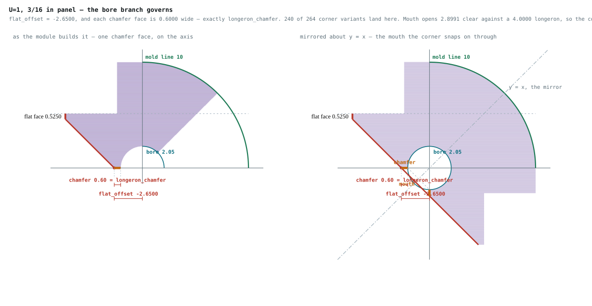
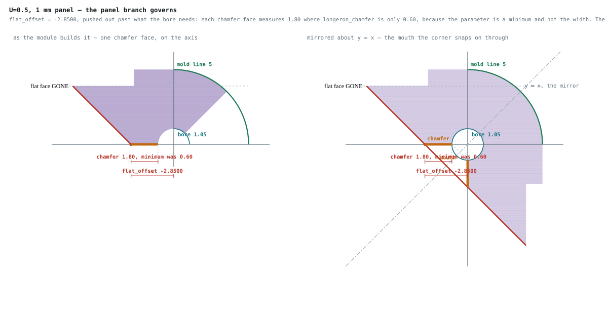

# The design basis

**Status:** the supporting argument for the fuselage's design and interface requirements — why
each is what it is, how the geometry follows from it, and what was measured. Written 2026-08-28
under [IP-FC-87](../implementation/freecad_migration.md), which
[OQ-DES-D9](dimension_scheme.md#open-questions) called for: a statement of what the interfaces
are *meant* to be, from which the geometry that exists follows.

**It was called `derivation.md` until 2026-08-29**, after the job
[`check_derivation.py`](../../src/Fuselage/tools/check_derivation.py) does — deriving every
parameter from a stated rule. That name outlived its accuracy. *Derivation* had come to mean
three things in one repository: this document's title, the INCOSE sense of a **derived
requirement** (traceable to no parent), and a **derived parameter** in the tool. And once
`system_requirements.md` existed, only about a quarter of the file was the thing the title
named; a third of it was requirement statements restated from elsewhere.
[OQ-DES-DB6](#open-questions) renamed it and removed the restatements. **The tool keeps its
name**, which was always correct.

**Restructured 2026-08-29**, in three corrections, each recorded where it bit rather than
quietly fixed. Requirements at different levels were run together; the level below the
architecture was mislabeled *derived*, which means something specific — traceable to no
higher-level requirement — and was true of only some of them; and the whole set was written
without reading the architectural requirements that already existed, which
[OQ-DES-DB5](#open-questions) settled by adopting them into the repository as
[doc/architecture/requirements.md](../architecture/requirements.md).

> **This document states no requirements.** They are in
> [system_requirements.md](system_requirements.md), all forty-seven of them, and in
> [doc/architecture/requirements.md](../architecture/requirements.md) above that. What is here
> is why they are what they are. A design requirement may cite an architectural one and does not
> have to; where it cites nothing it carries its own rationale, and
> [`requirements.py`](../../src/Fuselage/tools/requirements.py) demands that rationale in place
> of the citation.
>
> **This document is the argument. The specification is
> [system_requirements.md](system_requirements.md)**, written 2026-08-29, which states each
> requirement once with its parent, its verification method, and whether that verification has
> actually been run. If you want to know *what the fuselage must do*, read that. If you want to
> know *why anyone believes it* — the measurements, the reconstructions that turned out wrong,
> the places the implementation disagreed with the intent — read this.
>
> **This document argues twenty-two of the forty-seven requirements** — the design and interface
> groups, `DES-` and `INT-`, the latter being section 5's ten joints given ids. The other
> twenty-five are about the drawing set, the delivered FreeCAD model, and the equivalence of the
> two geometry paths; they are argued in [dimension_scheme.md](dimension_scheme.md) and in the
> migration's work items, and they were written down for the first time on 2026-08-29 by reading
> every checker in the repository and asking what each one enforces. **Nothing about the
> airframe's shape is in that set** — but a requirement set built only from this document would
> have been a set that proved it had copied one document.

---

## 1. Three kinds of statement, and they are not interchangeable

**Architectural requirements** constrain *any* compliant implementation. They live in
[doc/architecture/requirements.md](../architecture/requirements.md), not here, and that file is
authoritative — the project wiki restates it. MAUS‑FOS is a standard another airframe could be
built to; MAUS‑FD1 is the printable design system this fuselage belongs to. Neither can be
checked by a tool. They are accepted by review, or they are not.

**Design requirements** constrain *this* implementation, and they are what this document holds:
fifteen in [section 4](#4-why-each-design-requirement-is-what-it-is), decomposed again in
[section 5](#5-why-each-interface-is-what-it-is) into the ten joints. **A design
requirement may cite an architectural requirement, and does not have to** — decided 2026-08-29
with [OQ-DES-DB5](#open-questions). Where it cites one, that citation is its anchor. Where it
cites nothing, it carries its own rationale instead, and that is not a defect.

**Implementation artifacts** are neither. They are quantities that exist because a modeling
kernel needs them — a cutting solid that has to overshoot, a union that has to overlap, a mask
that has to reach past the profile. They have no design content at all, and the project has
already been bitten once by failing to say so: the corner's panel rebate is cut by a primitive
sized `2·panel_thickness + 2·panel_tolerance`, and the interface register recorded that as the
joint's own dimension until 2026-08-28.
[Section 7](#7-what-is-neither-implementation-artifacts) lists them and gives the rule that
keeps them distinguishable.

### On the word *derived*, which this document got wrong once

In the sense INCOSE uses — and ARP4754A and DO-178C with it — a **derived requirement is one
traceable to no higher-level requirement**: it arises from the design solution itself, from a
technology or implementation choice, rather than from decomposing something above it. That is
narrower than "produced by decomposition", and the difference carries an obligation: a derived
requirement has no parent to validate it against, so it has to be reviewed on its own.

> **This document called all eleven "derived" until 2026-08-29, and then reported as its
> headline result that every one traced upward.** In the standard sense that is a contradiction:
> anything that traces upward is decomposed, not derived. The structure was right and the label
> was wrong — and the label is the part that tells a reviewer what they are obliged to look at.

**Three of the fifteen cite nothing and so are derived in that sense** — DES-4, DES-7 and
DES-9 — and it is not a defect in any of them. MAUS‑FOS excludes dimensional tolerances as
application-dependent, so a decision about where a clearance sits is design work *by the
standard's own construction*, which is DES-4 and DES-7. DES-9 cites nothing for a different
reason: **the architecture says nothing about drawings at all**, and an earlier version of this
document invented a requirement so that it could.

> **It was five until 2026-08-29.** Adopting AP-1 and AP-2 into the architecture as AR-MOD-9
> and AR-CON-1 gave DES-6 and DES-5 the parents they had been standing without. That is what
> adopting an addition buys: not tidier prose, but two fewer statements nobody above has agreed
> to.

**Derived and *inferred* are different axes**, and DES-4 is why both labels are needed: its
reason is recorded in `design_constants.json`, so it is not inferred — and it cites no
requirement, so it is derived. A recorded rationale is not a parent.

### What each level is answerable to

| Level | Cites | Checked by | If it is wrong |
| --- | --- | --- | --- |
| Architectural | nothing — it is the source | review and acceptance | the design is solving the wrong problem |
| Design, citing architecture | one or more `AR-` ids | `check_derivation.py`'s citation check | a design rule is anchored to something that does not say it |
| Design, citing nothing | **nothing — deliberately, and it says why** | its own rationale, plus review | a design decision nobody agreed to is load-bearing |
| Part interface | one or more design requirements | `check_derivation.py` on the parameters, `check_derived_geometry.py` on the faces | a part does not meet its interface |
| Implementation artifact | nothing, deliberately | the kernel, by building | a boolean fails, or nothing at all |

Rows three and five both cite nothing, and confusing them would be the worst mistake this table
could invite. A design requirement that cites nothing is a **decision that needs accepting**; an
implementation artifact is a **number with no design content at all**. The first belongs in a
review, the second must never reach one.

### The test this document has to pass

> **Derivability: the geometry as it stands — the OpenSCAD source, together with the corrections
> the FreeCAD migration turned up — must *follow from* the design requirements; and every design
> requirement must either cite an architectural requirement that exists or carry its own
> rationale. Where a link fails, one end of it is wrong, and the disagreement is visible.**

Visible is the operative word, and it is why this document ships with checkers rather than with
an argument that it is correct. [Section 9](#9-how-this-is-checked) describes them. **What they cannot
do is check the architecture**, and no tool can: an architectural requirement is accepted by
review. Confusing the two is exactly the failure this document was written to end.

### How to read the source labels

Every statement below is labeled with where its reason comes from:

| Label | Meaning |
| --- | --- |
| **recorded** | the reason is written down in `design_constants.json`, a design document, or a resolved open question, and is quoted or cited here |
| **measured** | the value was arrived at empirically — a fit check on a printed prototype — and that origin is recorded. It is a real reason and it does **not** support extrapolation: a new size or material needs another fit check, not arithmetic |
| **generalized** | the reason is recorded for some of the cases it covers, and stating it as a rule over all of them is this document's step |
| **inferred** | no reason is recorded; the reconstruction is this document's, is marked as such wherever it is used, and is **not** design authority |

Ratifying an expression read off the geometry as design intent is the move that produced
OQ-DES-D9, so **an inference is never promoted here.** It is flagged, and it stays flagged until
it is replaced by a recorded or measured reason — [OQ-DES-DB3](#open-questions), decided
2026-08-30. There is no route from *inferred* to *recorded* that runs through argument, however
good the argument is.

**`measured` was added on 2026-08-29**, when OQ-DES-DB3's four clearances turned out to have an
origin after all. It is worth its own label rather than being folded into *recorded* because the
two support different things: a recorded reason like *"a one-extrusion wall has no interior"*
lets you recompute the value for a new case, and *"it fitted on the prototype"* does not.

Millimeters and degrees throughout, which is what the OpenSCAD path uses. Where a quantity is a
print setting rather than an airframe dimension, the unit is stated with it.

---

## 2. The architectural requirements

**They live in [doc/architecture/requirements.md](../architecture/requirements.md), and this
document does not restate them.** Decided 2026-08-29 under
[OQ-DES-DB5](#open-questions): the architectural requirements are adopted into this repository
as their own authoritative document, and the project wiki — where they were first written —
becomes a restatement of it rather than the source.

**They are architectural requirements, not design requirements**, and the distinction is the
one that file states: an architectural requirement constrains *any* compliant implementation, a
design requirement constrains *this* one. MAUS‑FOS is a standard another airframe could be built
to; MAUS‑FD1 is the printable design system this fuselage belongs to; both are architecture.
What a corner's seat is set back by is not.

**A design requirement may cite an architectural requirement, and does not have to.** That is
part of the same decision, and it is why
[section 4](#4-why-each-design-requirement-is-what-it-is) has requirements
that cite nothing and are not thereby defective. A citation is an anchor when one exists; a
requirement without one carries its own rationale instead, and `check_derivation.py` demands
that rationale in place of the anchor.

**Twelve of the fifteen design requirements cite architecture; three do not**, and the split is
not arbitrary. MAUS‑FOS excludes dimensional tolerances on purpose — *"considered application
dependent and therefore not included in the standard"* — so a decision about where a clearance
sits is design work by the standard's own construction, and there is nothing above it to cite.
That reading turns what looked like this document's weakest point into a consequence of the
architecture.

**Three architectural requirements were added on 2026-08-29**, closing
[OQ-DES-DB4](#open-questions): **AR-MOD-9**, the enclosed volume is usable; **AR-CON-1**, which
parts are printed and which are bought; and **AR-MOD-10**, the rounded-square cross section,
with the corner radius as the design's chosen point on the trade between flat panel area and
aerodynamic efficiency. The first two are the parents DES-6 and DES-5 lacked. The third answers
a question the wiki had carried as a `TODO` since it was written, and the architecture document
is explicit that **no analysis locates the chosen point on that front** — it is engineering
judgment, and it is labeled as such rather than dressed up as a derivation.

> **What this section used to be.** Nine proposed *originating* requirements, reconstructed on
> 2026-08-28 from `design_constants.json` and the design documents, without knowing the wiki
> existed. They were reconciled away on 2026-08-29. The reconstruction agreed with the wiki in
> most places, **missed three requirements** — layer orientation, printing without support
> material, and the constant cross section — and **inverted one**: it justified the mold line as
> an aerodynamic surface, where every reason the architecture gives is a modularity reason and
> aerodynamic optimization is explicitly secondary. Two of its nine had no counterpart at all,
> were proposed as **AP-1 and AP-2**, and were **adopted on 2026-08-29 as AR-MOD-9 and
> AR-CON-1** — because adding to the architecture is a decision, and it was taken rather than
> assumed.

---

## 3. What is chosen

The architecture says *that* the OML uses standardized dimensions and that the design is FDM
printable. These are the numbers that say **what**. A derivation has to bottom out
somewhere, and being on this list is a claim: that the value is a decision, not a consequence.

| Chosen | Value | Where | Cites | Why it is not derived |
| --- | --- | --- | --- | --- |
| `unit_width` | 100 mm at 1U | `standard` | AR-MOD-8 | the standard: what 1U *is* |
| `unit_length` | 100 mm at 1U, FX=1 | `standard` | AR-MOD-7 | the bay length, and the only standard value FX scales |
| `corner_radius` | 10 mm at 1U | `standard` | AR-MOD-5 | the mold line's corner |
| `longeron_radius` | 2 mm at 1U | `standard` | AR-MOD-8 | the tube is bought at this size |
| `bolt_offset` | 8 mm at 1U | `standard` | AR-MOD-2 | where the fastener sits in the corner |
| `panel_thickness` | 9 stock sizes | `panel_variants.csv` | AR-MOD-5 | the panel is bought; the sizes are a supplier's, in inches and millimeters both |
| `bulkhead_thickness` | 4, 5, 6, 6, 8, 10, 12, 16 | `bulkhead_size_variants.csv` | — | **a design choice per size step, on a tradeoff of several factors** — it traces to no formula and to no higher requirement, so airframe size is a discrete series of eight (OQ-DES-DB2, 2026-08-29) |
| `bulkhead_bolt_diameter` | 3, 3, 4, 4, 5, 6, 6, 8 | `bulkhead_size_variants.csv` | AR-MOD-2 | a standard fastener series, chosen per size step |
| `boom_diameter`, boom `y`/`z` | fractions of `unit_width` | `boom_bulkhead_type_variants.csv` | AR-MOD-8 | the boom tube is bought; where it sits is a configuration |
| `greeble_opening_angle` | 35° | `geometry` | AR-ASM-1 | tuned by experiment; the file says explicitly not to replace it with a formula |
| `boom_key_angle` | 0° | `geometry` | AR-ASM-1 | the key does not have to be there at all |
| `extrusion_width`, `layer_height` | 0.6, 0.2 mm | `printer` | AR-PRT-1 | print settings, not airframe dimensions |
| `cowl_n_perimeters` | 1 | `slicing` | AR-PRT-1 | how many perimeters the **cowl** prints with |
| the seven clearances | 0.05 … 0.2, one negative | `tolerances` | — MAUS‑FOS excludes tolerances | **four were set by fit checks on prototypes** — *measured*, so real but not extrapolable (OQ-DES-DB3, 2026-08-29) |

Everything else in the sweep is derived below. That is not a claim about tidiness; it is the
coverage `check_derivation.py` enforces.

---

## 4. Why each design requirement is what it is

**The requirements themselves are in
[system_requirements.md section 4](system_requirements.md#4-design-requirements)** — the `shall`
statement, the citation, the verification method and the status. They are not restated here.
What follows is the reason each is what it is: where the rule came from, how far it is on record,
what it excludes, and what was measured.

The heading labels say how far: **recorded** means the reason is written down somewhere and is
quoted here; **generalized** means it is recorded for some of the cases the rule covers and
stating it over all of them was this document's step; **inferred** means no reason is on record,
the reconstruction is this document's, and it carries no authority.

The same ids appear in the source —
[`requirements.py`](../../src/Fuselage/tools/requirements.py) carries the register and
`check_derivation.py` refuses a relation naming an id that is not in it.
[Section 5](#5-why-each-interface-is-what-it-is) decomposes these into the ten joints.

### DES-1 — why the airframe scales, and why below 1U as well — **recorded**

*Cites AR-MOD-8 — standardized dimensions, for commonality between implementations.* This is the general case and it covers most of the airframe: the
standard's five lengths, and every `_per_u` coefficient in the `scaling` group. `unit_length` is
multiplied by `FX` as well, because FX is the bay-length axis and nothing else responds to it.

**Scaling freely includes going below the 1U value, and most dimensions do.** Measured on a
1 mm-panel `end_bolt` at U=0.5 against U=1: `corner.radius` 5 against 10, `web.width` 1.5
against 3, `web.fillet_radius` 1 against 2, `bulkhead_flange.chamfer` 0.5 against 1,
`plate.thickness` 0.4 against 0.8, `longeron.radius` 1 against 2, `bolt.offset` 4 against 8 —
**eleven derived fields shrink and four do not**. The four that hold are DES-11's, and they are
the exception.

### DES-2 — why print-governed features quantize rather than floor — **recorded**

*Cites AR-PRT-1 — printable using FDM technology.* `design_constants.json`'s `scaling._about` states the discipline,
including that the suffix carries the unit: *"`_extrusions` is a count of `extrusion_width`,
`_layers` a count of `layer_height`, `_per_u` a multiple of U in millimeters, and a bare `_mm`
is an absolute floor that does not scale."*

`ceil(n·U)·extrusion_width` for a wall and `ceil(n·U)·layer_height` for a skin: a wall is laid
down in whole perimeters and a skin in whole layers, so the count rounds up and the feature
takes the size that produces. **This is about quantization, not about a minimum** — the plate
is `ceil(4·U)` layers and gets thinner as U falls, 0.4 mm at U=0.5 against 0.8 at U=1.

The one feature that scales as neither a proportion nor a count is the greeble wall, and its
entry says why: *"sqrt(U) not U: the wall is a printed feature sized to survive a snap fit, so
it scales in extrusions rather than as a fraction of the airframe."*

### DES-3 — why the mold line is a shared datum, and how far that was generalized — **generalized**

*Cites AR-MOD-4 and AR-MOD-5.* Recorded for three joints, in the clearances' own `why` fields:
`panel_tolerance` — *"so its outer surface still lands flush with the mold line at
`corner_radius`"*; `cowl_flange_tolerance` — *"the perimeter term is the radial room the
**COWL's** wall occupies, so the cowl's outer surface still lands on the mold line"*;
`nose_flange_tolerance` — *"the offset is a function of the shell it lands on"*.

**The generalization is this document's:** stating it as a rule that also governs the corner's
panel seat and the bulkhead's outer face, neither of which has it written down. Both follow —
section 5 shows the faces landing where the rule requires — but the rule was read from three
instances and then found to hold for five.

### DES-4 — why the clearance sits on one side, and why the rule is over joints — **cites nothing**, and **recorded**

**Cites nothing, and could not.** It is a statement about clearances, and MAUS‑FOS excludes
dimensional tolerances as application-dependent. Nothing in the architecture says the
accommodation is single-sided; splitting it across both halves would comply equally. Putting
it on one side is a design decision.

**Its reason is on record, which is exactly why this rule needs two labels.** Recorded twice in
the same words: `greeble_tolerance` — *"Carried entirely on the **CORNER** … so the joint takes
the clearance once. There is deliberately no bulkhead counterpart; 'the post is nominal' is an
invariant, not a setting"*; `corner_tolerance` — *"Carried entirely on the corner, same as the
greeble: when the bulkhead re-evaluates that shape to cut its own socket it passes 0."* So it is
**recorded** — its rationale is written down — and still **derived** — nothing above it requires
it. A recorded rationale is not a parent, and the two axes have to be tracked separately or a
rule like this looks validated when it is only explained.

**The unit is the joint, not the parameter, and `panel_tolerance` is why that has to be said.**
It is carried by *both* the corner (register row 4) and the bulkhead (row 5), which is not a
violation of this rule: those are two different joints against the same bought panel, and each
takes its own clearance once, on its own printed side. DES-3 in fact *requires* it — the panel
lies across both seats, so both must be set back by the same pocket or it cannot sit flat on
the mold line. Measured at 1U with a 3/16 in panel: the corner seats at 5.1375 corner-local and
the bulkhead at 45.1375 airframe, both the mold line less 4.8625. A rule stated over parameters
rather than over joints would forbid the geometry that is correct.

The consequence for a drawing is real and belongs to DES-9 rather than to this rule: a
drawing that dimensions both sides at nominal is not wrong about either part and is wrong about
the joint, and an inspector measuring the bulkhead's post against a drawing showing a clearance
would reject a good part.

### DES-5 — why the bought part is nominal, and what is still not recorded — **cites AR-CON-1**, and half **inferred**

*Cites AR-CON-1 — structural parts are printed; longerons, booms, panels, fasteners and inserts
are bought.* Adopted 2026-08-29, and it supplies the half of this rule that was missing: **which
parts are bought**, and with it that a bought part's size is the supplier's and cannot be moved.
The longeron tube, the boom tube, the bolt, the insert and the panel are all on that list, and
each mating feature in the printed parts is sized to the bought part's nominal plus a clearance.

**What the citation does not cover, and this is the honest half of the statement.** AR-CON-1
says which parts are bought. It does not say the clearance therefore goes entirely on the
printed side rather than being split between the two — MAUS‑FOS excludes tolerances, so nothing
above says that either. Splitting would be no less compliant; it would just mean specifying an
undersize on a part somebody else makes. That reasoning is nowhere on record, so **the
allocation stays inferred even though the rule now has a parent** — a narrower gap than before,
and a real one.

### DES-6 — why the corner is the part that gives way — **cites AR-MOD-9**, and **recorded**

**Rationale stated 2026-08-29, so this is no longer inferred:** *the corner is less likely to
have integrated components interfacing it than the bulkhead, so the bulkhead is the part whose
dimensions should stay consistent, and the variation is allocated to the corner.*

That is a stronger statement than "the corner carries it", and it generalizes: it is a rule
about **which part is the stable one**, so it would decide the next allocation of this kind the
same way without anyone having to re-argue it.

> **Both reconstructions this document offered were wrong.** It had proposed that the clearance
> sits on the corner because there are four corners to one bulkhead, or because the corner is
> the part that is pressed in. Neither is the reason. Both read plausibly, which is the entire
> case for [OQ-DES-DB3](#open-questions)'s refusal to promote an inference, and the reason that
> question was decided the way it was: a confident, well-argued reconstruction was available
> here, and it was not the intent.

**Its parent was adopted on 2026-08-29, and it is the one the rationale actually points at.**
*Cites AR-MOD-9 — the volume the airframe encloses is usable: payload, wiring, and a hand.* The
rationale is about **components integrating to the bulkhead**, which is integration on the
*inside*; AR-MOD-5 covers flat exterior panels and reaches only the outside. Until AR-MOD-9
existed there was nothing above this rule to cite, and the earlier draft's guess — that it
decomposed from AR-MOD-4, interchange not affecting structure — would have anchored it to a
requirement that says something else.

### DES-7 — why an absent joint has no clearance rather than a zero one — **recorded**

*Cites nothing.* `panel_tolerance` is 0 on a cowling bulkhead and on the 0 mm panel
variants; `cowl_flange_tolerance` is 0 on every non-cowling type; `plate.tolerance` is 0 where
the plate is inactive.

The drawing consequence is recorded: a generated drawing must **omit** the dimension rather than
print `0.0`, because a dimensioned zero asserts a coincident fit that was designed and is
inspectable. The geometric consequence is derived here and is sharper than it looks — see
[section 6.3](#63-what-happens-when-a-feature-is-absent), where a feature turns out to vanish in
two different ways.

### DES-8 — why assembly motion needs protecting, and how often it binds — **recorded**

*Cites AR-ASM-1 — components are self-aligning during assembly.* A clearance under DES-8 is room for a *motion*, not for a fit, which is
why it is a separate rule: it is measured along the direction of assembly and it applies even
where the assembled parts end up nowhere near each other.

### DES-9 — why a correct number is not enough — **recorded**

*Cites nothing.* Where two requirements bear on one feature, the feature takes the
binding one — that much is not a requirement, it is simply what a constraint does, and
`corner.md` records the instance: the corner's inboard boundary must clear the longeron bore
*and* sit outside wherever the panel interface has been pushed to, *"and whichever binds,
wins."* **The requirement is what the drawing then has to say.** The table carries the number,
and a note has to carry *which term produced it*, or an integrator takes the wrong design intent
away from a correct number.

### DES-10 — why the envelope belongs to the frame and not to a panel — **recorded**

*Cites AR-MOD-1 and AR-MOD-5.* Every boundary of the allocation is determined by the frame, and
OQ-DES-D4 made the envelope a part so a candidate panel is checked by containment rather than
against transcribed numbers.

**DES-9 and DES-10 are the two that no parameter relation enforces**, and `check_derivation.py`
says so on every run rather than letting them sit in the table looking checked. Both govern the
drawing or the envelope rather than a number the sweep produces: DES-10 is enforced by the OML
part and by section 6.1's allocation table, DES-9 by the note-binding in `check_drawing.py`.

### DES-11 — why some features floor, and which of those reasons are missing — **partly recorded**

*Cites AR-PRT-1.* This is DES-1's exception and it is a short list: four derived
quantities floor, written `max(n·U, n)` or `max(ceil(n·U)·w, n·w)` — `bolt.thickness`,
`bulkhead_flange.thickness`, `greeble.thickness` and its nub — plus the boom key's width, height
and radius, which are zero on every non-boom variant. `panel.overlap` floors too, on an absolute
4 mm rather than on a 1U value.

**The floor's reason is recorded for two of them and not for the rest.** The greeble wall:
*"The floor is the same n because a one-extrusion wall has no interior."* The panel overlap:
*"Absolute millimeters and deliberately unscaled — it is a bond-area minimum, not a proportion
of the airframe."* For the bolt boss, the bulkhead flange wall and the boom key, the floor is
stated and its reason is not — see [section 8](#8-what-could-not-be-derived).

That the floor *value* usually equals the 1U value is a consequence of writing it `max(n·U, n)`,
not the reason for it. `panel.overlap`'s floor is 4 mm, which is nothing's 1U value.

### DES-12 — why the cowl's wall must stay unmodelled — **recorded, and argued in cowl.md**

*Cites AR-PRT-1.* **Added to the set on 2026-08-29; its argument is
[cowl.md](cowl.md), not this document**, and it is here so that the list of design requirements
is the whole list rather than the part this document happens to derive.

The statement: the solid exported for printing carries one closed contour per layer and **no
interior geometry whatsoever**. Vase mode spirals a single continuous contour up the part, so a
cowl given a modelled wall is no longer vase-mode printable. Decided in OQ-DES-CW6, where the
capability was kept; `cowl.md` states it as a constraint over the whole interior-surface
section, because the interior surface serves the analysis use cases and **must not become what
the print export produces**.

**It reaches no parameter relation and nothing verifies it**, which is the same finding twice
and is [OQ-DES-SR2](system_requirements.md#open-questions). It is also the one requirement in
the set with a live, silent failure mode: a modelling change destroys the capability and the
part still builds, still exports, and still measures correctly.

### DES-13 — why the part is modelled standing the way it prints — **recorded**

*Cites AR-PRT-2 — layer orientation aligned to structural performance needs.* Added 2026-08-30
under [OQ-DES-SR1](system_requirements.md#open-questions).

**The orientation is recorded by construction, and that is the whole mechanism.** Every existing
part is modelled in the orientation it prints in, with the **print bed as the x/y plane** and +z
the build direction. There is no separate orientation field to go stale, and a part cannot be
oriented wrongly in the file without being wrong geometry. `corner.md` reads the corner's load
path against exactly this: the corner prints standing on end, layers stack along its length, and
the cross-section *is* the layer plane.

**Why it is a separate requirement from DES-14.** The two pull against each other — the
orientation that prints most easily is often not the one that carries load best — so putting
them behind one id would hide the trade. They also differ in what can be checked, which is the
sharper reason and is set out below.

### DES-14 — why parts have to build without support — **recorded**

*Cites AR-PRT-3 — printable without support material.* Added 2026-08-30 with DES-13, and it is
the parent [INT-9](#int-9--nose-plate--nose-closure) had been reaching past.

`overhang_angle_from_bed` is **35 degrees, measured from the bed** — the shallowest a face may
lean and still print unsupported, so 0 is a flat ceiling and 90 a vertical wall. OQ-DES-CW2
settled which way round it is measured; OQ-DES-CW11 made it one value for the project. Its
reason is on record in `design_constants.json`. It already governs the nose plate's pocket and
every cowl buttress.

**Two halves of printability, two verification states, and that is why they are two rules:**

| | DES-13, orientation | DES-14, support |
| --- | --- | --- |
| Recorded | by construction — the model is the record | a value with a written reason |
| Verifiable | **only half, even in principle** | **yes, computationally** |
| Verified today | held by review | **no** — nothing evaluates overhangs across the parts |

Whether a chosen orientation is the *right* one is **partly an overhang evaluation**, which is
DES-14's business and is computable, and **partly a stress analysis, for which this project does
not yet have the tools.** DES-13 is therefore held by review and says so. DES-14 is unverified
for a different reason — the check is known to be possible and nobody has written it, which is
a work item and not an open question.

### DES-15 — why every bay end mates every other, and why the aperture is exempt — **recorded**

*Cites AR-MOD-2 and AR-MOD-3 — interchange and re-ordering of fuselage sections — and
AR-MOD-1, a minimally constraining physical interface.* Added 2026-08-30 under
[OQ-DES-SR3](system_requirements.md#open-questions).

**Interchange is what the bolted end joint delivers, and nothing at this tier said so.** INT-10
is about the fastener. A change making one bay's end differ from another bay's mating end would
have violated the architecture and passed every check in the repository, because no requirement
was about the end interface being *repeatable*.

**The scope is the whole content of the rule.** Sameness holds for three things and not for a
fourth:

| | Same across every bay of a size? |
| --- | --- |
| the OML perimeter | **yes** |
| the longeron positions and sizes | **yes** |
| the fastener positions and sizes | **yes** |
| **the bulkhead's interior aperture** | **no — and deliberately so** |

The aperture is not constrained, it varies with offsets, and on a boom bulkhead — and on other
planar bulkheads that may yet be defined — it is neither a standard dimension nor a standard
shape. **An earlier draft of this requirement said "the same end interface" and was false.**

**Excluding the aperture is not a concession, it is the third citation.** AR-MOD-1 asks for a
*minimally* constraining physical interface, which means constraining what has to be shared and
deliberately nothing else. A requirement over the whole end face would have forbidden parts the
design intends to have. Two of DES-15's parents say what must be the same; the third says why
the rest must not be.

**It is verifiable and not yet verified.** The two ends of a built bay can be compared for
fastener positions, bolt circle, longeron positions and OML perimeter — the same kind of
face-level test `check_derived_geometry.py` already does — with the aperture excluded from the
comparison by the requirement itself. IP-FC-100.

---

## 5. Why each interface is what it is

The ten joints `dimension_scheme.md` section 2 enumerates. **The requirements are `INT-1` …
`INT-10` in [system_requirements.md section 5](system_requirements.md#5-interface-requirements)**
and are not restated here. What follows is the **derivation** of each joint's geometry from the
design requirements above, and the **evidence** — what was measured on the built solid, not what
the source says.

They were unnumbered until 2026-08-29, and that is why joint 9's dependence on AR-PRT-3 went
unnoticed: a requirement with no id is not in anybody's traceability matrix.

Values in the evidence lines are at **1U with a 3/16 in panel** unless stated: `corner_radius`
10, `panel_thickness` 4.7625, `panel_tolerance` 0.1, `panel_overlap` 4.7625, `panel_offset` 2.5,
`longeron_radius` 2, `longeron_tolerance` 0.05, `extrusion_width` 0.6.

### INT-1 — longeron tube → corner bore

*Traces to DES-5, DES-8. The tube is bought, and `corner.md` records that the corner locates it
over the full length of the part rather than retaining it.*

**Derivation.** DES-5: the tube is nominal, so the bore carries the whole clearance. DES-8: the
tube is pressed in sideways, so the corner's inboard boundary must leave the bore's mouth open
rather than closing around it; that boundary is derived under joint 3.

**Follows.** bore radius = `longeron_radius + longeron_tolerance` = 2.05.

### INT-2 — bulkhead greeble post → corner socket

*Traces to DES-4, DES-6. The greeble is the C-shaped seat that holds the longeron; it stands on
the bulkhead, and the corner has a socket it enters.*

**Derivation.** The clearance goes on the corner. The socket is the greeble's own profile grown
by `greeble_tolerance`, and the post is built at nominal.

**Follows.** socket radius = `longeron_radius + longeron_tolerance + greeble_thickness +
greeble_tolerance`; the bulkhead's post is the same expression with the tolerance at 0.

**Evidence.** `greeble.tolerance` resolves to 0.05 on the corner sweep and **0 on both bulkhead
sweeps, on all 280 bulkhead variants** — the invariant, checked rather than asserted.

### INT-3 — corner seating faces → bulkhead

*Traces to DES-4, DES-6, DES-9. The socket is cut from the corner's own description, so the two
are one shape — which is what lets DES-4 put the clearance on the corner alone.*





**What the drawing shows, because none of these three names is a face.** The corner's
cross-section is bounded on its inboard side by **one straight 45° line**, and `flat_offset` is
where that line crosses each axis — measured from the longeron axis, and negative. The other two
names are points on the same line: `flat_x` is where the axis-aligned flat faces sit (the arm
ends), and `flat_y = flat_offset − flat_x` is where the diagonal meets them. All four vertices
of the source's *bulkhead boundary* polygon satisfy `x + y = flat_offset`:

| Vertex | at 1U, 3/16 in | `x + y` |
| --- | ---: | ---: |
| `[flat_x, flat_y]` | (−7.2625, 4.6125) | −2.65 |
| `[flat_offset, 0]` | (−2.6500, 0.0000) | −2.65 |
| `[0, flat_offset]` | (0.0000, −2.6500) | −2.65 |
| `[flat_y, flat_x]` | (4.6125, −7.2625) | −2.65 |

**The corner snaps onto the longeron, and `longeron_chamfer` sizes the lead-in it snaps through.**
The corner is a C: it wraps **270° of the bore** and opens toward the fuselage interior. What
opens it is the third-quadrant mask, the one the source labels `// longeron chamfer`. The mouth
that mask leaves is **narrower than the longeron** — 2.8991 mm of clear opening against a 4 mm
rod at 1U, 1.4849 against 2 mm at 0.5U — so the corner has to be pressed on and the arms have to
spread.

**The two walls of that mouth are the chamfer.** They are flat cuts at 90° to each other, so each
stands at **45° to the direction the rod is pressed in**: the ramp the longeron rides as it
spreads the arms. Each runs from the bore out to the arm's tip corner at `[flat_offset, 0]`.

**`longeron_chamfer` is the *minimum* width of each of those faces** — the source says so in as
many words, *"use longeron_chamfer as a minimum"* — and the face equals it only when the bore
branch governs. At 1U each chamfer face measures **0.6000, exactly `longeron_chamfer`**; at 0.5U
with a 1 mm panel, where the panel branch pushes `flat_offset` out to −2.8500, each measures
**1.8000** against the same 0.60 minimum. Without the minimum the mouth walls would run tangent
to the bore, the chamfer would have zero width, and the arm tips would come to knife edges — so
what the floor buys is a lead-in at least one printed wall thick.

**Read the right-hand panel of each figure for the mouth.** The module draws half the corner:
the profile is cut by a mirror mask keeping `y ≥ x` and by the chamfer mask, so in the left-hand
panel only one chamfer face is present and it lies flat on the axis, where it looks like an
artifact of where the cut falls. Mirrored about `y = x` — the first step of `octant_to_full()` —
the second face appears at `x = 0`, the two meet the bore at their inner ends, and the mouth
between them is what the corner snaps on through. Both faces are drawn in **orange**; the heavy
red diagonal beside them is the bulkhead seating face, a different face that happens to start at
the same tip corner.

The drawings are generated by
[`tools/draw_flat_offset.py`](../../src/Fuselage/tools/draw_flat_offset.py) and are **diagrams
of the definition, not tracings of a built solid** — the opposite of
[corner_bulkhead_joint.md](corner_bulkhead_joint.md), which traces what FreeCAD built. **The
material is rasterized from `corner_middle_shape`'s own boolean expression**, not outlined by
hand, and that is not a stylistic choice: the first version of these figures *was* hand-outlined
and was wrong twice over — it drew a full quarter, filling material straight across the mouth,
and it labelled `longeron_chamfer` on both branches when the panel branch's face is three times
it. Both errors survived review and were found by drawing from the booleans instead. That the
definition and the built solid agree is established separately, by `check_derived_geometry.py`
measuring faces on the part.

**Derivation, and this is the one with real content.** Two constraints bear on the diagonal:

- **the bore branch.** The diagonal is a 45° line; where it crosses the axis it fixes the arm's
  tip corner, and the chamfer face runs from there back to the bore. That face must have width,
  or the mouth wall is tangent to the bore and the tip is a knife edge. Its minimum is
  `longeron_chamfer`, which is one `extrusion_width` — the thinnest wall that prints. So the
  crossing sits at `longeron_radius + longeron_tolerance + longeron_chamfer` from the axis.
- **the panel branch.** The diagonal may not rise above the panel seat, or it would cut into the
  seat the panel lands on. That puts a floor at
  `(panel_overlap + panel_offset) − (corner_radius − panel_thickness − panel_tolerance)`.

The binding branch wins; DES-9 makes the drawing say which. The **flat** faces then run from where the diagonal reaches them up to the
panel seat, so the seating flat's height is the amount by which the bore branch exceeds the panel
branch — and **when the panel branch governs, the flat is not small, it is gone.**

**Follows.**

```
flat_offset  = -max(longeron_radius + longeron_tolerance + longeron_chamfer,
                    (panel_overlap + panel_offset)
                      - (corner_radius - panel_thickness - panel_tolerance))
flat_x       = -(panel_overlap + panel_offset)
flat height  = max(bore branch, panel branch) - panel branch
```

Under DES-4 both faces then move inboard by `corner_tolerance` measured **normal to each**, which
is why the diagonal's intercept moves by `√2` times it and the flat's does not.

**Evidence.** At 1U/3-16 the bore branch is 2.65 and the panel branch 2.125, so the flat is 0.525
tall: the built corner has a face normal to X at −7.2625 of **52.5000 mm²**, which is 0.525 × the
100 mm part length, exactly. Across the sweep the bore branch governs on **240 of 264 corner
variants and 120 of the 132 non-cowling bulkhead variants**, and on the remaining 24 and 12 the
flat vanishes — checked by building `0.5 end_bolt 1 mm`, where `check_derived_geometry.py`
predicts the face absent and the part has none.

### INT-4 — panel → corner

*Traces to DES-3, DES-5, DES-10. The panel is bought flat stock, captured along each edge and
bonded there.*

**Derivation.** DES-3 puts the panel's outer surface on the mold line, so the corner's seat is set
back from it by the panel and its fit, with the clearance inboard. DES-3 also says no material
stands outboard of the panel, so **the feature is a rebate and not a slot** — the panel's outer
face is exposed and *is* the airframe surface. The arm carrying the seat reaches the corner's own
mating plane at `panel_overlap + panel_offset` and stops there; stopping one clearance short would
put the end face inboard of the seat's own boundary (OQ-DES-B13, and OQ-DES-D8 for the same error
surviving in the register until 2026-08-28). The seat's inboard end is a stop the panel butts
against, placed one `panel_tolerance` beyond the panel's edge so the panel bottoms out on
clearance.

**Follows.**

| | Expression | At 1U, 3/16 in |
| --- | --- | ---: |
| seat, from the corner arc center | `corner_radius − panel_thickness − panel_tolerance` | 5.1375 |
| seat length along the arm | `panel_overlap + panel_tolerance` | 4.8625 |
| end stop, from the longeron axis | `panel_offset − panel_tolerance` | 2.4000 |
| end stop height | `panel_thickness + panel_tolerance` | 4.8625 |
| mold line surviving on the arm | `panel_offset − panel_tolerance` | 2.4000 |
| arm reach | `panel_overlap + panel_offset` | 7.2625 |

**Evidence.** Every one of those faces is where the derivation puts it on the built corner, to
1e-6 mm, with the derived area — at 1U/3-16 in, seat 486.2500 mm², stop 486.2500 mm², mold line
240.0000 mm², arm end 52.5000 mm². The same predictions hold at 4U/1-4 in and 0.5U/1 mm, and on
the 0 mm panel, where the features the derivation says are absent are absent.

> **The register said "slot `2·panel_thickness + 2·panel_tolerance` deep" until 2026-08-28.**
> That is not a wrong requirement — it is not a requirement at all. It is the size of the cutting
> primitive, which overshoots on both axes so the boolean clears the material. Recording an
> implementation artifact as a joint dimension is the failure mode
> [section 7](#7-what-is-neither-implementation-artifacts) exists to prevent, and this is the
> instance that prompted it.

### INT-5 — panel → bulkhead flange

*Traces to DES-3, DES-10.*

**Derivation.** DES-3 from the other side: the panel's outer surface is on the mold line, so the
bulkhead's outer face is set back from the mold line by the panel pocket, and the panel passes
over it. The face runs the panel's exposed span, because that is the part of the panel that is
over the bulkhead rather than inside a corner.

**Follows.** outer face at `unit_width/2 − panel_thickness − panel_tolerance`, running
`unit_width − 2·(corner_radius + panel_offset) − 2·panel_overlap`.

**Evidence.** The built bulkhead's outer flat face is at **45.1375** and measures **392.8500
mm²**, which is 65.475 × 6 — the panel's exposed span times the bulkhead thickness. Checked at
0.5U, 1U and 4U and on the 0 mm panel. It is the strongest single confirmation in this document
because the span is derived from the panel allocation in [section 6.1](#61-the-panel), which
touches none of the bulkhead's own parameters.

**This is the reason a panel is not interrupted at a station: the bulkhead gives way to it.**
`unit_length − 2·bulkhead_thickness` was the alternative reading and it is wrong.

### INT-6 — boom tube → boom bulkhead collet

*Traces to DES-1, DES-5.*

**Derivation.** DES-5: the tube is nominal, the collet's bore takes the clearance. DES-1: the
collet wall scales with the airframe like any other proportion, with no floor.

**Follows.** `collet_radius = boom_diameter/2 + boom_collet_thickness + boom_tolerance`, with
`boom_collet_thickness = 3·U`. Recorded verbatim in `boom_tolerance`'s entry.

**Residual, largely answered.** The clearance is 0.2, four times the longeron's 0.05, and the
constants file says of it: *"the boom is a larger tube through a deeper bore, but the number has
never been justified in writing."* It was **set by a fit check on a printed prototype**
(OQ-DES-DB3, 2026-08-29), so it is *measured* rather than unexplained — and the factor of four
is the outcome of two independent fit checks, not a ratio anybody chose. Nothing here
extrapolates to a new tube size or a different printer.

### INT-7 — cowl → cowling bulkhead flange

*Traces to DES-3, DES-7.*

**Derivation.** DES-3: the cowl's outer surface lands on the mold line, so the flange has to be
inboard of the mold line by the cowl's own wall — `cowl_n_perimeters · extrusion_width`, which is
a *print* quantity of the other part — plus the fit.

**Follows.** flange outer radius = `corner_radius − cowl_n_perimeters·extrusion_width −
cowl_flange_tolerance`; flange height `cowl_flange_height_per_u · U`. Recorded verbatim.

**Carried by the cowling type, not by the bulkhead.** The flange's height is zero on the end and
interconnect types, so it is not a feature those parts have — DES-7, and the reason
`dimension_scheme.md` row 7 names a type rather than a part (OQ-DES-D6).

### INT-8 — nose closure → cowl shell

*Traces to DES-3. It is a lap joint: alignment comes from the fit, bond from the seating face.*

**Derivation.** DES-3: the offset is the shell the nose lands on — the cowl's own wall again —
plus the fit against it. The fit is **negative**, and legitimately: a nominal interference is how
a printed joint is made to grip, and a bonded joint does not need a positive gap because the bond
line is on the seating face and not in the lap.

**Follows.** `nose.flange_inset = cowl_n_perimeters·extrusion_width + nose_flange_tolerance`
= 1 × 0.6 − 0.1 = **0.5**. Recorded verbatim, and confirmed on all 16 nose and tail variants.

Do not read the old `0.5 = 0.4 + 0.1` decomposition as provenance: 0.4 was the hand drivers'
development extrusion width, so that arithmetic is a coincidence of test numbers.

### INT-9 — nose plate → nose closure

*Traces to DES-7 and DES-14. It reached past the design tier to AR-PRT-3 until 2026-08-30,
which the register reported as a level skip on every run;
[OQ-DES-SR1](system_requirements.md#open-questions) closed it by adding the requirement that was
missing underneath — which is what a reported skip is for.*

**Derivation.** DES-5 does not apply — both parts are printed — so the clearance is a fit between
two printed features and sits on the pocket. The relief angle is DES-14 applied here:
`overhang_angle_from_bed`, 35 degrees from the bed, one value for the project since
OQ-DES-CW11.

**Follows.** pocket radius = `plate_diameter/2 + plate_tolerance`, relieved at
`overhang_angle_from_bed`. `plate.tolerance` is 0 on `tail_high_open`, where the plate is
inactive — DES-7.

### INT-10 — bolt or insert → bulkhead

*Traces to DES-1, DES-5, DES-11 and DES-15. The last was added 2026-08-30: this joint is the
mechanism that delivers interchange, and until then nothing above it said the bay ends had to be
repeatable — only how the fastener is placed and sized.*

**Derivation.** DES-1 places the fastener: `bolt_offset · U` from the corner arc center, on the
diagonal. DES-5 sizes the hole: a bolt gets its own nominal, an insert gets its bore from
[`threaded_insert_dimensions.csv`](../../src/Fuselage/tools/threaded_insert_dimensions.csv),
which is supplier data. DES-11 floors the boss around it: the fastener series does not shrink proportionally, so the
boss cannot either.

**Follows.** `bolt.offset = 8·U`; `bolt.radius = bolt_diameter/2`, or the insert bore for an
anchor; `bolt.thickness = max(3·U, 3)`.

**Residual.** Where the fillet between the bulkhead flange and the bolt boss lands relative to the
bolt axis is *not* determined by anything — it is the difference of four dimensions chosen
independently, and it takes whatever value they leave. That is OQ-DES-B14, deliberately measured
and reported rather than constrained, and this document does not change it.

---

## 6. What follows from the interfaces

### 6.1 The panel

The panel's own size is what a panel designer needs and no joint states it. DES-10 requires it be
stated anyway, and DES-3 does the work: the panel spans from corner to corner, its outer face on
the mold line.

| | Expression | At 1U, 3/16 in |
| --- | --- | ---: |
| width, corner to corner | `unit_width − 2·(corner_radius + panel_offset)` | 75.000 |
| exposed span between corners | `width − 2·panel_overlap` | 65.475 |
| entry into each corner | `panel_overlap` | 4.7625 |
| inner face, from the airframe axis | `unit_width/2 − panel_thickness − panel_tolerance` | 45.1375 |
| outer face | the mold line, `unit_width/2` | 50.000 |
| length along the bay | `unit_length · FX` | 100.000 |

**The width is confirmed by a clearance, not by a face.** Take the panel to be 75.000 wide and
its edge lands 0.1000 short of the corner's end stop — `panel_tolerance` exactly, and no other
width fits the rebate the corner was cut with. The exposed span is confirmed a second time, and
independently, by the bulkhead's outer face measuring 392.8500 mm² (joint 5).

### 6.2 `panel_offset`, which is the densest thing in the design

`panel_offset` is how far the panel's inboard edge stands off the longeron axis, and it is not
free: two requirements bear on it and the binding one wins, which is what DES-9 obliges
the drawing to say.

**R1 — the panel must not run into the greeble.** The greeble's outer perimeter is a circle about
the longeron axis of radius `longeron_radius + longeron_tolerance + greeble_thickness +
greeble_nub_thickness`, and `greeble_margin_extrusions` of clearance is kept outside it. The
panel's inboard corner is the point (`offset`, `seat_y`), so it is outside the circle exactly when
`offset² + seat_y² ≥ radius²`.

**R2 — the corner has to be able to snap on (DES-8).** The greeble's mouth faces the 45° diagonal
and the corner presses onto the longeron sideways, so the corner's mating plane at
`panel_overlap + panel_offset` must clear the greeble's extremity *measured along that diagonal*,
plus the margin, plus `greeble_snap_clearance_per_u · U` of room to move.

The margin is taken out of the radius before the projection and added back after. That is not an
accident of the arithmetic and the constants file already flags the three appearances as one
quantity: the margin is a clearance **normal to the plane**, and projecting it onto the diagonal
would shrink it by √2, so it would no longer be the clearance.

The result is rounded **up** to a whole `panel_offset_quantum_mm`. Rounding down would eat the
clearance the requirements just established.

**Evidence, and it is a stronger check than the formula.** `check_derivation.py` also tests R1 and
R2 directly against the offset the sweep produced — never evaluating the formula, so it cannot
fail in sympathy with it. On all **528 non-cowling variants** the built offset satisfies both
requirements, and on **all 528 one quantum less would violate at least one**. The quantized offset
is never slack. **R2 governs on 468 of them and R1 on 60**, so the requirement that usually
decides the panel's width is the assembly motion, not the static clearance.

### 6.3 What happens when a feature is absent

DES-7 says a structural zero is the absence of a joint. Deriving where the faces go makes that
concrete, and it turns out features vanish in **two different ways**, which is worth stating
because the first form of the geometry check had them behaving alike and the parts said otherwise:

- **By merging.** On a 0 mm panel variant the corner's panel seat has no depth, so it collapses
  onto the mold line, and the end stop collapses onto the bulkhead seating flat. A face is still
  found at each derived position — it belongs to the other feature. The corner has 50 faces
  instead of 54.
- **By closing up.** On the 24 corner variants where joint 3's panel branch governs, the seating
  flat's height goes to zero and the face is simply not there. Nothing takes its place.

The distinction matters for a checker and for a drawing both: "absent" cannot be tested as "no
face at this coordinate", and a dimension cannot be attached to a face that has merged into
another feature. The bulkhead's outer face is a third case again — it does *not* vanish with the
panel, it moves out onto the mold line, because its extent is the exposed span and not the pocket.

### 6.4 The enclosed spans

*Cites AR-MOD-9 — the volume the airframe encloses is usable: payload, wiring, and a hand.*
Adopted 2026-08-29; until then this was the only place in the document reaching for a
requirement that did not exist. Nothing in the
model mates with the bulkhead's interior aperture, so no joint reaches it — but a battery, a loom,
a servo and a hand with a nut driver all depend on it, which is the requirement almost verbatim. Its derivation is DES-3 applied twice
inward, and the last term differs by part because the ring's inner boundary is set by the flange
on a frame bulkhead and by the web on a boom bulkhead:

| Part | Enclosed span | At 1U, 3/16 in |
| --- | --- | ---: |
| frame bulkhead | `unit_width − 2·(panel_thickness + panel_tolerance) − 2·flange_thickness` | 87.875 |
| boom bulkhead | `unit_width − 2·(panel_thickness + panel_tolerance) − 2·web_width` | 78.275 |

On a boom bulkhead the span and the clear opening are two different numbers — 78.275 both ways
against 78.275 × 66.402 — because the collet intrudes from one side.

---

## 7. What is neither: implementation artifacts

A modeling kernel needs quantities the design does not have. A cutting solid has to overshoot the
material or the boolean leaves a zero-thickness sliver; a masking half-plane has to reach past the
profile; a union of stacked sections has to overlap or CGAL may not fuse them. **None of these is
a requirement at any level, and none of them belongs in a register, a drawing, or a trace.**

> **The rule: an implementation artifact must not be sized from the dimension of the feature it
> operates on.** Sized that way it is indistinguishable from a design quantity — it scales like
> one, it reads like one, and sooner or later somebody records it as one.

### The instance that prompted this section

The corner's panel rebate is cut by a rectangle whose rows are, in `freecad/corner_tree.py` and
identically in `scad/fuselage_corner_geometry.scad`:

```
slot_x = -panel_overlap * 2 - panel_offset + panel_tolerance
slot_w = panel_overlap * 2
slot_d = panel_thickness * 2 + panel_tolerance * 2
```

The feature those produce is a rebate `panel_thickness + panel_tolerance` deep and
`panel_overlap + panel_tolerance` long — measured, in [joint 4](#int-4--panel--corner). Every
one of the doublings is overshoot: the rectangle is drawn twice the pocket tall so it clears the
mold line, and twice the overlap long so it opens through the end of the arm. **The overshoot is
the feature's own dimension, doubled**, which is why it scaled convincingly across 264 variants
and why the interface register carried `2·panel_thickness + 2·panel_tolerance` as the joint's
depth until 2026-08-28.

**It is also unnecessary in FreeCAD.** OCCT does not need CGAL's slop, and this project already
has the right idiom two rows further up the same table — `mask_reach` and `through_cut`, each a
"big enough" distance stated once, named, and commented with why it is named rather than inlined.
The panel slot should use it. That is
[IP-FC-88](../implementation/freecad_migration.md), filed rather than done here because it changes
a live generator and wants a before/after measurement.

### The others, and why they are already handled correctly

| Artifact | What it is | How it stays visible |
| --- | --- | --- |
| `mask_reach = 2·corner_radius` | how far a masking half-plane must extend to cover the profile | named, with a comment recording that it had to be renamed from `far` once it shared a sheet with the bulkhead's different "big enough" distance |
| `through_cut = 3·bulkhead_thickness` | length for a centered cutting solid that must pass entirely through | named, with a docstring saying exactly that |
| `eps = 0.01` section overlap | the corner's three z-sections overlap so CGAL fuses them | measured under IP-FC-55: forcing all three flush moves the assembled corner by −0.0006 mm³ and changes no face. **OCCT does not need it; it stays for the OpenSCAD path**, and the measurement is why that is a decision rather than an assumption |
| masking polygon trailing vertices | points that only have to sit off the part | `corner_tree.py` says so in as many words |

Three of those four are artifacts done right: named, commented, and sized from something other
than the feature they act on. The panel slot is the one that is not.

---

## 8. What could not be derived

Everything here is a place where the implementation is correct, self-consistent, and rests on
something nobody wrote down.

1. **~~Four of the seven clearances carry no argument.~~ Answered 2026-08-29: they are
   *measured*.** `longeron_tolerance` 0.05, `greeble_tolerance` 0.05, `panel_tolerance` 0.1 and
   `boom_tolerance` 0.2 were **arrived at through fit checks during prototype testing**. That is
   a real reason and it is now on record. What it does not give is a rule: nothing here
   extrapolates to a new size, a new stock or a different printer, and `boom_tolerance` being
   four times `longeron_tolerance` is an outcome of two separate fit checks rather than a ratio
   anybody chose. [OQ-DES-DB3](#open-questions) is closed.

2. **~~`bulkhead_thickness` and `bulkhead_bolt_diameter` are tabulated with no rule.~~
   Answered 2026-08-29: the table *is* the design.** They are design choices made on a tradeoff
   of several factors and objectives, and they trace to no formula and to no higher requirement.
   Eight rows each; airframe size is a **discrete series of eight**, and adding a ninth means
   choosing again rather than evaluating something. That `4·U` reproduces the thickness for
   U ≥ 1.5 and misses all three smaller sizes is a coincidence of fit, not a rule with
   exceptions. Several derived quantities depend on the thickness — the panel seat's area, the
   greeble nub's height — and they are derived *from the table*, which is a legitimate thing to
   derive from.

3. **~~`longeron_chamfer` is not a chamfer.~~ Withdrawn 2026-08-30: it is one, it is correctly
   named, and the name was the only part of it this document read correctly.** The corner snaps
   onto the longeron: it wraps 270° of the bore and opens through a mouth narrower than the rod,
   2.8991 mm clear against 4 mm at 1U. The mouth's two walls stand at 45° to the direction the
   rod is pressed in and are the lead-in that spreads the arms. `longeron_chamfer` is the
   minimum width of each. Drawn, in orange, in
   [INT-3](#int-3--corner-seating-faces--bulkhead).

   **Three readings preceded that, all wrong, all written with confidence** — "the smallest
   chamfer worth printing" (marked an inference in `corner.md`), then a "standoff" that chamfers
   nothing, then a floor on that standoff. Every figure this document generated drew the chamfer
   while the prose beside it denied there was one. The residue worth keeping is that the same
   words label a second, unrelated feature:

   | Where | What it is | Sized by |
   | --- | --- | --- |
   | `longeron_chamfer` — `fuselage_corner_geometry.scad:76`, `corner_common.py:72`, `corner_tree.py:67` | **the minimum width of each mouth-wall chamfer**, equal to the built width only when the bore branch governs. Correctly named | `= extrusion_width`, 0.6 mm at 1U |
   | `// longeron chamfer` — `fuselage_corner_geometry.scad:258` | **the mask that cuts that chamfer**, `[[0,0],[-far,0],[-far,-far],[0,-far]]`. It opens the third quadrant, which is the mouth. The comment is on the right line | dimensioned by the row above |
   | `// longeron chamfer` — `fuselage_bulkhead_geometry.scad:125` | **a different chamfer, on a different part**: the cone that flares the longeron flange boss out where it meets the plate | **`flange_chamfer`**, 1.0 mm at 1U |

   **The real one is neither broken nor lost.** `simple_positives.py` builds it as
   `LongeronChamfer`, `_cone(long_chamfer_r, long_r, flange_chamfer, plate_thickness)` with
   `long_r = longeron_radius + bolt_thickness`, matching the source term for term. It is built
   **only on cowling bulkheads** — `if (is_cowling)` at `fuselage_bulkhead_geometry.scad:93`,
   verified by tracing the brace depth from there to the feature at line 128 — and **on one face
   only**, since `octant_to_full()` mirrors x, y and x↔y but not z. IP-FC-9 records that the
   FreeCAD reference first built it unconditionally and that assembling `bulkhead_section`
   caught it: 5.87 mm³ standing in the first quadrant that the real module does not have.

4. **~~`panel_offset`'s upper clamp is unexercised and is not a bound.~~ Answered 2026-08-29:
   it is a guard, and the ordering is deliberate.** The `min` against `√2 · corner_radius` was
   written as a guard against an excessively large panel offset, and **applying the quantum after
   it was intentional** — so the value that leaves the expression is always on the 0.25 mm grid.
   It still never binds: measured across all **528 non-cowling variants, zero reach it**, and at
   1U the requirements produce 2.5 against a clamp at 14.14. An unexercised guard is not a
   defect; what was a defect was this document calling the ordering one.

5. **Where the clearance sits, once a joint has one, is still nobody's requirement.** Three of
   the fifteen cite nothing — DES-4, DES-7 and DES-9 — and for the first two that is the OML
   standard working as intended: it excludes dimensional tolerances as application-dependent, so
   they are design-level by construction rather than by omission. The residue is narrower and
   real: **DES-5 now cites AR-CON-1 for which parts are bought, and still records no reason why
   the clearance goes wholly on the printed side rather than being split.** DES-6 was in the
   same position until 2026-08-29 and is not any more — it has both a stated rationale and
   AR-MOD-9 above it.

6. **`panel_overlap = max(panel_thickness, 4 mm)` ties a bond length to a stock thickness.** The
   floor is recorded as a bond-area minimum, deliberately unscaled. Why the lap should otherwise
   be exactly one panel thickness is not.

7. **`greeble_opening_angle` and the boom key's dimensions are declared choices, not gaps.** 35°
   is tuned by experiment and the file says not to replace it with a formula; the key's width and
   height are recorded as independent dimensions that happen to agree. Both are in
   [section 3](#3-what-is-chosen) and neither is a defect.

8. **Four of the floors under DES-11 have a reason on record and three do not.** The greeble
   wall floors because a one-extrusion wall has no interior; the panel overlap floors on an
   absolute bond area. Why the bolt boss, the bulkhead flange wall and the boom key hold at
   their 1U size is stated as a formula and justified nowhere — and unlike the rest of the
   airframe, which shrinks freely below 1U, these are the places somebody decided it must
   not.

---

## 9. How this is checked

Three things are checked and one is not.

### The trace — `tools/check_derivation.py`, on every run

`ARCHITECTURE`, `DESIGN` and `INTERFACE` are tables in the source, and every relation names a
`DES-` id rather than describing its reason in prose. A citation that resolves to nothing, a requirement that cites
nothing and offers no rationale, or a relation naming a requirement that does not exist is a
**failure**, not a wording problem — each means a design decision is anchored to something that
is not there. A requirement that simply cites nothing is *not* a failure; that is the normal case
for anything about clearances.

```
traceability -- every relation names one of the 12 design requirements; 9 of them cite
                architecture, 3 carry their own rationale (DES-4, DES-7, DES-9)
             the register itself is checked by requirements.py
    note: DES-10 reaches no parameter relation; it is checked elsewhere or not at all
    note: DES-12 reaches no parameter relation; it is checked elsewhere or not at all
    note: DES-9 reaches no parameter relation; it is checked elsewhere or not at all
```

The note is not a failure and is printed deliberately: a requirement nothing enforces should not
be able to sit in the table looking enforced.

### The register — `tools/requirements.py`

**The requirement text is not in `check_derivation.py`.** It moved to
[`tools/requirements.py`](../../src/Fuselage/tools/requirements.py) on 2026-08-29, because a
copy there plus a copy in `system_requirements.md` is two copies of every statement — the exact
failure a register exists to prevent. `check_derivation.py` imports it and keeps only the half
of the trace it alone can check: every relation names a `DES-` id, and that id resolves.

`requirements.py` carries all six tables and refuses six things: a citation that resolves to no
requirement; a citation to the wrong tier; a requirement below the design tier citing nothing; a
design requirement citing nothing **and** carrying no rationale; a requirement below the
architecture with no **source**; and a **verifier naming a file that is not in the repository**,
which is the cheapest way to catch a specification claiming a check that does not exist. Each of
the six was seen to fail against a deliberately perturbed register before being relied on.

```
python requirements.py
register -- 47 requirements below 19 architectural; every citation resolves to a tier above
    9 of the 12 design requirements cite architecture, 3 carry their own rationale
    note: DES-9 is verified by nothing
    note: DES-12 is verified by nothing
    note: INT-9 cites AR-PRT-3 directly, skipping the design tier
    note: DRW-7 is verified by nothing
document -- doc/design/system_requirements.md states every id in the register, and no others
coverage -- 10 of 19 architectural requirements are cited; 9 are not
```

The document check is deliberately shallow — it compares the *set* of ids, not the wording,
because a checker that compared prose would either be defeated by a rephrasing or would forbid
one. **The four notes are the findings**, and each is an open question rather than a defect.

### The parameters — `tools/check_derivation.py`, every variant

Runs in the project virtualenv, no FreeCAD, seconds. Every numeric field a variant carries is
either a **given** — listed with where it was chosen — or a **derived** field produced by a
relation from the givens and from values the checker has already derived. It never reads the
sweep's own answer. Coverage is enforced: a field that is neither fails, so a parameter added to
`fuselage_variants.py` cannot silently leave the derivation behind.

```
corner        -- 264 variants, every relation derives the built value
bulkhead      -- 148 variants, every relation derives the built value
boom_bulkhead -- 132 variants, every relation derives the built value
nose          --   8 variants, every relation derives the built value
tail          --   8 variants, every relation derives the built value
ok -- every parameter is a stated choice or follows from one
```

It also tests [section 6.2](#62-panel_offset-which-is-the-densest-thing-in-the-design)'s two
requirements against the built offset directly, which is the one place the derivation would
otherwise be a restatement of the implementation's own arithmetic. `--report` prints the whole
requirement tree.

### The faces — `freecad/check_derived_geometry.py`, by sample

Runs under `freecadcmd`, builds the part, about a second each. Each entry states a face the design
*requires*: its normal, position, area, whether it exists at all on this variant, and the DR it
serves. Then the solid is asked. Absence is a prediction in its own right, handled as
[section 6.3](#63-what-happens-when-a-feature-is-absent) describes.

```
freecadcmd check_derived_geometry.py --pass variant.params.json
freecadcmd check_derived_geometry.py --pass variant.params.json kind=bulkhead
```

Run 2026-08-28 on four variants chosen to reach the topology cases rather than to sample evenly —
1U/3-16 in, 1U/0 mm (features merge), 0.5U/1 mm (the seating flat closes up), 4U/1-4 in — for both
the corner and the bulkhead. All pass.

**What it does not cover.** The diagonal seating face, which is not axis-normal; the bore and
collet, which are cylindrical; the cowl and nose, which are not ported to FreeCAD yet (IP-FC-12).
Those are derived above and checked only through their parameters.

### What is checked by nothing — the architecture

**No tool can validate an architectural requirement**, and a checker that appeared to would be
worse than none.
[doc/architecture/requirements.md](../architecture/requirements.md) is accepted by review or it
is not. A green run here means the implementation follows from the design requirements, and that
those are anchored where they claim to be — not that the architecture is the right architecture.
That is still worth having; it is the difference between a design that is internally consistent
and one that is merely built. It is not the same claim, and this document does not let the two
be read as one.

Neither does anything establish that a *clearance value* is right. A derivation shows the geometry
follows from the numbers chosen; whether 0.05 is the right gap for a printed bore is a question for
a printed part, and [section 8](#8-what-could-not-be-derived) says which of them nothing has
answered.

---

## 10. Where this document lives

[OQ-ARCH-7](../architecture/freecad_migration.md#open-questions) named this document's
prerequisite on 2026-08-07 and assigned it to `doc/architecture/overview.md`, which does not
exist. It is filed here instead, in `doc/design/`, beside `corner.md`, `bulkhead.md`, `cowl.md`
and `dimension_scheme.md`. The reason is what the other two directories hold: `doc/architecture/`
holds the migration's own structure and `doc/implementation/` holds the work items, and this is
neither — it is design intent, and it is read together with the design documents it derives.

That is a filing decision and it is cheap to reverse; the deps in IP-FC-87 record it.

---

## Open questions

**None.** DB1 through DB6 are decided, between 2026-08-29 and 2026-08-30, and DB7 was withdrawn
on 2026-08-30 for having been filed on a false premise. Their resolution notes stay below in
numerical order, because what each one decided is the reason several parts of this document read
the way they do.

> **This series was renamed `DV` → `DB` on 2026-08-30, 69 references across five documents and
> three tools.** `DV` was short for `derivation.md`, the file this document used to be called.
> After the rename to `design_basis.md` the prefix pointed at nothing, and it read one character
> away from `D`, which is [dimension_scheme.md](dimension_scheme.md#open-questions)'s series —
> so `OQ-DES-D7` and `OQ-DES-DV7` were different questions in different documents, distinguished
> by a letter. The numbers did not change: `OQ-DES-DV3` is `OQ-DES-DB3`. Decided questions
> elsewhere that still say `OQ-DES-DV` would be history rather than broken links, and there are
> none — every reference moved.

**The live questions are elsewhere.**
[system_requirements.md](system_requirements.md#open-questions) holds OQ-DES-SR1, SR2 and SR3 —
the printability requirement with no design-tier parent, the three requirements verified by
nothing, and interchange being delivered but not required.
[dimension_scheme.md](dimension_scheme.md#open-questions) holds OQ-DES-D10, D11 and D12.

**What is left *here* is not a question but a queue.**
[Section 8](#8-what-could-not-be-derived) lists what still rests on something nobody wrote down,
and under DB3's decision the way to close each of those is to **ask the person who decided it**,
one at a time. `longeron_chamfer` came off this queue on 2026-08-30 — its reason is the snap-on
mouth, item 3 — and it is worth recording *how*: four reconstructions were written and published
before the question was asked, and the asking took one sentence. What remains, shortest first:
the three of DES-11's seven floors whose reason is not on record — the bolt boss, the bulkhead
flange wall, the boom key (item 8); why `panel_overlap` should be one panel thickness (item 6);
why the longeron flange is built only on cowling bulkheads and on one face (item 3); and
**DES-5's allocation** (item 5), which is the one with the most weight on it.

### ~~OQ-DES-DB1 — `panel_offset`'s upper clamp never binds, and is not a bound~~ — DECIDED 2026-08-29: it is a guard, kept as it is, and the ordering is deliberate

**Resolution note.** Alternative 3: keep it as written and mark it a guard.

**It is a guard against an excessively large panel offset.** Recalled 2026-08-29 by the person
who wrote it. That is the reason the question said was written down nowhere, and it is now on
record — with the hedge the recollection carried, since it is a recollection and not a
contemporaneous note.

**The ordering was intentional, and this document was wrong to call it a defect.** The question
argued that applying the clamp before the rounding meant *"a clamp the next line can undo is not
doing what a clamp reads as doing."* That reads the two lines as competing when they are doing
different jobs: the `min` bounds the **requirement-driven** value, and the quantum is applied
last so that whatever leaves the expression sits on the 0.25 mm grid. Clamping after the
rounding would produce an off-grid offset in exactly the case the guard fires, which is worse
than exceeding the bound by less than one quantum.

**What does not change.** It still never binds — **zero of 528 non-cowling variants**, with 2.5
against 14.14 at 1U — so it remains an untested branch, and the derivation still reproduces it
exactly rather than ignoring it. What changes is that the branch is now a **recorded guard**
rather than an unexplained line, and [section 8](#8-what-could-not-be-derived) item 4 says so.

**Why not alternative 4, which this document recommended.** The recommendation argued for
turning the clamp into a refusal, on the grounds that silently shortening the panel's reach
changes a dimension somebody will build a panel to. That argument stands on its own and was
outweighed by a simpler fact: the line was written deliberately, it does what its author
intended, and replacing working code to satisfy a preference about how guards should be shaped
is a change with a cost and no defect behind it. If a variant ever reaches the clamp, the
refusal is the right conversation to have then, with a real case to look at.

*Implementation: no code change. The comment in `check_derivation.py`'s `_panel_offset` and in
`fuselage_variants.py` records the reason and the deliberate ordering.*

### ~~OQ-DES-DB2 — Two of the airframe's dimensions are tables, not rules~~ — DECIDED 2026-08-29: the table is the design

**Resolution note.** Alternative 1: declare the table the design.

**`bulkhead_thickness` and `bulkhead_bolt_diameter` are design choices, made on a tradeoff of a
number of factors and objectives.** They do not trace to a formula, and they do not decompose
from a higher requirement from which they could be derived or calculated. That is the answer to
what the question was actually asking — whether the table stands in for a rule that exists
somewhere — and the answer is that there is no such rule.

**So airframe size is a discrete series of eight, and adding a ninth means choosing again.**
`U` remains a continuous scale factor for everything else in the airframe, and the code will
accept any value; these two columns are the exception, and they are an exception by decision
rather than by omission. [Section 3](#3-what-is-chosen) lists both as chosen, which was already
right, and now carries the reason.

**`4·U` fitting six of the eight rows is a coincidence and must not be adopted.** It reproduces
the thickness for U ≥ 1.5 and misses 0.5, 0.75 and 1 — giving 2, 3 and 4 against the table's 4,
5 and 6. Alternative 2 would have retabulated the small sizes to fit that curve, which is
fitting a curve to eight points and calling the fit intent: the precise move
[OQ-DES-D9](dimension_scheme.md#open-questions) identified as the source of the problem this
document exists to fix. The small sizes are thicker than proportion **because they were chosen
to be**.

**What still follows from the table, legitimately.** The bulkhead's outer face area is the
panel's exposed span times `bulkhead_thickness` (INT-5), the greeble nub's height is
`bulkhead_thickness/3`, and the corner's three z-sections are cut at multiples of it. Deriving
from a chosen value is what the whole document does; the thing that was in question was whether
the chosen value was itself a stand-in.

**AR-MOD-8 does not reach these, and that is now a finding rather than a gap.** The standardized
dimensions of the OML produce the family for every dimension except these two, which are
selected per step. [Section 8](#8-what-could-not-be-derived) item 2 records it that way.

*Implementation: no code change. `check_derivation.py`'s `GIVENS` entries for
`bulkhead.thickness` and `bolt.diameter` carry the reason.*

### ~~OQ-DES-DB3 — May an inferred reason be adopted as intent?~~ — DECIDED 2026-08-30: ask, one case at a time; between askings an inference stays flagged

**Resolution note.** Alternative 4, with alternative 1 as the standing rule.

**The values were answered first, on 2026-08-29.** `longeron_tolerance` 0.05,
`greeble_tolerance` 0.05, `panel_tolerance` 0.1 and `boom_tolerance` 0.2 were **arrived at
through fit checks during prototype testing**. They are *measured* — a label
[section 1](#how-to-read-the-source-labels) now carries — and none of them is inferred any more.
That answer supports no extrapolation, and `boom_tolerance` being four times
`longeron_tolerance` is the outcome of two separate fit checks rather than a ratio anybody
chose.

**The rule, which is what this question was really about: ask.** Where a reason is not on
record, the way to get it is to put the question to whoever made the decision, one case at a
time. **Between askings, alternative 1 holds: an inference is never promoted.** It can be
replaced by a recorded reason or by a measured one, and by nothing else. There is no third label
for a well-argued reconstruction, and [section 1](#how-to-read-the-source-labels) now says so
plainly.

**The evidence for that is this document's own record, and it is not close.**

| Case | What was available by reconstruction | What the answer turned out to be |
| --- | --- | --- |
| DES-6 — which side carries the corner/bulkhead clearance | two confident readings: *four corners to one bulkhead*, and *the corner is the part pressed in* | **neither.** The corner is less likely to have components integrating to it, so the bulkhead is the part held consistent |
| the four clearances | a plausible physical story for each: a sliding fit, one layer of spread, proportionality | **fit checks on prototypes** — an empirical origin no argument would have produced |
| AP-3 — why the cross section is square | nothing; the document said it could not be justified | **a chosen point on a Pareto front**, which reframed the question rather than answering it as posed |
| DB1 — `panel_offset`'s clamp | *a clamp the next line can undo is not doing what a clamp reads as doing* | **a guard, with the ordering deliberate** — and the reconstruction was not merely incomplete, it was wrong |

Four cases in two days. **In none of them would the reconstruction have been right**, and in two
of them the reconstruction was confident and specific. Alternative 3 — a third label for a
reason derived from first principles — was the recommendation this document made before that
record existed; the record is the argument against it, because every one of the above would have
qualified for the label and every one of them would have been wrong.

**The cost is accepted and is stated rather than argued away.** Asking does not scale past the
person who made the decisions, and it leaves this document unable to close a gap on its own. If
asking ever stops being possible, alternative 3 becomes the question worth reopening — with the
table above as the evidence for how strict the admissibility rule would have to be.

**What this leaves.** [Section 8](#8-what-could-not-be-derived) is now a queue rather than a
list of defects: each entry is a question for whoever decided it, and the open-questions header
above lists them shortest first. **DES-5's allocation** — that the clearance goes wholly on the
printed side rather than being split — is the one with the most weight on it, and it stays
marked *inferred* until it is asked, not until it is argued.

*Implementation: no code change. [Section 1](#how-to-read-the-source-labels)'s label table now
states that an inference is never promoted, and names the two things that can replace it.*

### ~~OQ-DES-DB4 — Where the architecture/design boundary falls~~ — DECIDED 2026-08-29: the test came from DB5, and all three proposed additions are adopted

**Resolution note.** Answered in two parts on the same day.

**The boundary itself came from [OQ-DES-DB5](#open-questions)**: an architectural requirement
constrains *any* compliant implementation; a design requirement constrains *this* one. That test
settled three of this question's four cases — the section's number four is a real gap rather
than a reconstruction artifact; the mold line's continuity clause has a parent and it is
modularity, **AR-MOD-4** with AR-MOD-5, not aerodynamics; and the drawing requirement stopped
appearing as a parent of geometry rules, because the architecture says nothing about drawings
and DES-9 now says so.

**The fourth case was whether the three proposed additions are adopted. All three are**, which
goes beyond the recommendation here — it was alternative 2, adopt AP-1 and AP-2 and leave the
cross section as a stated gap.

| Proposed | Adopted as | What it says | What it fixes |
| --- | --- | --- | --- |
| AP-1 | **AR-MOD-9** | the volume the airframe encloses is usable — payload, wiring, and a hand | DES-6's parent. AR-MOD-5 covers integration on the *outside* only, and DES-6's rationale is about components integrating to the bulkhead, on the inside |
| AP-2 | **AR-CON-1**, in a new **Construction** group | structural parts are printed; longerons, booms, panels, fasteners and inserts are bought | DES-5's parent. The whole tolerance scheme rests on knowing which parts are bought, and nothing stated it |
| AP-3 | **AR-MOD-10** | the OML cross section is a rounded square, and the corner radius fixes the design's position on the trade between flat panel area and aerodynamic efficiency | the thing the design could not justify — its own shape — and the wiki's own `TODO` since the pages were written |

**AP-3's answer is the one worth reading, because it is not the answer this document expected.**
The recommendation argued that answering *why the section is square* under time pressure would
manufacture a justification, and that a stated gap was better. The actual answer was neither: it
reframed the question. The square section is **one chosen point on a Pareto front**, not a
conclusion. A rounder fuselage wins on weight and drag; flat sides win on system integration and
allow panels to be cut from cheap sheet stock. The corner radius is the knob, and where it is
set is the design's position on that trade.

**And the architecture document says outright that no analysis locates that point** — 10 mm at
1U gives 80% flat per side, a 75 mm usable panel, 9914.2 mm² of enclosed area and a perimeter of
382.83 mm against 352.97 mm for an equal-area circle, an 8.5% wetted-perimeter penalty. Those
are measurements of the choice, not a derivation of it. It is engineering judgment, in the same
category as `greeble_opening_angle`, and it is labeled that way. That is what
[OQ-DES-DB3](#open-questions) asked for, and it is the reason the recommendation's worry did not
materialize: the risk was never in answering the question, it was in answering it as though the
answer were derived.

**Effect on this document.** Design requirements citing architecture went from six to eight;
DES-5 gained AR-CON-1 and DES-6 gained AR-MOD-9. Three still cite nothing — DES-4, DES-7 and
DES-9 — and [section 1](#on-the-word-derived-which-this-document-got-wrong-once) explains why
each is right to. Section 6.4 no longer reaches for an unadopted requirement. **DES-5 keeps one
gap the adoption does not close**: AR-CON-1 names the bought parts, and still nothing says the
clearance goes wholly on the printed side rather than being split.

*Implementation: `doc/architecture/requirements.md` gains AR-MOD-9, AR-MOD-10 and AR-CON-1, a
Construction group, and a section on the cross-section trade; `tools/check_derivation.py` gains
the three ids and re-cites DES-1, DES-5 and DES-6.*

### ~~OQ-DES-DB5 — Section 2 duplicates a requirements set that already exists~~ — DECIDED 2026-08-29: adopt the architectural requirements into the repository

**Resolution note.** Alternative 1 in substance, with a correction to its premise that changes
what the answer means.

**The architectural requirements are adopted into this repository** as
[doc/architecture/requirements.md](../architecture/requirements.md), which is authoritative.
**The wiki is a user document, not a source** — it explains the architecture to someone reading
about it, and it now restates the repository's copy rather than the other way round. The
alternatives above all assumed the wiki was the authority and argued about how to defer to it;
that premise was wrong, and none of them was quite the right answer.

**They are architectural requirements, not design requirements**, and that distinction is what
the new document leads with: an architectural requirement constrains *any* compliant
implementation, a design requirement constrains *this* one. Both MAUS‑FOS and MAUS‑FD1 are
architecture. Everything in sections 4 and 5 here is design.

**A design requirement may cite an architectural requirement and does not have to.** That is the
part with teeth. `check_derivation.py` no longer treats a missing citation as a defect — it
requires a *rationale* in place of one, and it still refuses a citation that resolves to
nothing. Measured immediately after the change: **six of the eleven design requirements cite
architecture, five carry their own rationale.** The five were not an embarrassment; MAUS‑FOS
excludes dimensional tolerances as application-dependent, so a decision about where a clearance
sits is design work by the standard's own construction, and DES-9 cites nothing because the
architecture says nothing about drawings at all.

**Additions are a decision, so three were proposed rather than made** — and all three were then
taken, later the same day, under [OQ-DES-DB4](#open-questions). The reconstruction this question
was filed about turned out to hold two requirements the architecture did not have, and the wiki
held one gap of its own:

- **AP-1** → **AR-MOD-9** — the enclosed volume is usable. AR-MOD-5 covers integration on the
  *outside* only.
- **AP-2** → **AR-CON-1** — structural parts are printed; longerons, booms, panels, fasteners
  and inserts are bought. The whole tolerance scheme rests on this and nothing stated it.
- **AP-3** → **AR-MOD-10** — a rule for what the cross section is. The wiki's own FAQ asks *"Why
  only square fuselage cross sections?"* and answers `TODO`.

With those adopted the split is **eight citing architecture and three carrying their own
rationale**. DB4 records what each addition fixed, and why AP-3's answer is not the one this
document expected.

**What the reconstruction got wrong, recorded because it is the lesson.** It missed AR-PRT-2,
AR-PRT-3 and AR-MOD-7 — and AR-PRT-3, printing without support material, is the actual parent of
joint 9's `overhang_angle_from_bed`, which this document had traced elsewhere. And it **inverted
the reason for the mold line**: it called the OML an aerodynamic surface, where every reason the
architecture gives is a modularity reason and aerodynamic optimization is explicitly secondary.
The generalization the reconstruction made — a shared datum no joint may trade against — turned
out to be *better* supported than the reason it gave for it, by AR-MOD-4.

*Implementation: `doc/architecture/requirements.md` is new; section 2 here is now a pointer;
`tools/check_derivation.py` carries `ARCHITECTURE` and `DESIGN` in place of `ORIGINATING` and
`SYSTEM`, with `cites` optional. Those tables moved again later the same day, to
[`tools/requirements.py`](../../src/Fuselage/tools/requirements.py) -- see IP-FC-91.*

### ~~OQ-DES-DB6 — This document is named for a job it now only half does~~ — DECIDED 2026-08-29: rename to `design_basis.md`, and strip the restatements

**Resolution note.** Alternative 1, as recommended.

**The file is `doc/design/design_basis.md`.** The title was `derivation.md`, after the job
[`check_derivation.py`](../../src/Fuselage/tools/check_derivation.py) does. **The tool keeps its
name** — it derives parameters and checks them, which is exactly what it is called. What was
wrong was the document: *derivation* had come to mean three things in one repository, and the
file name was the least accurate of the three.

| Where | What *derivation* meant | Still in use |
| --- | --- | --- |
| this file's old title | the geometry is derived from the requirements | renamed |
| [section 1](#on-the-word-derived-which-this-document-got-wrong-once) | INCOSE / ARP4754A / DO-178C: a **derived requirement** traces to no higher-level requirement | kept — it is the standard term and three of the fifteen are derived in it |
| `check_derivation.py`, `requirements.py` | a **derived parameter**, produced by a relation rather than chosen | kept — correct |

**The rename was the small part.** Sections 4 and 5 were 440 lines of the 1 295, and they
restated the requirement statements that had moved to
[system_requirements.md](system_requirements.md) three days earlier — **the same defect the
specification split was made to fix, one level up.** They are now written as what they always
were: the reason each requirement is what it is.

- **Section 4** is *Why each design requirement is what it is*. Each heading names the question
  the subsection answers — *DES-6 — why the corner is the part that gives way* — rather than
  restating the rule. The **recorded / generalized / inferred** labels stay, since they say how
  far the reason is on record, which is this document's business and not the specification's.
- **Section 5** is *Why each interface is what it is*, and its subsections are keyed by
  **`INT-1` … `INT-10`** rather than by *Joint 1 … Joint 10*, so a heading here and a
  requirement there share a name. The `**Requirement.**` paragraph is gone from all ten; what
  remains is **Derivation**, **Follows**, **Evidence** and **Residual**, which are genuinely a
  derivation and keep the section's name honest.

**What did not move.** Sections 3, 6, 7, 8 and 9 — the givens, what follows from the interfaces,
the implementation artifacts, what could not be derived, and how it is checked — are the
derivation proper and are unchanged. Alternative 2 would have split them from sections 4 and 5
into two files; it was rejected because a requirement's reason, the parameter it produces and
the measurement that confirms it are one argument, and keeping them together is what this
document is for.

**Cost, recorded because a rename is never free:** 72 references repointed across eight
documents and three modules, two section anchors changed, and `requirements.py`'s ten joint
`source` fields now read `section 5, INT-n`. Decided open questions elsewhere still name
`derivation.md`, and that is history rather than a broken link.

### OQ-DES-DB7 — Withdrawn 2026-08-30: the premise was false

**The question asked whether `longeron_chamfer` should be renamed, because it chamfers nothing.
It chamfers something. There was no question.**

The recorded reason, 2026-08-30: the chamfer is the feature in the corner that opens to let the
corner **snap onto the longeron**. It is a chamfer in shape and in function, and
`longeron_chamfer` bounds its dimension. That is what the figures in
[INT-3](#int-3--corner-seating-faces--bulkhead) had been drawing all along.

**What this document got wrong, and how far.** Three readings were written before the question
was filed — *"the smallest chamfer worth printing"*, then a *"standoff"* that chamfers nothing,
then a floor on that standoff — and a fourth was drafted after it. Each was a reconstruction from
the expressions, each was more confidently worded than the last, and one of them was written into
`corner.md` as a **correction** over wording that had been closer to right. The `// longeron
chamfer` comment at `fuselage_corner_geometry.scad:258` was called misplaced; it is on the mask
that cuts the chamfer, and it is correct.

**One thing the episode did establish, and it stands:** `longeron_chamfer` is a *minimum*, not
the width. Each chamfer face measures 0.6000 at 1U — exactly the parameter — and 1.8000 at 0.5U
with a 1 mm panel, where the panel branch governs. Both branches are drawn.

**The residue is one line, not a question.** `// longeron chamfer` at
`fuselage_bulkhead_geometry.scad:125` names a *different* chamfer on a *different* part, the cone
sized by `flange_chamfer` at 1.0 mm. Two features on two parts sharing a name is ordinary; the
table in [section 8](#8-what-could-not-be-derived) item 3 records it and nothing needs to move.

**On the 0.5 mm, which this document also got wrong.** An earlier revision recorded 0.5 mm as a
recollection about what dimension a feature like this would have used. **It was not a
recollection — this document reported 0.5 mm first, in error, and the response it drew was a
response to that error.** The figure was then written back into this file as though it had come
from the other direction, which is how a mistake becomes a citation. Nothing in the code is
0.5: `longeron_chamfer` is `extrusion_width` = **0.6 mm** at 1U, and `flange_chamfer` is
**1.0 mm**. The attribution is withdrawn along with the question.

**Still not recorded**, and outside this question: why the longeron flange is built only on
cowling bulkheads — `if (is_cowling)` at `fuselage_bulkhead_geometry.scad:93`, verified by
tracing the brace depth — and on one face rather than two, since `octant_to_full()` mirrors x, y
and x↔y but not z. Under [OQ-DES-DB3](#open-questions)'s decision that is settled by asking.

---

## See also

- [system_requirements.md](system_requirements.md) — the specification these arguments support:
  all 47 requirements with parent, verification method and status; the coverage matrix; and
  OQ-DES-SR1, SR2 and SR3
- [doc/architecture/requirements.md](../architecture/requirements.md) — the architectural
  requirements, and the cross-section trade
- [dimension_scheme.md](dimension_scheme.md) — section 2's register, which this derives rather than
  restates; OQ-DES-D10, D11 and D12, and the decided D7, D8 and D9
- [corner.md](corner.md) — the cross-section, joint 3's `max`, OQ-DES-C5
- [bulkhead.md](bulkhead.md) — the greeble, the flange, OQ-DES-B13 and B14
- [corner_bulkhead_joint.md](corner_bulkhead_joint.md) — joint 3 drawn from the built solids
- [cowl.md](cowl.md) — joints 7 and 8, OQ-DES-CW9 through CW11
- [freecad_migration.md](../implementation/freecad_migration.md) — IP-FC-87, the work item;
  IP-FC-88, the panel slot's overshoot
- [freecad_migration.md](../architecture/freecad_migration.md) — OQ-ARCH-7, which asked for this
