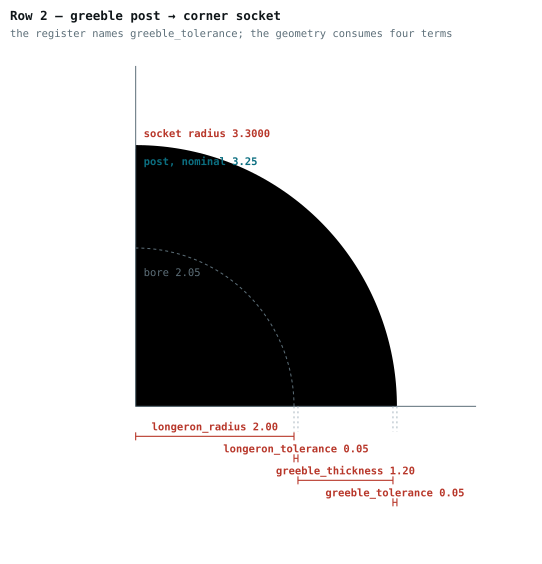
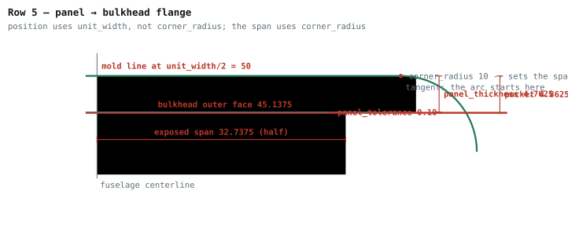

# The dimension scheme

*IP-FC-36. Written 2026-08-21.*

Which dimensions a generated drawing carries, and how to know the set is complete.

[OQ-ARCH-7](../architecture/freecad_migration.md#open-questions) decided the shape of this on
2026-08-07: **dimension the interfaces first, grow into a full parameter-driven scheme second.**
It named one prerequisite — *"agreement on what belongs to the interface"* — and assigned it to
`doc/architecture/overview.md`, which does not exist. This document supplies that agreement
from the design authorities that do exist, so the prerequisite is met by enumeration rather
than by waiting.

## 0. Who the drawing is for

Stated 2026-08-22, and everything below is judged against it:

> **The drawing user wants to understand the impact of the part design on their integration
> with the structure.** What size longerons are used, and what are the tolerances on that
> dimension? What size panels, and what are its tolerances? What size bolts and bolt anchors?
> What is the interior dimension of the structural cell — the bulkhead interior aperture? How
> much volume does each part use, which translates to mass?

**This is an integration drawing, not an inspection drawing**, and the distinction is not
cosmetic. An inspector wants the feature as built — the 4.10 mm bore. An integrator wants the
hardware the feature is cut for — the 4.00 mm longeron and the 0.10 mm of clearance. The design
puts the whole fit clearance inside the mating face, so those are different numbers *by
construction*.

**[OQ-DES-D2](#open-questions) decided how one annotation carries both, on 2026-08-22: the
dimension gives the feature as built and a callout beside it names the hardware.** So the bore
reads `⌀4.10 BORE / FOR ⌀4.00 LONGERON / 0.10 DIA CLEARANCE`, and the two numbers cannot drift
apart because both come from the same expression.

Two of the five questions above are not answered by any dimension as the rule stood, because
the cell aperture is a hole nothing in the model mates with and material is not a distance at
all. **[OQ-DES-D3](#open-questions) decided both on 2026-08-22**: the aperture *is* a dimension
— the span between two real interior faces — so the rule gains a clause for it below, and
volume goes in a data block rather than being annotated at all.

**Panel dimensions are a stated requirement, 2026-08-22**, and they reach further than the
frame. Panels are to be given their own OML allocation with panel shapes designed inside it, so
that designs can be interchanged. Every boundary of that allocation is determined by the frame
and verified, and it is in §2's register — including the length, which is the full bay: the
bulkhead is cut back by exactly the panel pocket so the panel runs over it unbroken.
**[OQ-DES-D4](#open-questions) decided on 2026-08-22 that the OML itself becomes a part**, so a
candidate panel can be checked against it by containment rather than against transcribed
numbers.

---

## 1. The membership test

A part has hundreds of dimensionable edges and a useful drawing carries a dozen. The question
is not "which are interesting" — that is taste, and taste does not scale to 576 variants.

> **A dimension belongs to the interface set if another part's geometry depends on it, or if
> it bounds a space the airframe encloses.**

That is mechanical, not aesthetic. It also has a convenient property in this project:
**the clearance parameters already enumerate the joints.** Every entry in
`design_constants.json`'s `tolerances` group exists because two parts meet somewhere. There are
seven, and there are seven joints.

**What section 2 is, decided in [OQ-DES-D9](#open-questions) on 2026-08-28: it is an analysis
of the implementation, not a specification the implementation is built to.** The sentence that
stood here until then said the register *"is a reading of a file the sweep already validates on
every run"*, and that is true of three of its rows. Measured 2026-08-28, `design_constants.json`
carries a governing expression in its `why` field for **three of the seven joints** —
`boom_tolerance`, `cowl_flange_tolerance` and `nose_flange_tolerance`, which rows 6, 7 and 8
quote verbatim. For the other four the `why` is prose: rows 2, 3 and 5 faithfully reproduce that
prose, and **rows 1 and 4 carry expressions that appear in no design document at all** — they
were written by reading the parts. Not one term of rows 1 to 5's expressions appears in the
corresponding `why`.

So the register's authority is the geometry, and **where the register and a part disagree, the
part is right and the register is corrected.** That is what makes
[OQ-DES-D8](#open-questions) a transcription fix rather than a defect in every corner.

**This is a statement of what the document is, not of what the project needs.** What is needed
is a derivation of the fundamental design relationships, written so that the implementation —
the OpenSCAD geometry, together with the corrections the FreeCAD migration turned up — *follows
from* it. **That document was written on 2026-08-28 under IP-FC-87 and is
[design_basis.md](design_basis.md)**, which holds the argument.

**The requirements themselves are stated in
[system_requirements.md](system_requirements.md)**, written 2026-08-29 — each once, with its
parent, its verification method, and whether that verification has been run. Two groups of it
come from this document. **The ten joints this section's register enumerates are `INT-1` …
`INT-10` there**, in the same order, so a row of the register and a requirement now share an id.
And **section 5.2's five hard constraints are `DRW-1` … `DRW-5`**, with the rest of section 5 —
the fail-loud rule, determinism, the independent checker — as `DRW-6` through `DRW-8`, and
section 3's completeness test as `DRW-12`. Section 5.3's soft costs are ranked preferences and
are deliberately **not** requirements.

**The architectural requirements are a separate document and a separate level**, adopted into
this repository on 2026-08-29 under OQ-DES-DB5 as
[doc/architecture/requirements.md](../architecture/requirements.md). An architectural
requirement constrains any compliant implementation; a design requirement constrains this one.
Together they are the prerequisite
[OQ-ARCH-7](../architecture/freecad_migration.md#open-questions) named — *"agreement on what
belongs to the interface"* — with the architectural half in `doc/architecture/` and the design
half here.

**What that changes for this section, and what it does not.** No reading of the register
establishes that a part is built as intended; it establishes that a drawing states what the
part measures, which is what it is for. The other claim now has somewhere to be made: the
derivation states each relationship as a requirement and checks it, over every variant for the
parameters and by sample for the faces. Where the two disagree the derivation is the one that
says a part is wrong — and where it and the register disagree, as they did over row 4, the part
settles it.

**The second clause was added on 2026-08-22 and it is deliberately narrow.** The first clause
is a test about *joints*, and it misses the one thing that decides whether anything fits inside
the airframe: the bulkhead's interior aperture. Nothing in the model mates with that opening —
it is what is left after the ring and the webs — so the joint test cannot see it, while a
battery, a wiring loom, a servo and a hand with a nut driver all depend on it and none of them
is a part in this model.

The clause is a **closed list, not an open invitation**, and that is what keeps the completeness
test a lookup rather than a judgment. It admits exactly the enclosed span of each part that has
one, by name:

| Part | Enclosed span | Value at 1U, 3/16 in |
| --- | --- | --- |
| frame bulkhead | `unit_width − 2·(panel_thickness + panel_tolerance) − 2·flange_thickness` | 87.875 |
| boom bulkhead | `unit_width − 2·(panel_thickness + panel_tolerance) − 2·web_width` | 78.275 |

Both are the distance between a real pair of parallel planar faces — 247.3 mm² each on the
frame bulkhead, 93.7 mm² on the boom — so each dimensions like any other and needs no new
convention. The last term differs because the ring's inner boundary is set by the flange on a
frame bulkhead and by the web on a boom bulkhead.

**On a boom bulkhead the span and the clear opening are two different numbers.** The span
between the interior faces is 78.275 both ways; the clear opening is 78.275 × 66.402, because
the boom collet intrudes from one side. The dimension is the span, and the obstruction is
visible in the view — but a reader asking "what fits through" has to look at the view and not
only at the number, and this is the one part where those differ.

---

## 2. The interface register

`U` is the size multiplier, `w` is `extrusion_width`, `n_p` is `cowl_n_perimeters`.

**The carried-by column names a part, and where a joint belongs to one *type* of a
part it names the type.** Row 7 reads *cowling bulkhead* rather than *bulkhead*,
decided in [OQ-DES-D6](#open-questions) on 2026-08-28: the cowl flange is a
`linear_extrude` whose height is zero on the end and interconnect types, so it is
not a feature those parts have, and section 3 was obliging their drawings to state
`cowl_n_perimeters` — a parameter that is not even a row on their parameter sheet.
An obligation no correct drawing can discharge costs the completeness test its
meaning.

| # | Joint | Governing expression | Clearance | Carried by |
| --- | --- | --- | --- | --- |
| 1 | longeron tube → corner bore | bore radius = `longeron_radius + longeron_tolerance`; lead-in chamfer = `w` | `longeron_tolerance` 0.05 | corner |
| 2 | bulkhead greeble post → corner socket | socket opened out by the clearance; **post stays nominal** | `greeble_tolerance` 0.05 | corner |
| 3 | corner seating faces → bulkhead | `flat_x += corner_tolerance`, `flat_offset += corner_tolerance·√2` | `corner_tolerance` 0.0 | corner |
| 4 | panel → corner | seat at `corner_radius − panel_thickness − panel_tolerance`, a rebate `panel_thickness + panel_tolerance` deep from the mold line; end stop at `panel_offset − panel_tolerance`; extension `panel_overlap + panel_offset` | `panel_tolerance` 0.1 | corner |
| 5 | panel → bulkhead flange | standoff so the panel's outer surface lands on the mold line at `corner_radius` | `panel_tolerance` 0.1 | bulkhead |
| 6 | boom tube → boom bulkhead collet | `collet_radius = boom_diameter/2 + boom_collet_thickness + boom_tolerance` | `boom_tolerance` 0.2 | bulkhead |
| 7 | cowl → cowling bulkhead flange | flange outer radius = `corner_radius − n_p·w − cowl_flange_tolerance`; flange height `2·U` | `cowl_flange_tolerance` 0.2 | cowling bulkhead |
| 8 | nose closure → cowl shell | base offset = `n_p·w + nose_flange_tolerance` | `nose_flange_tolerance` −0.1 | nose closure |
| 9 | nose plate → nose closure | pocket radius = `plate_diam/2 + plate_tol`, relieved at `overhang_angle_from_bed` | `plate.tolerance` 0.1 | nose closure |
| 10 | bolt or insert → bulkhead | `bolt_offset = 8·U` on the diagonal; `bolt_radius` = `diameter/2`, or the insert bore from [`threaded_insert_dimensions.csv`](../../src/Fuselage/tools/threaded_insert_dimensions.csv) | — | bulkhead |

**Row 4 was corrected on 2026-08-28, and it was not a wrong requirement — it was not a
requirement at all.** It read *"slot `2·panel_thickness + 2·panel_tolerance` deep"*, which is
the size of the **cutting primitive**: the square is drawn twice the pocket tall so that it
overshoots the material, and twice the overlap long so it opens through the end of the arm. The
material it is cut from ends at the mold line, so what is left is a rebate
`panel_thickness + panel_tolerance` deep with the panel's outer face exposed. Measured on the
built corner at 1U with a 3/16 in panel: the seat is a face at 5.1375 of 486.2500 mm², which is
`panel_overlap + panel_tolerance` times the part length, and no material stands outboard of it.

**An overshoot is an implementation artifact, and this one is sized from the feature it cuts**,
which is why it scaled convincingly across 264 variants and got recorded here as the joint's own
dimension. [design_basis.md section 7](design_basis.md#7-what-is-neither-implementation-artifacts)
states the rule that keeps the two apart and lists the artifacts the project already handles
correctly; IP-FC-88 is the change that stops this one reading like a design quantity. The
register carries **requirements**, so what belongs in this row is the rebate.

### The panel allocation, which joints 4 and 5 pin without stating

Panel dimensions have to be on the drawings, and the frame determines all of them. Joints 4 and
5 give the *interface* — the slot, the seat, the clearance — but not the panel's own size, and
the panel's own size is what a panel designer needs. It falls out of the same parameters:

| | Expression | At 1U, 3/16 in |
| --- | --- | --- |
| width, corner to corner | `unit_width − 2·(corner_radius + panel_offset)` | 75.000 |
| exposed span between corners | `width − 2·panel_overlap` | 65.475 |
| entry into each corner | `panel_overlap` | 4.7625 |
| thickness | `panel_thickness` | 4.7625 |
| pocket it seats in | `panel_thickness + panel_tolerance` | 4.8625 |
| inner face, from the airframe axis | `unit_width/2 − panel_thickness − panel_tolerance` | 45.1375 |
| outer face | the mold line, `unit_width/2` | 50.000 |
| length along the bay | `unit_length`, the full bay | 100.000 |

**The width expression is confirmed by a clearance, not by a face, and that is the stronger
check.** Take the panel to be 75.000 wide and its edge lands at corner-local x = −2.5000
against a slot bottom at −2.4000. The gap is 0.1000 — `panel_tolerance` exactly. No other width
fits the slot the corner was actually cut with.

**The panel runs the full bay length, and the bulkhead is cut out to let it.** That was settled
on 2026-08-22 and the geometry states it twice over. The bulkhead's outer profile sits at
45.1375 from the airframe axis, which is 4.8625 inboard of the mold line — exactly
`panel_thickness + panel_tolerance`, the panel pocket. And one of its outer flat faces measures
**392.850 mm²**, which is `65.475 × 6`: the panel's exposed span times the bulkhead thickness.
So the bulkhead's outer flat face *is* the panel's seating surface, cut back by precisely the
panel it seats and running precisely as far.

That is the reason a panel is not interrupted at a station: the bulkhead gives way to it rather
than the other way round. `unit_length − 2·bulkhead_thickness` = 88.000 was the alternative
reading, and it is wrong.

**The envelope becomes a part**, decided in [OQ-DES-D4](#open-questions) on 2026-08-22, so a
candidate panel design is checked against it by containment rather than by someone comparing it
against the expressions above.

### What the assembly drawing carries

Stated 2026-08-22, and it is a requirement rather than a preference: **the assembly drawings
show the projection of the panel and the corner onto the bulkhead top view.** On that view,

- the **panel width** and the **panel thickness** are dimensions;
- **`panel_tolerance`** and **`corner_tolerance`** are dimension callouts.

The bulkhead top view is the right carrier for this and not an arbitrary choice: it is the one
view where all three parts appear in the same plane. The bulkhead's outer flat face *is* the
panel's seating surface, and the corner's panel extension lands on that same view as a real
feature — the corner's extension face sits at 32.7375 from the airframe axis and the bulkhead
has a face there too. So the projection is of parts that genuinely share the plane rather than
a construction.

**The `corner_tolerance` callout will read 0.00, and that is the point of putting it there.**
[OQ-DES-C5](corner.md#open-questions) resolved on 2026-08-14 by creating the parameter and
holding it at 0, and recorded the residual plainly: *"if these faces are bonded, 0 leaves no
bond line."* A callout naming the clearance and showing 0.00 puts that in front of whoever is
assembling the airframe. This is **not** §2's structural-zero case — the joint exists and the
clearance was chosen — so the rule about omitting a dimensioned zero does not apply, and
omitting it would hide a live question rather than avoid a false claim.

### Three things the drawing has to say that a dimension alone does not

**Which part carries the clearance.** Joints 2 and 3 are both carried *entirely on the corner*
— the bulkhead re-evaluates the same shape and passes 0, so the joint takes the clearance once.
A drawing that dimensions both sides at nominal is not wrong about either part and is wrong
about the joint. An inspector measuring the bulkhead's post against a drawing that showed a
clearance would reject a good part.

**Which zeros are structural.** `panel_tolerance` is 0 on a cowling bulkhead and on the 0 mm
panel variants; `cowl_flange_tolerance` is 0 on every non-cowling type; `plate.tolerance` is 0
on `tail_high_open`, where the plate is inactive. **These are not settings at their minimum —
they are the absence of the joint.** A generated drawing must omit the dimension, not print
`0.0`, because a dimensioned zero asserts a coincident fit that was designed and inspectable,
and here there is nothing to inspect.

**Which constraint governs, when more than one can.** The corner's flat face is

```
flat_offset = -max(longeron_radius + longeron_tolerance + longeron_chamfer,
                   (panel_overlap + panel_offset) - (corner_radius - panel_thickness - panel_tolerance))
```

— a two-sided constraint. The face must clear the longeron bore *and* sit outside wherever the
panel interface has been pushed to, and **whichever binds, wins**. Which one binds changes
across the family. OQ-ARCH-7 chose a family drawing with a per-variant value table, so the
table carries the number; the note has to carry *which term produced it*, or a reader takes the
wrong design intent away from a correct number.

---

## 3. The completeness test

> **The set is complete when, for every entry in `design_constants.json`'s `tolerances` group,
> the drawing carries every dimension that entry's expression consumes — and, for a part that
> encloses a space, the span §1 names for it.**

Mechanical, and checkable against a file that already exists and is already validated —
`load_constants()` refuses a missing name and refuses an unrecognized one, so the group cannot
silently drift out from under the test.

The second clause was added with §1's on 2026-08-22 and costs the test nothing, because §1's
list is closed: two parts have an enclosed span, both are named there with their expressions,
and a part not on that list is not asked for one. What the clause buys is that a bulkhead
drawing missing its aperture now *fails* the test rather than passing it.

Worked: joint 7's expression consumes `corner_radius`, `n_p`, `w` and `cowl_flange_tolerance`.
The drawing carries the resulting flange radius and the clearance. `n_p·w` is the radial room
the **cowl's** wall occupies, so a drawing of the *bulkhead* that dimensions the flange without
saying what the subtraction is for leaves its most important number unexplained — the reason
the flange is where it is lives in another part.

> **A fourth gap, and it is larger than the three below.** Measured on the built
> parts on 2026-08-22, **6 of 22 interface parameters exist as a distance anywhere
> on their own part** — and one of those six is a value-matching coincidence. The
> rest are off by exactly a clearance, because §2's own principle puts the whole fit
> clearance inside the mating face. So "carries every dimension the expression
> consumes" is not satisfiable by dimension *lines*, and
> [OQ-DES-D2](#open-questions) settled what satisfies it instead: the dimension
> carries the feature and its callout carries the parameter, so the sheet states
> both and the test reads the pair rather than the dimension alone.

**Three known gaps in the test, stated rather than left to be discovered.**

1. **Joint 9's clearance is not in the group.** `plate.tolerance` lives in the per-cowl-type
   parameter files. That is defensible and follows the structural-zero pattern — it is 0.1 on
   `nose_round_plate` and 0 on `tail_high_open`, where there is no plate — but it means the
   test must read the cowl type files too, not only `design_constants.json`.
2. **Joint 10 has no clearance parameter at all.** A bolt through a hole and a heat-set insert
   in a bore are different fits, and neither is named. The insert bore comes from
   `threaded_insert_dimensions.csv`, which is the authority for insert geometry and must not be
   re-derived; the bolt clearance is not written down anywhere.
3. **`corner_tolerance` is 0 and its own note flags why that may be wrong.** [OQ-DES-C5](corner.md#open-questions)
   resolved on 2026-08-14 by creating the parameter and holding it at 0, which is what every
   flown part was built at. The entry records the residual plainly: *"if these faces are bonded,
   0 leaves no bond line."* That is the same question [OQ-DES-CW10](cowl.md#open-questions)
   answered for the nose base joint on 2026-08-21, and it is unanswered here. **A drawing
   generated today will dimension a zero-clearance fit that may be a bonded joint.**

---

## 4. Internal structure is reference geometry

OQ-ARCH-7 chose alternative 3 first: **dimension the interfaces, show internal structure as
non-dimensioned reference geometry.** Nothing in this document reopens that.

The reasoning is worth restating because it is easy to read as a shortcut and it is not one.
Internal structure here — webs, fillets, greeble nubs, buttress ramps — is **derived**, not
chosen. `web.fillet_radius` is `2·U`, `bulkhead_flange.chamfer` is `1·U`,
`plate.thickness` is `ceil(4·U)·layer_height`. Dimensioning a derived quantity on a drawing
duplicates a formula that already exists in one place, and a duplicate that can disagree is
worse than an absence. The variant table carries the value; the formula stays in
`derived_parameters()`.

**What promotes an internal dimension to the interface set** is the membership test in §1 and
nothing else: another part's geometry coming to depend on it. That is not hypothetical —
`n_p·w` began as a property of the cowl's wall and now sets the *bulkhead's* flange radius
(joint 7), and the same count reaches the nose closure's base offset (joint 8). When that
happens the dimension moves into the register and the drawing gains it.

---

## 5. Placing the dimensions

Knowing *which* dimensions to carry is half the problem. A drawing whose dimensions overlap
each other, sit on top of an edge, or run off the sheet is not a drawing — and unlike a wrong
model, nothing downstream catches it. It renders, it exports, it prints, and then someone reads
`12.5` as `12.6` and makes a part.

**These cannot be hand-placed.** Placement has to be a rule set with a machine-checkable
outcome, for the same reason the rest of this project's decisions are: taste does not survive
regeneration.

### 5.1 Two products, and only one of them is solved once per family

[OQ-ARCH-7](../architecture/freecad_migration.md#open-questions) chose **lettered callouts plus
a per-variant value table**, and that choice does most of the work here: the letters are placed
once against the drawn representative view, and the table carries the numbers. One solve per
drawing, not 576.

**[OQ-DES-D1](#open-questions) added a second product on 2026-08-22, and it does not inherit
that property.** Alongside the family sheets the build emits **single-variant drawing sets**,
keyed on `U` and panel thickness — **72 sets of 11 drawings**, each drawing its own file, the files of a set collocated
so the set can be delivered together. A set holds every part needed to build a fuselage at that
size and panel, **including the whole `FX` range** — but `FX` is carried by a table rather than by
six corner sheets, because with `U` and panel fixed exactly one dimension moves with it. Those 792
sheets carry values on the view rather than callouts, so each is placed on its own: **792 solves,
not one**. That is affordable — the solver is
arithmetic over a dozen rectangles — but it is a different claim from the one this section
opened with, and the difference is load-bearing for §5.2's extent bound.

**The family table is factored by axis**, per OQ-DES-D1: one short table per size axis rather
than one row per variant, plus a small matrix for each field that follows two axes. What makes
that possible is measured rather than assumed — asking, for each dimension, which axes it is
actually a function of over the whole family.

**But the family must be partitioned by topology, not by size.** A no-panel variant and a
panelled one cannot share a sheet, because a callout pointing at a feature that is not there is
worse than no drawing at all — the reader trusts it. This is §2's structural-zero rule
reappearing at the sheet level: where a dimension is absent because the *joint* is absent, that
is a different drawing, not a blank cell in the table. Size, by contrast, changes only the
values, which is exactly what the table is for.

### 5.1a What the partition and the factoring actually come to

Both were estimated when OQ-DES-D1 was filed and both are now computed, by
[`drawing_families.py`](../../src/Fuselage/tools/drawing_families.py). **Three of the numbers
the question was decided on were wrong, and none of them reverses the decision** — the
factoring works better than claimed, not worse. They are corrected here because a reader
otherwise takes the estimates for measurements.

| | Filed as | Measured 2026-08-22 |
| --- | --- | --- |
| Family sheets | 18 | **13** |
| Fields needing two axes | 2 | **5** |
| Rows an ANSI A sheet holds | "about 25" | **19** |
| Families that overflow one sheet | 12 of 18 | **0 of 13** |

**Thirteen sheets rather than eighteen, because two type axes are not topology.** The
partition is taken from the *features a resolved part has*, not from the names on its type
axis, and two distinctions that read as separate parts are not. `end_bolt` and `end_anchor`
reach the same OpenSCAD module with the same arguments and differ in exactly one number —
`bolt_hole_radius`, 1.95 mm against 1.50 mm at `U` = 0.5 — so under §1 they are one part in two
sizes. `offset_single` and `dual` likewise: the boom bulkhead has no mirrored second boom, and
the two differ only in where the single boom sits. The cowling types account for the rest, and
for a different reason: `bulkhead_validity_check` refuses a cowling row with a panel, so a
panelled cowling family does not exist to be drawn.

**Five coupled fields rather than two, and the three new ones are the same finding.** Demoting
a type axis from a sheet to a table column is what makes `bolt_hole_radius`, `boom_y_position`
and `boom_z_position` follow two axes — they were single-axis while the type was a sheet, and
they are `U` × type now. The original two, `panel_offset` on `U` × panel and `unit_length`
(the corner's bay length) on `U` × `FX`, are unchanged.

**Nineteen rows rather than about twenty-five, because the sheet was measured.** The column a
value table gets is the frame's top edge down to the title block — 139.0 mm on the pinned ANSI
A landscape template — and at the 7.0 mm row pitch the drawing standard used then, that is 19
rows. [OQ-DES-D5](#open-questions) later gave the table its own 2.5 mm text at ISO 3098's
1.4 h line spacing, and moved it beside the title block; the figures in this section are left
at the size and placement they were measured on. The
"about 25" was a guess at a sheet nobody had opened.

**Every family fits down the page, and five of them fit exactly.** What closes the gap is that
tables sharing a leading axis are **one block**, not several: a `U` table and a `U` × panel
matrix put the same eight values of `U` down the left, so printed separately that column is
printed twice. Merged, the single-axis fields are ordinary columns and each coupled field is a
band of columns inside the same table. The panelled corner then costs a 10-row `U` block and a
9-row panel block — 19 of 19, with **nothing spare**. That is a fit in the arithmetic and not on
paper: one more dimension, one more panel stock, or a title row above the table puts them on a
second sheet.

**Across the page it did not fit, and the reason was the layout rather than the factoring —
[OQ-DES-D5](#open-questions), decided 2026-08-22.** The rows were the only budget the factoring
was ever checked against. Measured, the table as first laid out cost **a third of the frame**;
compacted and packed abreast it costs **a ninth**, printing the same values.

**So the row figures above are an artifact of stacking the blocks**, and so is the budget they
were measured against. Packed abreast the panelled corner costs **10 rows, not 19** — and under
the decided layout the table sits *beside* the title block rather than above it, so the budget
is the band's depth rather than a full column. At the table's own 2.5 mm text and ISO 3098's
1.4 h line spacing the band holds **13 rows**, and no family needs more than 10. The figures in
the table above are left as they were measured, because they are what OQ-DES-D1 was decided
against; the sheet is laid out to OQ-DES-D5.

### 5.2 Hard constraints — violation fails the build

Every one of these is checkable on the produced drawing. None is a preference.

**These are `DRW-1` … `DRW-5` in
[system_requirements.md section 6](system_requirements.md#6-drawing-requirements)**, where H1 is
DRW-1 and so on in order. They were unnumbered here until 2026-08-29, and a hard constraint that
fails the build is a requirement whether or not it has an id.

| | Constraint | Why it is hard rather than soft |
| --- | --- | --- |
| **H1** | **Containment.** The full extent of every dimension — text box, dimension line, arrowheads, witness lines, any leader — lies inside the view frame and inside the sheet's printable area. | A dimension partly off-sheet is not a dimension. |
| **H2** | **Text does not touch text.** No two dimension text boxes intersect, and the clear gap between them is at least one text height. | A smaller gap reads as a single block of digits. |
| **H3** | **Text does not touch geometry.** No text box intersects a visible edge, a hidden edge, a centre line, or a hatch region. | Text over a line is the most common way a digit is misread. |
| **H4** | **A witness line does not cross a dimension line.** Crossing another *witness* line is conventional and permitted. | At the crossing the reader cannot tell which extension belongs to which measurement. |
| **H5** | **No structurally-zero dimension is placed at all.** | §2. A dimensioned zero asserts an inspectable coincident fit; where the joint is absent there is nothing to inspect. |

**How an annotation's extent is known, since nothing headless renders it.** H1, H2 and H3
all test the rectangle an annotation occupies. Measured 2026-08-21 under `freecadcmd`
([`spike_techdraw.py`](../../src/Fuselage/freecad/spike_techdraw.py)): the dimension line
reads back exactly, but `getArrowPositions()` returns the origin for both arrowheads, and
no call reports the text's rendered width — both are computed by the GUI-side view
provider. **On a family sheet, §5.1 is what makes this a bound rather than a problem.** The text on such
a view is a single lettered callout, so the set of strings the drawing can contain is 26 items
known before any variant is built. Measured across the three candidate fonts at a 3.5 mm text
height, a capital spans 0.772 mm (`I` in osifont) to 3.461 mm (`W` in DejaVu Sans), and the
worst spread for any one letter is 1.270 mm. So **every callout is bounded by the widest
letter in the widest font**, and because they are all the same length that bound is uniform
— it shifts the layout without distorting it, which a bound on variable-length value text
would not. Arrowheads take a fixed multiple of the text height, being identical on every
annotation. Witness-line extent is exact, from `getLinearPoints()` and the referenced
points.

**Single-variant sheets do not get that bound, and must not be given it.** Their views carry
the value rather than a letter — `112.50 mm` is 5.3 times the width of `W`, and value strings
differ from one another — so there is no uniform number that is both safe and useful. Their
annotation widths are **measured exactly** from the pinned font instead, which costs a lookup
per string and is what [OQ-ARCH-18](../architecture/freecad_migration.md#open-questions)
recommended before it was withdrawn as unnecessary for the product that existed then. The two
products place under two extent models and collapsing them into one would silently mis-size
every annotation on 792 sheets.

Two conditions ride on the callout bound and neither is automatic. **The font and its size must
be project data** — TechDraw's preference groups are empty, so today the text is drawn with a
compiled-in default a user setting can silently change, and a bound taken from a font the
reader's machine does not use is not a bound. And **the value table is not covered by
it**: its columns hold variant values, whose widths do vary. That is a grid-sizing problem
— each column as wide as its widest cell — and not the collision problem this section is
about, but it is the one place on the sheet where value text still has to be measured.

This was filed as a blocking open question (OQ-ARCH-18) and withdrawn on 2026-08-22: the
question had measured `20.00 mm` and `112.50 mm`, which §5.1 had already moved off the view.

### 5.3 Soft costs, minimized in this order

1. **Nest by magnitude — smaller dimensions inboard, larger outboard.** This heads the list
   because it is not aesthetic: it is the arrangement under which witness lines do not *need*
   to cross dimension lines, so it is what makes **H4** satisfiable rather than a constraint to
   fight. Get this wrong and the solver spends its effort escaping a problem it created.
2. **Fewest witness-line crossings with geometry edges.**
3. **Fewest lanes.** Dimensions sharing an offset share a lane; fewer lanes means shorter
   witness lines and a tighter drawing.
4. **Text nearest the feature it dimensions**, subject to everything above.
5. **Balance across the sides of the view**, rather than stacking on one.

### 5.4 Two numbers, and everything else derived

Lanes are regular: the first dimension line stands off the outline by a gap `g`, and successive
lanes are spaced by `s`. **`g` and `s` are the only tunables in the whole placement scheme** —
every other position is derived from the geometry, the lane index, and the rules above. Keeping
it to two is deliberate and follows the same reasoning as the interior surface's single
tolerance ([cowl_interior_surface.md §5](cowl_interior_surface.md)): a scheme with a dozen
knobs is a scheme nobody can reason about, and the knobs get tuned per drawing until the rules
no longer mean anything.

Both scale with text height, not with `U`. The reader's eye does not get bigger when the part
does.

### 5.5 Determinism

**The same family produces byte-identical placement on every run.** No unseeded randomness, no
dependence on dictionary or set iteration order, and every tie broken by a stated total order —
callout letter is the obvious one.

This is not fastidiousness. A generator whose output moves between runs makes *"did this
drawing change?"* unanswerable, and a drawing set that cannot be diffed cannot be reviewed. The
same problem already bites elsewhere in this project: OpenSCAD emits the same mesh with a
different facet order on every run, so STL bytes are not a comparison basis on that path. Do
not introduce a second instance of it somewhere a human is the consumer.

### 5.6 Fail rather than emit an unreadable drawing

If the hard constraints cannot all be satisfied, **the build fails and names the dimensions
that could not be placed.** It does not relax a constraint, shrink the text, or emit the
overlap.

The escape hatch when a view genuinely cannot hold its dimensions is to **split the view or add
a detail view** — a drafting decision, made deliberately — not to accept a worse drawing.

**The checker is independent of the placer.** It reads the produced drawing, re-derives every
constraint in §5.2 from the placed annotations and the projected geometry, and fails on
violation. Independent because a placer that certifies its own output has only proved it is
self-consistent, which is not the claim anyone needs.

### 5.7 What to test it against

Not "does it look right". Every constraint in §5.2 is machine-checkable, so the acceptance test
is that the checker passes over a corpus — and the corpus is chosen for difficulty rather than
for coverage:

- **The smallest variant**, where there is least room and the drawing is densest.
- **The largest**, where witness lines are longest and containment binds first.
- **Each topology class** — no-panel, anchor versus bolt, cowling versus not — since §5.1 makes
  each of these a separate sheet, and the sparse ones are where a stale callout would survive.

- **A single-variant sheet at the largest `U`**, where the annotation text is widest — the one
  case the family sheets cannot exercise at all, since their views carry one letter regardless
  of variant. Measured 2026-08-22: the dense twelve-dimension case places in four lanes as both
  products, at 2.66 mm annotation width as a family sheet and 5.75–9.22 mm as a single-variant
  sheet, so widening the text cost no lane. That is the current state and not a guarantee —
  it is exactly the measurement to repeat when the dimension set grows.
- **A corner sheet from a single-variant set**, which is the only case that mixes both extent
  models on one sheet — measured values everywhere and one lettered callout for the `FX`-tabled
  length. It places clean in four lanes, with the tabled length taking the outermost lane on its
  own because it has the widest span. A sheet carrying only one kind of annotation cannot catch
  a bound applied to the wrong kind.

Sweeping the size axis alone will not reach the cases that break this. The topology boundaries
have to be walked deliberately, from both sides.

---

## 6. Scope

This document owns the enumeration (§2), the completeness test (§3), the reference-geometry
rule (§4), and the placement rules and their acceptance test (§5).

It does not own sheet size, title block, projection convention (first or third angle), line
weights, or standards compliance — none of which are decided.

**§1 and §2 are a placeholder for a section of a document that does not exist.** OQ-ARCH-7
assigns interface conventions to `doc/architecture/overview.md`. When that is written they
belong in its interface-conventions section, and what stays here is the drawing-specific part:
§3's completeness test, §4's reference-geometry rule, and §5's placement rules.

## Open questions

| ID | Question | Blocking |
| --- | --- | --- |
| OQ-DES-D7 | The interface register's *Governing expression* column gives the whole size of a fit in some rows and only the clearance gap in others, and one automatic check reads them all the same way | Not blocking — no drawing changes under any answer. Three parameter names go undemanded, all three already printed on the sheets that owe them; two joints are covered only by coincidence |


### ~~OQ-DES-D1 — What carries the size variation, when the largest family is 384 variants?~~ — DECIDED 2026-08-22: factor the table by axis, and add a second product

**Chosen: alternative 2, plus alternative 5 as a companion rather than a competitor.**

**The family drawing factors its table by axis.** One short table per size axis with each callout
labelled by the axis it follows, plus a small matrix for each coupled field. The corner's 384-row
table becomes an 8-row `U` table, a 6-row `FX` table and an 8-row panel table — 22 rows — with an
8 × 6 matrix for `corner.length` and an 8 × 8 matrix for `panel.offset`. The measurement that
supports this is recorded in §5.1: across every part family in the sweep the entire coupled
surface is those two fields, and the two cowling bulkheads are coupled to nothing at all.

> **The counts in this note are the ones the question was decided on, and three of them were
> estimates that turned out wrong. §5.1a carries the measured figures** — 13 family sheets rather
> than 18, five coupled fields rather than two, and 19 rows to a sheet rather than about 25. The
> decision stands on all three: every family fits one sheet, which is more than the question asked
> for. The note is left as written because it records what was decided and why; §5.1a is where the
> numbers now live.

**And the build also emits single-variant drawing sets.** A set is keyed on **`U` and panel
thickness**, and it holds a drawing for every part needed to build a fuselage at that size and
panel — **including the whole `FX` range**, because a fuselage uses more than one bay length and
a set that carried only one would not be a build kit. Each drawing is its own file, and the files
of a set are collocated so the set can be delivered as a unit.

**`FX` is carried by a table, not by six corner sheets.** The corner is drawn once at `FX = 1.0`
and the dimensions that move with `FX` are tabled. That is not a compromise on this part, because
of how little moves: with `U` and panel fixed, **exactly one dimension varies with `FX`** —
`corner.length`, which is `100·U·FX` — `unit_length` is 100 mm at 1U, and it is the one standard value `FX` scales. The only other field that changes is `corner.FX` itself,
which is the axis parameter and not a dimension. Measured across `U = 0.5`, `1.0` and `4.0`; the
result is the same at each. So a corner sheet carries values everywhere and **one lettered callout
over a six-row table**, and a set holds 11 drawings rather than 16.

| | Family drawings | Single-variant sets |
| --- | --- | --- |
| Keyed on | topology (§5.1's partition) | `U` × panel thickness |
| Count | 13 sheets (18 as estimated; see §5.1a) | 72 sets |
| Contents | one part kind, all sizes in a table | 11 drawings: 1 corner (drawn at `FX = 1.0`, `FX` tabled), 5 bulkheads, 3 boom bulkheads, nose, tail |
| View carries | a lettered callout | the value, except where a dimension is tabled |
| Total sheets | 13 | 792 |

The five bulkheads and three boom bulkheads do **not** collapse the same way, and the reason is
not the one first given here. It is not that every type axis is topology — §5.1a measures that
two of them are not — but that a set is a **build kit**: `end_bolt` and `end_anchor` are two
parts a builder installs in two places, and they need two sheets whether or not their *family*
sheets merge. Sharing a family sheet and needing separate single-variant sheets are compatible,
because the family sheet carries a callout and the single-variant sheet carries the number.
11 is the floor, not a first cut.

**Why both, and why that is not redundancy.** They answer different questions. The family drawing
is the reference document: it shows that the scheme is complete, that a dimension is an expression
over parameters, and how a value moves with each axis — which is what a reviewer and a designer
need. The single-variant sheet is what a shop receives: one number per callout, no lookup, no
chance of reading the wrong row. Alternative 2's one real drawback was that a per-axis lookup asks
the reader to combine tables correctly; the second product removes that from the person least
placed to absorb it.

**A consequence that has to be carried, because it reverses a simplification.**
[OQ-ARCH-18](../architecture/freecad_migration.md#open-questions) was withdrawn on the grounds
that a view carries only a lettered callout, so every annotation is the same width and one
conservative bound covers all of them. **That reasoning holds for the family drawing and does not
hold for the single-variant sheet**, whose view carries the value: `112.50 mm` is 5.3 times the
width of `W`, and value strings differ from each other, so no uniform bound is both safe and
useful. This does not reopen the question — the measurement it asked for is available exactly as
it recommended, from the font file through `fontTools` — but the two products now place under two
different extent models, and that must not be quietly collapsed into one.

Measured rather than assumed: the dense twelve-dimension case places in four lanes both ways, with
annotation widths of 2.66 mm as a family sheet and 5.75–9.22 mm as a single-variant sheet across
the `U` range. Widening the text did not cost a lane, because lane assignment here is driven by
span nesting rather than by text collision. A corner sheet **mixes both** — ten measured values and
one tabled callout — and places clean in four lanes, with the tabled overall length falling to the
outermost lane on its own, since it has the widest span and §5.3's nesting rule puts it there.

**One thing the `FX` table demands that this document does not own.** A view drawn at `FX = 1.0`
with `corner.length` tabled is **not to scale for five of the six rows** — at `U = 1.0` the part
is 100 mm as drawn and 300 mm at `FX = 3.0`. Drafting standards require a not-to-scale dimension to
be marked, and this sheet has exactly one. Which convention marks it — an underlined value, a
general note, a symbol — belongs to the standards-compliance question §6 lists as undecided. It is
recorded here because the `FX` decision is what creates the requirement, and an unmarked
not-to-scale dimension on an otherwise true-scale sheet is a drawing that lies quietly.

**Alternative 3 was rejected rather than deferred**, on the reasoning given when the question was
filed: promoting a size axis to a sheet axis buys a fitting table by making the partition mean
nothing, and §5.1's rule is what lets a reader trust that a callout points at a feature the part
actually has.

*Implementation: IP-FC-21 (family drawings), IP-FC-84 (single-variant sets).*

### ~~OQ-DES-D2 — How does a dimension state a joint, when the reader is integrating rather than inspecting?~~ — DECIDED 2026-08-22: the dimension is the feature as built, and a callout beside it names the hardware

**Chosen: alternative 3.** A dimension gives the feature the way the part actually is, and the
callout beside it says what the feature is for:

```
⌀4.10 BORE
FOR ⌀4.00 LONGERON
0.10 DIA CLEARANCE
```

Both readers are served by one annotation, and the two numbers cannot drift apart, because the
callout and the dimension are generated from the same expression.

**Why the other three lost, which the drawings made plain in a way the prose had not.**
Dimensioning only the features as built states none of the three hardware sizes and not by
arithmetic either — the clearance is the term that would let a reader work backwards, and it
never appears on the sheet. Dimensioning the nominals instead, to the mating parts drawn as
reference geometry, states every hardware size and leaves every dimension disagreeing with the
part: a caliper on the bore reads 4.10 against a drawing that says 4.00. Moving the hardware
into a schedule beside the view works, and it costs table rows the sheets do not have — five of
the thirteen family sheets measure 19 of 19 available rows with nothing spare (§5.1a — under
OQ-DES-D5's layout every family measures 10 of 10, which is the same finding at a different
budget). The
callout costs nothing off the view.

**The risk this takes on, stated because it is real and not yet measured.** §5.2's hard
constraints are about the rectangle an annotation occupies, and a three-line callout is several
times a bare dimension's extent. Whether a whole part's worth of them places without collision
is measurable with what is already built — `drawing_standard.text_width_mm` measures arbitrary
strings from the pinned font — and has not been measured. **If they do not place, alternative 4
becomes the answer and the sheet size becomes the question**, which is the right order: a larger
sheet is a smaller decision than a drawing that does not say what it is for.

**A finding this surfaced that the decision does not fix.** The bolt hole is ⌀4.00 for a
nominal 4 mm bolt — a line-to-line fit with no clearance at all, because joint 10 is the one
interface in the register with no clearance parameter (§3, gap 2). What the callout does is
make that *visible*: it prints the fastener beside the hole, where a bare `⌀4.00` says nothing
and a reader has no way to notice the bolt will not pass.

*The alternatives as drawn are in
[`draw_dimension_alternatives.py`](../../src/Fuselage/tools/draw_dimension_alternatives.py),
which annotates the corner's mid-bay section four ways from geometry traced off the built
solid. Implementation: IP-FC-21.*

### ~~OQ-DES-D3 — The drawing's rule for what to dimension can only see parts that are in the model~~ — DECIDED 2026-08-22: the aperture is a dimension and goes on the drawings; volume goes in a data block

**The aperture span is a dimension, and it is worth having on the drawings.** It is not a
special case needing a new kind of annotation: it is the distance between two real, parallel,
planar faces, and it dimensions exactly like the bore or the panel pocket does.

Measured on the built parts to confirm that before generating it, because a dimension across a
bounding box that merely touches at some corner feature would not be one:

| Part | Interior faces | Area of each | Span |
| --- | --- | --- | --- |
| frame bulkhead | ±43.9375 in **both** axes | 247.3 mm² | **87.875** |
| boom bulkhead | ±39.1375 in both axes | 93.7 mm² | **78.275** |

**And it is an expression over the parameters, not a measurement** — which matters, because a
dimension bound to a measured face is bound to the topology, and IP-FC-5 established that face
counts move with `U`. Both check exactly against the faces above:

```
frame bulkhead   unit_width - 2*(panel_thickness + panel_tolerance) - 2*flange_thickness
                 100 - 2*(4.7625 + 0.1) - 2*1.2   = 87.875
boom bulkhead    unit_width - 2*(panel_thickness + panel_tolerance) - 2*web_width
                 100 - 2*(4.7625 + 0.1) - 2*6.0   = 78.275
```

The two differ in their last term because the ring's inner boundary is set by the flange on a
frame bulkhead and by the web on a boom bulkhead. That is a real difference between the parts,
not a naming inconsistency.

**A caveat the boom bulkhead needs and the frame bulkhead does not.** On a boom bulkhead the
span between the interior faces is 78.275 in both axes, but the *clear* opening is
78.275 × 66.402, because the boom collet intrudes from one side. The dimension is the span; the
obstruction is visible in the view. A reader asking "what fits through" needs to look at the
view and not only at the number, and on this part alone those are two different answers.

**What this changes in §1.** The membership test was *dimension it if another part's geometry
depends on it*, which is a test about joints. The aperture has no joint — nothing in the model
mates with it — and everything the airframe carries depends on it. The rule gains a second
clause and stays closed rather than open-ended: the enclosed span of each part that has one, by
name, so the completeness test remains a lookup rather than a judgment.

**Volume goes in a data block.** Either a data area or a callout was acceptable; the block is
chosen because a callout points *at* a feature and volume is a property of the whole part, so a
leader would have nothing to land on. It carries the solid volume and the wall area, which are
the two numbers that let a reader work out material for their own slicing — and neither of them
depends on a slicing choice, which is what makes them safe to print. **Mass stays off**: it
needs a filament density and the reader's perimeter count, and the design constrains neither.

On a single-variant sheet the block is three lines. On a family sheet, volume and wall area vary
with every size axis, so they become two more columns in the factored tables — which costs sheet
*width* rather than rows, and width has not been budgeted the way §5.1a budgeted rows.

*Implementation: IP-FC-21.*

### ~~OQ-DES-D4 — Panels are to get their own OML allocation, and nothing in the model owns one~~ — DECIDED 2026-08-22: the panel OML becomes a part

**Chosen: the allocated envelope itself becomes a part, and panel designs are then made to fit
within it.** That is not one of the four alternatives as filed — those offered a derivation, a
*panel* part, a data file, or nothing — and it is better than any of them for one reason: an
envelope that is a part can be checked against **geometrically**, by containment, rather than
by a person comparing a candidate against numbers somebody transcribed. Interchange is the
stated purpose, and a containment test is what interchange actually needs.

It also keeps the panel itself out of the printed-part pipeline, which was the real cost of
making the *panel* a sweep part: a panel is cut sheet, not a print, and it does not fit the
assumptions the rest of the sweep carries. The OML part is not a manufactured object at all —
it is the space a panel is allowed to occupy.

**The envelope is complete and every boundary of it is verified.** All of it is in §2's
register, and each figure is an expression over parameters that a built face confirms:

| | Expression | At 1U, 3/16 in |
| --- | --- | --- |
| width, corner to corner | `unit_width − 2·(corner_radius + panel_offset)` | 75.000 |
| exposed span between corners | `width − 2·panel_overlap` | 65.475 |
| entry into each corner | `panel_overlap` | 4.7625 |
| thickness | `panel_thickness` | 4.7625 |
| pocket | `panel_thickness + panel_tolerance` | 4.8625 |
| inner face from the airframe axis | `unit_width/2 − panel_thickness − panel_tolerance` | 45.1375 |
| outer face | the mold line, `unit_width/2` | 50.000 |
| length along the bay | `unit_length`, the full bay | 100.000 |

**A claim made twice while this was open, and wrong both times.** It was asserted here that the
four faces of a bay are not alike — that a boom passes through one and a cowling station closes
an end. Neither holds, and both were checked only after being written down:

- **The cowl closes an end of the airframe**, perpendicular to the fuselage axis. It never
  touches a side face where a panel sits. That was a confusion between the end of the fuselage
  and a face of a bay.
- **The boom runs parallel to the fuselage axis, inside the airframe.** `boom_key_shape` is
  inside the `linear_extrude`, so the boom hole is a 2D feature extruded through the bulkhead's
  thickness. It reaches 32.20 mm off-axis against a panel inner face at 45.1375 — it clears the
  panel by **12.94 mm** and never reaches a side face at all.

**So there is no evidence the four faces of a bay differ**, and the allocation is one envelope.
That is also what the decision implies: the OML is a part, and what differs between faces is the
*panel design* fitted into it, which is exactly the interchange the allocation exists to allow.

**One real difference between stations, which is not a difference between faces.** The boom
bulkhead presents a 75.000 mm seating face to the panel where the frame bulkhead presents
65.475 mm — measured as 150.000 mm² and 392.850 mm² over thicknesses of 2 and 6. Different
stations give the same panel different amounts of seat. Worth knowing; it does not bear on the
envelope, which is set by the corner.

*Implementation: IP-FC-85 for the OML part, IP-FC-22 for the assembly drawings it appears on.*

### ~~OQ-DES-D5 — How is the value table laid out, when the view must have three quarters of the frame?~~ — DECIDED 2026-08-22: compact the table, and draw our own title block

**Chosen: alternative 2.** The value table is compacted and its blocks packed abreast, and the
sheet gets a title block of this project's own rather than the stock ASME one.

**The requirement the decision serves**, stated 2026-08-22: *the drawn view takes at least 75 %
of the frame, and the title block and the values share what is left.* Read as the frame rather
than the paper, since 75 % of an ANSI A sheet is more than the whole frame.

**Compaction, which prints the same numbers in under a third of the area.** Worst of the
thirteen families, carrying §3's interface floor, from **14 949 mm² to 4 329** — 33.3 % of the
frame to **9.7 %** — and the next largest is 1 329 mm², 3.0 %. Each step is a layout choice and
none removes a value:

| | Decided as |
| --- | --- |
| decimals | per column, at the fewest places that loses nothing. `DECIMAL_PLACES` is a **bound** on the precision a value may carry, not an instruction to print that many places whatever the value is |
| band headings | the stock name without its unit — `3/16` — with the unit stated once above the band |
| column gutter | **1.0 mm**, not one text height. §5.2's H2 governs annotations floating on a view with nothing between them; a ruled table has a rule between its columns. **The rule is drawn and checked for**, not assumed — `sheet_table.check_layout` refuses a table whose cells are closer than H2's clearance with nothing between them |
| text height | **2.5 mm**, one size down from the view's 3.5 in ISO 3098's preferred series. The table had simply inherited the view's height because there was one constant, and a table setting smaller than the annotations around it is what every title block and parts list does |
| row pitch | **1.4 text heights** — ISO 3098's minimum line spacing for type B lettering, the same rule the leader notes follow. It was 2, matching the dimension lanes' pitch, which is an argument about how the sheet looks; then 1.3, which fit the band and is **below the standard's floor** |
| packing | blocks **abreast**, not stacked. Two blocks on different axes have nothing to do with each other, and stacking adds their row counts where placing them side by side takes the larger |

**And the view's share is a packing result, not an area subtraction** — a view is a projection
with a bounding box, so what it gets is the largest *rectangle* left once the title block and
the table are placed. Only two placements leave one: a **band** across the bottom carrying the
title block and the table with the view full width above, or a **column** up one side with the
view full height beside. The column is as wide as the *wider* of the two, so a table narrower
than the title block gains nothing by being narrower.

**Which is why the title block is what binds, and it binds twice.** At 146.66 × 48.074 mm it is
7 051 mm² — **63 % of everything that is not the view**, larger than every family's table put
together. Its depth caps the view at **74.3 % with no table on the sheet at all**, so the
requirement is unreachable on the stock template whatever the table does; and its width leaves
91.9 mm beside it, where the compacted table is 95.1, so the band placement is unavailable and
the layout falls back to a column giving the view 38.4 %.

**What the decision specifies is an envelope, not a size.** For the view to reach 75 %:

> **the title block fits inside 132.7 × 46.8 mm.**

Any block inside that envelope gives the same view share, because past the point where the block
is shallower than the table the band's depth *is* the table — which is why 120 × 40 and 100 × 32
measure identically at 75.7 %. So the size is free within the envelope and should be settled by
what the block has to hold. **The stock block misses it by 3.2 mm of width and 1.3 mm of depth**,
which is how close the sheet came to working untouched.

**That figure was 143.4 × 46.8 mm until 2026-08-27 and it was measured against the wrong
table.** It came from the widest *parameter mapping* any family carries at §3's floor, 95.1 mm,
which is what the compaction ladder measures because that is the content OQ-DES-D1 was decided
on. What a sheet prints is its **quantity** table — the columns the view's callout letters
point at — and the widest of those is the panelled corner's at **105.8 × 35.0 mm**, 10 mm
wider. The envelope narrows to match. The pinned block is 130.0 × 46.0 and still fits, with
**2.7 mm of width and 0.8 mm of depth to spare**, so the decision holds; the margin is simply
smaller than the number said, and a margin quoted from a table nobody prints is not a margin.

**A defect this fixes that is not a layout problem.** The sheet states its units nowhere: cells
are bare numbers, annotations are bare numbers, and the stock template has no field for a unit.
A drawing whose numbers are millimeters and does not say so is wrong in a way no compaction
reaches, and the block is where that field goes.

**Two things the alternatives ruled out.** A larger sheet buys room by making the paper bigger
rather than the layout better, which the compaction shows was never necessary — and it leaves
the same stock block, so the sheet still states no units. Presenting `panel_offset` as an
expression rather than a band removes the most millimeters for the least work and removes them
from a dimension §2's register names and §3 obliges the sheet to carry; if a printed expression
satisfies §3 that is a change to §3 and should be argued as one.

**The reserve, if a later dimension does not fit:** make panel stock a sheet axis for the
corner, which is the only family with a wide band. It costs sheets, which are cheap, rather than
legibility, which is not.

**Two of the numbers above were corrected on 2026-08-27, and the correction is part of the
resolution rather than a footnote to it.** The row pitch was set to **1.3 text heights** to make
the band arithmetic work — below ISO 3098's 1.4 h minimum for type B lettering, while the same
1.4 was cited three files away as the floor for note line spacing. That is precisely what §5.4
warns of: *the knobs get tuned per drawing until the rules no longer mean anything*.

The squeeze that forced it came from a second choice nobody had made: **the table was setting at
the view's 3.5 mm**, because there was one text-height constant and the table inherited it. A
value table sets one size smaller than the annotations around it, which is what every title
block and parts list does. At **2.5 mm with the standard's 1.4 h spacing** the table is smaller
on both axes than it was at 3.5 mm and 1.3 h, so the sheet obeys the lettering standard *and*
has more room than the version that broke it. The band holds **13 rows, not 10**.

*Implementation: IP-FC-21 for the compaction, IP-FC-86 for the title block and template.*

### ~~OQ-DES-D6 — The completeness test asks what a mapping carries, not what the geometry consumes~~ — DECIDED 2026-08-28: name the type in the register, and state joint 3 on the bulkhead

**Resolution note.** Both alternatives 2 and 3 were taken, and they are not competing: the one
error message covered two different problems.

**Alternative 2 — the register's carried-by column names a type where a type owns the joint.**
Row 7 now reads *cowling bulkhead*. The cowl flange is a `linear_extrude` whose height is zero
on the end and interconnect types, so it is not a feature those parts have, and section 3 was
obliging their drawings to state `cowl_n_perimeters` — which is not even a row on their
parameter sheet. `CARRIED_BY_TYPES` carries the restriction and `interface_fields` takes the
family's type names. Four family sheets stop being asked for something no correct drawing can
give; the cowling family keeps the obligation, and its two remaining names are unfinished work
under IP-FC-12 rather than an unanswerable demand.

**Alternative 3 — the bulkhead states joint 3.** `extrusion_width` reaches the frame bulkhead
through `longeron_chamfer` into the floor in `nominal_flat_offset`, which sets the **corner
seating faces**. The sheet said nothing about them. It now dimensions the offset those faces
sit at from the longeron axis, with a note saying what it clears.

**The rule alternative 3 asked for, and it turns out to be one this document already had.**

> **A feature that is absent on some members of a family means the family is mis-partitioned,
> not that the dimension needs a table convention.** Section 5.1's membership test is that two
> variants share a drawing when they have the same *features*. A dimension that section 5.2's
> H5 would refuse on some members and not others is evidence the partition missed a split:
> put the governing condition in the topology signature and let the family divide. Each
> resulting sheet then carries the dimension unconditionally, and its view is right for every
> variant on it.

The alternative was a table convention — a dash, or a zero, in the cells where the feature is
missing — and that is the wrong answer for a reason worth stating: **the view is wrong too.**
A family sheet showing an outline that some of its variants do not have is not repaired by
annotating the table.

Measured, which is what settled it. The seating flat's span is `max(a, b) - b` of the two
branches of that floor, so it is **exactly zero when the panel branch wins**, and the face is
gone rather than narrow: the corner goes from 54 faces to 52 and the bulkhead from 187 to 179,
losing four flats of 3.15 mm² each. Three of the thirteen families held both kinds of part —
**24 of the panelled corner's 216, 8 of the panelled end bulkhead's 72, and 4 of the panelled
interconnect's 36**. Splitting them takes the drawing set from **13 family sheets to 16**, and
that is the price of the sheets being true.

**Two things the implementation had to get right, both of which failed first.**

*The condition is read from the part's own parameter mapping, not from the resolved object.*
Every kind's flat parameters carry `printer.extrusion_width`, including kinds whose geometry
never sees it — `boom_bulkhead_parameters` does not pass it and no boom module mentions
`longeron_chamfer`, so a boom bulkhead has no flat of this kind to have. Gating on the resolved
object split the boom bulkhead's four families into eight for a distinction its parts do not
have, and the set came out at 18 rather than 16.

*The dimension is the seat's offset, not the flat's span.* The span follows `U` and the panel
stock both, so it prints as a band of eight columns and the panelled end bulkhead's table came
to **158.6 mm** against a 108.5 mm band. The same face located from the longeron axis instead
of measured across it is `max(a, b)`, and where the bore branch wins — which is every member
of a family the flat exists on, by construction — that is a function of `U` alone. One column.
The table is **105.8 mm** and every one of the ten families with an annotation set fits.

The verification is the same shape as the rest of this section: the diagonal seating face sits
at that offset over root two from the longeron axis, measured on built solids at **1.8738 mm**
for 1U with 3/16 in panel where the bore branch wins and **2.0153 mm** for 0.5U with 1 mm panel
where the panel branch does.

**Alternative 1 remains the better question and is not foreclosed.** Asking what the geometry
consumes rather than what the mapping carries is the general form, `check_unread_rows.py`
(IP-FC-56) already measures it by perturbation, and the only thing missing is a decision on
whether a family's obligation is the union or the intersection over its members. Nothing in
this resolution depends on that. **Alternative 4 was rejected**: it closes the test by printing
a sentence about a cowl on the drawing of a part no cowl attaches to.

**A note on the register.** Joint 3's expression names only `corner_tolerance`, its clearance,
and not the terms that set the nominal offset — so nothing in section 3 demanded joint 3 be
stated on either part, and it was not. The bulkhead now states it because the part needs it
said, not because the test asked. Whether the register's expressions should name the nominal
as well as the adjustment is a question this resolution does not settle.

*Implementation: IP-FC-21. Reported by `tools/drawing_families.py`; the condition is
`freecad/sheet_annotations.corner_seat_span`, read from both sides; the reachability record is
`freecad/check_unread_rows.py` (IP-FC-56).*

### OQ-DES-D7 — Some register rows give the whole size of a fit, others only the clearance gap, and one check reads them all the same way

**The problem.**

*This description assumes no knowledge of the rest of this document. Everything it relies on is
defined here.*

#### What the register is, and what reads it

Section 2 of this document is a table called the **interface register**. It has one row for each
of the ten places where two parts of the airframe have to fit together — a carbon tube going
into a bore, a panel edge sliding into a slot, a cowl seating on a flange. Each row names the two
parts, gives the **clearance** (the deliberate gap that makes the fit work — 0.05 mm on the
longeron, 0.2 mm on the boom), and says which part's drawing is responsible for the joint.

Each row also has a column called **Governing expression**. It is meant to say *how the fit is
sized*: the arithmetic that turns airframe parameters into the actual dimension of the feature.

One thing reads that column: an automated check called the **completeness test**. It works like
this.

1. It pulls every name out of the column — the names in `code font` — for each row.
2. For a given part, it collects the names from all the rows that part is responsible for.
3. It **drops any name that is not an airframe parameter**. Some expressions name intermediate
   results — `collet_radius` in row 6, `flat_offset` in row 3 — and those are the names *of*
   the answer rather than inputs to it, so they are discarded here. It also drops any parameter
   that is zero across the whole family, on the rule that a zero-valued clearance means the
   joint is *absent* rather than tight, and there is nothing to inspect.
4. It then requires that the engineering drawing of that part **state every surviving name**,
   either as a dimension or as a callout beside one.

Step 3 is easy to skip over and it does a lot of work below.

The point is to stop a drawing from going out that leaves a fit unexplained. If the boom collet's
size depends on the wall thickness of the collet, and the drawing never says what that thickness
is, the person machining or inspecting from that drawing cannot check the fit.

**Nothing else reads the column.** It does not feed the drawings themselves. This matters and is
demonstrated below.

#### The inconsistency, in two rows side by side

**Row 6 — the boom tube going into its collet.** The column reads:

```
collet_radius = boom_diameter/2 + boom_collet_thickness + boom_tolerance
```

That is the whole size of the feature. Four names come out of it, one of which —
`collet_radius` — is the name of the result and is dropped at step 3. The remaining three,
`boom_diameter`, `boom_collet_thickness` and `boom_tolerance`, are all obligations on the boom
bulkhead's drawing. If the collet wall thickness changed and the drawing did not say so, the
check would catch it.

**Row 2 — the bulkhead's greeble post going into the corner's socket.** The column reads:

> *socket opened out by the clearance; post stays nominal*

That is not a size. It is a sentence about what the clearance does. One name comes out of it —
`greeble_tolerance` — and that is the entire obligation this joint places on the corner's
drawing.

The socket's actual radius is:

```
longeron_radius + longeron_tolerance + greeble_thickness + greeble_tolerance   = 3.3000 mm at 1U
```

So `greeble_thickness` — the wall thickness of the post, which is the term that actually decides
how big the socket has to be — **is never demanded of any drawing**. A corner drawing could omit
it entirely and the completeness test would report the set complete.

Same column, two different jobs. Rows 1, 4, 6 and 7 give the whole size. Rows 2, 3 and 5 give
only the clearance, or only the adjustment the clearance makes, and describe the size in prose.

#### The three rows that fall short, and by how much

| Row | What the column says now | What the geometry actually is |
| --- | --- | --- |
| 2 — greeble post → corner socket | *socket opened out by the clearance; post stays nominal* | `longeron_radius + longeron_tolerance + greeble_thickness + greeble_tolerance` — measured **3.3000 mm** on the built corner at 1U |
| 3 — corner seating faces → bulkhead | `flat_x += corner_tolerance`, `flat_offset += corner_tolerance·√2` | `−max(longeron_radius + longeron_tolerance + extrusion_width, (panel_overlap + panel_offset) − (corner_radius − panel_thickness − panel_tolerance))` |
| 5 — panel → bulkhead flange | *standoff so the panel's outer surface lands on the mold line at `corner_radius`* | `unit_width/2 − panel_thickness − panel_tolerance` — measured **45.1375 mm** on the built bulkhead at 1U with a 3/16 in panel |

**Three parameter names are missing in total**, and this is the whole quantified impact on what
drawings must say:

| Row | Names demanded now | Full expression would also demand |
| --- | --- | --- |
| 2, corner | `greeble_tolerance` | **`greeble_thickness`** |
| 3, corner | `corner_tolerance` | **nothing** |
| 5, bulkheads | `corner_radius`, `panel_tolerance` | **`panel_thickness`, `unit_width`** |

**All three are already printed on the sheets that would owe them.** The corner's socket callout
is computed from `greeble_thickness`; the bulkhead states `panel_thickness` and dimensions
`unit_width/2` as its mold line. So **no drawing changes under any answer to this question.**
What changes is whether the check would notice if one of them stopped being stated.

#### Two failure modes, and the second is the one that should worry us

**Under-naming** is what rows 2 and 5 do: the check asks for less than the joint needs. It is
unpleasant but it is visible — anyone comparing the column against the geometry can see the
missing terms, which is how this question came to be written.

**Being satisfied for the wrong reason** is the other one, and a check cannot report it about
itself. Two instances:

*Row 3 is demanded of nobody.* Its column names three things, and step 3 discards all
three: `flat_x` and `flat_offset` are intermediate values inside the corner's construction and
are not airframe parameters at all, and `corner_tolerance` is 0.0 on every part, so it goes as a
structural zero. The row contributes **nothing** to any drawing's obligation.
Writing out its full expression would also change nothing, because every parameter in it is
already named by rows 1 and 4. **The joint is covered by coincidence.** The check reports no gap
today, and it would go on reporting no gap if row 3 were deleted from the register outright.
Joint 3 got stated on the bulkhead drawing under [OQ-DES-D6](#open-questions) because the part
needs it said — not because anything asked.

*Row 5 names the right parameter for the wrong reason.* Its prose reads *"so the panel's outer
surface lands on the mold line at `corner_radius`"*, which makes `corner_radius` one of the names
the bulkhead owes. But that sentence is about **where the face sits**, and the position uses no
`corner_radius` at all — the face is on the flat part of the mold line, which runs at
`unit_width/2`, while `corner_radius` shapes the rounded corner that starts where this face ends.
`corner_radius` *is* genuinely consumed by this joint, but by the face's **width** rather than
its position: the exposed span is `unit_width − 2·(corner_radius + panel_offset) − 2·panel_overlap`,
and the built face measures 392.8500 mm², which is that span times the bulkhead thickness. So the
check demands `corner_radius`, the bulkhead does owe it, **and the reason the register gives is
not the reason it is owed.** Replace that sentence with a different wrong one that happens to
mention `corner_radius` and nothing would report a change.

#### The geometry, drawn

Drawn on 2026-08-30, because the question cannot be answered without seeing what *"the whole
size"* would actually be for each row. Generated by
[`tools/draw_register_rows.py`](../../src/Fuselage/tools/draw_register_rows.py). These are
**diagrams of the arithmetic, not tracings of a built solid**, and each reproduces the measured
value quoted above.



**Row 2 is the simple case: four terms stack outward from the center, and the register names one
of them.** The drawing exists to show the size of the objection in alternative 1 below — that
full expressions get unwieldy. Here, it amounts to four terms on one line.



**Row 5 shows the position and the extent are different things**, which is what makes the
"right parameter, wrong reason" problem visible rather than a matter of wording.

**Row 3 needs no figure of its own.** It is `flat_offset`, drawn in
[design_basis.md INT-3](design_basis.md#int-3--corner-seating-faces--bulkhead) with both branches
of its `max`. That figure is also the clearest statement of why row 3's full expression would add
no names: everything it would name, rows 1 and 4 already name.

#### Why the column ended up this way — it was inherited, not careless

Section 1 says the register is *"a reading of a file the sweep already validates on every
run"* — the `tolerances` group in `design_constants.json`, where each entry has a `why` field
said to name the joint and give its expression. Checked on 2026-08-28, that file carries a real
expression for **three of the seven** joints and prose for the other four:

| Joint | What `design_constants.json` carries | What the register row did |
| --- | --- | --- |
| `boom_tolerance` | `collet_radius = boom_diameter/2 + boom_collet_thickness + boom_tolerance` | row 6 quotes it **verbatim** |
| `cowl_flange_tolerance` | `corner_radius - cowl_n_perimeters*extrusion_width - cowl_flange_tolerance` | row 7 quotes it **verbatim** |
| `nose_flange_tolerance` | `cowl_n_perimeters*extrusion_width + nose_flange_tolerance` | row 8 quotes it |
| `longeron_tolerance` | prose only | row 1 supplied an expression from elsewhere |
| `greeble_tolerance` | prose only | row 2 reproduced the prose |
| `corner_tolerance` | prose only | row 3 reproduced the prose |
| `panel_tolerance` | prose only | row 5 reproduced the prose; row 4 supplied an expression from elsewhere |

**So rows 2, 3 and 5 are the faithful ones**, and rows 1 and 4 are the ones that went beyond the
stated source — not one term of their expressions appears in the corresponding `why`. That
inverts the obvious reading of this question: the register is not inconsistent where its author
was careless, it is inconsistent where its **source** is.

That raised a separate question about where rows 1 and 4's expressions came from and what
authority they carry, which was [OQ-DES-D9](#open-questions), **decided on 2026-08-28: section 2
is an analysis of the implementation.** The consequence for this question is that filling in the
missing expressions is *finishing the analysis*, not promoting it into a specification — so
nothing here is waiting on that. What section 2 cannot become by being completed is a
*derivation* of why the geometry is what it is; that is separate work, tracked as IP-FC-87.

#### What is and is not at stake

**No answer to this question can produce a wrong drawing.** Nothing that renders a sheet reads
the register: `sheet_annotations.py` declares the annotation sets by hand, and the `interface`
argument on a field only *marks* it — it never filters what gets drawn. Demonstrated on
2026-08-28 by mutating the parsed register and diffing every family's drawn output, table
columns and callout letters:

| Register mutated to | Drawn output | Completeness report |
| --- | --- | --- |
| row 3 given its full expression | identical | identical |
| **every row emptied** | **identical** | changes |
| **every row given every parameter name** | **identical** | changes |

So the damage is bounded: the column can make the completeness test agree with a drawing set for
the wrong reasons, and that is all it can do. That cuts both ways — it makes any change here
cheap and safe, and it also means the column has exactly one job, which it currently does
inconsistently.

**One more thing this row should settle while it is open.** Row 3 says it is *carried by: corner*,
but the seating faces exist on both parts — the bulkhead carries four of them, measured at
3.15 mm² each at 1U with a 3/16 in panel. Whether a joint whose faces are on two parts is the
responsibility of one drawing or both is the same column [OQ-DES-D6](#open-questions) has already
changed once.

**Alternatives.**

**1. Write the whole size in every row, and add a check that keeps it that way.**

Rewrite rows 2, 3 and 5 so the column states the arithmetic the geometry actually evaluates, and
add a refusal to `check_register` for any row whose expression names no parameter beyond its own
clearance.

*What it looks like.* Row 2's column changes from

> *socket opened out by the clearance; post stays nominal*

to

```
socket radius = longeron_radius + longeron_tolerance + greeble_thickness + greeble_tolerance
```

Row 5's from

> *standoff so the panel's outer surface lands on the mold line at `corner_radius`*

to

```
outer face at unit_width/2 − panel_thickness − panel_tolerance;
exposed span unit_width − 2·(corner_radius + panel_offset) − 2·panel_overlap
```

Row 3's becomes the nested `max` shown in the table above — 146 characters, genuinely the
longest line in the register.

*Benefits.* The column then means one thing everywhere, and the new refusal makes it stay that
way rather than drifting again. The three missing names start being demanded, and since all three
are already on the sheets, the completeness test goes green without anybody redrawing anything.
Row 5's expression states the position and the span separately, so `corner_radius` is demanded
for the reason it is actually owed.

*Drawbacks.* The expressions get long, and the register is read by people as well as by the test;
a column of dense arithmetic is harder to skim than the prose it replaces. Note that the length
cost and the benefit land on **different rows** — row 3 is the long one and it gains no names;
rows 2 and 5 gain the names and are short.

*Needs.* Nothing. It can be done today.

**2. Keep the prose, and add a separate machine-readable column.**

The register grows a *Consumes* column listing the parameter names outright, and the completeness
test reads that instead of scraping the prose.

*What it looks like.* Row 2 keeps *"socket opened out by the clearance; post stays nominal"* and
gains a second cell reading `longeron_radius, longeron_tolerance, greeble_thickness,
greeble_tolerance`.

*Benefits.* The prose stays readable for a human, and the test gets an unambiguous input instead
of having to parse English.

*Drawbacks.* Two statements of one fact, with nothing forcing them to agree. A row whose prose is
edited and whose name list is not would pass every check while describing a different joint than
it lists — and that is a failure the present arrangement, whatever else is wrong with it, cannot
have, because there is only one column to be wrong.

*Needs.* Nothing.

**3. Stop reading the register for this, and measure the parts instead.**

This is [OQ-DES-D6](#open-questions)'s alternative 1: instead of asking the register what a joint
consumes, ask the geometry which parameters actually move the part, measured by perturbing each
parameter and looking for a change — `check_unread_rows.py`, tracked as IP-FC-56.

*What it looks like.* Nudge `greeble_thickness`, rebuild the corner, see the socket move,
conclude the corner consumes `greeble_thickness`. No table involved.

*Benefits.* The strongest form available, because it cannot go stale — it is a measurement of the
code rather than a description of it.

*Drawbacks.* It answers *which parameters reach this part*, not *which joint each one belongs
to*, so the register is still needed to attribute a parameter to a fit. And a run takes tens of
minutes per part kind, so it is a periodic audit rather than a check that runs with every build.

*Needs.* The union-or-intersection decision that [OQ-DES-D6](#open-questions) left open.

**4. Accept the column as it stands, and write down that it is allowed to state only a
clearance.**

Record in section 3 that a row may give only its clearance, and that the completeness test's
floor is correspondingly the clearance set rather than the full parameter set.

*What it looks like.* Nothing in the register moves. Section 3 gains a sentence saying the test
is weaker than its name suggests.

*Benefits.* No work at all.

*Drawbacks.* Row 3 remains demanded of nobody. Row 2 never demands the wall thickness that sets
the socket. Row 3's coverage stays a coincidence of two other rows, and row 5's stays a
coincidence of a wrong sentence — and *"satisfied for the wrong reason"* is exactly the condition
no test can report about itself, so accepting it means accepting a check that will keep saying
"complete" whether or not it should. Also makes the name *completeness test* misleading.

*Needs.* Nothing.

**5. Make the expressions executable, and check them against the built parts.**

If every row states the whole size, the row can be *evaluated* on a variant's parameters and
compared with a measured feature on the built part — the way `check_drawing` already compares a
dimension against the parameters that produced it.

*What it looks like.* Row 2 evaluates to 3.3000 at 1U; a measurement of the built corner's socket
returns 3.3000; the check passes. If someone changed the socket construction and not the
register, the two would diverge and the check would say so — on the next build, not three weeks
later.

*Benefits.* This turns the register from a list of names into a claim the parts are tested
against, which is the strongest thing this column could be. Concretely: it would have caught
[OQ-DES-D8](#open-questions) — where the register and the built corner disagreed by one 0.1 mm
clearance — on the day the expression was written, instead of three weeks afterward.

*Drawbacks.* It needs a way to say **which feature** on the part each expression is the size of,
and the register has no such column today. Row 3's nested `max` is real work both to evaluate and
to locate on a solid. And it cannot be done at all while rows state only their clearance, so it
is not an alternative to option 1 so much as a thing option 1 unlocks.

*Needs.* Alternative 1 first, plus a new per-row statement of which measured feature the
expression corresponds to.

**Recommendation.**

**Alternative 1**, understood as the step alternative 5 needs rather than as a destination.

The column is already the test's input, so the real choice is between making it say what the test
reads it to say (alternative 1) and adding a second thing that has to be kept in step with the
first (alternative 2). One column that must be complete is easier to trust than two that must
agree.

**The added check is the part that matters**, more than the three rewritten rows. Without it this
recurs the first time a row is added under time pressure — which is exactly how rows 2, 3 and 5
came to differ from 1, 4, 6 and 7 in the first place.

Alternative 4 looks free and is not: it locks in two joints whose coverage is coincidental, and
coincidental coverage is the one defect a completeness test cannot surface itself. A row that
states the whole size cannot be right by accident, because the expression is then the thing the
geometry evaluates rather than a sentence about it.

Alternative 3 is the better long-run answer for a **different** question — which parameters reach
a part — and does not compete with this one, because it cannot say which fit a parameter belongs
to, and attribution is the register's actual job. The two are complementary and can both be done.

**Row 3's *carried by* attribution should be settled at the same time**, since it is the same row
and the seating faces are demonstrably on both parts.

*Implementation: `tools/drawing_families.read_register` and `check_register`; the completeness
floors are reported by `tools/drawing_families.py`.*

### ~~OQ-DES-D8 — The register and the built corner disagree about the panel extension by one clearance~~ — DECIDED 2026-08-28: the register is corrected; the part is right

**Resolution note.** Determined by [OQ-DES-D9](#open-questions) rather than decided separately:
section 2 is an analysis of the implementation, so where it and a part disagree the part is
right and the register is corrected. Alternative 1.

Row 4's expression read `panel_overlap + panel_offset − panel_tolerance`. The built corner's end
face is at `panel_overlap + panel_offset` — measured **7.2625 against 7.1625** at 1U with 3/16 in
panel and **14.3500 against 14.2500** at 4U with 1/4 in, one `panel_tolerance` out on both. The
geometry is self-consistent: the slot mouth is at `panel_offset − panel_tolerance`, the slot
bottom at `panel_overlap + panel_offset`, and the slot is therefore
`panel_overlap + panel_tolerance` deep — the panel's entry plus its fit. The register's shorter
extension would have put the end face inside the slot bottom and opened the slot through the end
of the part.

**What this does not settle, and where it goes instead.** Whether that 0.1 mm *should* be there
is a question about intent, and correcting an analysis to match a part cannot answer it. It is
one of the relationships **IP-FC-87** has to derive: if the design says the corner ends at the
slot bottom, the geometry follows and the register was a transcription slip; if it says the
corner should stop a clearance short, the part is wrong and this closure will need reopening
against the derivation rather than against the part.

*Implementation: section 2's register table. No code depends on the difference — both forms name
the same parameters, which is why section 3's completeness test could never have caught it.*

### ~~OQ-DES-D9 — Is section 2 the interface design, or an analysis of the implementation?~~ — DECIDED 2026-08-28: it is analysis, and the derivation it is not is now tracked work

**Resolution note.** Section 2 **is** an analysis of the implementation as written, and section
1 now says so instead of claiming to be a reading of `design_constants.json`. Measured
2026-08-28: that file carries a governing expression for **three of the seven joints** — rows 6,
7 and 8 quote theirs verbatim — and prose for the other four, of which rows 2, 3 and 5
faithfully reproduce the prose while **rows 1 and 4 carry expressions that appear in no design
document at all**, having been written by reading the parts. Not one term of rows 1 to 5's
expressions appears in the corresponding `why`.

The consequences are taken rather than left implicit: the register's authority is the geometry,
so where the two disagree the part is right and the register is corrected — which determines
[OQ-DES-D8](#open-questions) — and completing rows 2, 3 and 5's expressions under
[OQ-DES-D7](#open-questions) is *finishing the analysis*, not promoting it to a specification.

**What the project actually needs, and this is the substance of the decision rather than a
footnote to it.** A derivation of the fundamental design relationships, documented so that
**the implementation follows from it** — the OpenSCAD geometry as it stands, together with the
corrections the FreeCAD migration turned up. The test of that document is derivability: if a
relationship in it cannot produce the part, one of the two is wrong and the disagreement is
visible. That is a different and much stronger thing than either alternative this question
offered, both of which took the existing rows as the material to be relabelled. **Ratifying an
expression read off the geometry as design intent was the move to avoid**, and deriving the
relationship instead is what avoids it.

It is tracked as **IP-FC-87**, and until it exists no reading of section 2 establishes that a
part is built as intended — only that a drawing states what the part measures. This is the
prerequisite [OQ-ARCH-7](../architecture/freecad_migration.md#open-questions) named on
2026-08-07 and assigned to `doc/architecture/overview.md`, which section 1 met "by enumeration
rather than by waiting". The enumeration was the right thing to do at the time and it is not the
derivation.

**The loop this closes.** For rows 1 and 4 the chain was: the OpenSCAD geometry → section 2 (by
reading) → section 3's completeness test → the drawings, which are generated from
`freecad/sheet_annotations.py`, written by measuring the same geometry. Two readings of one
source, compared. That catches a transcription slip and cannot in principle catch the geometry
departing from intent — which is exactly why the test could not see OQ-DES-D8. Declaring what
section 2 is does not remove the loop; it stops the loop being read as evidence it never was.
**IP-FC-87 is what breaks it**, by giving the geometry something to be derived from.

*Implementation: IP-FC-87 for the derivation; section 1 carries the statement of what section 2
is.*

---

## See also

- [freecad_migration.md](../architecture/freecad_migration.md) — OQ-ARCH-7, the decision this
  implements; UC-7, the use case it serves
- [system_requirements.md](system_requirements.md) — the requirement set: section 2's ten
  joints as INT-1 … INT-10, section 5's hard constraints as DRW-1 … DRW-5, and the verification
  status of each; OQ-DES-SR2, which asks what verifies DRW-7
- [design_basis.md](design_basis.md) — what the interfaces are *meant* to be, which this section
  analyzes rather than specifies; OQ-DES-D9's answer
- [corner.md](corner.md) — the cross-section, the panel offset derivation, OQ-DES-C5
- [bulkhead.md](bulkhead.md) — derived dimensions, bolts and anchors
- [cowl.md](cowl.md) — OQ-DES-CW9 through CW11, joints 7 and 8
- [freecad_migration.md](../implementation/freecad_migration.md) — IP-FC-21 (the family
  drawing), IP-FC-22 (assembly drawings)
